# Asset Review Catalogue

This document is generated from the files under `assets/` so the Mosul art, maps, manifests, and runtime products can be reviewed from one place.

Use the thumbnails for quick visual QA. Click any path to open the full asset in GitHub or your Markdown viewer. The catalogue itself is not included in the inventory.

## Summary

- Total listed files: 1520
- Visual files: 1491
- Nonvisual files: 29

| Extension | Count |
| --- | ---: |
| `(none)` | 5 |
| `json` | 5 |
| `jsonl` | 1 |
| `mapmanifest` | 1 |
| `markermanifest` | 1 |
| `md` | 15 |
| `png` | 1491 |
| `spritemanifest` | 1 |

## Major Folders

| Folder | Count |
| --- | ---: |
| `mosul/runtime/sprites` | 1068 |
| `mosul/source/sprite_sheets` | 407 |
| `mosul/source/maps` | 11 |
| `mosul/source/line_art` | 7 |
| `mosul/runtime/maps` | 6 |
| `mosul/source/notes` | 2 |
| `.DS_Store` | 1 |
| `mosul/.DS_Store` | 1 |
| `mosul/atlases/README.md` | 1 |
| `mosul/manifests/README.md` | 1 |
| `mosul/manifests/market_commercial_streets_2003.mapmanifest` | 1 |
| `mosul/manifests/market_commercial_streets_2003_building_levels.json` | 1 |
| `mosul/manifests/market_commercial_streets_2003_topology.json` | 1 |
| `mosul/manifests/mosul_2003_markers.markermanifest` | 1 |
| `shared/manifests/shared_tactical_sprites.spritemanifest` | 1 |
| `mosul/maps/README.md` | 1 |
| `mosul/references/README.md` | 1 |
| `mosul/runtime/.DS_Store` | 1 |
| `mosul/runtime/README.md` | 1 |
| `mosul/source/README.md` | 1 |
| `mosul/sprites/.DS_Store` | 1 |
| `mosul/sprites/README.md` | 1 |
| `mosul/sprites/characters` | 1 |
| `mosul/sprites/vehicles` | 1 |
| `mosul/sprites/weapons` | 1 |

## Visual Assets

### Runtime Maps

<code>mosul/runtime/maps/market_commercial_streets_2003</code> (1)

| Preview | Asset | Dimensions | Size |
| --- | --- | ---: | ---: |
| 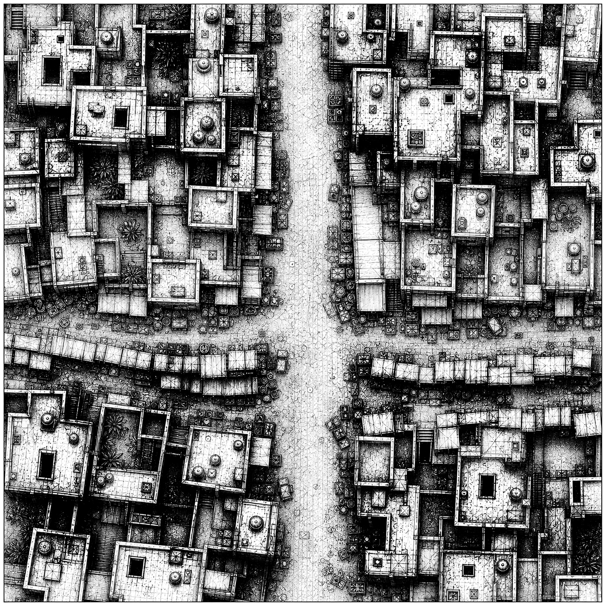 | [`mosul/runtime/maps/market_commercial_streets_2003/overview.png`](mosul/runtime/maps/market_commercial_streets_2003/overview.png) | 1400x1400 | 1.5 MB |

<code>mosul/runtime/maps/market_commercial_streets_2003/levels</code> (4)

| Preview | Asset | Dimensions | Size |
| --- | --- | ---: | ---: |
|  | [`mosul/runtime/maps/market_commercial_streets_2003/levels/level_01_ground.png`](mosul/runtime/maps/market_commercial_streets_2003/levels/level_01_ground.png) | 7000x7000 | 20.4 MB |
|  | [`mosul/runtime/maps/market_commercial_streets_2003/levels/level_02_roofs_and_second_floor.png`](mosul/runtime/maps/market_commercial_streets_2003/levels/level_02_roofs_and_second_floor.png) | 7000x7000 | 12.9 MB |
|  | [`mosul/runtime/maps/market_commercial_streets_2003/levels/level_03_upper_floor.png`](mosul/runtime/maps/market_commercial_streets_2003/levels/level_03_upper_floor.png) | 7000x7000 | 4.9 MB |
|  | [`mosul/runtime/maps/market_commercial_streets_2003/levels/level_04_roof_access.png`](mosul/runtime/maps/market_commercial_streets_2003/levels/level_04_roof_access.png) | 7000x7000 | 5.1 MB |

### Source Maps

<code>mosul/source/maps/market_commercial_streets_demo_2003/assets/map_data/market_commercial_streets_demo_7000</code> (6)

| Preview | Asset | Dimensions | Size |
| --- | --- | ---: | ---: |
|  | [`mosul/source/maps/market_commercial_streets_demo_2003/assets/map_data/market_commercial_streets_demo_7000/01_ground_level.png`](mosul/source/maps/market_commercial_streets_demo_2003/assets/map_data/market_commercial_streets_demo_7000/01_ground_level.png) | 7000x7000 | 20.4 MB |
|  | [`mosul/source/maps/market_commercial_streets_demo_2003/assets/map_data/market_commercial_streets_demo_7000/02_level_2_alpha.png`](mosul/source/maps/market_commercial_streets_demo_2003/assets/map_data/market_commercial_streets_demo_7000/02_level_2_alpha.png) | 7000x7000 | 12.9 MB |
|  | [`mosul/source/maps/market_commercial_streets_demo_2003/assets/map_data/market_commercial_streets_demo_7000/03_level_3_alpha.png`](mosul/source/maps/market_commercial_streets_demo_2003/assets/map_data/market_commercial_streets_demo_7000/03_level_3_alpha.png) | 7000x7000 | 4.9 MB |
|  | [`mosul/source/maps/market_commercial_streets_demo_2003/assets/map_data/market_commercial_streets_demo_7000/04_roof_access_alpha.png`](mosul/source/maps/market_commercial_streets_demo_2003/assets/map_data/market_commercial_streets_demo_7000/04_roof_access_alpha.png) | 7000x7000 | 5.1 MB |
| 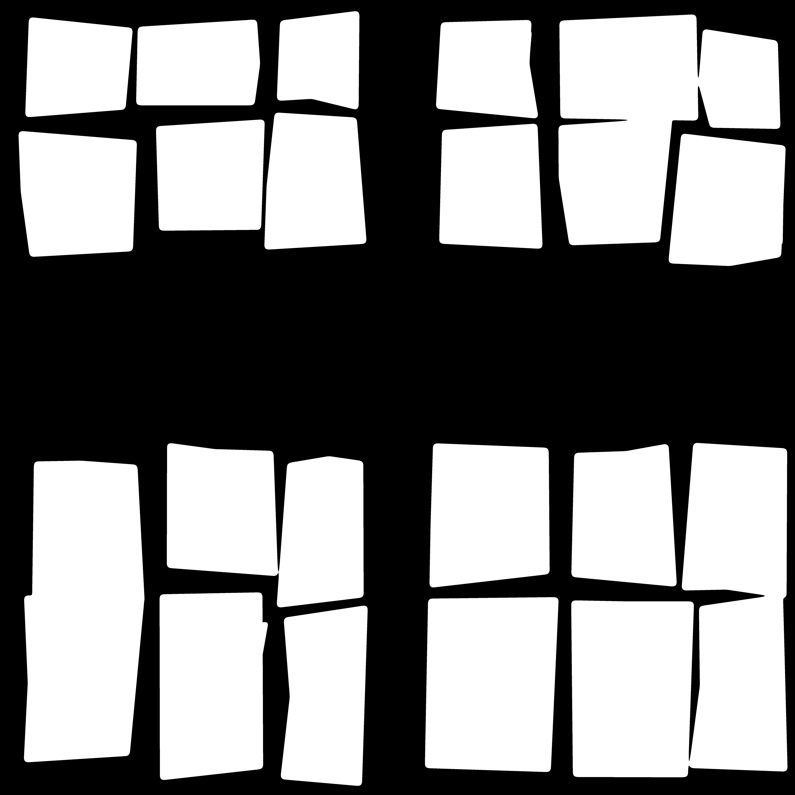 | [`mosul/source/maps/market_commercial_streets_demo_2003/assets/map_data/market_commercial_streets_demo_7000/05_multistorey_mask.png`](mosul/source/maps/market_commercial_streets_demo_2003/assets/map_data/market_commercial_streets_demo_7000/05_multistorey_mask.png) | 7000x7000 | 71.5 KB |
|  | [`mosul/source/maps/market_commercial_streets_demo_2003/assets/map_data/market_commercial_streets_demo_7000/preview_multistorey_mask_1400.png`](mosul/source/maps/market_commercial_streets_demo_2003/assets/map_data/market_commercial_streets_demo_7000/preview_multistorey_mask_1400.png) | 1400x1400 | 6.4 KB |

<code>mosul/source/maps/market_commercial_streets_demo_2003/imgs/market_commercial_streets_demo_7000</code> (4)

| Preview | Asset | Dimensions | Size |
| --- | --- | ---: | ---: |
|  | [`mosul/source/maps/market_commercial_streets_demo_2003/imgs/market_commercial_streets_demo_7000/00_minimap_composite.png`](mosul/source/maps/market_commercial_streets_demo_2003/imgs/market_commercial_streets_demo_7000/00_minimap_composite.png) | 7000x7000 | 20.7 MB |
|  | [`mosul/source/maps/market_commercial_streets_demo_2003/imgs/market_commercial_streets_demo_7000/06_multistorey_lineart_overview.png`](mosul/source/maps/market_commercial_streets_demo_2003/imgs/market_commercial_streets_demo_7000/06_multistorey_lineart_overview.png) | 7000x7000 | 20.6 MB |
|  | [`mosul/source/maps/market_commercial_streets_demo_2003/imgs/market_commercial_streets_demo_7000/preview_1400.png`](mosul/source/maps/market_commercial_streets_demo_2003/imgs/market_commercial_streets_demo_7000/preview_1400.png) | 1400x1400 | 1.5 MB |
| 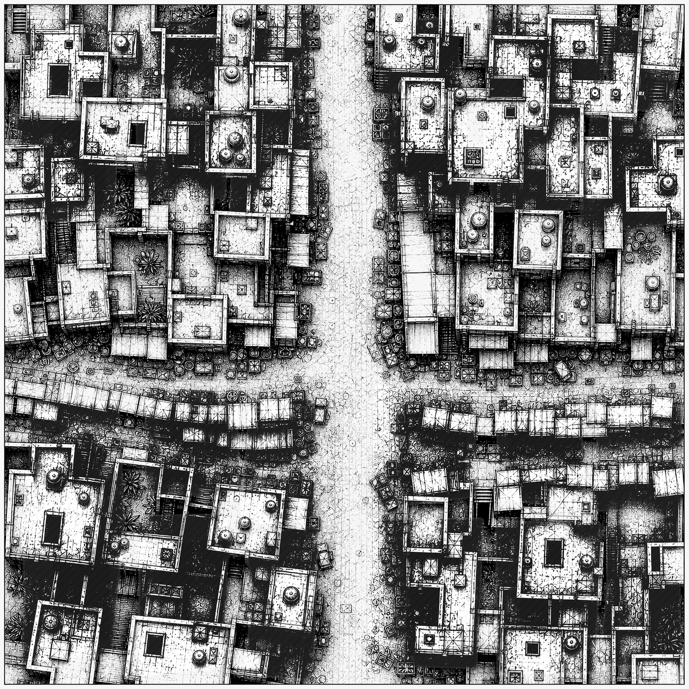 | [`mosul/source/maps/market_commercial_streets_demo_2003/imgs/market_commercial_streets_demo_7000/preview_multistorey_lineart_1400.png`](mosul/source/maps/market_commercial_streets_demo_2003/imgs/market_commercial_streets_demo_7000/preview_multistorey_lineart_1400.png) | 1400x1400 | 1.4 MB |

### Source Line Art

<code>mosul/source/line_art</code> (7)

| Preview | Asset | Dimensions | Size |
| --- | --- | ---: | ---: |
| 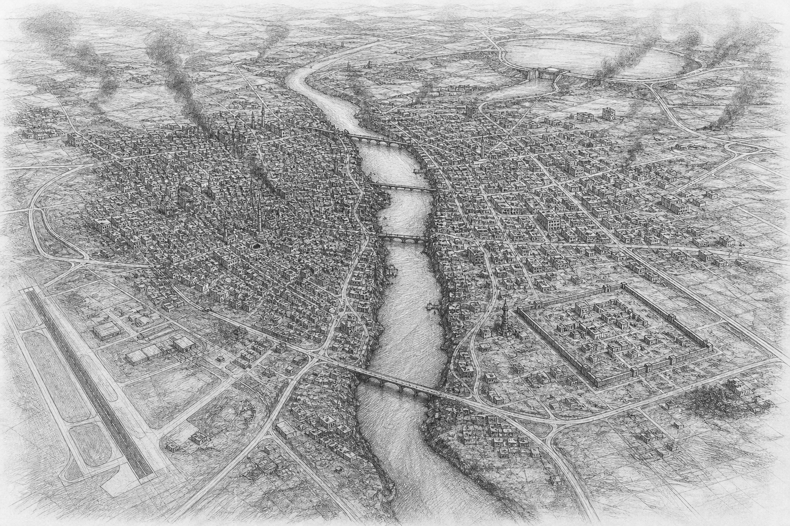 | [`mosul/source/line_art/01_mosul_area_map.png`](mosul/source/line_art/01_mosul_area_map.png) | 1536x1024 | 1.3 MB |
| 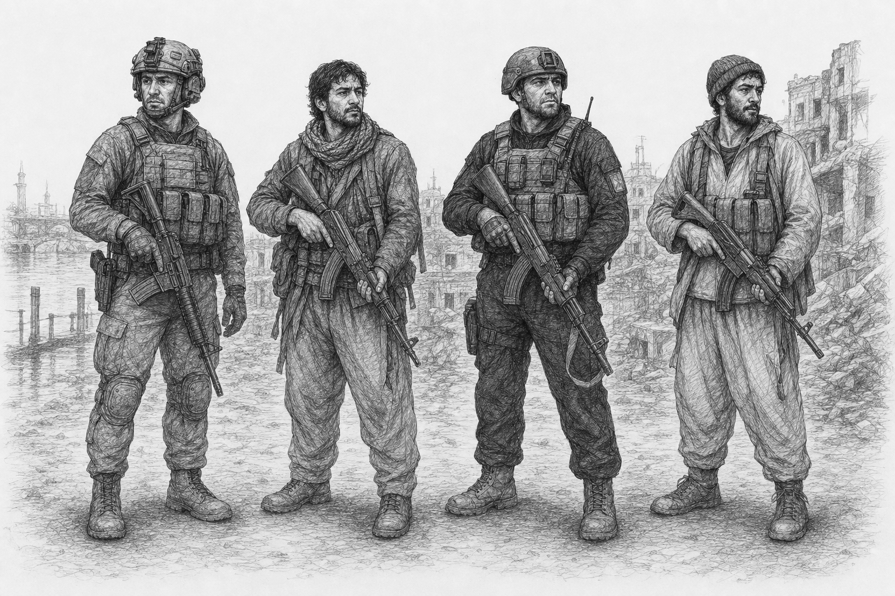 | [`mosul/source/line_art/04_combatant_types.png`](mosul/source/line_art/04_combatant_types.png) | 1536x1024 | 1.1 MB |
|  | [`mosul/source/line_art/05_weapons_infantry_support.png`](mosul/source/line_art/05_weapons_infantry_support.png) | 1536x1024 | 949.7 KB |
| 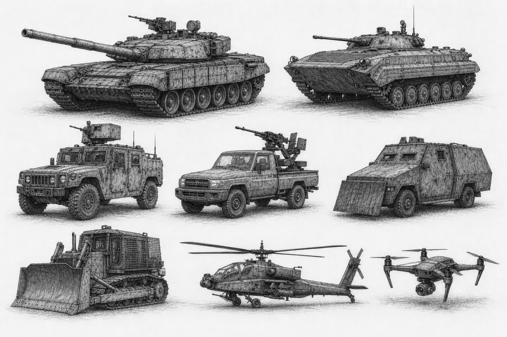 | [`mosul/source/line_art/06_vehicles_and_air_systems.png`](mosul/source/line_art/06_vehicles_and_air_systems.png) | 1536x1024 | 1.1 MB |
| 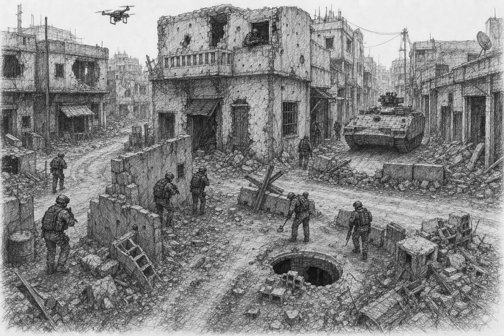 | [`mosul/source/line_art/07_tactics_urban_combat.png`](mosul/source/line_art/07_tactics_urban_combat.png) | 1536x1024 | 1.2 MB |
| 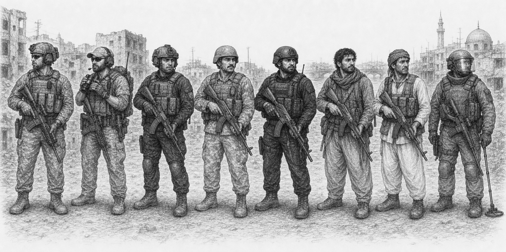 | [`mosul/source/line_art/10_us_ally_force_archetypes.png`](mosul/source/line_art/10_us_ally_force_archetypes.png) | 1774x887 | 1.1 MB |
|  | [`mosul/source/line_art/11_us_ally_weapons_lineart.png`](mosul/source/line_art/11_us_ally_weapons_lineart.png) | 1536x1024 | 911.3 KB |

### Runtime Civilian Sprites

<code>mosul/runtime/sprites/rendered/civilians_128/civilian/adult_woman/dead</code> (8)

| Preview | Asset | Dimensions | Size |
| --- | --- | ---: | ---: |
|  | [`mosul/runtime/sprites/rendered/civilians_128/civilian/adult_woman/dead/east.png`](mosul/runtime/sprites/rendered/civilians_128/civilian/adult_woman/dead/east.png) | 128x128 | 4.4 KB |
| 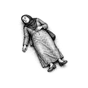 | [`mosul/runtime/sprites/rendered/civilians_128/civilian/adult_woman/dead/north.png`](mosul/runtime/sprites/rendered/civilians_128/civilian/adult_woman/dead/north.png) | 128x128 | 4.8 KB |
| 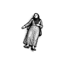 | [`mosul/runtime/sprites/rendered/civilians_128/civilian/adult_woman/dead/north_east.png`](mosul/runtime/sprites/rendered/civilians_128/civilian/adult_woman/dead/north_east.png) | 128x128 | 4.0 KB |
| 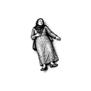 | [`mosul/runtime/sprites/rendered/civilians_128/civilian/adult_woman/dead/north_west.png`](mosul/runtime/sprites/rendered/civilians_128/civilian/adult_woman/dead/north_west.png) | 128x128 | 4.1 KB |
| 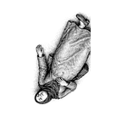 | [`mosul/runtime/sprites/rendered/civilians_128/civilian/adult_woman/dead/south.png`](mosul/runtime/sprites/rendered/civilians_128/civilian/adult_woman/dead/south.png) | 128x128 | 4.8 KB |
| 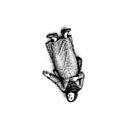 | [`mosul/runtime/sprites/rendered/civilians_128/civilian/adult_woman/dead/south_east.png`](mosul/runtime/sprites/rendered/civilians_128/civilian/adult_woman/dead/south_east.png) | 128x128 | 4.0 KB |
| 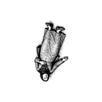 | [`mosul/runtime/sprites/rendered/civilians_128/civilian/adult_woman/dead/south_west.png`](mosul/runtime/sprites/rendered/civilians_128/civilian/adult_woman/dead/south_west.png) | 128x128 | 4.0 KB |
| 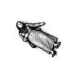 | [`mosul/runtime/sprites/rendered/civilians_128/civilian/adult_woman/dead/west.png`](mosul/runtime/sprites/rendered/civilians_128/civilian/adult_woman/dead/west.png) | 128x128 | 4.4 KB |

<code>mosul/runtime/sprites/rendered/civilians_128/civilian/adult_woman/standing</code> (8)

| Preview | Asset | Dimensions | Size |
| --- | --- | ---: | ---: |
|  | [`mosul/runtime/sprites/rendered/civilians_128/civilian/adult_woman/standing/east.png`](mosul/runtime/sprites/rendered/civilians_128/civilian/adult_woman/standing/east.png) | 128x128 | 3.6 KB |
|  | [`mosul/runtime/sprites/rendered/civilians_128/civilian/adult_woman/standing/north.png`](mosul/runtime/sprites/rendered/civilians_128/civilian/adult_woman/standing/north.png) | 128x128 | 4.2 KB |
| 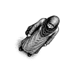 | [`mosul/runtime/sprites/rendered/civilians_128/civilian/adult_woman/standing/north_east.png`](mosul/runtime/sprites/rendered/civilians_128/civilian/adult_woman/standing/north_east.png) | 128x128 | 4.8 KB |
| 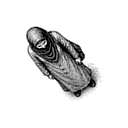 | [`mosul/runtime/sprites/rendered/civilians_128/civilian/adult_woman/standing/north_west.png`](mosul/runtime/sprites/rendered/civilians_128/civilian/adult_woman/standing/north_west.png) | 128x128 | 4.8 KB |
| 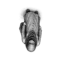 | [`mosul/runtime/sprites/rendered/civilians_128/civilian/adult_woman/standing/south.png`](mosul/runtime/sprites/rendered/civilians_128/civilian/adult_woman/standing/south.png) | 128x128 | 4.3 KB |
| 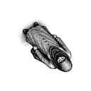 | [`mosul/runtime/sprites/rendered/civilians_128/civilian/adult_woman/standing/south_east.png`](mosul/runtime/sprites/rendered/civilians_128/civilian/adult_woman/standing/south_east.png) | 128x128 | 4.8 KB |
| 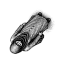 | [`mosul/runtime/sprites/rendered/civilians_128/civilian/adult_woman/standing/south_west.png`](mosul/runtime/sprites/rendered/civilians_128/civilian/adult_woman/standing/south_west.png) | 128x128 | 4.8 KB |
| 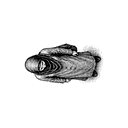 | [`mosul/runtime/sprites/rendered/civilians_128/civilian/adult_woman/standing/west.png`](mosul/runtime/sprites/rendered/civilians_128/civilian/adult_woman/standing/west.png) | 128x128 | 3.6 KB |

<code>mosul/runtime/sprites/rendered/civilians_128/civilian/adult_woman/wounded</code> (8)

| Preview | Asset | Dimensions | Size |
| --- | --- | ---: | ---: |
| 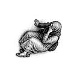 | [`mosul/runtime/sprites/rendered/civilians_128/civilian/adult_woman/wounded/east.png`](mosul/runtime/sprites/rendered/civilians_128/civilian/adult_woman/wounded/east.png) | 128x128 | 6.2 KB |
|  | [`mosul/runtime/sprites/rendered/civilians_128/civilian/adult_woman/wounded/north.png`](mosul/runtime/sprites/rendered/civilians_128/civilian/adult_woman/wounded/north.png) | 128x128 | 6.8 KB |
|  | [`mosul/runtime/sprites/rendered/civilians_128/civilian/adult_woman/wounded/north_east.png`](mosul/runtime/sprites/rendered/civilians_128/civilian/adult_woman/wounded/north_east.png) | 128x128 | 4.7 KB |
|  | [`mosul/runtime/sprites/rendered/civilians_128/civilian/adult_woman/wounded/north_west.png`](mosul/runtime/sprites/rendered/civilians_128/civilian/adult_woman/wounded/north_west.png) | 128x128 | 4.7 KB |
| 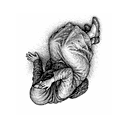 | [`mosul/runtime/sprites/rendered/civilians_128/civilian/adult_woman/wounded/south.png`](mosul/runtime/sprites/rendered/civilians_128/civilian/adult_woman/wounded/south.png) | 128x128 | 6.8 KB |
| 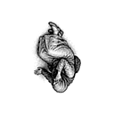 | [`mosul/runtime/sprites/rendered/civilians_128/civilian/adult_woman/wounded/south_east.png`](mosul/runtime/sprites/rendered/civilians_128/civilian/adult_woman/wounded/south_east.png) | 128x128 | 4.7 KB |
| 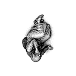 | [`mosul/runtime/sprites/rendered/civilians_128/civilian/adult_woman/wounded/south_west.png`](mosul/runtime/sprites/rendered/civilians_128/civilian/adult_woman/wounded/south_west.png) | 128x128 | 4.8 KB |
| 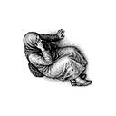 | [`mosul/runtime/sprites/rendered/civilians_128/civilian/adult_woman/wounded/west.png`](mosul/runtime/sprites/rendered/civilians_128/civilian/adult_woman/wounded/west.png) | 128x128 | 6.3 KB |

<code>mosul/runtime/sprites/rendered/civilians_128/civilian/old_man/dead</code> (8)

| Preview | Asset | Dimensions | Size |
| --- | --- | ---: | ---: |
| 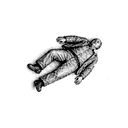 | [`mosul/runtime/sprites/rendered/civilians_128/civilian/old_man/dead/east.png`](mosul/runtime/sprites/rendered/civilians_128/civilian/old_man/dead/east.png) | 128x128 | 4.8 KB |
|  | [`mosul/runtime/sprites/rendered/civilians_128/civilian/old_man/dead/north.png`](mosul/runtime/sprites/rendered/civilians_128/civilian/old_man/dead/north.png) | 128x128 | 5.3 KB |
|  | [`mosul/runtime/sprites/rendered/civilians_128/civilian/old_man/dead/north_east.png`](mosul/runtime/sprites/rendered/civilians_128/civilian/old_man/dead/north_east.png) | 128x128 | 4.3 KB |
|  | [`mosul/runtime/sprites/rendered/civilians_128/civilian/old_man/dead/north_west.png`](mosul/runtime/sprites/rendered/civilians_128/civilian/old_man/dead/north_west.png) | 128x128 | 4.3 KB |
| 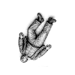 | [`mosul/runtime/sprites/rendered/civilians_128/civilian/old_man/dead/south.png`](mosul/runtime/sprites/rendered/civilians_128/civilian/old_man/dead/south.png) | 128x128 | 5.3 KB |
|  | [`mosul/runtime/sprites/rendered/civilians_128/civilian/old_man/dead/south_east.png`](mosul/runtime/sprites/rendered/civilians_128/civilian/old_man/dead/south_east.png) | 128x128 | 4.3 KB |
|  | [`mosul/runtime/sprites/rendered/civilians_128/civilian/old_man/dead/south_west.png`](mosul/runtime/sprites/rendered/civilians_128/civilian/old_man/dead/south_west.png) | 128x128 | 4.3 KB |
| 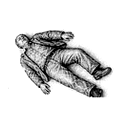 | [`mosul/runtime/sprites/rendered/civilians_128/civilian/old_man/dead/west.png`](mosul/runtime/sprites/rendered/civilians_128/civilian/old_man/dead/west.png) | 128x128 | 4.9 KB |

<code>mosul/runtime/sprites/rendered/civilians_128/civilian/old_man/standing</code> (8)

| Preview | Asset | Dimensions | Size |
| --- | --- | ---: | ---: |
|  | [`mosul/runtime/sprites/rendered/civilians_128/civilian/old_man/standing/east.png`](mosul/runtime/sprites/rendered/civilians_128/civilian/old_man/standing/east.png) | 128x128 | 4.5 KB |
| 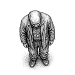 | [`mosul/runtime/sprites/rendered/civilians_128/civilian/old_man/standing/north.png`](mosul/runtime/sprites/rendered/civilians_128/civilian/old_man/standing/north.png) | 128x128 | 5.2 KB |
| 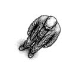 | [`mosul/runtime/sprites/rendered/civilians_128/civilian/old_man/standing/north_east.png`](mosul/runtime/sprites/rendered/civilians_128/civilian/old_man/standing/north_east.png) | 128x128 | 5.2 KB |
| 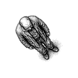 | [`mosul/runtime/sprites/rendered/civilians_128/civilian/old_man/standing/north_west.png`](mosul/runtime/sprites/rendered/civilians_128/civilian/old_man/standing/north_west.png) | 128x128 | 5.2 KB |
|  | [`mosul/runtime/sprites/rendered/civilians_128/civilian/old_man/standing/south.png`](mosul/runtime/sprites/rendered/civilians_128/civilian/old_man/standing/south.png) | 128x128 | 5.3 KB |
|  | [`mosul/runtime/sprites/rendered/civilians_128/civilian/old_man/standing/south_east.png`](mosul/runtime/sprites/rendered/civilians_128/civilian/old_man/standing/south_east.png) | 128x128 | 5.3 KB |
|  | [`mosul/runtime/sprites/rendered/civilians_128/civilian/old_man/standing/south_west.png`](mosul/runtime/sprites/rendered/civilians_128/civilian/old_man/standing/south_west.png) | 128x128 | 5.2 KB |
| 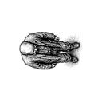 | [`mosul/runtime/sprites/rendered/civilians_128/civilian/old_man/standing/west.png`](mosul/runtime/sprites/rendered/civilians_128/civilian/old_man/standing/west.png) | 128x128 | 4.5 KB |

<code>mosul/runtime/sprites/rendered/civilians_128/civilian/old_man/wounded</code> (8)

| Preview | Asset | Dimensions | Size |
| --- | --- | ---: | ---: |
| 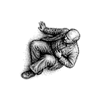 | [`mosul/runtime/sprites/rendered/civilians_128/civilian/old_man/wounded/east.png`](mosul/runtime/sprites/rendered/civilians_128/civilian/old_man/wounded/east.png) | 128x128 | 6.8 KB |
| 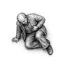 | [`mosul/runtime/sprites/rendered/civilians_128/civilian/old_man/wounded/north.png`](mosul/runtime/sprites/rendered/civilians_128/civilian/old_man/wounded/north.png) | 128x128 | 7.5 KB |
|  | [`mosul/runtime/sprites/rendered/civilians_128/civilian/old_man/wounded/north_east.png`](mosul/runtime/sprites/rendered/civilians_128/civilian/old_man/wounded/north_east.png) | 128x128 | 5.0 KB |
|  | [`mosul/runtime/sprites/rendered/civilians_128/civilian/old_man/wounded/north_west.png`](mosul/runtime/sprites/rendered/civilians_128/civilian/old_man/wounded/north_west.png) | 128x128 | 5.0 KB |
| 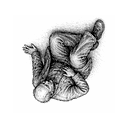 | [`mosul/runtime/sprites/rendered/civilians_128/civilian/old_man/wounded/south.png`](mosul/runtime/sprites/rendered/civilians_128/civilian/old_man/wounded/south.png) | 128x128 | 7.5 KB |
|  | [`mosul/runtime/sprites/rendered/civilians_128/civilian/old_man/wounded/south_east.png`](mosul/runtime/sprites/rendered/civilians_128/civilian/old_man/wounded/south_east.png) | 128x128 | 5.0 KB |
| 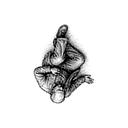 | [`mosul/runtime/sprites/rendered/civilians_128/civilian/old_man/wounded/south_west.png`](mosul/runtime/sprites/rendered/civilians_128/civilian/old_man/wounded/south_west.png) | 128x128 | 5.1 KB |
| 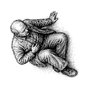 | [`mosul/runtime/sprites/rendered/civilians_128/civilian/old_man/wounded/west.png`](mosul/runtime/sprites/rendered/civilians_128/civilian/old_man/wounded/west.png) | 128x128 | 6.8 KB |

<code>mosul/runtime/sprites/rendered/civilians_128/civilian/old_woman/dead</code> (8)

| Preview | Asset | Dimensions | Size |
| --- | --- | ---: | ---: |
| 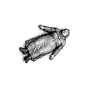 | [`mosul/runtime/sprites/rendered/civilians_128/civilian/old_woman/dead/east.png`](mosul/runtime/sprites/rendered/civilians_128/civilian/old_woman/dead/east.png) | 128x128 | 4.6 KB |
| 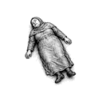 | [`mosul/runtime/sprites/rendered/civilians_128/civilian/old_woman/dead/north.png`](mosul/runtime/sprites/rendered/civilians_128/civilian/old_woman/dead/north.png) | 128x128 | 5.0 KB |
| 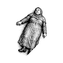 | [`mosul/runtime/sprites/rendered/civilians_128/civilian/old_woman/dead/north_east.png`](mosul/runtime/sprites/rendered/civilians_128/civilian/old_woman/dead/north_east.png) | 128x128 | 4.4 KB |
| 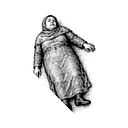 | [`mosul/runtime/sprites/rendered/civilians_128/civilian/old_woman/dead/north_west.png`](mosul/runtime/sprites/rendered/civilians_128/civilian/old_woman/dead/north_west.png) | 128x128 | 4.5 KB |
| 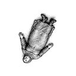 | [`mosul/runtime/sprites/rendered/civilians_128/civilian/old_woman/dead/south.png`](mosul/runtime/sprites/rendered/civilians_128/civilian/old_woman/dead/south.png) | 128x128 | 5.0 KB |
| 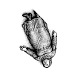 | [`mosul/runtime/sprites/rendered/civilians_128/civilian/old_woman/dead/south_east.png`](mosul/runtime/sprites/rendered/civilians_128/civilian/old_woman/dead/south_east.png) | 128x128 | 4.4 KB |
| 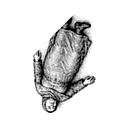 | [`mosul/runtime/sprites/rendered/civilians_128/civilian/old_woman/dead/south_west.png`](mosul/runtime/sprites/rendered/civilians_128/civilian/old_woman/dead/south_west.png) | 128x128 | 4.4 KB |
| 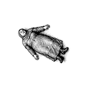 | [`mosul/runtime/sprites/rendered/civilians_128/civilian/old_woman/dead/west.png`](mosul/runtime/sprites/rendered/civilians_128/civilian/old_woman/dead/west.png) | 128x128 | 4.7 KB |

<code>mosul/runtime/sprites/rendered/civilians_128/civilian/old_woman/standing</code> (8)

| Preview | Asset | Dimensions | Size |
| --- | --- | ---: | ---: |
| 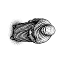 | [`mosul/runtime/sprites/rendered/civilians_128/civilian/old_woman/standing/east.png`](mosul/runtime/sprites/rendered/civilians_128/civilian/old_woman/standing/east.png) | 128x128 | 4.4 KB |
| 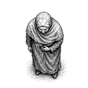 | [`mosul/runtime/sprites/rendered/civilians_128/civilian/old_woman/standing/north.png`](mosul/runtime/sprites/rendered/civilians_128/civilian/old_woman/standing/north.png) | 128x128 | 5.1 KB |
| 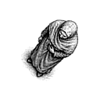 | [`mosul/runtime/sprites/rendered/civilians_128/civilian/old_woman/standing/north_east.png`](mosul/runtime/sprites/rendered/civilians_128/civilian/old_woman/standing/north_east.png) | 128x128 | 5.1 KB |
| 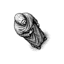 | [`mosul/runtime/sprites/rendered/civilians_128/civilian/old_woman/standing/north_west.png`](mosul/runtime/sprites/rendered/civilians_128/civilian/old_woman/standing/north_west.png) | 128x128 | 5.1 KB |
|  | [`mosul/runtime/sprites/rendered/civilians_128/civilian/old_woman/standing/south.png`](mosul/runtime/sprites/rendered/civilians_128/civilian/old_woman/standing/south.png) | 128x128 | 5.2 KB |
|  | [`mosul/runtime/sprites/rendered/civilians_128/civilian/old_woman/standing/south_east.png`](mosul/runtime/sprites/rendered/civilians_128/civilian/old_woman/standing/south_east.png) | 128x128 | 5.1 KB |
|  | [`mosul/runtime/sprites/rendered/civilians_128/civilian/old_woman/standing/south_west.png`](mosul/runtime/sprites/rendered/civilians_128/civilian/old_woman/standing/south_west.png) | 128x128 | 5.1 KB |
|  | [`mosul/runtime/sprites/rendered/civilians_128/civilian/old_woman/standing/west.png`](mosul/runtime/sprites/rendered/civilians_128/civilian/old_woman/standing/west.png) | 128x128 | 4.4 KB |

<code>mosul/runtime/sprites/rendered/civilians_128/civilian/old_woman/wounded</code> (8)

| Preview | Asset | Dimensions | Size |
| --- | --- | ---: | ---: |
|  | [`mosul/runtime/sprites/rendered/civilians_128/civilian/old_woman/wounded/east.png`](mosul/runtime/sprites/rendered/civilians_128/civilian/old_woman/wounded/east.png) | 128x128 | 6.1 KB |
|  | [`mosul/runtime/sprites/rendered/civilians_128/civilian/old_woman/wounded/north.png`](mosul/runtime/sprites/rendered/civilians_128/civilian/old_woman/wounded/north.png) | 128x128 | 6.4 KB |
|  | [`mosul/runtime/sprites/rendered/civilians_128/civilian/old_woman/wounded/north_east.png`](mosul/runtime/sprites/rendered/civilians_128/civilian/old_woman/wounded/north_east.png) | 128x128 | 5.4 KB |
|  | [`mosul/runtime/sprites/rendered/civilians_128/civilian/old_woman/wounded/north_west.png`](mosul/runtime/sprites/rendered/civilians_128/civilian/old_woman/wounded/north_west.png) | 128x128 | 5.5 KB |
|  | [`mosul/runtime/sprites/rendered/civilians_128/civilian/old_woman/wounded/south.png`](mosul/runtime/sprites/rendered/civilians_128/civilian/old_woman/wounded/south.png) | 128x128 | 6.5 KB |
|  | [`mosul/runtime/sprites/rendered/civilians_128/civilian/old_woman/wounded/south_east.png`](mosul/runtime/sprites/rendered/civilians_128/civilian/old_woman/wounded/south_east.png) | 128x128 | 5.4 KB |
|  | [`mosul/runtime/sprites/rendered/civilians_128/civilian/old_woman/wounded/south_west.png`](mosul/runtime/sprites/rendered/civilians_128/civilian/old_woman/wounded/south_west.png) | 128x128 | 5.5 KB |
|  | [`mosul/runtime/sprites/rendered/civilians_128/civilian/old_woman/wounded/west.png`](mosul/runtime/sprites/rendered/civilians_128/civilian/old_woman/wounded/west.png) | 128x128 | 6.1 KB |

<code>mosul/runtime/sprites/rendered/civilians_128/civilian/teenage_boy/dead</code> (8)

| Preview | Asset | Dimensions | Size |
| --- | --- | ---: | ---: |
|  | [`mosul/runtime/sprites/rendered/civilians_128/civilian/teenage_boy/dead/east.png`](mosul/runtime/sprites/rendered/civilians_128/civilian/teenage_boy/dead/east.png) | 128x128 | 3.8 KB |
|  | [`mosul/runtime/sprites/rendered/civilians_128/civilian/teenage_boy/dead/north.png`](mosul/runtime/sprites/rendered/civilians_128/civilian/teenage_boy/dead/north.png) | 128x128 | 4.2 KB |
|  | [`mosul/runtime/sprites/rendered/civilians_128/civilian/teenage_boy/dead/north_east.png`](mosul/runtime/sprites/rendered/civilians_128/civilian/teenage_boy/dead/north_east.png) | 128x128 | 4.1 KB |
|  | [`mosul/runtime/sprites/rendered/civilians_128/civilian/teenage_boy/dead/north_west.png`](mosul/runtime/sprites/rendered/civilians_128/civilian/teenage_boy/dead/north_west.png) | 128x128 | 4.1 KB |
|  | [`mosul/runtime/sprites/rendered/civilians_128/civilian/teenage_boy/dead/south.png`](mosul/runtime/sprites/rendered/civilians_128/civilian/teenage_boy/dead/south.png) | 128x128 | 4.1 KB |
|  | [`mosul/runtime/sprites/rendered/civilians_128/civilian/teenage_boy/dead/south_east.png`](mosul/runtime/sprites/rendered/civilians_128/civilian/teenage_boy/dead/south_east.png) | 128x128 | 4.1 KB |
|  | [`mosul/runtime/sprites/rendered/civilians_128/civilian/teenage_boy/dead/south_west.png`](mosul/runtime/sprites/rendered/civilians_128/civilian/teenage_boy/dead/south_west.png) | 128x128 | 4.1 KB |
|  | [`mosul/runtime/sprites/rendered/civilians_128/civilian/teenage_boy/dead/west.png`](mosul/runtime/sprites/rendered/civilians_128/civilian/teenage_boy/dead/west.png) | 128x128 | 3.8 KB |

<code>mosul/runtime/sprites/rendered/civilians_128/civilian/teenage_boy/standing</code> (8)

| Preview | Asset | Dimensions | Size |
| --- | --- | ---: | ---: |
|  | [`mosul/runtime/sprites/rendered/civilians_128/civilian/teenage_boy/standing/east.png`](mosul/runtime/sprites/rendered/civilians_128/civilian/teenage_boy/standing/east.png) | 128x128 | 3.6 KB |
|  | [`mosul/runtime/sprites/rendered/civilians_128/civilian/teenage_boy/standing/north.png`](mosul/runtime/sprites/rendered/civilians_128/civilian/teenage_boy/standing/north.png) | 128x128 | 4.2 KB |
|  | [`mosul/runtime/sprites/rendered/civilians_128/civilian/teenage_boy/standing/north_east.png`](mosul/runtime/sprites/rendered/civilians_128/civilian/teenage_boy/standing/north_east.png) | 128x128 | 4.5 KB |
|  | [`mosul/runtime/sprites/rendered/civilians_128/civilian/teenage_boy/standing/north_west.png`](mosul/runtime/sprites/rendered/civilians_128/civilian/teenage_boy/standing/north_west.png) | 128x128 | 4.6 KB |
|  | [`mosul/runtime/sprites/rendered/civilians_128/civilian/teenage_boy/standing/south.png`](mosul/runtime/sprites/rendered/civilians_128/civilian/teenage_boy/standing/south.png) | 128x128 | 4.3 KB |
|  | [`mosul/runtime/sprites/rendered/civilians_128/civilian/teenage_boy/standing/south_east.png`](mosul/runtime/sprites/rendered/civilians_128/civilian/teenage_boy/standing/south_east.png) | 128x128 | 4.5 KB |
|  | [`mosul/runtime/sprites/rendered/civilians_128/civilian/teenage_boy/standing/south_west.png`](mosul/runtime/sprites/rendered/civilians_128/civilian/teenage_boy/standing/south_west.png) | 128x128 | 4.5 KB |
|  | [`mosul/runtime/sprites/rendered/civilians_128/civilian/teenage_boy/standing/west.png`](mosul/runtime/sprites/rendered/civilians_128/civilian/teenage_boy/standing/west.png) | 128x128 | 3.6 KB |

<code>mosul/runtime/sprites/rendered/civilians_128/civilian/teenage_boy/wounded</code> (8)

| Preview | Asset | Dimensions | Size |
| --- | --- | ---: | ---: |
|  | [`mosul/runtime/sprites/rendered/civilians_128/civilian/teenage_boy/wounded/east.png`](mosul/runtime/sprites/rendered/civilians_128/civilian/teenage_boy/wounded/east.png) | 128x128 | 6.1 KB |
|  | [`mosul/runtime/sprites/rendered/civilians_128/civilian/teenage_boy/wounded/north.png`](mosul/runtime/sprites/rendered/civilians_128/civilian/teenage_boy/wounded/north.png) | 128x128 | 6.6 KB |
|  | [`mosul/runtime/sprites/rendered/civilians_128/civilian/teenage_boy/wounded/north_east.png`](mosul/runtime/sprites/rendered/civilians_128/civilian/teenage_boy/wounded/north_east.png) | 128x128 | 4.9 KB |
|  | [`mosul/runtime/sprites/rendered/civilians_128/civilian/teenage_boy/wounded/north_west.png`](mosul/runtime/sprites/rendered/civilians_128/civilian/teenage_boy/wounded/north_west.png) | 128x128 | 4.9 KB |
|  | [`mosul/runtime/sprites/rendered/civilians_128/civilian/teenage_boy/wounded/south.png`](mosul/runtime/sprites/rendered/civilians_128/civilian/teenage_boy/wounded/south.png) | 128x128 | 6.6 KB |
|  | [`mosul/runtime/sprites/rendered/civilians_128/civilian/teenage_boy/wounded/south_east.png`](mosul/runtime/sprites/rendered/civilians_128/civilian/teenage_boy/wounded/south_east.png) | 128x128 | 4.9 KB |
|  | [`mosul/runtime/sprites/rendered/civilians_128/civilian/teenage_boy/wounded/south_west.png`](mosul/runtime/sprites/rendered/civilians_128/civilian/teenage_boy/wounded/south_west.png) | 128x128 | 4.9 KB |
|  | [`mosul/runtime/sprites/rendered/civilians_128/civilian/teenage_boy/wounded/west.png`](mosul/runtime/sprites/rendered/civilians_128/civilian/teenage_boy/wounded/west.png) | 128x128 | 6.2 KB |

<code>mosul/runtime/sprites/rendered/civilians_128/civilian/teenage_girl/dead</code> (8)

| Preview | Asset | Dimensions | Size |
| --- | --- | ---: | ---: |
|  | [`mosul/runtime/sprites/rendered/civilians_128/civilian/teenage_girl/dead/east.png`](mosul/runtime/sprites/rendered/civilians_128/civilian/teenage_girl/dead/east.png) | 128x128 | 3.9 KB |
|  | [`mosul/runtime/sprites/rendered/civilians_128/civilian/teenage_girl/dead/north.png`](mosul/runtime/sprites/rendered/civilians_128/civilian/teenage_girl/dead/north.png) | 128x128 | 4.3 KB |
|  | [`mosul/runtime/sprites/rendered/civilians_128/civilian/teenage_girl/dead/north_east.png`](mosul/runtime/sprites/rendered/civilians_128/civilian/teenage_girl/dead/north_east.png) | 128x128 | 4.0 KB |
|  | [`mosul/runtime/sprites/rendered/civilians_128/civilian/teenage_girl/dead/north_west.png`](mosul/runtime/sprites/rendered/civilians_128/civilian/teenage_girl/dead/north_west.png) | 128x128 | 3.9 KB |
|  | [`mosul/runtime/sprites/rendered/civilians_128/civilian/teenage_girl/dead/south.png`](mosul/runtime/sprites/rendered/civilians_128/civilian/teenage_girl/dead/south.png) | 128x128 | 4.3 KB |
|  | [`mosul/runtime/sprites/rendered/civilians_128/civilian/teenage_girl/dead/south_east.png`](mosul/runtime/sprites/rendered/civilians_128/civilian/teenage_girl/dead/south_east.png) | 128x128 | 3.9 KB |
|  | [`mosul/runtime/sprites/rendered/civilians_128/civilian/teenage_girl/dead/south_west.png`](mosul/runtime/sprites/rendered/civilians_128/civilian/teenage_girl/dead/south_west.png) | 128x128 | 4.0 KB |
|  | [`mosul/runtime/sprites/rendered/civilians_128/civilian/teenage_girl/dead/west.png`](mosul/runtime/sprites/rendered/civilians_128/civilian/teenage_girl/dead/west.png) | 128x128 | 3.9 KB |

<code>mosul/runtime/sprites/rendered/civilians_128/civilian/teenage_girl/standing</code> (8)

| Preview | Asset | Dimensions | Size |
| --- | --- | ---: | ---: |
|  | [`mosul/runtime/sprites/rendered/civilians_128/civilian/teenage_girl/standing/east.png`](mosul/runtime/sprites/rendered/civilians_128/civilian/teenage_girl/standing/east.png) | 128x128 | 3.2 KB |
|  | [`mosul/runtime/sprites/rendered/civilians_128/civilian/teenage_girl/standing/north.png`](mosul/runtime/sprites/rendered/civilians_128/civilian/teenage_girl/standing/north.png) | 128x128 | 3.7 KB |
|  | [`mosul/runtime/sprites/rendered/civilians_128/civilian/teenage_girl/standing/north_east.png`](mosul/runtime/sprites/rendered/civilians_128/civilian/teenage_girl/standing/north_east.png) | 128x128 | 4.3 KB |
|  | [`mosul/runtime/sprites/rendered/civilians_128/civilian/teenage_girl/standing/north_west.png`](mosul/runtime/sprites/rendered/civilians_128/civilian/teenage_girl/standing/north_west.png) | 128x128 | 4.3 KB |
|  | [`mosul/runtime/sprites/rendered/civilians_128/civilian/teenage_girl/standing/south.png`](mosul/runtime/sprites/rendered/civilians_128/civilian/teenage_girl/standing/south.png) | 128x128 | 3.7 KB |
|  | [`mosul/runtime/sprites/rendered/civilians_128/civilian/teenage_girl/standing/south_east.png`](mosul/runtime/sprites/rendered/civilians_128/civilian/teenage_girl/standing/south_east.png) | 128x128 | 4.3 KB |
|  | [`mosul/runtime/sprites/rendered/civilians_128/civilian/teenage_girl/standing/south_west.png`](mosul/runtime/sprites/rendered/civilians_128/civilian/teenage_girl/standing/south_west.png) | 128x128 | 4.2 KB |
|  | [`mosul/runtime/sprites/rendered/civilians_128/civilian/teenage_girl/standing/west.png`](mosul/runtime/sprites/rendered/civilians_128/civilian/teenage_girl/standing/west.png) | 128x128 | 3.2 KB |

<code>mosul/runtime/sprites/rendered/civilians_128/civilian/teenage_girl/wounded</code> (8)

| Preview | Asset | Dimensions | Size |
| --- | --- | ---: | ---: |
|  | [`mosul/runtime/sprites/rendered/civilians_128/civilian/teenage_girl/wounded/east.png`](mosul/runtime/sprites/rendered/civilians_128/civilian/teenage_girl/wounded/east.png) | 128x128 | 5.1 KB |
|  | [`mosul/runtime/sprites/rendered/civilians_128/civilian/teenage_girl/wounded/north.png`](mosul/runtime/sprites/rendered/civilians_128/civilian/teenage_girl/wounded/north.png) | 128x128 | 5.8 KB |
|  | [`mosul/runtime/sprites/rendered/civilians_128/civilian/teenage_girl/wounded/north_east.png`](mosul/runtime/sprites/rendered/civilians_128/civilian/teenage_girl/wounded/north_east.png) | 128x128 | 4.8 KB |
|  | [`mosul/runtime/sprites/rendered/civilians_128/civilian/teenage_girl/wounded/north_west.png`](mosul/runtime/sprites/rendered/civilians_128/civilian/teenage_girl/wounded/north_west.png) | 128x128 | 4.7 KB |
|  | [`mosul/runtime/sprites/rendered/civilians_128/civilian/teenage_girl/wounded/south.png`](mosul/runtime/sprites/rendered/civilians_128/civilian/teenage_girl/wounded/south.png) | 128x128 | 5.8 KB |
|  | [`mosul/runtime/sprites/rendered/civilians_128/civilian/teenage_girl/wounded/south_east.png`](mosul/runtime/sprites/rendered/civilians_128/civilian/teenage_girl/wounded/south_east.png) | 128x128 | 4.7 KB |
|  | [`mosul/runtime/sprites/rendered/civilians_128/civilian/teenage_girl/wounded/south_west.png`](mosul/runtime/sprites/rendered/civilians_128/civilian/teenage_girl/wounded/south_west.png) | 128x128 | 4.7 KB |
|  | [`mosul/runtime/sprites/rendered/civilians_128/civilian/teenage_girl/wounded/west.png`](mosul/runtime/sprites/rendered/civilians_128/civilian/teenage_girl/wounded/west.png) | 128x128 | 5.2 KB |

<code>mosul/runtime/sprites/rendered/civilians_128/civilian/young_boy/dead</code> (8)

| Preview | Asset | Dimensions | Size |
| --- | --- | ---: | ---: |
|  | [`mosul/runtime/sprites/rendered/civilians_128/civilian/young_boy/dead/east.png`](mosul/runtime/sprites/rendered/civilians_128/civilian/young_boy/dead/east.png) | 128x128 | 4.4 KB |
|  | [`mosul/runtime/sprites/rendered/civilians_128/civilian/young_boy/dead/north.png`](mosul/runtime/sprites/rendered/civilians_128/civilian/young_boy/dead/north.png) | 128x128 | 4.8 KB |
|  | [`mosul/runtime/sprites/rendered/civilians_128/civilian/young_boy/dead/north_east.png`](mosul/runtime/sprites/rendered/civilians_128/civilian/young_boy/dead/north_east.png) | 128x128 | 4.1 KB |
|  | [`mosul/runtime/sprites/rendered/civilians_128/civilian/young_boy/dead/north_west.png`](mosul/runtime/sprites/rendered/civilians_128/civilian/young_boy/dead/north_west.png) | 128x128 | 4.2 KB |
|  | [`mosul/runtime/sprites/rendered/civilians_128/civilian/young_boy/dead/south.png`](mosul/runtime/sprites/rendered/civilians_128/civilian/young_boy/dead/south.png) | 128x128 | 4.8 KB |
|  | [`mosul/runtime/sprites/rendered/civilians_128/civilian/young_boy/dead/south_east.png`](mosul/runtime/sprites/rendered/civilians_128/civilian/young_boy/dead/south_east.png) | 128x128 | 4.2 KB |
|  | [`mosul/runtime/sprites/rendered/civilians_128/civilian/young_boy/dead/south_west.png`](mosul/runtime/sprites/rendered/civilians_128/civilian/young_boy/dead/south_west.png) | 128x128 | 4.2 KB |
|  | [`mosul/runtime/sprites/rendered/civilians_128/civilian/young_boy/dead/west.png`](mosul/runtime/sprites/rendered/civilians_128/civilian/young_boy/dead/west.png) | 128x128 | 4.4 KB |

<code>mosul/runtime/sprites/rendered/civilians_128/civilian/young_boy/standing</code> (8)

| Preview | Asset | Dimensions | Size |
| --- | --- | ---: | ---: |
|  | [`mosul/runtime/sprites/rendered/civilians_128/civilian/young_boy/standing/east.png`](mosul/runtime/sprites/rendered/civilians_128/civilian/young_boy/standing/east.png) | 128x128 | 3.3 KB |
|  | [`mosul/runtime/sprites/rendered/civilians_128/civilian/young_boy/standing/north.png`](mosul/runtime/sprites/rendered/civilians_128/civilian/young_boy/standing/north.png) | 128x128 | 3.6 KB |
|  | [`mosul/runtime/sprites/rendered/civilians_128/civilian/young_boy/standing/north_east.png`](mosul/runtime/sprites/rendered/civilians_128/civilian/young_boy/standing/north_east.png) | 128x128 | 4.2 KB |
|  | [`mosul/runtime/sprites/rendered/civilians_128/civilian/young_boy/standing/north_west.png`](mosul/runtime/sprites/rendered/civilians_128/civilian/young_boy/standing/north_west.png) | 128x128 | 4.3 KB |
|  | [`mosul/runtime/sprites/rendered/civilians_128/civilian/young_boy/standing/south.png`](mosul/runtime/sprites/rendered/civilians_128/civilian/young_boy/standing/south.png) | 128x128 | 3.7 KB |
|  | [`mosul/runtime/sprites/rendered/civilians_128/civilian/young_boy/standing/south_east.png`](mosul/runtime/sprites/rendered/civilians_128/civilian/young_boy/standing/south_east.png) | 128x128 | 4.3 KB |
|  | [`mosul/runtime/sprites/rendered/civilians_128/civilian/young_boy/standing/south_west.png`](mosul/runtime/sprites/rendered/civilians_128/civilian/young_boy/standing/south_west.png) | 128x128 | 4.2 KB |
|  | [`mosul/runtime/sprites/rendered/civilians_128/civilian/young_boy/standing/west.png`](mosul/runtime/sprites/rendered/civilians_128/civilian/young_boy/standing/west.png) | 128x128 | 3.3 KB |

<code>mosul/runtime/sprites/rendered/civilians_128/civilian/young_boy/wounded</code> (8)

| Preview | Asset | Dimensions | Size |
| --- | --- | ---: | ---: |
|  | [`mosul/runtime/sprites/rendered/civilians_128/civilian/young_boy/wounded/east.png`](mosul/runtime/sprites/rendered/civilians_128/civilian/young_boy/wounded/east.png) | 128x128 | 4.7 KB |
|  | [`mosul/runtime/sprites/rendered/civilians_128/civilian/young_boy/wounded/north.png`](mosul/runtime/sprites/rendered/civilians_128/civilian/young_boy/wounded/north.png) | 128x128 | 5.1 KB |
|  | [`mosul/runtime/sprites/rendered/civilians_128/civilian/young_boy/wounded/north_east.png`](mosul/runtime/sprites/rendered/civilians_128/civilian/young_boy/wounded/north_east.png) | 128x128 | 4.7 KB |
|  | [`mosul/runtime/sprites/rendered/civilians_128/civilian/young_boy/wounded/north_west.png`](mosul/runtime/sprites/rendered/civilians_128/civilian/young_boy/wounded/north_west.png) | 128x128 | 4.7 KB |
|  | [`mosul/runtime/sprites/rendered/civilians_128/civilian/young_boy/wounded/south.png`](mosul/runtime/sprites/rendered/civilians_128/civilian/young_boy/wounded/south.png) | 128x128 | 5.2 KB |
|  | [`mosul/runtime/sprites/rendered/civilians_128/civilian/young_boy/wounded/south_east.png`](mosul/runtime/sprites/rendered/civilians_128/civilian/young_boy/wounded/south_east.png) | 128x128 | 4.7 KB |
|  | [`mosul/runtime/sprites/rendered/civilians_128/civilian/young_boy/wounded/south_west.png`](mosul/runtime/sprites/rendered/civilians_128/civilian/young_boy/wounded/south_west.png) | 128x128 | 4.7 KB |
|  | [`mosul/runtime/sprites/rendered/civilians_128/civilian/young_boy/wounded/west.png`](mosul/runtime/sprites/rendered/civilians_128/civilian/young_boy/wounded/west.png) | 128x128 | 4.7 KB |

<code>mosul/runtime/sprites/rendered/civilians_128/civilian/young_girl/dead</code> (8)

| Preview | Asset | Dimensions | Size |
| --- | --- | ---: | ---: |
|  | [`mosul/runtime/sprites/rendered/civilians_128/civilian/young_girl/dead/east.png`](mosul/runtime/sprites/rendered/civilians_128/civilian/young_girl/dead/east.png) | 128x128 | 4.4 KB |
|  | [`mosul/runtime/sprites/rendered/civilians_128/civilian/young_girl/dead/north.png`](mosul/runtime/sprites/rendered/civilians_128/civilian/young_girl/dead/north.png) | 128x128 | 4.8 KB |
|  | [`mosul/runtime/sprites/rendered/civilians_128/civilian/young_girl/dead/north_east.png`](mosul/runtime/sprites/rendered/civilians_128/civilian/young_girl/dead/north_east.png) | 128x128 | 4.1 KB |
|  | [`mosul/runtime/sprites/rendered/civilians_128/civilian/young_girl/dead/north_west.png`](mosul/runtime/sprites/rendered/civilians_128/civilian/young_girl/dead/north_west.png) | 128x128 | 4.1 KB |
|  | [`mosul/runtime/sprites/rendered/civilians_128/civilian/young_girl/dead/south.png`](mosul/runtime/sprites/rendered/civilians_128/civilian/young_girl/dead/south.png) | 128x128 | 4.8 KB |
|  | [`mosul/runtime/sprites/rendered/civilians_128/civilian/young_girl/dead/south_east.png`](mosul/runtime/sprites/rendered/civilians_128/civilian/young_girl/dead/south_east.png) | 128x128 | 4.1 KB |
|  | [`mosul/runtime/sprites/rendered/civilians_128/civilian/young_girl/dead/south_west.png`](mosul/runtime/sprites/rendered/civilians_128/civilian/young_girl/dead/south_west.png) | 128x128 | 4.1 KB |
|  | [`mosul/runtime/sprites/rendered/civilians_128/civilian/young_girl/dead/west.png`](mosul/runtime/sprites/rendered/civilians_128/civilian/young_girl/dead/west.png) | 128x128 | 4.4 KB |

<code>mosul/runtime/sprites/rendered/civilians_128/civilian/young_girl/standing</code> (8)

| Preview | Asset | Dimensions | Size |
| --- | --- | ---: | ---: |
|  | [`mosul/runtime/sprites/rendered/civilians_128/civilian/young_girl/standing/east.png`](mosul/runtime/sprites/rendered/civilians_128/civilian/young_girl/standing/east.png) | 128x128 | 3.3 KB |
|  | [`mosul/runtime/sprites/rendered/civilians_128/civilian/young_girl/standing/north.png`](mosul/runtime/sprites/rendered/civilians_128/civilian/young_girl/standing/north.png) | 128x128 | 3.7 KB |
|  | [`mosul/runtime/sprites/rendered/civilians_128/civilian/young_girl/standing/north_east.png`](mosul/runtime/sprites/rendered/civilians_128/civilian/young_girl/standing/north_east.png) | 128x128 | 4.7 KB |
|  | [`mosul/runtime/sprites/rendered/civilians_128/civilian/young_girl/standing/north_west.png`](mosul/runtime/sprites/rendered/civilians_128/civilian/young_girl/standing/north_west.png) | 128x128 | 4.7 KB |
|  | [`mosul/runtime/sprites/rendered/civilians_128/civilian/young_girl/standing/south.png`](mosul/runtime/sprites/rendered/civilians_128/civilian/young_girl/standing/south.png) | 128x128 | 3.8 KB |
|  | [`mosul/runtime/sprites/rendered/civilians_128/civilian/young_girl/standing/south_east.png`](mosul/runtime/sprites/rendered/civilians_128/civilian/young_girl/standing/south_east.png) | 128x128 | 4.7 KB |
|  | [`mosul/runtime/sprites/rendered/civilians_128/civilian/young_girl/standing/south_west.png`](mosul/runtime/sprites/rendered/civilians_128/civilian/young_girl/standing/south_west.png) | 128x128 | 4.6 KB |
|  | [`mosul/runtime/sprites/rendered/civilians_128/civilian/young_girl/standing/west.png`](mosul/runtime/sprites/rendered/civilians_128/civilian/young_girl/standing/west.png) | 128x128 | 3.3 KB |

<code>mosul/runtime/sprites/rendered/civilians_128/civilian/young_girl/wounded</code> (8)

| Preview | Asset | Dimensions | Size |
| --- | --- | ---: | ---: |
|  | [`mosul/runtime/sprites/rendered/civilians_128/civilian/young_girl/wounded/east.png`](mosul/runtime/sprites/rendered/civilians_128/civilian/young_girl/wounded/east.png) | 128x128 | 5.3 KB |
|  | [`mosul/runtime/sprites/rendered/civilians_128/civilian/young_girl/wounded/north.png`](mosul/runtime/sprites/rendered/civilians_128/civilian/young_girl/wounded/north.png) | 128x128 | 6.0 KB |
|  | [`mosul/runtime/sprites/rendered/civilians_128/civilian/young_girl/wounded/north_east.png`](mosul/runtime/sprites/rendered/civilians_128/civilian/young_girl/wounded/north_east.png) | 128x128 | 4.9 KB |
|  | [`mosul/runtime/sprites/rendered/civilians_128/civilian/young_girl/wounded/north_west.png`](mosul/runtime/sprites/rendered/civilians_128/civilian/young_girl/wounded/north_west.png) | 128x128 | 4.9 KB |
|  | [`mosul/runtime/sprites/rendered/civilians_128/civilian/young_girl/wounded/south.png`](mosul/runtime/sprites/rendered/civilians_128/civilian/young_girl/wounded/south.png) | 128x128 | 6.0 KB |
|  | [`mosul/runtime/sprites/rendered/civilians_128/civilian/young_girl/wounded/south_east.png`](mosul/runtime/sprites/rendered/civilians_128/civilian/young_girl/wounded/south_east.png) | 128x128 | 4.9 KB |
|  | [`mosul/runtime/sprites/rendered/civilians_128/civilian/young_girl/wounded/south_west.png`](mosul/runtime/sprites/rendered/civilians_128/civilian/young_girl/wounded/south_west.png) | 128x128 | 4.9 KB |
|  | [`mosul/runtime/sprites/rendered/civilians_128/civilian/young_girl/wounded/west.png`](mosul/runtime/sprites/rendered/civilians_128/civilian/young_girl/wounded/west.png) | 128x128 | 5.3 KB |

### Runtime Infantry Sprites

<code>mosul/runtime/sprites/rendered/infantry_128/allied/us_army_automatic_rifleman/crouch</code> (8)

| Preview | Asset | Dimensions | Size |
| --- | --- | ---: | ---: |
|  | [`mosul/runtime/sprites/rendered/infantry_128/allied/us_army_automatic_rifleman/crouch/east.png`](mosul/runtime/sprites/rendered/infantry_128/allied/us_army_automatic_rifleman/crouch/east.png) | 128x128 | 4.5 KB |
|  | [`mosul/runtime/sprites/rendered/infantry_128/allied/us_army_automatic_rifleman/crouch/north.png`](mosul/runtime/sprites/rendered/infantry_128/allied/us_army_automatic_rifleman/crouch/north.png) | 128x128 | 4.7 KB |
|  | [`mosul/runtime/sprites/rendered/infantry_128/allied/us_army_automatic_rifleman/crouch/north_east.png`](mosul/runtime/sprites/rendered/infantry_128/allied/us_army_automatic_rifleman/crouch/north_east.png) | 128x128 | 4.7 KB |
|  | [`mosul/runtime/sprites/rendered/infantry_128/allied/us_army_automatic_rifleman/crouch/north_west.png`](mosul/runtime/sprites/rendered/infantry_128/allied/us_army_automatic_rifleman/crouch/north_west.png) | 128x128 | 4.7 KB |
|  | [`mosul/runtime/sprites/rendered/infantry_128/allied/us_army_automatic_rifleman/crouch/south.png`](mosul/runtime/sprites/rendered/infantry_128/allied/us_army_automatic_rifleman/crouch/south.png) | 128x128 | 4.6 KB |
|  | [`mosul/runtime/sprites/rendered/infantry_128/allied/us_army_automatic_rifleman/crouch/south_east.png`](mosul/runtime/sprites/rendered/infantry_128/allied/us_army_automatic_rifleman/crouch/south_east.png) | 128x128 | 4.6 KB |
|  | [`mosul/runtime/sprites/rendered/infantry_128/allied/us_army_automatic_rifleman/crouch/south_west.png`](mosul/runtime/sprites/rendered/infantry_128/allied/us_army_automatic_rifleman/crouch/south_west.png) | 128x128 | 4.6 KB |
|  | [`mosul/runtime/sprites/rendered/infantry_128/allied/us_army_automatic_rifleman/crouch/west.png`](mosul/runtime/sprites/rendered/infantry_128/allied/us_army_automatic_rifleman/crouch/west.png) | 128x128 | 4.6 KB |

<code>mosul/runtime/sprites/rendered/infantry_128/allied/us_army_automatic_rifleman/dead</code> (8)

| Preview | Asset | Dimensions | Size |
| --- | --- | ---: | ---: |
|  | [`mosul/runtime/sprites/rendered/infantry_128/allied/us_army_automatic_rifleman/dead/east.png`](mosul/runtime/sprites/rendered/infantry_128/allied/us_army_automatic_rifleman/dead/east.png) | 128x128 | 4.0 KB |
|  | [`mosul/runtime/sprites/rendered/infantry_128/allied/us_army_automatic_rifleman/dead/north.png`](mosul/runtime/sprites/rendered/infantry_128/allied/us_army_automatic_rifleman/dead/north.png) | 128x128 | 4.3 KB |
|  | [`mosul/runtime/sprites/rendered/infantry_128/allied/us_army_automatic_rifleman/dead/north_east.png`](mosul/runtime/sprites/rendered/infantry_128/allied/us_army_automatic_rifleman/dead/north_east.png) | 128x128 | 4.6 KB |
|  | [`mosul/runtime/sprites/rendered/infantry_128/allied/us_army_automatic_rifleman/dead/north_west.png`](mosul/runtime/sprites/rendered/infantry_128/allied/us_army_automatic_rifleman/dead/north_west.png) | 128x128 | 4.7 KB |
|  | [`mosul/runtime/sprites/rendered/infantry_128/allied/us_army_automatic_rifleman/dead/south.png`](mosul/runtime/sprites/rendered/infantry_128/allied/us_army_automatic_rifleman/dead/south.png) | 128x128 | 4.2 KB |
|  | [`mosul/runtime/sprites/rendered/infantry_128/allied/us_army_automatic_rifleman/dead/south_east.png`](mosul/runtime/sprites/rendered/infantry_128/allied/us_army_automatic_rifleman/dead/south_east.png) | 128x128 | 4.6 KB |
|  | [`mosul/runtime/sprites/rendered/infantry_128/allied/us_army_automatic_rifleman/dead/south_west.png`](mosul/runtime/sprites/rendered/infantry_128/allied/us_army_automatic_rifleman/dead/south_west.png) | 128x128 | 4.6 KB |
|  | [`mosul/runtime/sprites/rendered/infantry_128/allied/us_army_automatic_rifleman/dead/west.png`](mosul/runtime/sprites/rendered/infantry_128/allied/us_army_automatic_rifleman/dead/west.png) | 128x128 | 4.0 KB |

<code>mosul/runtime/sprites/rendered/infantry_128/allied/us_army_automatic_rifleman/prone</code> (8)

| Preview | Asset | Dimensions | Size |
| --- | --- | ---: | ---: |
|  | [`mosul/runtime/sprites/rendered/infantry_128/allied/us_army_automatic_rifleman/prone/east.png`](mosul/runtime/sprites/rendered/infantry_128/allied/us_army_automatic_rifleman/prone/east.png) | 128x128 | 5.7 KB |
|  | [`mosul/runtime/sprites/rendered/infantry_128/allied/us_army_automatic_rifleman/prone/north.png`](mosul/runtime/sprites/rendered/infantry_128/allied/us_army_automatic_rifleman/prone/north.png) | 128x128 | 5.7 KB |
|  | [`mosul/runtime/sprites/rendered/infantry_128/allied/us_army_automatic_rifleman/prone/north_east.png`](mosul/runtime/sprites/rendered/infantry_128/allied/us_army_automatic_rifleman/prone/north_east.png) | 128x128 | 4.3 KB |
|  | [`mosul/runtime/sprites/rendered/infantry_128/allied/us_army_automatic_rifleman/prone/north_west.png`](mosul/runtime/sprites/rendered/infantry_128/allied/us_army_automatic_rifleman/prone/north_west.png) | 128x128 | 4.3 KB |
|  | [`mosul/runtime/sprites/rendered/infantry_128/allied/us_army_automatic_rifleman/prone/south.png`](mosul/runtime/sprites/rendered/infantry_128/allied/us_army_automatic_rifleman/prone/south.png) | 128x128 | 5.8 KB |
|  | [`mosul/runtime/sprites/rendered/infantry_128/allied/us_army_automatic_rifleman/prone/south_east.png`](mosul/runtime/sprites/rendered/infantry_128/allied/us_army_automatic_rifleman/prone/south_east.png) | 128x128 | 4.3 KB |
|  | [`mosul/runtime/sprites/rendered/infantry_128/allied/us_army_automatic_rifleman/prone/south_west.png`](mosul/runtime/sprites/rendered/infantry_128/allied/us_army_automatic_rifleman/prone/south_west.png) | 128x128 | 4.3 KB |
|  | [`mosul/runtime/sprites/rendered/infantry_128/allied/us_army_automatic_rifleman/prone/west.png`](mosul/runtime/sprites/rendered/infantry_128/allied/us_army_automatic_rifleman/prone/west.png) | 128x128 | 5.6 KB |

<code>mosul/runtime/sprites/rendered/infantry_128/allied/us_army_automatic_rifleman/standing</code> (8)

| Preview | Asset | Dimensions | Size |
| --- | --- | ---: | ---: |
|  | [`mosul/runtime/sprites/rendered/infantry_128/allied/us_army_automatic_rifleman/standing/east.png`](mosul/runtime/sprites/rendered/infantry_128/allied/us_army_automatic_rifleman/standing/east.png) | 128x128 | 5.0 KB |
|  | [`mosul/runtime/sprites/rendered/infantry_128/allied/us_army_automatic_rifleman/standing/north.png`](mosul/runtime/sprites/rendered/infantry_128/allied/us_army_automatic_rifleman/standing/north.png) | 128x128 | 5.1 KB |
|  | [`mosul/runtime/sprites/rendered/infantry_128/allied/us_army_automatic_rifleman/standing/north_east.png`](mosul/runtime/sprites/rendered/infantry_128/allied/us_army_automatic_rifleman/standing/north_east.png) | 128x128 | 5.1 KB |
|  | [`mosul/runtime/sprites/rendered/infantry_128/allied/us_army_automatic_rifleman/standing/north_west.png`](mosul/runtime/sprites/rendered/infantry_128/allied/us_army_automatic_rifleman/standing/north_west.png) | 128x128 | 5.1 KB |
|  | [`mosul/runtime/sprites/rendered/infantry_128/allied/us_army_automatic_rifleman/standing/south.png`](mosul/runtime/sprites/rendered/infantry_128/allied/us_army_automatic_rifleman/standing/south.png) | 128x128 | 5.0 KB |
|  | [`mosul/runtime/sprites/rendered/infantry_128/allied/us_army_automatic_rifleman/standing/south_east.png`](mosul/runtime/sprites/rendered/infantry_128/allied/us_army_automatic_rifleman/standing/south_east.png) | 128x128 | 5.0 KB |
|  | [`mosul/runtime/sprites/rendered/infantry_128/allied/us_army_automatic_rifleman/standing/south_west.png`](mosul/runtime/sprites/rendered/infantry_128/allied/us_army_automatic_rifleman/standing/south_west.png) | 128x128 | 5.0 KB |
|  | [`mosul/runtime/sprites/rendered/infantry_128/allied/us_army_automatic_rifleman/standing/west.png`](mosul/runtime/sprites/rendered/infantry_128/allied/us_army_automatic_rifleman/standing/west.png) | 128x128 | 5.0 KB |

<code>mosul/runtime/sprites/rendered/infantry_128/allied/us_army_automatic_rifleman/wounded</code> (8)

| Preview | Asset | Dimensions | Size |
| --- | --- | ---: | ---: |
|  | [`mosul/runtime/sprites/rendered/infantry_128/allied/us_army_automatic_rifleman/wounded/east.png`](mosul/runtime/sprites/rendered/infantry_128/allied/us_army_automatic_rifleman/wounded/east.png) | 128x128 | 4.4 KB |
|  | [`mosul/runtime/sprites/rendered/infantry_128/allied/us_army_automatic_rifleman/wounded/north.png`](mosul/runtime/sprites/rendered/infantry_128/allied/us_army_automatic_rifleman/wounded/north.png) | 128x128 | 4.4 KB |
|  | [`mosul/runtime/sprites/rendered/infantry_128/allied/us_army_automatic_rifleman/wounded/north_east.png`](mosul/runtime/sprites/rendered/infantry_128/allied/us_army_automatic_rifleman/wounded/north_east.png) | 128x128 | 4.7 KB |
|  | [`mosul/runtime/sprites/rendered/infantry_128/allied/us_army_automatic_rifleman/wounded/north_west.png`](mosul/runtime/sprites/rendered/infantry_128/allied/us_army_automatic_rifleman/wounded/north_west.png) | 128x128 | 4.6 KB |
|  | [`mosul/runtime/sprites/rendered/infantry_128/allied/us_army_automatic_rifleman/wounded/south.png`](mosul/runtime/sprites/rendered/infantry_128/allied/us_army_automatic_rifleman/wounded/south.png) | 128x128 | 4.4 KB |
|  | [`mosul/runtime/sprites/rendered/infantry_128/allied/us_army_automatic_rifleman/wounded/south_east.png`](mosul/runtime/sprites/rendered/infantry_128/allied/us_army_automatic_rifleman/wounded/south_east.png) | 128x128 | 4.6 KB |
|  | [`mosul/runtime/sprites/rendered/infantry_128/allied/us_army_automatic_rifleman/wounded/south_west.png`](mosul/runtime/sprites/rendered/infantry_128/allied/us_army_automatic_rifleman/wounded/south_west.png) | 128x128 | 4.6 KB |
|  | [`mosul/runtime/sprites/rendered/infantry_128/allied/us_army_automatic_rifleman/wounded/west.png`](mosul/runtime/sprites/rendered/infantry_128/allied/us_army_automatic_rifleman/wounded/west.png) | 128x128 | 4.4 KB |

<code>mosul/runtime/sprites/rendered/infantry_128/allied/us_army_engineer_breacher/crouch</code> (8)

| Preview | Asset | Dimensions | Size |
| --- | --- | ---: | ---: |
|  | [`mosul/runtime/sprites/rendered/infantry_128/allied/us_army_engineer_breacher/crouch/east.png`](mosul/runtime/sprites/rendered/infantry_128/allied/us_army_engineer_breacher/crouch/east.png) | 128x128 | 4.5 KB |
|  | [`mosul/runtime/sprites/rendered/infantry_128/allied/us_army_engineer_breacher/crouch/north.png`](mosul/runtime/sprites/rendered/infantry_128/allied/us_army_engineer_breacher/crouch/north.png) | 128x128 | 4.6 KB |
|  | [`mosul/runtime/sprites/rendered/infantry_128/allied/us_army_engineer_breacher/crouch/north_east.png`](mosul/runtime/sprites/rendered/infantry_128/allied/us_army_engineer_breacher/crouch/north_east.png) | 128x128 | 4.7 KB |
|  | [`mosul/runtime/sprites/rendered/infantry_128/allied/us_army_engineer_breacher/crouch/north_west.png`](mosul/runtime/sprites/rendered/infantry_128/allied/us_army_engineer_breacher/crouch/north_west.png) | 128x128 | 4.7 KB |
|  | [`mosul/runtime/sprites/rendered/infantry_128/allied/us_army_engineer_breacher/crouch/south.png`](mosul/runtime/sprites/rendered/infantry_128/allied/us_army_engineer_breacher/crouch/south.png) | 128x128 | 4.6 KB |
|  | [`mosul/runtime/sprites/rendered/infantry_128/allied/us_army_engineer_breacher/crouch/south_east.png`](mosul/runtime/sprites/rendered/infantry_128/allied/us_army_engineer_breacher/crouch/south_east.png) | 128x128 | 4.7 KB |
|  | [`mosul/runtime/sprites/rendered/infantry_128/allied/us_army_engineer_breacher/crouch/south_west.png`](mosul/runtime/sprites/rendered/infantry_128/allied/us_army_engineer_breacher/crouch/south_west.png) | 128x128 | 4.6 KB |
|  | [`mosul/runtime/sprites/rendered/infantry_128/allied/us_army_engineer_breacher/crouch/west.png`](mosul/runtime/sprites/rendered/infantry_128/allied/us_army_engineer_breacher/crouch/west.png) | 128x128 | 4.6 KB |

<code>mosul/runtime/sprites/rendered/infantry_128/allied/us_army_engineer_breacher/dead</code> (8)

| Preview | Asset | Dimensions | Size |
| --- | --- | ---: | ---: |
|  | [`mosul/runtime/sprites/rendered/infantry_128/allied/us_army_engineer_breacher/dead/east.png`](mosul/runtime/sprites/rendered/infantry_128/allied/us_army_engineer_breacher/dead/east.png) | 128x128 | 4.0 KB |
|  | [`mosul/runtime/sprites/rendered/infantry_128/allied/us_army_engineer_breacher/dead/north.png`](mosul/runtime/sprites/rendered/infantry_128/allied/us_army_engineer_breacher/dead/north.png) | 128x128 | 4.3 KB |
|  | [`mosul/runtime/sprites/rendered/infantry_128/allied/us_army_engineer_breacher/dead/north_east.png`](mosul/runtime/sprites/rendered/infantry_128/allied/us_army_engineer_breacher/dead/north_east.png) | 128x128 | 4.5 KB |
|  | [`mosul/runtime/sprites/rendered/infantry_128/allied/us_army_engineer_breacher/dead/north_west.png`](mosul/runtime/sprites/rendered/infantry_128/allied/us_army_engineer_breacher/dead/north_west.png) | 128x128 | 4.6 KB |
|  | [`mosul/runtime/sprites/rendered/infantry_128/allied/us_army_engineer_breacher/dead/south.png`](mosul/runtime/sprites/rendered/infantry_128/allied/us_army_engineer_breacher/dead/south.png) | 128x128 | 4.2 KB |
|  | [`mosul/runtime/sprites/rendered/infantry_128/allied/us_army_engineer_breacher/dead/south_east.png`](mosul/runtime/sprites/rendered/infantry_128/allied/us_army_engineer_breacher/dead/south_east.png) | 128x128 | 4.6 KB |
|  | [`mosul/runtime/sprites/rendered/infantry_128/allied/us_army_engineer_breacher/dead/south_west.png`](mosul/runtime/sprites/rendered/infantry_128/allied/us_army_engineer_breacher/dead/south_west.png) | 128x128 | 4.5 KB |
|  | [`mosul/runtime/sprites/rendered/infantry_128/allied/us_army_engineer_breacher/dead/west.png`](mosul/runtime/sprites/rendered/infantry_128/allied/us_army_engineer_breacher/dead/west.png) | 128x128 | 4.0 KB |

<code>mosul/runtime/sprites/rendered/infantry_128/allied/us_army_engineer_breacher/prone</code> (8)

| Preview | Asset | Dimensions | Size |
| --- | --- | ---: | ---: |
|  | [`mosul/runtime/sprites/rendered/infantry_128/allied/us_army_engineer_breacher/prone/east.png`](mosul/runtime/sprites/rendered/infantry_128/allied/us_army_engineer_breacher/prone/east.png) | 128x128 | 5.7 KB |
|  | [`mosul/runtime/sprites/rendered/infantry_128/allied/us_army_engineer_breacher/prone/north.png`](mosul/runtime/sprites/rendered/infantry_128/allied/us_army_engineer_breacher/prone/north.png) | 128x128 | 5.7 KB |
|  | [`mosul/runtime/sprites/rendered/infantry_128/allied/us_army_engineer_breacher/prone/north_east.png`](mosul/runtime/sprites/rendered/infantry_128/allied/us_army_engineer_breacher/prone/north_east.png) | 128x128 | 4.2 KB |
|  | [`mosul/runtime/sprites/rendered/infantry_128/allied/us_army_engineer_breacher/prone/north_west.png`](mosul/runtime/sprites/rendered/infantry_128/allied/us_army_engineer_breacher/prone/north_west.png) | 128x128 | 4.2 KB |
|  | [`mosul/runtime/sprites/rendered/infantry_128/allied/us_army_engineer_breacher/prone/south.png`](mosul/runtime/sprites/rendered/infantry_128/allied/us_army_engineer_breacher/prone/south.png) | 128x128 | 5.7 KB |
|  | [`mosul/runtime/sprites/rendered/infantry_128/allied/us_army_engineer_breacher/prone/south_east.png`](mosul/runtime/sprites/rendered/infantry_128/allied/us_army_engineer_breacher/prone/south_east.png) | 128x128 | 4.2 KB |
|  | [`mosul/runtime/sprites/rendered/infantry_128/allied/us_army_engineer_breacher/prone/south_west.png`](mosul/runtime/sprites/rendered/infantry_128/allied/us_army_engineer_breacher/prone/south_west.png) | 128x128 | 4.2 KB |
|  | [`mosul/runtime/sprites/rendered/infantry_128/allied/us_army_engineer_breacher/prone/west.png`](mosul/runtime/sprites/rendered/infantry_128/allied/us_army_engineer_breacher/prone/west.png) | 128x128 | 5.6 KB |

<code>mosul/runtime/sprites/rendered/infantry_128/allied/us_army_engineer_breacher/standing</code> (8)

| Preview | Asset | Dimensions | Size |
| --- | --- | ---: | ---: |
|  | [`mosul/runtime/sprites/rendered/infantry_128/allied/us_army_engineer_breacher/standing/east.png`](mosul/runtime/sprites/rendered/infantry_128/allied/us_army_engineer_breacher/standing/east.png) | 128x128 | 4.9 KB |
|  | [`mosul/runtime/sprites/rendered/infantry_128/allied/us_army_engineer_breacher/standing/north.png`](mosul/runtime/sprites/rendered/infantry_128/allied/us_army_engineer_breacher/standing/north.png) | 128x128 | 5.0 KB |
|  | [`mosul/runtime/sprites/rendered/infantry_128/allied/us_army_engineer_breacher/standing/north_east.png`](mosul/runtime/sprites/rendered/infantry_128/allied/us_army_engineer_breacher/standing/north_east.png) | 128x128 | 5.1 KB |
|  | [`mosul/runtime/sprites/rendered/infantry_128/allied/us_army_engineer_breacher/standing/north_west.png`](mosul/runtime/sprites/rendered/infantry_128/allied/us_army_engineer_breacher/standing/north_west.png) | 128x128 | 5.1 KB |
|  | [`mosul/runtime/sprites/rendered/infantry_128/allied/us_army_engineer_breacher/standing/south.png`](mosul/runtime/sprites/rendered/infantry_128/allied/us_army_engineer_breacher/standing/south.png) | 128x128 | 5.0 KB |
|  | [`mosul/runtime/sprites/rendered/infantry_128/allied/us_army_engineer_breacher/standing/south_east.png`](mosul/runtime/sprites/rendered/infantry_128/allied/us_army_engineer_breacher/standing/south_east.png) | 128x128 | 5.0 KB |
|  | [`mosul/runtime/sprites/rendered/infantry_128/allied/us_army_engineer_breacher/standing/south_west.png`](mosul/runtime/sprites/rendered/infantry_128/allied/us_army_engineer_breacher/standing/south_west.png) | 128x128 | 5.0 KB |
|  | [`mosul/runtime/sprites/rendered/infantry_128/allied/us_army_engineer_breacher/standing/west.png`](mosul/runtime/sprites/rendered/infantry_128/allied/us_army_engineer_breacher/standing/west.png) | 128x128 | 5.0 KB |

<code>mosul/runtime/sprites/rendered/infantry_128/allied/us_army_engineer_breacher/wounded</code> (8)

| Preview | Asset | Dimensions | Size |
| --- | --- | ---: | ---: |
|  | [`mosul/runtime/sprites/rendered/infantry_128/allied/us_army_engineer_breacher/wounded/east.png`](mosul/runtime/sprites/rendered/infantry_128/allied/us_army_engineer_breacher/wounded/east.png) | 128x128 | 4.4 KB |
|  | [`mosul/runtime/sprites/rendered/infantry_128/allied/us_army_engineer_breacher/wounded/north.png`](mosul/runtime/sprites/rendered/infantry_128/allied/us_army_engineer_breacher/wounded/north.png) | 128x128 | 4.4 KB |
|  | [`mosul/runtime/sprites/rendered/infantry_128/allied/us_army_engineer_breacher/wounded/north_east.png`](mosul/runtime/sprites/rendered/infantry_128/allied/us_army_engineer_breacher/wounded/north_east.png) | 128x128 | 4.6 KB |
|  | [`mosul/runtime/sprites/rendered/infantry_128/allied/us_army_engineer_breacher/wounded/north_west.png`](mosul/runtime/sprites/rendered/infantry_128/allied/us_army_engineer_breacher/wounded/north_west.png) | 128x128 | 4.6 KB |
|  | [`mosul/runtime/sprites/rendered/infantry_128/allied/us_army_engineer_breacher/wounded/south.png`](mosul/runtime/sprites/rendered/infantry_128/allied/us_army_engineer_breacher/wounded/south.png) | 128x128 | 4.4 KB |
|  | [`mosul/runtime/sprites/rendered/infantry_128/allied/us_army_engineer_breacher/wounded/south_east.png`](mosul/runtime/sprites/rendered/infantry_128/allied/us_army_engineer_breacher/wounded/south_east.png) | 128x128 | 4.5 KB |
|  | [`mosul/runtime/sprites/rendered/infantry_128/allied/us_army_engineer_breacher/wounded/south_west.png`](mosul/runtime/sprites/rendered/infantry_128/allied/us_army_engineer_breacher/wounded/south_west.png) | 128x128 | 4.6 KB |
|  | [`mosul/runtime/sprites/rendered/infantry_128/allied/us_army_engineer_breacher/wounded/west.png`](mosul/runtime/sprites/rendered/infantry_128/allied/us_army_engineer_breacher/wounded/west.png) | 128x128 | 4.4 KB |

<code>mosul/runtime/sprites/rendered/infantry_128/allied/us_army_grenadier/crouch</code> (8)

| Preview | Asset | Dimensions | Size |
| --- | --- | ---: | ---: |
|  | [`mosul/runtime/sprites/rendered/infantry_128/allied/us_army_grenadier/crouch/east.png`](mosul/runtime/sprites/rendered/infantry_128/allied/us_army_grenadier/crouch/east.png) | 128x128 | 4.5 KB |
|  | [`mosul/runtime/sprites/rendered/infantry_128/allied/us_army_grenadier/crouch/north.png`](mosul/runtime/sprites/rendered/infantry_128/allied/us_army_grenadier/crouch/north.png) | 128x128 | 4.6 KB |
|  | [`mosul/runtime/sprites/rendered/infantry_128/allied/us_army_grenadier/crouch/north_east.png`](mosul/runtime/sprites/rendered/infantry_128/allied/us_army_grenadier/crouch/north_east.png) | 128x128 | 4.7 KB |
|  | [`mosul/runtime/sprites/rendered/infantry_128/allied/us_army_grenadier/crouch/north_west.png`](mosul/runtime/sprites/rendered/infantry_128/allied/us_army_grenadier/crouch/north_west.png) | 128x128 | 4.7 KB |
|  | [`mosul/runtime/sprites/rendered/infantry_128/allied/us_army_grenadier/crouch/south.png`](mosul/runtime/sprites/rendered/infantry_128/allied/us_army_grenadier/crouch/south.png) | 128x128 | 4.6 KB |
|  | [`mosul/runtime/sprites/rendered/infantry_128/allied/us_army_grenadier/crouch/south_east.png`](mosul/runtime/sprites/rendered/infantry_128/allied/us_army_grenadier/crouch/south_east.png) | 128x128 | 4.6 KB |
|  | [`mosul/runtime/sprites/rendered/infantry_128/allied/us_army_grenadier/crouch/south_west.png`](mosul/runtime/sprites/rendered/infantry_128/allied/us_army_grenadier/crouch/south_west.png) | 128x128 | 4.6 KB |
|  | [`mosul/runtime/sprites/rendered/infantry_128/allied/us_army_grenadier/crouch/west.png`](mosul/runtime/sprites/rendered/infantry_128/allied/us_army_grenadier/crouch/west.png) | 128x128 | 4.6 KB |

<code>mosul/runtime/sprites/rendered/infantry_128/allied/us_army_grenadier/dead</code> (8)

| Preview | Asset | Dimensions | Size |
| --- | --- | ---: | ---: |
|  | [`mosul/runtime/sprites/rendered/infantry_128/allied/us_army_grenadier/dead/east.png`](mosul/runtime/sprites/rendered/infantry_128/allied/us_army_grenadier/dead/east.png) | 128x128 | 4.0 KB |
|  | [`mosul/runtime/sprites/rendered/infantry_128/allied/us_army_grenadier/dead/north.png`](mosul/runtime/sprites/rendered/infantry_128/allied/us_army_grenadier/dead/north.png) | 128x128 | 4.3 KB |
|  | [`mosul/runtime/sprites/rendered/infantry_128/allied/us_army_grenadier/dead/north_east.png`](mosul/runtime/sprites/rendered/infantry_128/allied/us_army_grenadier/dead/north_east.png) | 128x128 | 4.5 KB |
|  | [`mosul/runtime/sprites/rendered/infantry_128/allied/us_army_grenadier/dead/north_west.png`](mosul/runtime/sprites/rendered/infantry_128/allied/us_army_grenadier/dead/north_west.png) | 128x128 | 4.6 KB |
|  | [`mosul/runtime/sprites/rendered/infantry_128/allied/us_army_grenadier/dead/south.png`](mosul/runtime/sprites/rendered/infantry_128/allied/us_army_grenadier/dead/south.png) | 128x128 | 4.2 KB |
|  | [`mosul/runtime/sprites/rendered/infantry_128/allied/us_army_grenadier/dead/south_east.png`](mosul/runtime/sprites/rendered/infantry_128/allied/us_army_grenadier/dead/south_east.png) | 128x128 | 4.6 KB |
|  | [`mosul/runtime/sprites/rendered/infantry_128/allied/us_army_grenadier/dead/south_west.png`](mosul/runtime/sprites/rendered/infantry_128/allied/us_army_grenadier/dead/south_west.png) | 128x128 | 4.5 KB |
|  | [`mosul/runtime/sprites/rendered/infantry_128/allied/us_army_grenadier/dead/west.png`](mosul/runtime/sprites/rendered/infantry_128/allied/us_army_grenadier/dead/west.png) | 128x128 | 4.0 KB |

<code>mosul/runtime/sprites/rendered/infantry_128/allied/us_army_grenadier/prone</code> (8)

| Preview | Asset | Dimensions | Size |
| --- | --- | ---: | ---: |
|  | [`mosul/runtime/sprites/rendered/infantry_128/allied/us_army_grenadier/prone/east.png`](mosul/runtime/sprites/rendered/infantry_128/allied/us_army_grenadier/prone/east.png) | 128x128 | 5.6 KB |
|  | [`mosul/runtime/sprites/rendered/infantry_128/allied/us_army_grenadier/prone/north.png`](mosul/runtime/sprites/rendered/infantry_128/allied/us_army_grenadier/prone/north.png) | 128x128 | 5.7 KB |
|  | [`mosul/runtime/sprites/rendered/infantry_128/allied/us_army_grenadier/prone/north_east.png`](mosul/runtime/sprites/rendered/infantry_128/allied/us_army_grenadier/prone/north_east.png) | 128x128 | 4.3 KB |
|  | [`mosul/runtime/sprites/rendered/infantry_128/allied/us_army_grenadier/prone/north_west.png`](mosul/runtime/sprites/rendered/infantry_128/allied/us_army_grenadier/prone/north_west.png) | 128x128 | 4.3 KB |
|  | [`mosul/runtime/sprites/rendered/infantry_128/allied/us_army_grenadier/prone/south.png`](mosul/runtime/sprites/rendered/infantry_128/allied/us_army_grenadier/prone/south.png) | 128x128 | 5.7 KB |
|  | [`mosul/runtime/sprites/rendered/infantry_128/allied/us_army_grenadier/prone/south_east.png`](mosul/runtime/sprites/rendered/infantry_128/allied/us_army_grenadier/prone/south_east.png) | 128x128 | 4.3 KB |
|  | [`mosul/runtime/sprites/rendered/infantry_128/allied/us_army_grenadier/prone/south_west.png`](mosul/runtime/sprites/rendered/infantry_128/allied/us_army_grenadier/prone/south_west.png) | 128x128 | 4.3 KB |
|  | [`mosul/runtime/sprites/rendered/infantry_128/allied/us_army_grenadier/prone/west.png`](mosul/runtime/sprites/rendered/infantry_128/allied/us_army_grenadier/prone/west.png) | 128x128 | 5.6 KB |

<code>mosul/runtime/sprites/rendered/infantry_128/allied/us_army_grenadier/standing</code> (8)

| Preview | Asset | Dimensions | Size |
| --- | --- | ---: | ---: |
|  | [`mosul/runtime/sprites/rendered/infantry_128/allied/us_army_grenadier/standing/east.png`](mosul/runtime/sprites/rendered/infantry_128/allied/us_army_grenadier/standing/east.png) | 128x128 | 5.0 KB |
|  | [`mosul/runtime/sprites/rendered/infantry_128/allied/us_army_grenadier/standing/north.png`](mosul/runtime/sprites/rendered/infantry_128/allied/us_army_grenadier/standing/north.png) | 128x128 | 5.1 KB |
|  | [`mosul/runtime/sprites/rendered/infantry_128/allied/us_army_grenadier/standing/north_east.png`](mosul/runtime/sprites/rendered/infantry_128/allied/us_army_grenadier/standing/north_east.png) | 128x128 | 5.1 KB |
|  | [`mosul/runtime/sprites/rendered/infantry_128/allied/us_army_grenadier/standing/north_west.png`](mosul/runtime/sprites/rendered/infantry_128/allied/us_army_grenadier/standing/north_west.png) | 128x128 | 5.1 KB |
|  | [`mosul/runtime/sprites/rendered/infantry_128/allied/us_army_grenadier/standing/south.png`](mosul/runtime/sprites/rendered/infantry_128/allied/us_army_grenadier/standing/south.png) | 128x128 | 5.0 KB |
|  | [`mosul/runtime/sprites/rendered/infantry_128/allied/us_army_grenadier/standing/south_east.png`](mosul/runtime/sprites/rendered/infantry_128/allied/us_army_grenadier/standing/south_east.png) | 128x128 | 5.0 KB |
|  | [`mosul/runtime/sprites/rendered/infantry_128/allied/us_army_grenadier/standing/south_west.png`](mosul/runtime/sprites/rendered/infantry_128/allied/us_army_grenadier/standing/south_west.png) | 128x128 | 5.0 KB |
|  | [`mosul/runtime/sprites/rendered/infantry_128/allied/us_army_grenadier/standing/west.png`](mosul/runtime/sprites/rendered/infantry_128/allied/us_army_grenadier/standing/west.png) | 128x128 | 5.0 KB |

<code>mosul/runtime/sprites/rendered/infantry_128/allied/us_army_grenadier/wounded</code> (8)

| Preview | Asset | Dimensions | Size |
| --- | --- | ---: | ---: |
|  | [`mosul/runtime/sprites/rendered/infantry_128/allied/us_army_grenadier/wounded/east.png`](mosul/runtime/sprites/rendered/infantry_128/allied/us_army_grenadier/wounded/east.png) | 128x128 | 4.4 KB |
|  | [`mosul/runtime/sprites/rendered/infantry_128/allied/us_army_grenadier/wounded/north.png`](mosul/runtime/sprites/rendered/infantry_128/allied/us_army_grenadier/wounded/north.png) | 128x128 | 4.4 KB |
|  | [`mosul/runtime/sprites/rendered/infantry_128/allied/us_army_grenadier/wounded/north_east.png`](mosul/runtime/sprites/rendered/infantry_128/allied/us_army_grenadier/wounded/north_east.png) | 128x128 | 4.6 KB |
|  | [`mosul/runtime/sprites/rendered/infantry_128/allied/us_army_grenadier/wounded/north_west.png`](mosul/runtime/sprites/rendered/infantry_128/allied/us_army_grenadier/wounded/north_west.png) | 128x128 | 4.5 KB |
|  | [`mosul/runtime/sprites/rendered/infantry_128/allied/us_army_grenadier/wounded/south.png`](mosul/runtime/sprites/rendered/infantry_128/allied/us_army_grenadier/wounded/south.png) | 128x128 | 4.4 KB |
|  | [`mosul/runtime/sprites/rendered/infantry_128/allied/us_army_grenadier/wounded/south_east.png`](mosul/runtime/sprites/rendered/infantry_128/allied/us_army_grenadier/wounded/south_east.png) | 128x128 | 4.5 KB |
|  | [`mosul/runtime/sprites/rendered/infantry_128/allied/us_army_grenadier/wounded/south_west.png`](mosul/runtime/sprites/rendered/infantry_128/allied/us_army_grenadier/wounded/south_west.png) | 128x128 | 4.6 KB |
|  | [`mosul/runtime/sprites/rendered/infantry_128/allied/us_army_grenadier/wounded/west.png`](mosul/runtime/sprites/rendered/infantry_128/allied/us_army_grenadier/wounded/west.png) | 128x128 | 4.4 KB |

<code>mosul/runtime/sprites/rendered/infantry_128/allied/us_army_humvee_crew/crouch</code> (8)

| Preview | Asset | Dimensions | Size |
| --- | --- | ---: | ---: |
|  | [`mosul/runtime/sprites/rendered/infantry_128/allied/us_army_humvee_crew/crouch/east.png`](mosul/runtime/sprites/rendered/infantry_128/allied/us_army_humvee_crew/crouch/east.png) | 128x128 | 4.5 KB |
|  | [`mosul/runtime/sprites/rendered/infantry_128/allied/us_army_humvee_crew/crouch/north.png`](mosul/runtime/sprites/rendered/infantry_128/allied/us_army_humvee_crew/crouch/north.png) | 128x128 | 4.6 KB |
|  | [`mosul/runtime/sprites/rendered/infantry_128/allied/us_army_humvee_crew/crouch/north_east.png`](mosul/runtime/sprites/rendered/infantry_128/allied/us_army_humvee_crew/crouch/north_east.png) | 128x128 | 4.7 KB |
|  | [`mosul/runtime/sprites/rendered/infantry_128/allied/us_army_humvee_crew/crouch/north_west.png`](mosul/runtime/sprites/rendered/infantry_128/allied/us_army_humvee_crew/crouch/north_west.png) | 128x128 | 4.7 KB |
|  | [`mosul/runtime/sprites/rendered/infantry_128/allied/us_army_humvee_crew/crouch/south.png`](mosul/runtime/sprites/rendered/infantry_128/allied/us_army_humvee_crew/crouch/south.png) | 128x128 | 4.6 KB |
|  | [`mosul/runtime/sprites/rendered/infantry_128/allied/us_army_humvee_crew/crouch/south_east.png`](mosul/runtime/sprites/rendered/infantry_128/allied/us_army_humvee_crew/crouch/south_east.png) | 128x128 | 4.6 KB |
|  | [`mosul/runtime/sprites/rendered/infantry_128/allied/us_army_humvee_crew/crouch/south_west.png`](mosul/runtime/sprites/rendered/infantry_128/allied/us_army_humvee_crew/crouch/south_west.png) | 128x128 | 4.6 KB |
|  | [`mosul/runtime/sprites/rendered/infantry_128/allied/us_army_humvee_crew/crouch/west.png`](mosul/runtime/sprites/rendered/infantry_128/allied/us_army_humvee_crew/crouch/west.png) | 128x128 | 4.6 KB |

<code>mosul/runtime/sprites/rendered/infantry_128/allied/us_army_humvee_crew/dead</code> (8)

| Preview | Asset | Dimensions | Size |
| --- | --- | ---: | ---: |
|  | [`mosul/runtime/sprites/rendered/infantry_128/allied/us_army_humvee_crew/dead/east.png`](mosul/runtime/sprites/rendered/infantry_128/allied/us_army_humvee_crew/dead/east.png) | 128x128 | 4.0 KB |
|  | [`mosul/runtime/sprites/rendered/infantry_128/allied/us_army_humvee_crew/dead/north.png`](mosul/runtime/sprites/rendered/infantry_128/allied/us_army_humvee_crew/dead/north.png) | 128x128 | 4.3 KB |
|  | [`mosul/runtime/sprites/rendered/infantry_128/allied/us_army_humvee_crew/dead/north_east.png`](mosul/runtime/sprites/rendered/infantry_128/allied/us_army_humvee_crew/dead/north_east.png) | 128x128 | 4.4 KB |
|  | [`mosul/runtime/sprites/rendered/infantry_128/allied/us_army_humvee_crew/dead/north_west.png`](mosul/runtime/sprites/rendered/infantry_128/allied/us_army_humvee_crew/dead/north_west.png) | 128x128 | 4.5 KB |
|  | [`mosul/runtime/sprites/rendered/infantry_128/allied/us_army_humvee_crew/dead/south.png`](mosul/runtime/sprites/rendered/infantry_128/allied/us_army_humvee_crew/dead/south.png) | 128x128 | 4.2 KB |
|  | [`mosul/runtime/sprites/rendered/infantry_128/allied/us_army_humvee_crew/dead/south_east.png`](mosul/runtime/sprites/rendered/infantry_128/allied/us_army_humvee_crew/dead/south_east.png) | 128x128 | 4.5 KB |
|  | [`mosul/runtime/sprites/rendered/infantry_128/allied/us_army_humvee_crew/dead/south_west.png`](mosul/runtime/sprites/rendered/infantry_128/allied/us_army_humvee_crew/dead/south_west.png) | 128x128 | 4.4 KB |
|  | [`mosul/runtime/sprites/rendered/infantry_128/allied/us_army_humvee_crew/dead/west.png`](mosul/runtime/sprites/rendered/infantry_128/allied/us_army_humvee_crew/dead/west.png) | 128x128 | 4.0 KB |

<code>mosul/runtime/sprites/rendered/infantry_128/allied/us_army_humvee_crew/prone</code> (8)

| Preview | Asset | Dimensions | Size |
| --- | --- | ---: | ---: |
|  | [`mosul/runtime/sprites/rendered/infantry_128/allied/us_army_humvee_crew/prone/east.png`](mosul/runtime/sprites/rendered/infantry_128/allied/us_army_humvee_crew/prone/east.png) | 128x128 | 5.6 KB |
|  | [`mosul/runtime/sprites/rendered/infantry_128/allied/us_army_humvee_crew/prone/north.png`](mosul/runtime/sprites/rendered/infantry_128/allied/us_army_humvee_crew/prone/north.png) | 128x128 | 5.7 KB |
|  | [`mosul/runtime/sprites/rendered/infantry_128/allied/us_army_humvee_crew/prone/north_east.png`](mosul/runtime/sprites/rendered/infantry_128/allied/us_army_humvee_crew/prone/north_east.png) | 128x128 | 4.2 KB |
|  | [`mosul/runtime/sprites/rendered/infantry_128/allied/us_army_humvee_crew/prone/north_west.png`](mosul/runtime/sprites/rendered/infantry_128/allied/us_army_humvee_crew/prone/north_west.png) | 128x128 | 4.2 KB |
|  | [`mosul/runtime/sprites/rendered/infantry_128/allied/us_army_humvee_crew/prone/south.png`](mosul/runtime/sprites/rendered/infantry_128/allied/us_army_humvee_crew/prone/south.png) | 128x128 | 5.7 KB |
|  | [`mosul/runtime/sprites/rendered/infantry_128/allied/us_army_humvee_crew/prone/south_east.png`](mosul/runtime/sprites/rendered/infantry_128/allied/us_army_humvee_crew/prone/south_east.png) | 128x128 | 4.2 KB |
|  | [`mosul/runtime/sprites/rendered/infantry_128/allied/us_army_humvee_crew/prone/south_west.png`](mosul/runtime/sprites/rendered/infantry_128/allied/us_army_humvee_crew/prone/south_west.png) | 128x128 | 4.2 KB |
|  | [`mosul/runtime/sprites/rendered/infantry_128/allied/us_army_humvee_crew/prone/west.png`](mosul/runtime/sprites/rendered/infantry_128/allied/us_army_humvee_crew/prone/west.png) | 128x128 | 5.6 KB |

<code>mosul/runtime/sprites/rendered/infantry_128/allied/us_army_humvee_crew/standing</code> (8)

| Preview | Asset | Dimensions | Size |
| --- | --- | ---: | ---: |
|  | [`mosul/runtime/sprites/rendered/infantry_128/allied/us_army_humvee_crew/standing/east.png`](mosul/runtime/sprites/rendered/infantry_128/allied/us_army_humvee_crew/standing/east.png) | 128x128 | 5.0 KB |
|  | [`mosul/runtime/sprites/rendered/infantry_128/allied/us_army_humvee_crew/standing/north.png`](mosul/runtime/sprites/rendered/infantry_128/allied/us_army_humvee_crew/standing/north.png) | 128x128 | 5.1 KB |
|  | [`mosul/runtime/sprites/rendered/infantry_128/allied/us_army_humvee_crew/standing/north_east.png`](mosul/runtime/sprites/rendered/infantry_128/allied/us_army_humvee_crew/standing/north_east.png) | 128x128 | 5.0 KB |
|  | [`mosul/runtime/sprites/rendered/infantry_128/allied/us_army_humvee_crew/standing/north_west.png`](mosul/runtime/sprites/rendered/infantry_128/allied/us_army_humvee_crew/standing/north_west.png) | 128x128 | 5.1 KB |
|  | [`mosul/runtime/sprites/rendered/infantry_128/allied/us_army_humvee_crew/standing/south.png`](mosul/runtime/sprites/rendered/infantry_128/allied/us_army_humvee_crew/standing/south.png) | 128x128 | 5.0 KB |
|  | [`mosul/runtime/sprites/rendered/infantry_128/allied/us_army_humvee_crew/standing/south_east.png`](mosul/runtime/sprites/rendered/infantry_128/allied/us_army_humvee_crew/standing/south_east.png) | 128x128 | 5.0 KB |
|  | [`mosul/runtime/sprites/rendered/infantry_128/allied/us_army_humvee_crew/standing/south_west.png`](mosul/runtime/sprites/rendered/infantry_128/allied/us_army_humvee_crew/standing/south_west.png) | 128x128 | 5.0 KB |
|  | [`mosul/runtime/sprites/rendered/infantry_128/allied/us_army_humvee_crew/standing/west.png`](mosul/runtime/sprites/rendered/infantry_128/allied/us_army_humvee_crew/standing/west.png) | 128x128 | 5.0 KB |

<code>mosul/runtime/sprites/rendered/infantry_128/allied/us_army_humvee_crew/wounded</code> (8)

| Preview | Asset | Dimensions | Size |
| --- | --- | ---: | ---: |
|  | [`mosul/runtime/sprites/rendered/infantry_128/allied/us_army_humvee_crew/wounded/east.png`](mosul/runtime/sprites/rendered/infantry_128/allied/us_army_humvee_crew/wounded/east.png) | 128x128 | 4.4 KB |
|  | [`mosul/runtime/sprites/rendered/infantry_128/allied/us_army_humvee_crew/wounded/north.png`](mosul/runtime/sprites/rendered/infantry_128/allied/us_army_humvee_crew/wounded/north.png) | 128x128 | 4.4 KB |
|  | [`mosul/runtime/sprites/rendered/infantry_128/allied/us_army_humvee_crew/wounded/north_east.png`](mosul/runtime/sprites/rendered/infantry_128/allied/us_army_humvee_crew/wounded/north_east.png) | 128x128 | 4.6 KB |
|  | [`mosul/runtime/sprites/rendered/infantry_128/allied/us_army_humvee_crew/wounded/north_west.png`](mosul/runtime/sprites/rendered/infantry_128/allied/us_army_humvee_crew/wounded/north_west.png) | 128x128 | 4.5 KB |
|  | [`mosul/runtime/sprites/rendered/infantry_128/allied/us_army_humvee_crew/wounded/south.png`](mosul/runtime/sprites/rendered/infantry_128/allied/us_army_humvee_crew/wounded/south.png) | 128x128 | 4.4 KB |
|  | [`mosul/runtime/sprites/rendered/infantry_128/allied/us_army_humvee_crew/wounded/south_east.png`](mosul/runtime/sprites/rendered/infantry_128/allied/us_army_humvee_crew/wounded/south_east.png) | 128x128 | 4.5 KB |
|  | [`mosul/runtime/sprites/rendered/infantry_128/allied/us_army_humvee_crew/wounded/south_west.png`](mosul/runtime/sprites/rendered/infantry_128/allied/us_army_humvee_crew/wounded/south_west.png) | 128x128 | 4.6 KB |
|  | [`mosul/runtime/sprites/rendered/infantry_128/allied/us_army_humvee_crew/wounded/west.png`](mosul/runtime/sprites/rendered/infantry_128/allied/us_army_humvee_crew/wounded/west.png) | 128x128 | 4.4 KB |

<code>mosul/runtime/sprites/rendered/infantry_128/allied/us_army_marksman/crouch</code> (8)

| Preview | Asset | Dimensions | Size |
| --- | --- | ---: | ---: |
|  | [`mosul/runtime/sprites/rendered/infantry_128/allied/us_army_marksman/crouch/east.png`](mosul/runtime/sprites/rendered/infantry_128/allied/us_army_marksman/crouch/east.png) | 128x128 | 4.5 KB |
|  | [`mosul/runtime/sprites/rendered/infantry_128/allied/us_army_marksman/crouch/north.png`](mosul/runtime/sprites/rendered/infantry_128/allied/us_army_marksman/crouch/north.png) | 128x128 | 4.7 KB |
|  | [`mosul/runtime/sprites/rendered/infantry_128/allied/us_army_marksman/crouch/north_east.png`](mosul/runtime/sprites/rendered/infantry_128/allied/us_army_marksman/crouch/north_east.png) | 128x128 | 4.7 KB |
|  | [`mosul/runtime/sprites/rendered/infantry_128/allied/us_army_marksman/crouch/north_west.png`](mosul/runtime/sprites/rendered/infantry_128/allied/us_army_marksman/crouch/north_west.png) | 128x128 | 4.7 KB |
|  | [`mosul/runtime/sprites/rendered/infantry_128/allied/us_army_marksman/crouch/south.png`](mosul/runtime/sprites/rendered/infantry_128/allied/us_army_marksman/crouch/south.png) | 128x128 | 4.6 KB |
|  | [`mosul/runtime/sprites/rendered/infantry_128/allied/us_army_marksman/crouch/south_east.png`](mosul/runtime/sprites/rendered/infantry_128/allied/us_army_marksman/crouch/south_east.png) | 128x128 | 4.7 KB |
|  | [`mosul/runtime/sprites/rendered/infantry_128/allied/us_army_marksman/crouch/south_west.png`](mosul/runtime/sprites/rendered/infantry_128/allied/us_army_marksman/crouch/south_west.png) | 128x128 | 4.6 KB |
|  | [`mosul/runtime/sprites/rendered/infantry_128/allied/us_army_marksman/crouch/west.png`](mosul/runtime/sprites/rendered/infantry_128/allied/us_army_marksman/crouch/west.png) | 128x128 | 4.6 KB |

<code>mosul/runtime/sprites/rendered/infantry_128/allied/us_army_marksman/dead</code> (8)

| Preview | Asset | Dimensions | Size |
| --- | --- | ---: | ---: |
|  | [`mosul/runtime/sprites/rendered/infantry_128/allied/us_army_marksman/dead/east.png`](mosul/runtime/sprites/rendered/infantry_128/allied/us_army_marksman/dead/east.png) | 128x128 | 4.0 KB |
|  | [`mosul/runtime/sprites/rendered/infantry_128/allied/us_army_marksman/dead/north.png`](mosul/runtime/sprites/rendered/infantry_128/allied/us_army_marksman/dead/north.png) | 128x128 | 4.3 KB |
|  | [`mosul/runtime/sprites/rendered/infantry_128/allied/us_army_marksman/dead/north_east.png`](mosul/runtime/sprites/rendered/infantry_128/allied/us_army_marksman/dead/north_east.png) | 128x128 | 4.5 KB |
|  | [`mosul/runtime/sprites/rendered/infantry_128/allied/us_army_marksman/dead/north_west.png`](mosul/runtime/sprites/rendered/infantry_128/allied/us_army_marksman/dead/north_west.png) | 128x128 | 4.6 KB |
|  | [`mosul/runtime/sprites/rendered/infantry_128/allied/us_army_marksman/dead/south.png`](mosul/runtime/sprites/rendered/infantry_128/allied/us_army_marksman/dead/south.png) | 128x128 | 4.2 KB |
|  | [`mosul/runtime/sprites/rendered/infantry_128/allied/us_army_marksman/dead/south_east.png`](mosul/runtime/sprites/rendered/infantry_128/allied/us_army_marksman/dead/south_east.png) | 128x128 | 4.6 KB |
|  | [`mosul/runtime/sprites/rendered/infantry_128/allied/us_army_marksman/dead/south_west.png`](mosul/runtime/sprites/rendered/infantry_128/allied/us_army_marksman/dead/south_west.png) | 128x128 | 4.5 KB |
|  | [`mosul/runtime/sprites/rendered/infantry_128/allied/us_army_marksman/dead/west.png`](mosul/runtime/sprites/rendered/infantry_128/allied/us_army_marksman/dead/west.png) | 128x128 | 4.0 KB |

<code>mosul/runtime/sprites/rendered/infantry_128/allied/us_army_marksman/prone</code> (8)

| Preview | Asset | Dimensions | Size |
| --- | --- | ---: | ---: |
|  | [`mosul/runtime/sprites/rendered/infantry_128/allied/us_army_marksman/prone/east.png`](mosul/runtime/sprites/rendered/infantry_128/allied/us_army_marksman/prone/east.png) | 128x128 | 5.7 KB |
|  | [`mosul/runtime/sprites/rendered/infantry_128/allied/us_army_marksman/prone/north.png`](mosul/runtime/sprites/rendered/infantry_128/allied/us_army_marksman/prone/north.png) | 128x128 | 5.8 KB |
|  | [`mosul/runtime/sprites/rendered/infantry_128/allied/us_army_marksman/prone/north_east.png`](mosul/runtime/sprites/rendered/infantry_128/allied/us_army_marksman/prone/north_east.png) | 128x128 | 4.3 KB |
|  | [`mosul/runtime/sprites/rendered/infantry_128/allied/us_army_marksman/prone/north_west.png`](mosul/runtime/sprites/rendered/infantry_128/allied/us_army_marksman/prone/north_west.png) | 128x128 | 4.3 KB |
|  | [`mosul/runtime/sprites/rendered/infantry_128/allied/us_army_marksman/prone/south.png`](mosul/runtime/sprites/rendered/infantry_128/allied/us_army_marksman/prone/south.png) | 128x128 | 5.8 KB |
|  | [`mosul/runtime/sprites/rendered/infantry_128/allied/us_army_marksman/prone/south_east.png`](mosul/runtime/sprites/rendered/infantry_128/allied/us_army_marksman/prone/south_east.png) | 128x128 | 4.4 KB |
|  | [`mosul/runtime/sprites/rendered/infantry_128/allied/us_army_marksman/prone/south_west.png`](mosul/runtime/sprites/rendered/infantry_128/allied/us_army_marksman/prone/south_west.png) | 128x128 | 4.4 KB |
|  | [`mosul/runtime/sprites/rendered/infantry_128/allied/us_army_marksman/prone/west.png`](mosul/runtime/sprites/rendered/infantry_128/allied/us_army_marksman/prone/west.png) | 128x128 | 5.7 KB |

<code>mosul/runtime/sprites/rendered/infantry_128/allied/us_army_marksman/standing</code> (8)

| Preview | Asset | Dimensions | Size |
| --- | --- | ---: | ---: |
|  | [`mosul/runtime/sprites/rendered/infantry_128/allied/us_army_marksman/standing/east.png`](mosul/runtime/sprites/rendered/infantry_128/allied/us_army_marksman/standing/east.png) | 128x128 | 5.0 KB |
|  | [`mosul/runtime/sprites/rendered/infantry_128/allied/us_army_marksman/standing/north.png`](mosul/runtime/sprites/rendered/infantry_128/allied/us_army_marksman/standing/north.png) | 128x128 | 5.1 KB |
|  | [`mosul/runtime/sprites/rendered/infantry_128/allied/us_army_marksman/standing/north_east.png`](mosul/runtime/sprites/rendered/infantry_128/allied/us_army_marksman/standing/north_east.png) | 128x128 | 5.1 KB |
|  | [`mosul/runtime/sprites/rendered/infantry_128/allied/us_army_marksman/standing/north_west.png`](mosul/runtime/sprites/rendered/infantry_128/allied/us_army_marksman/standing/north_west.png) | 128x128 | 5.1 KB |
|  | [`mosul/runtime/sprites/rendered/infantry_128/allied/us_army_marksman/standing/south.png`](mosul/runtime/sprites/rendered/infantry_128/allied/us_army_marksman/standing/south.png) | 128x128 | 5.0 KB |
|  | [`mosul/runtime/sprites/rendered/infantry_128/allied/us_army_marksman/standing/south_east.png`](mosul/runtime/sprites/rendered/infantry_128/allied/us_army_marksman/standing/south_east.png) | 128x128 | 5.0 KB |
|  | [`mosul/runtime/sprites/rendered/infantry_128/allied/us_army_marksman/standing/south_west.png`](mosul/runtime/sprites/rendered/infantry_128/allied/us_army_marksman/standing/south_west.png) | 128x128 | 5.0 KB |
|  | [`mosul/runtime/sprites/rendered/infantry_128/allied/us_army_marksman/standing/west.png`](mosul/runtime/sprites/rendered/infantry_128/allied/us_army_marksman/standing/west.png) | 128x128 | 5.0 KB |

<code>mosul/runtime/sprites/rendered/infantry_128/allied/us_army_marksman/wounded</code> (8)

| Preview | Asset | Dimensions | Size |
| --- | --- | ---: | ---: |
|  | [`mosul/runtime/sprites/rendered/infantry_128/allied/us_army_marksman/wounded/east.png`](mosul/runtime/sprites/rendered/infantry_128/allied/us_army_marksman/wounded/east.png) | 128x128 | 4.5 KB |
|  | [`mosul/runtime/sprites/rendered/infantry_128/allied/us_army_marksman/wounded/north.png`](mosul/runtime/sprites/rendered/infantry_128/allied/us_army_marksman/wounded/north.png) | 128x128 | 4.5 KB |
|  | [`mosul/runtime/sprites/rendered/infantry_128/allied/us_army_marksman/wounded/north_east.png`](mosul/runtime/sprites/rendered/infantry_128/allied/us_army_marksman/wounded/north_east.png) | 128x128 | 4.7 KB |
|  | [`mosul/runtime/sprites/rendered/infantry_128/allied/us_army_marksman/wounded/north_west.png`](mosul/runtime/sprites/rendered/infantry_128/allied/us_army_marksman/wounded/north_west.png) | 128x128 | 4.7 KB |
|  | [`mosul/runtime/sprites/rendered/infantry_128/allied/us_army_marksman/wounded/south.png`](mosul/runtime/sprites/rendered/infantry_128/allied/us_army_marksman/wounded/south.png) | 128x128 | 4.5 KB |
|  | [`mosul/runtime/sprites/rendered/infantry_128/allied/us_army_marksman/wounded/south_east.png`](mosul/runtime/sprites/rendered/infantry_128/allied/us_army_marksman/wounded/south_east.png) | 128x128 | 4.6 KB |
|  | [`mosul/runtime/sprites/rendered/infantry_128/allied/us_army_marksman/wounded/south_west.png`](mosul/runtime/sprites/rendered/infantry_128/allied/us_army_marksman/wounded/south_west.png) | 128x128 | 4.7 KB |
|  | [`mosul/runtime/sprites/rendered/infantry_128/allied/us_army_marksman/wounded/west.png`](mosul/runtime/sprites/rendered/infantry_128/allied/us_army_marksman/wounded/west.png) | 128x128 | 4.5 KB |

<code>mosul/runtime/sprites/rendered/infantry_128/allied/us_army_medic/crouch</code> (8)

| Preview | Asset | Dimensions | Size |
| --- | --- | ---: | ---: |
|  | [`mosul/runtime/sprites/rendered/infantry_128/allied/us_army_medic/crouch/east.png`](mosul/runtime/sprites/rendered/infantry_128/allied/us_army_medic/crouch/east.png) | 128x128 | 4.5 KB |
|  | [`mosul/runtime/sprites/rendered/infantry_128/allied/us_army_medic/crouch/north.png`](mosul/runtime/sprites/rendered/infantry_128/allied/us_army_medic/crouch/north.png) | 128x128 | 4.6 KB |
|  | [`mosul/runtime/sprites/rendered/infantry_128/allied/us_army_medic/crouch/north_east.png`](mosul/runtime/sprites/rendered/infantry_128/allied/us_army_medic/crouch/north_east.png) | 128x128 | 4.8 KB |
|  | [`mosul/runtime/sprites/rendered/infantry_128/allied/us_army_medic/crouch/north_west.png`](mosul/runtime/sprites/rendered/infantry_128/allied/us_army_medic/crouch/north_west.png) | 128x128 | 4.8 KB |
|  | [`mosul/runtime/sprites/rendered/infantry_128/allied/us_army_medic/crouch/south.png`](mosul/runtime/sprites/rendered/infantry_128/allied/us_army_medic/crouch/south.png) | 128x128 | 4.6 KB |
|  | [`mosul/runtime/sprites/rendered/infantry_128/allied/us_army_medic/crouch/south_east.png`](mosul/runtime/sprites/rendered/infantry_128/allied/us_army_medic/crouch/south_east.png) | 128x128 | 4.7 KB |
|  | [`mosul/runtime/sprites/rendered/infantry_128/allied/us_army_medic/crouch/south_west.png`](mosul/runtime/sprites/rendered/infantry_128/allied/us_army_medic/crouch/south_west.png) | 128x128 | 4.7 KB |
|  | [`mosul/runtime/sprites/rendered/infantry_128/allied/us_army_medic/crouch/west.png`](mosul/runtime/sprites/rendered/infantry_128/allied/us_army_medic/crouch/west.png) | 128x128 | 4.6 KB |

<code>mosul/runtime/sprites/rendered/infantry_128/allied/us_army_medic/dead</code> (8)

| Preview | Asset | Dimensions | Size |
| --- | --- | ---: | ---: |
|  | [`mosul/runtime/sprites/rendered/infantry_128/allied/us_army_medic/dead/east.png`](mosul/runtime/sprites/rendered/infantry_128/allied/us_army_medic/dead/east.png) | 128x128 | 4.0 KB |
|  | [`mosul/runtime/sprites/rendered/infantry_128/allied/us_army_medic/dead/north.png`](mosul/runtime/sprites/rendered/infantry_128/allied/us_army_medic/dead/north.png) | 128x128 | 4.3 KB |
|  | [`mosul/runtime/sprites/rendered/infantry_128/allied/us_army_medic/dead/north_east.png`](mosul/runtime/sprites/rendered/infantry_128/allied/us_army_medic/dead/north_east.png) | 128x128 | 4.5 KB |
|  | [`mosul/runtime/sprites/rendered/infantry_128/allied/us_army_medic/dead/north_west.png`](mosul/runtime/sprites/rendered/infantry_128/allied/us_army_medic/dead/north_west.png) | 128x128 | 4.6 KB |
|  | [`mosul/runtime/sprites/rendered/infantry_128/allied/us_army_medic/dead/south.png`](mosul/runtime/sprites/rendered/infantry_128/allied/us_army_medic/dead/south.png) | 128x128 | 4.2 KB |
|  | [`mosul/runtime/sprites/rendered/infantry_128/allied/us_army_medic/dead/south_east.png`](mosul/runtime/sprites/rendered/infantry_128/allied/us_army_medic/dead/south_east.png) | 128x128 | 4.6 KB |
|  | [`mosul/runtime/sprites/rendered/infantry_128/allied/us_army_medic/dead/south_west.png`](mosul/runtime/sprites/rendered/infantry_128/allied/us_army_medic/dead/south_west.png) | 128x128 | 4.5 KB |
|  | [`mosul/runtime/sprites/rendered/infantry_128/allied/us_army_medic/dead/west.png`](mosul/runtime/sprites/rendered/infantry_128/allied/us_army_medic/dead/west.png) | 128x128 | 4.0 KB |

<code>mosul/runtime/sprites/rendered/infantry_128/allied/us_army_medic/prone</code> (8)

| Preview | Asset | Dimensions | Size |
| --- | --- | ---: | ---: |
|  | [`mosul/runtime/sprites/rendered/infantry_128/allied/us_army_medic/prone/east.png`](mosul/runtime/sprites/rendered/infantry_128/allied/us_army_medic/prone/east.png) | 128x128 | 5.7 KB |
|  | [`mosul/runtime/sprites/rendered/infantry_128/allied/us_army_medic/prone/north.png`](mosul/runtime/sprites/rendered/infantry_128/allied/us_army_medic/prone/north.png) | 128x128 | 5.7 KB |
|  | [`mosul/runtime/sprites/rendered/infantry_128/allied/us_army_medic/prone/north_east.png`](mosul/runtime/sprites/rendered/infantry_128/allied/us_army_medic/prone/north_east.png) | 128x128 | 4.2 KB |
|  | [`mosul/runtime/sprites/rendered/infantry_128/allied/us_army_medic/prone/north_west.png`](mosul/runtime/sprites/rendered/infantry_128/allied/us_army_medic/prone/north_west.png) | 128x128 | 4.2 KB |
|  | [`mosul/runtime/sprites/rendered/infantry_128/allied/us_army_medic/prone/south.png`](mosul/runtime/sprites/rendered/infantry_128/allied/us_army_medic/prone/south.png) | 128x128 | 5.7 KB |
|  | [`mosul/runtime/sprites/rendered/infantry_128/allied/us_army_medic/prone/south_east.png`](mosul/runtime/sprites/rendered/infantry_128/allied/us_army_medic/prone/south_east.png) | 128x128 | 4.3 KB |
|  | [`mosul/runtime/sprites/rendered/infantry_128/allied/us_army_medic/prone/south_west.png`](mosul/runtime/sprites/rendered/infantry_128/allied/us_army_medic/prone/south_west.png) | 128x128 | 4.3 KB |
|  | [`mosul/runtime/sprites/rendered/infantry_128/allied/us_army_medic/prone/west.png`](mosul/runtime/sprites/rendered/infantry_128/allied/us_army_medic/prone/west.png) | 128x128 | 5.6 KB |

<code>mosul/runtime/sprites/rendered/infantry_128/allied/us_army_medic/standing</code> (8)

| Preview | Asset | Dimensions | Size |
| --- | --- | ---: | ---: |
|  | [`mosul/runtime/sprites/rendered/infantry_128/allied/us_army_medic/standing/east.png`](mosul/runtime/sprites/rendered/infantry_128/allied/us_army_medic/standing/east.png) | 128x128 | 4.9 KB |
|  | [`mosul/runtime/sprites/rendered/infantry_128/allied/us_army_medic/standing/north.png`](mosul/runtime/sprites/rendered/infantry_128/allied/us_army_medic/standing/north.png) | 128x128 | 5.1 KB |
|  | [`mosul/runtime/sprites/rendered/infantry_128/allied/us_army_medic/standing/north_east.png`](mosul/runtime/sprites/rendered/infantry_128/allied/us_army_medic/standing/north_east.png) | 128x128 | 5.2 KB |
|  | [`mosul/runtime/sprites/rendered/infantry_128/allied/us_army_medic/standing/north_west.png`](mosul/runtime/sprites/rendered/infantry_128/allied/us_army_medic/standing/north_west.png) | 128x128 | 5.2 KB |
|  | [`mosul/runtime/sprites/rendered/infantry_128/allied/us_army_medic/standing/south.png`](mosul/runtime/sprites/rendered/infantry_128/allied/us_army_medic/standing/south.png) | 128x128 | 5.0 KB |
|  | [`mosul/runtime/sprites/rendered/infantry_128/allied/us_army_medic/standing/south_east.png`](mosul/runtime/sprites/rendered/infantry_128/allied/us_army_medic/standing/south_east.png) | 128x128 | 5.1 KB |
|  | [`mosul/runtime/sprites/rendered/infantry_128/allied/us_army_medic/standing/south_west.png`](mosul/runtime/sprites/rendered/infantry_128/allied/us_army_medic/standing/south_west.png) | 128x128 | 5.1 KB |
|  | [`mosul/runtime/sprites/rendered/infantry_128/allied/us_army_medic/standing/west.png`](mosul/runtime/sprites/rendered/infantry_128/allied/us_army_medic/standing/west.png) | 128x128 | 5.0 KB |

<code>mosul/runtime/sprites/rendered/infantry_128/allied/us_army_medic/wounded</code> (8)

| Preview | Asset | Dimensions | Size |
| --- | --- | ---: | ---: |
|  | [`mosul/runtime/sprites/rendered/infantry_128/allied/us_army_medic/wounded/east.png`](mosul/runtime/sprites/rendered/infantry_128/allied/us_army_medic/wounded/east.png) | 128x128 | 4.4 KB |
|  | [`mosul/runtime/sprites/rendered/infantry_128/allied/us_army_medic/wounded/north.png`](mosul/runtime/sprites/rendered/infantry_128/allied/us_army_medic/wounded/north.png) | 128x128 | 4.3 KB |
|  | [`mosul/runtime/sprites/rendered/infantry_128/allied/us_army_medic/wounded/north_east.png`](mosul/runtime/sprites/rendered/infantry_128/allied/us_army_medic/wounded/north_east.png) | 128x128 | 4.6 KB |
|  | [`mosul/runtime/sprites/rendered/infantry_128/allied/us_army_medic/wounded/north_west.png`](mosul/runtime/sprites/rendered/infantry_128/allied/us_army_medic/wounded/north_west.png) | 128x128 | 4.6 KB |
|  | [`mosul/runtime/sprites/rendered/infantry_128/allied/us_army_medic/wounded/south.png`](mosul/runtime/sprites/rendered/infantry_128/allied/us_army_medic/wounded/south.png) | 128x128 | 4.4 KB |
|  | [`mosul/runtime/sprites/rendered/infantry_128/allied/us_army_medic/wounded/south_east.png`](mosul/runtime/sprites/rendered/infantry_128/allied/us_army_medic/wounded/south_east.png) | 128x128 | 4.5 KB |
|  | [`mosul/runtime/sprites/rendered/infantry_128/allied/us_army_medic/wounded/south_west.png`](mosul/runtime/sprites/rendered/infantry_128/allied/us_army_medic/wounded/south_west.png) | 128x128 | 4.6 KB |
|  | [`mosul/runtime/sprites/rendered/infantry_128/allied/us_army_medic/wounded/west.png`](mosul/runtime/sprites/rendered/infantry_128/allied/us_army_medic/wounded/west.png) | 128x128 | 4.4 KB |

<code>mosul/runtime/sprites/rendered/infantry_128/allied/us_army_rifleman/crouch</code> (8)

| Preview | Asset | Dimensions | Size |
| --- | --- | ---: | ---: |
|  | [`mosul/runtime/sprites/rendered/infantry_128/allied/us_army_rifleman/crouch/east.png`](mosul/runtime/sprites/rendered/infantry_128/allied/us_army_rifleman/crouch/east.png) | 128x128 | 4.6 KB |
|  | [`mosul/runtime/sprites/rendered/infantry_128/allied/us_army_rifleman/crouch/north.png`](mosul/runtime/sprites/rendered/infantry_128/allied/us_army_rifleman/crouch/north.png) | 128x128 | 4.7 KB |
|  | [`mosul/runtime/sprites/rendered/infantry_128/allied/us_army_rifleman/crouch/north_east.png`](mosul/runtime/sprites/rendered/infantry_128/allied/us_army_rifleman/crouch/north_east.png) | 128x128 | 4.7 KB |
|  | [`mosul/runtime/sprites/rendered/infantry_128/allied/us_army_rifleman/crouch/north_west.png`](mosul/runtime/sprites/rendered/infantry_128/allied/us_army_rifleman/crouch/north_west.png) | 128x128 | 4.7 KB |
|  | [`mosul/runtime/sprites/rendered/infantry_128/allied/us_army_rifleman/crouch/south.png`](mosul/runtime/sprites/rendered/infantry_128/allied/us_army_rifleman/crouch/south.png) | 128x128 | 4.6 KB |
|  | [`mosul/runtime/sprites/rendered/infantry_128/allied/us_army_rifleman/crouch/south_east.png`](mosul/runtime/sprites/rendered/infantry_128/allied/us_army_rifleman/crouch/south_east.png) | 128x128 | 4.7 KB |
|  | [`mosul/runtime/sprites/rendered/infantry_128/allied/us_army_rifleman/crouch/south_west.png`](mosul/runtime/sprites/rendered/infantry_128/allied/us_army_rifleman/crouch/south_west.png) | 128x128 | 4.6 KB |
|  | [`mosul/runtime/sprites/rendered/infantry_128/allied/us_army_rifleman/crouch/west.png`](mosul/runtime/sprites/rendered/infantry_128/allied/us_army_rifleman/crouch/west.png) | 128x128 | 4.6 KB |

<code>mosul/runtime/sprites/rendered/infantry_128/allied/us_army_rifleman/dead</code> (8)

| Preview | Asset | Dimensions | Size |
| --- | --- | ---: | ---: |
|  | [`mosul/runtime/sprites/rendered/infantry_128/allied/us_army_rifleman/dead/east.png`](mosul/runtime/sprites/rendered/infantry_128/allied/us_army_rifleman/dead/east.png) | 128x128 | 4.0 KB |
|  | [`mosul/runtime/sprites/rendered/infantry_128/allied/us_army_rifleman/dead/north.png`](mosul/runtime/sprites/rendered/infantry_128/allied/us_army_rifleman/dead/north.png) | 128x128 | 4.2 KB |
|  | [`mosul/runtime/sprites/rendered/infantry_128/allied/us_army_rifleman/dead/north_east.png`](mosul/runtime/sprites/rendered/infantry_128/allied/us_army_rifleman/dead/north_east.png) | 128x128 | 4.4 KB |
|  | [`mosul/runtime/sprites/rendered/infantry_128/allied/us_army_rifleman/dead/north_west.png`](mosul/runtime/sprites/rendered/infantry_128/allied/us_army_rifleman/dead/north_west.png) | 128x128 | 4.5 KB |
|  | [`mosul/runtime/sprites/rendered/infantry_128/allied/us_army_rifleman/dead/south.png`](mosul/runtime/sprites/rendered/infantry_128/allied/us_army_rifleman/dead/south.png) | 128x128 | 4.2 KB |
|  | [`mosul/runtime/sprites/rendered/infantry_128/allied/us_army_rifleman/dead/south_east.png`](mosul/runtime/sprites/rendered/infantry_128/allied/us_army_rifleman/dead/south_east.png) | 128x128 | 4.5 KB |
|  | [`mosul/runtime/sprites/rendered/infantry_128/allied/us_army_rifleman/dead/south_west.png`](mosul/runtime/sprites/rendered/infantry_128/allied/us_army_rifleman/dead/south_west.png) | 128x128 | 4.4 KB |
|  | [`mosul/runtime/sprites/rendered/infantry_128/allied/us_army_rifleman/dead/west.png`](mosul/runtime/sprites/rendered/infantry_128/allied/us_army_rifleman/dead/west.png) | 128x128 | 4.0 KB |

<code>mosul/runtime/sprites/rendered/infantry_128/allied/us_army_rifleman/prone</code> (8)

| Preview | Asset | Dimensions | Size |
| --- | --- | ---: | ---: |
|  | [`mosul/runtime/sprites/rendered/infantry_128/allied/us_army_rifleman/prone/east.png`](mosul/runtime/sprites/rendered/infantry_128/allied/us_army_rifleman/prone/east.png) | 128x128 | 5.6 KB |
|  | [`mosul/runtime/sprites/rendered/infantry_128/allied/us_army_rifleman/prone/north.png`](mosul/runtime/sprites/rendered/infantry_128/allied/us_army_rifleman/prone/north.png) | 128x128 | 5.7 KB |
|  | [`mosul/runtime/sprites/rendered/infantry_128/allied/us_army_rifleman/prone/north_east.png`](mosul/runtime/sprites/rendered/infantry_128/allied/us_army_rifleman/prone/north_east.png) | 128x128 | 4.2 KB |
|  | [`mosul/runtime/sprites/rendered/infantry_128/allied/us_army_rifleman/prone/north_west.png`](mosul/runtime/sprites/rendered/infantry_128/allied/us_army_rifleman/prone/north_west.png) | 128x128 | 4.2 KB |
|  | [`mosul/runtime/sprites/rendered/infantry_128/allied/us_army_rifleman/prone/south.png`](mosul/runtime/sprites/rendered/infantry_128/allied/us_army_rifleman/prone/south.png) | 128x128 | 5.7 KB |
|  | [`mosul/runtime/sprites/rendered/infantry_128/allied/us_army_rifleman/prone/south_east.png`](mosul/runtime/sprites/rendered/infantry_128/allied/us_army_rifleman/prone/south_east.png) | 128x128 | 4.2 KB |
|  | [`mosul/runtime/sprites/rendered/infantry_128/allied/us_army_rifleman/prone/south_west.png`](mosul/runtime/sprites/rendered/infantry_128/allied/us_army_rifleman/prone/south_west.png) | 128x128 | 4.2 KB |
|  | [`mosul/runtime/sprites/rendered/infantry_128/allied/us_army_rifleman/prone/west.png`](mosul/runtime/sprites/rendered/infantry_128/allied/us_army_rifleman/prone/west.png) | 128x128 | 5.6 KB |

<code>mosul/runtime/sprites/rendered/infantry_128/allied/us_army_rifleman/standing</code> (8)

| Preview | Asset | Dimensions | Size |
| --- | --- | ---: | ---: |
|  | [`mosul/runtime/sprites/rendered/infantry_128/allied/us_army_rifleman/standing/east.png`](mosul/runtime/sprites/rendered/infantry_128/allied/us_army_rifleman/standing/east.png) | 128x128 | 5.0 KB |
|  | [`mosul/runtime/sprites/rendered/infantry_128/allied/us_army_rifleman/standing/north.png`](mosul/runtime/sprites/rendered/infantry_128/allied/us_army_rifleman/standing/north.png) | 128x128 | 5.1 KB |
|  | [`mosul/runtime/sprites/rendered/infantry_128/allied/us_army_rifleman/standing/north_east.png`](mosul/runtime/sprites/rendered/infantry_128/allied/us_army_rifleman/standing/north_east.png) | 128x128 | 5.1 KB |
|  | [`mosul/runtime/sprites/rendered/infantry_128/allied/us_army_rifleman/standing/north_west.png`](mosul/runtime/sprites/rendered/infantry_128/allied/us_army_rifleman/standing/north_west.png) | 128x128 | 5.1 KB |
|  | [`mosul/runtime/sprites/rendered/infantry_128/allied/us_army_rifleman/standing/south.png`](mosul/runtime/sprites/rendered/infantry_128/allied/us_army_rifleman/standing/south.png) | 128x128 | 5.1 KB |
|  | [`mosul/runtime/sprites/rendered/infantry_128/allied/us_army_rifleman/standing/south_east.png`](mosul/runtime/sprites/rendered/infantry_128/allied/us_army_rifleman/standing/south_east.png) | 128x128 | 5.1 KB |
|  | [`mosul/runtime/sprites/rendered/infantry_128/allied/us_army_rifleman/standing/south_west.png`](mosul/runtime/sprites/rendered/infantry_128/allied/us_army_rifleman/standing/south_west.png) | 128x128 | 5.0 KB |
|  | [`mosul/runtime/sprites/rendered/infantry_128/allied/us_army_rifleman/standing/west.png`](mosul/runtime/sprites/rendered/infantry_128/allied/us_army_rifleman/standing/west.png) | 128x128 | 5.0 KB |

<code>mosul/runtime/sprites/rendered/infantry_128/allied/us_army_rifleman/wounded</code> (8)

| Preview | Asset | Dimensions | Size |
| --- | --- | ---: | ---: |
|  | [`mosul/runtime/sprites/rendered/infantry_128/allied/us_army_rifleman/wounded/east.png`](mosul/runtime/sprites/rendered/infantry_128/allied/us_army_rifleman/wounded/east.png) | 128x128 | 4.3 KB |
|  | [`mosul/runtime/sprites/rendered/infantry_128/allied/us_army_rifleman/wounded/north.png`](mosul/runtime/sprites/rendered/infantry_128/allied/us_army_rifleman/wounded/north.png) | 128x128 | 4.2 KB |
|  | [`mosul/runtime/sprites/rendered/infantry_128/allied/us_army_rifleman/wounded/north_east.png`](mosul/runtime/sprites/rendered/infantry_128/allied/us_army_rifleman/wounded/north_east.png) | 128x128 | 4.5 KB |
|  | [`mosul/runtime/sprites/rendered/infantry_128/allied/us_army_rifleman/wounded/north_west.png`](mosul/runtime/sprites/rendered/infantry_128/allied/us_army_rifleman/wounded/north_west.png) | 128x128 | 4.5 KB |
|  | [`mosul/runtime/sprites/rendered/infantry_128/allied/us_army_rifleman/wounded/south.png`](mosul/runtime/sprites/rendered/infantry_128/allied/us_army_rifleman/wounded/south.png) | 128x128 | 4.2 KB |
|  | [`mosul/runtime/sprites/rendered/infantry_128/allied/us_army_rifleman/wounded/south_east.png`](mosul/runtime/sprites/rendered/infantry_128/allied/us_army_rifleman/wounded/south_east.png) | 128x128 | 4.4 KB |
|  | [`mosul/runtime/sprites/rendered/infantry_128/allied/us_army_rifleman/wounded/south_west.png`](mosul/runtime/sprites/rendered/infantry_128/allied/us_army_rifleman/wounded/south_west.png) | 128x128 | 4.5 KB |
|  | [`mosul/runtime/sprites/rendered/infantry_128/allied/us_army_rifleman/wounded/west.png`](mosul/runtime/sprites/rendered/infantry_128/allied/us_army_rifleman/wounded/west.png) | 128x128 | 4.3 KB |

<code>mosul/runtime/sprites/rendered/infantry_128/allied/us_army_squad_leader/crouch</code> (8)

| Preview | Asset | Dimensions | Size |
| --- | --- | ---: | ---: |
|  | [`mosul/runtime/sprites/rendered/infantry_128/allied/us_army_squad_leader/crouch/east.png`](mosul/runtime/sprites/rendered/infantry_128/allied/us_army_squad_leader/crouch/east.png) | 128x128 | 4.6 KB |
|  | [`mosul/runtime/sprites/rendered/infantry_128/allied/us_army_squad_leader/crouch/north.png`](mosul/runtime/sprites/rendered/infantry_128/allied/us_army_squad_leader/crouch/north.png) | 128x128 | 4.7 KB |
|  | [`mosul/runtime/sprites/rendered/infantry_128/allied/us_army_squad_leader/crouch/north_east.png`](mosul/runtime/sprites/rendered/infantry_128/allied/us_army_squad_leader/crouch/north_east.png) | 128x128 | 4.7 KB |
|  | [`mosul/runtime/sprites/rendered/infantry_128/allied/us_army_squad_leader/crouch/north_west.png`](mosul/runtime/sprites/rendered/infantry_128/allied/us_army_squad_leader/crouch/north_west.png) | 128x128 | 4.7 KB |
|  | [`mosul/runtime/sprites/rendered/infantry_128/allied/us_army_squad_leader/crouch/south.png`](mosul/runtime/sprites/rendered/infantry_128/allied/us_army_squad_leader/crouch/south.png) | 128x128 | 4.6 KB |
|  | [`mosul/runtime/sprites/rendered/infantry_128/allied/us_army_squad_leader/crouch/south_east.png`](mosul/runtime/sprites/rendered/infantry_128/allied/us_army_squad_leader/crouch/south_east.png) | 128x128 | 4.7 KB |
|  | [`mosul/runtime/sprites/rendered/infantry_128/allied/us_army_squad_leader/crouch/south_west.png`](mosul/runtime/sprites/rendered/infantry_128/allied/us_army_squad_leader/crouch/south_west.png) | 128x128 | 4.6 KB |
|  | [`mosul/runtime/sprites/rendered/infantry_128/allied/us_army_squad_leader/crouch/west.png`](mosul/runtime/sprites/rendered/infantry_128/allied/us_army_squad_leader/crouch/west.png) | 128x128 | 4.6 KB |

<code>mosul/runtime/sprites/rendered/infantry_128/allied/us_army_squad_leader/dead</code> (8)

| Preview | Asset | Dimensions | Size |
| --- | --- | ---: | ---: |
|  | [`mosul/runtime/sprites/rendered/infantry_128/allied/us_army_squad_leader/dead/east.png`](mosul/runtime/sprites/rendered/infantry_128/allied/us_army_squad_leader/dead/east.png) | 128x128 | 4.0 KB |
|  | [`mosul/runtime/sprites/rendered/infantry_128/allied/us_army_squad_leader/dead/north.png`](mosul/runtime/sprites/rendered/infantry_128/allied/us_army_squad_leader/dead/north.png) | 128x128 | 4.3 KB |
|  | [`mosul/runtime/sprites/rendered/infantry_128/allied/us_army_squad_leader/dead/north_east.png`](mosul/runtime/sprites/rendered/infantry_128/allied/us_army_squad_leader/dead/north_east.png) | 128x128 | 4.4 KB |
|  | [`mosul/runtime/sprites/rendered/infantry_128/allied/us_army_squad_leader/dead/north_west.png`](mosul/runtime/sprites/rendered/infantry_128/allied/us_army_squad_leader/dead/north_west.png) | 128x128 | 4.5 KB |
|  | [`mosul/runtime/sprites/rendered/infantry_128/allied/us_army_squad_leader/dead/south.png`](mosul/runtime/sprites/rendered/infantry_128/allied/us_army_squad_leader/dead/south.png) | 128x128 | 4.2 KB |
|  | [`mosul/runtime/sprites/rendered/infantry_128/allied/us_army_squad_leader/dead/south_east.png`](mosul/runtime/sprites/rendered/infantry_128/allied/us_army_squad_leader/dead/south_east.png) | 128x128 | 4.5 KB |
|  | [`mosul/runtime/sprites/rendered/infantry_128/allied/us_army_squad_leader/dead/south_west.png`](mosul/runtime/sprites/rendered/infantry_128/allied/us_army_squad_leader/dead/south_west.png) | 128x128 | 4.4 KB |
|  | [`mosul/runtime/sprites/rendered/infantry_128/allied/us_army_squad_leader/dead/west.png`](mosul/runtime/sprites/rendered/infantry_128/allied/us_army_squad_leader/dead/west.png) | 128x128 | 4.0 KB |

<code>mosul/runtime/sprites/rendered/infantry_128/allied/us_army_squad_leader/prone</code> (8)

| Preview | Asset | Dimensions | Size |
| --- | --- | ---: | ---: |
|  | [`mosul/runtime/sprites/rendered/infantry_128/allied/us_army_squad_leader/prone/east.png`](mosul/runtime/sprites/rendered/infantry_128/allied/us_army_squad_leader/prone/east.png) | 128x128 | 5.6 KB |
|  | [`mosul/runtime/sprites/rendered/infantry_128/allied/us_army_squad_leader/prone/north.png`](mosul/runtime/sprites/rendered/infantry_128/allied/us_army_squad_leader/prone/north.png) | 128x128 | 5.7 KB |
|  | [`mosul/runtime/sprites/rendered/infantry_128/allied/us_army_squad_leader/prone/north_east.png`](mosul/runtime/sprites/rendered/infantry_128/allied/us_army_squad_leader/prone/north_east.png) | 128x128 | 4.2 KB |
|  | [`mosul/runtime/sprites/rendered/infantry_128/allied/us_army_squad_leader/prone/north_west.png`](mosul/runtime/sprites/rendered/infantry_128/allied/us_army_squad_leader/prone/north_west.png) | 128x128 | 4.2 KB |
|  | [`mosul/runtime/sprites/rendered/infantry_128/allied/us_army_squad_leader/prone/south.png`](mosul/runtime/sprites/rendered/infantry_128/allied/us_army_squad_leader/prone/south.png) | 128x128 | 5.7 KB |
|  | [`mosul/runtime/sprites/rendered/infantry_128/allied/us_army_squad_leader/prone/south_east.png`](mosul/runtime/sprites/rendered/infantry_128/allied/us_army_squad_leader/prone/south_east.png) | 128x128 | 4.2 KB |
|  | [`mosul/runtime/sprites/rendered/infantry_128/allied/us_army_squad_leader/prone/south_west.png`](mosul/runtime/sprites/rendered/infantry_128/allied/us_army_squad_leader/prone/south_west.png) | 128x128 | 4.2 KB |
|  | [`mosul/runtime/sprites/rendered/infantry_128/allied/us_army_squad_leader/prone/west.png`](mosul/runtime/sprites/rendered/infantry_128/allied/us_army_squad_leader/prone/west.png) | 128x128 | 5.6 KB |

<code>mosul/runtime/sprites/rendered/infantry_128/allied/us_army_squad_leader/standing</code> (8)

| Preview | Asset | Dimensions | Size |
| --- | --- | ---: | ---: |
|  | [`mosul/runtime/sprites/rendered/infantry_128/allied/us_army_squad_leader/standing/east.png`](mosul/runtime/sprites/rendered/infantry_128/allied/us_army_squad_leader/standing/east.png) | 128x128 | 5.0 KB |
|  | [`mosul/runtime/sprites/rendered/infantry_128/allied/us_army_squad_leader/standing/north.png`](mosul/runtime/sprites/rendered/infantry_128/allied/us_army_squad_leader/standing/north.png) | 128x128 | 5.1 KB |
|  | [`mosul/runtime/sprites/rendered/infantry_128/allied/us_army_squad_leader/standing/north_east.png`](mosul/runtime/sprites/rendered/infantry_128/allied/us_army_squad_leader/standing/north_east.png) | 128x128 | 5.1 KB |
|  | [`mosul/runtime/sprites/rendered/infantry_128/allied/us_army_squad_leader/standing/north_west.png`](mosul/runtime/sprites/rendered/infantry_128/allied/us_army_squad_leader/standing/north_west.png) | 128x128 | 5.1 KB |
|  | [`mosul/runtime/sprites/rendered/infantry_128/allied/us_army_squad_leader/standing/south.png`](mosul/runtime/sprites/rendered/infantry_128/allied/us_army_squad_leader/standing/south.png) | 128x128 | 5.0 KB |
|  | [`mosul/runtime/sprites/rendered/infantry_128/allied/us_army_squad_leader/standing/south_east.png`](mosul/runtime/sprites/rendered/infantry_128/allied/us_army_squad_leader/standing/south_east.png) | 128x128 | 5.0 KB |
|  | [`mosul/runtime/sprites/rendered/infantry_128/allied/us_army_squad_leader/standing/south_west.png`](mosul/runtime/sprites/rendered/infantry_128/allied/us_army_squad_leader/standing/south_west.png) | 128x128 | 5.0 KB |
|  | [`mosul/runtime/sprites/rendered/infantry_128/allied/us_army_squad_leader/standing/west.png`](mosul/runtime/sprites/rendered/infantry_128/allied/us_army_squad_leader/standing/west.png) | 128x128 | 5.0 KB |

<code>mosul/runtime/sprites/rendered/infantry_128/allied/us_army_squad_leader/wounded</code> (8)

| Preview | Asset | Dimensions | Size |
| --- | --- | ---: | ---: |
|  | [`mosul/runtime/sprites/rendered/infantry_128/allied/us_army_squad_leader/wounded/east.png`](mosul/runtime/sprites/rendered/infantry_128/allied/us_army_squad_leader/wounded/east.png) | 128x128 | 4.4 KB |
|  | [`mosul/runtime/sprites/rendered/infantry_128/allied/us_army_squad_leader/wounded/north.png`](mosul/runtime/sprites/rendered/infantry_128/allied/us_army_squad_leader/wounded/north.png) | 128x128 | 4.3 KB |
|  | [`mosul/runtime/sprites/rendered/infantry_128/allied/us_army_squad_leader/wounded/north_east.png`](mosul/runtime/sprites/rendered/infantry_128/allied/us_army_squad_leader/wounded/north_east.png) | 128x128 | 4.6 KB |
|  | [`mosul/runtime/sprites/rendered/infantry_128/allied/us_army_squad_leader/wounded/north_west.png`](mosul/runtime/sprites/rendered/infantry_128/allied/us_army_squad_leader/wounded/north_west.png) | 128x128 | 4.5 KB |
|  | [`mosul/runtime/sprites/rendered/infantry_128/allied/us_army_squad_leader/wounded/south.png`](mosul/runtime/sprites/rendered/infantry_128/allied/us_army_squad_leader/wounded/south.png) | 128x128 | 4.4 KB |
|  | [`mosul/runtime/sprites/rendered/infantry_128/allied/us_army_squad_leader/wounded/south_east.png`](mosul/runtime/sprites/rendered/infantry_128/allied/us_army_squad_leader/wounded/south_east.png) | 128x128 | 4.5 KB |
|  | [`mosul/runtime/sprites/rendered/infantry_128/allied/us_army_squad_leader/wounded/south_west.png`](mosul/runtime/sprites/rendered/infantry_128/allied/us_army_squad_leader/wounded/south_west.png) | 128x128 | 4.6 KB |
|  | [`mosul/runtime/sprites/rendered/infantry_128/allied/us_army_squad_leader/wounded/west.png`](mosul/runtime/sprites/rendered/infantry_128/allied/us_army_squad_leader/wounded/west.png) | 128x128 | 4.4 KB |

<code>mosul/runtime/sprites/rendered/infantry_128/opposing/armed_looter/crouch</code> (8)

| Preview | Asset | Dimensions | Size |
| --- | --- | ---: | ---: |
|  | [`mosul/runtime/sprites/rendered/infantry_128/opposing/armed_looter/crouch/east.png`](mosul/runtime/sprites/rendered/infantry_128/opposing/armed_looter/crouch/east.png) | 128x128 | 4.5 KB |
|  | [`mosul/runtime/sprites/rendered/infantry_128/opposing/armed_looter/crouch/north.png`](mosul/runtime/sprites/rendered/infantry_128/opposing/armed_looter/crouch/north.png) | 128x128 | 4.6 KB |
|  | [`mosul/runtime/sprites/rendered/infantry_128/opposing/armed_looter/crouch/north_east.png`](mosul/runtime/sprites/rendered/infantry_128/opposing/armed_looter/crouch/north_east.png) | 128x128 | 4.7 KB |
|  | [`mosul/runtime/sprites/rendered/infantry_128/opposing/armed_looter/crouch/north_west.png`](mosul/runtime/sprites/rendered/infantry_128/opposing/armed_looter/crouch/north_west.png) | 128x128 | 4.7 KB |
|  | [`mosul/runtime/sprites/rendered/infantry_128/opposing/armed_looter/crouch/south.png`](mosul/runtime/sprites/rendered/infantry_128/opposing/armed_looter/crouch/south.png) | 128x128 | 4.6 KB |
|  | [`mosul/runtime/sprites/rendered/infantry_128/opposing/armed_looter/crouch/south_east.png`](mosul/runtime/sprites/rendered/infantry_128/opposing/armed_looter/crouch/south_east.png) | 128x128 | 4.7 KB |
|  | [`mosul/runtime/sprites/rendered/infantry_128/opposing/armed_looter/crouch/south_west.png`](mosul/runtime/sprites/rendered/infantry_128/opposing/armed_looter/crouch/south_west.png) | 128x128 | 4.6 KB |
|  | [`mosul/runtime/sprites/rendered/infantry_128/opposing/armed_looter/crouch/west.png`](mosul/runtime/sprites/rendered/infantry_128/opposing/armed_looter/crouch/west.png) | 128x128 | 4.6 KB |

<code>mosul/runtime/sprites/rendered/infantry_128/opposing/armed_looter/dead</code> (8)

| Preview | Asset | Dimensions | Size |
| --- | --- | ---: | ---: |
|  | [`mosul/runtime/sprites/rendered/infantry_128/opposing/armed_looter/dead/east.png`](mosul/runtime/sprites/rendered/infantry_128/opposing/armed_looter/dead/east.png) | 128x128 | 4.0 KB |
|  | [`mosul/runtime/sprites/rendered/infantry_128/opposing/armed_looter/dead/north.png`](mosul/runtime/sprites/rendered/infantry_128/opposing/armed_looter/dead/north.png) | 128x128 | 4.3 KB |
|  | [`mosul/runtime/sprites/rendered/infantry_128/opposing/armed_looter/dead/north_east.png`](mosul/runtime/sprites/rendered/infantry_128/opposing/armed_looter/dead/north_east.png) | 128x128 | 4.5 KB |
|  | [`mosul/runtime/sprites/rendered/infantry_128/opposing/armed_looter/dead/north_west.png`](mosul/runtime/sprites/rendered/infantry_128/opposing/armed_looter/dead/north_west.png) | 128x128 | 4.6 KB |
|  | [`mosul/runtime/sprites/rendered/infantry_128/opposing/armed_looter/dead/south.png`](mosul/runtime/sprites/rendered/infantry_128/opposing/armed_looter/dead/south.png) | 128x128 | 4.2 KB |
|  | [`mosul/runtime/sprites/rendered/infantry_128/opposing/armed_looter/dead/south_east.png`](mosul/runtime/sprites/rendered/infantry_128/opposing/armed_looter/dead/south_east.png) | 128x128 | 4.5 KB |
|  | [`mosul/runtime/sprites/rendered/infantry_128/opposing/armed_looter/dead/south_west.png`](mosul/runtime/sprites/rendered/infantry_128/opposing/armed_looter/dead/south_west.png) | 128x128 | 4.5 KB |
|  | [`mosul/runtime/sprites/rendered/infantry_128/opposing/armed_looter/dead/west.png`](mosul/runtime/sprites/rendered/infantry_128/opposing/armed_looter/dead/west.png) | 128x128 | 4.0 KB |

<code>mosul/runtime/sprites/rendered/infantry_128/opposing/armed_looter/prone</code> (8)

| Preview | Asset | Dimensions | Size |
| --- | --- | ---: | ---: |
|  | [`mosul/runtime/sprites/rendered/infantry_128/opposing/armed_looter/prone/east.png`](mosul/runtime/sprites/rendered/infantry_128/opposing/armed_looter/prone/east.png) | 128x128 | 5.7 KB |
|  | [`mosul/runtime/sprites/rendered/infantry_128/opposing/armed_looter/prone/north.png`](mosul/runtime/sprites/rendered/infantry_128/opposing/armed_looter/prone/north.png) | 128x128 | 5.7 KB |
|  | [`mosul/runtime/sprites/rendered/infantry_128/opposing/armed_looter/prone/north_east.png`](mosul/runtime/sprites/rendered/infantry_128/opposing/armed_looter/prone/north_east.png) | 128x128 | 4.3 KB |
|  | [`mosul/runtime/sprites/rendered/infantry_128/opposing/armed_looter/prone/north_west.png`](mosul/runtime/sprites/rendered/infantry_128/opposing/armed_looter/prone/north_west.png) | 128x128 | 4.3 KB |
|  | [`mosul/runtime/sprites/rendered/infantry_128/opposing/armed_looter/prone/south.png`](mosul/runtime/sprites/rendered/infantry_128/opposing/armed_looter/prone/south.png) | 128x128 | 5.7 KB |
|  | [`mosul/runtime/sprites/rendered/infantry_128/opposing/armed_looter/prone/south_east.png`](mosul/runtime/sprites/rendered/infantry_128/opposing/armed_looter/prone/south_east.png) | 128x128 | 4.3 KB |
|  | [`mosul/runtime/sprites/rendered/infantry_128/opposing/armed_looter/prone/south_west.png`](mosul/runtime/sprites/rendered/infantry_128/opposing/armed_looter/prone/south_west.png) | 128x128 | 4.3 KB |
|  | [`mosul/runtime/sprites/rendered/infantry_128/opposing/armed_looter/prone/west.png`](mosul/runtime/sprites/rendered/infantry_128/opposing/armed_looter/prone/west.png) | 128x128 | 5.6 KB |

<code>mosul/runtime/sprites/rendered/infantry_128/opposing/armed_looter/standing</code> (8)

| Preview | Asset | Dimensions | Size |
| --- | --- | ---: | ---: |
|  | [`mosul/runtime/sprites/rendered/infantry_128/opposing/armed_looter/standing/east.png`](mosul/runtime/sprites/rendered/infantry_128/opposing/armed_looter/standing/east.png) | 128x128 | 4.9 KB |
|  | [`mosul/runtime/sprites/rendered/infantry_128/opposing/armed_looter/standing/north.png`](mosul/runtime/sprites/rendered/infantry_128/opposing/armed_looter/standing/north.png) | 128x128 | 5.0 KB |
|  | [`mosul/runtime/sprites/rendered/infantry_128/opposing/armed_looter/standing/north_east.png`](mosul/runtime/sprites/rendered/infantry_128/opposing/armed_looter/standing/north_east.png) | 128x128 | 5.1 KB |
|  | [`mosul/runtime/sprites/rendered/infantry_128/opposing/armed_looter/standing/north_west.png`](mosul/runtime/sprites/rendered/infantry_128/opposing/armed_looter/standing/north_west.png) | 128x128 | 5.1 KB |
|  | [`mosul/runtime/sprites/rendered/infantry_128/opposing/armed_looter/standing/south.png`](mosul/runtime/sprites/rendered/infantry_128/opposing/armed_looter/standing/south.png) | 128x128 | 5.0 KB |
|  | [`mosul/runtime/sprites/rendered/infantry_128/opposing/armed_looter/standing/south_east.png`](mosul/runtime/sprites/rendered/infantry_128/opposing/armed_looter/standing/south_east.png) | 128x128 | 5.1 KB |
|  | [`mosul/runtime/sprites/rendered/infantry_128/opposing/armed_looter/standing/south_west.png`](mosul/runtime/sprites/rendered/infantry_128/opposing/armed_looter/standing/south_west.png) | 128x128 | 5.0 KB |
|  | [`mosul/runtime/sprites/rendered/infantry_128/opposing/armed_looter/standing/west.png`](mosul/runtime/sprites/rendered/infantry_128/opposing/armed_looter/standing/west.png) | 128x128 | 5.0 KB |

<code>mosul/runtime/sprites/rendered/infantry_128/opposing/armed_looter/wounded</code> (8)

| Preview | Asset | Dimensions | Size |
| --- | --- | ---: | ---: |
|  | [`mosul/runtime/sprites/rendered/infantry_128/opposing/armed_looter/wounded/east.png`](mosul/runtime/sprites/rendered/infantry_128/opposing/armed_looter/wounded/east.png) | 128x128 | 4.4 KB |
|  | [`mosul/runtime/sprites/rendered/infantry_128/opposing/armed_looter/wounded/north.png`](mosul/runtime/sprites/rendered/infantry_128/opposing/armed_looter/wounded/north.png) | 128x128 | 4.4 KB |
|  | [`mosul/runtime/sprites/rendered/infantry_128/opposing/armed_looter/wounded/north_east.png`](mosul/runtime/sprites/rendered/infantry_128/opposing/armed_looter/wounded/north_east.png) | 128x128 | 4.6 KB |
|  | [`mosul/runtime/sprites/rendered/infantry_128/opposing/armed_looter/wounded/north_west.png`](mosul/runtime/sprites/rendered/infantry_128/opposing/armed_looter/wounded/north_west.png) | 128x128 | 4.6 KB |
|  | [`mosul/runtime/sprites/rendered/infantry_128/opposing/armed_looter/wounded/south.png`](mosul/runtime/sprites/rendered/infantry_128/opposing/armed_looter/wounded/south.png) | 128x128 | 4.4 KB |
|  | [`mosul/runtime/sprites/rendered/infantry_128/opposing/armed_looter/wounded/south_east.png`](mosul/runtime/sprites/rendered/infantry_128/opposing/armed_looter/wounded/south_east.png) | 128x128 | 4.5 KB |
|  | [`mosul/runtime/sprites/rendered/infantry_128/opposing/armed_looter/wounded/south_west.png`](mosul/runtime/sprites/rendered/infantry_128/opposing/armed_looter/wounded/south_west.png) | 128x128 | 4.6 KB |
|  | [`mosul/runtime/sprites/rendered/infantry_128/opposing/armed_looter/wounded/west.png`](mosul/runtime/sprites/rendered/infantry_128/opposing/armed_looter/wounded/west.png) | 128x128 | 4.4 KB |

<code>mosul/runtime/sprites/rendered/infantry_128/opposing/baathist_regime_remnant/crouch</code> (8)

| Preview | Asset | Dimensions | Size |
| --- | --- | ---: | ---: |
|  | [`mosul/runtime/sprites/rendered/infantry_128/opposing/baathist_regime_remnant/crouch/east.png`](mosul/runtime/sprites/rendered/infantry_128/opposing/baathist_regime_remnant/crouch/east.png) | 128x128 | 4.5 KB |
|  | [`mosul/runtime/sprites/rendered/infantry_128/opposing/baathist_regime_remnant/crouch/north.png`](mosul/runtime/sprites/rendered/infantry_128/opposing/baathist_regime_remnant/crouch/north.png) | 128x128 | 4.6 KB |
|  | [`mosul/runtime/sprites/rendered/infantry_128/opposing/baathist_regime_remnant/crouch/north_east.png`](mosul/runtime/sprites/rendered/infantry_128/opposing/baathist_regime_remnant/crouch/north_east.png) | 128x128 | 4.7 KB |
|  | [`mosul/runtime/sprites/rendered/infantry_128/opposing/baathist_regime_remnant/crouch/north_west.png`](mosul/runtime/sprites/rendered/infantry_128/opposing/baathist_regime_remnant/crouch/north_west.png) | 128x128 | 4.7 KB |
|  | [`mosul/runtime/sprites/rendered/infantry_128/opposing/baathist_regime_remnant/crouch/south.png`](mosul/runtime/sprites/rendered/infantry_128/opposing/baathist_regime_remnant/crouch/south.png) | 128x128 | 4.6 KB |
|  | [`mosul/runtime/sprites/rendered/infantry_128/opposing/baathist_regime_remnant/crouch/south_east.png`](mosul/runtime/sprites/rendered/infantry_128/opposing/baathist_regime_remnant/crouch/south_east.png) | 128x128 | 4.7 KB |
|  | [`mosul/runtime/sprites/rendered/infantry_128/opposing/baathist_regime_remnant/crouch/south_west.png`](mosul/runtime/sprites/rendered/infantry_128/opposing/baathist_regime_remnant/crouch/south_west.png) | 128x128 | 4.6 KB |
|  | [`mosul/runtime/sprites/rendered/infantry_128/opposing/baathist_regime_remnant/crouch/west.png`](mosul/runtime/sprites/rendered/infantry_128/opposing/baathist_regime_remnant/crouch/west.png) | 128x128 | 4.6 KB |

<code>mosul/runtime/sprites/rendered/infantry_128/opposing/baathist_regime_remnant/dead</code> (8)

| Preview | Asset | Dimensions | Size |
| --- | --- | ---: | ---: |
|  | [`mosul/runtime/sprites/rendered/infantry_128/opposing/baathist_regime_remnant/dead/east.png`](mosul/runtime/sprites/rendered/infantry_128/opposing/baathist_regime_remnant/dead/east.png) | 128x128 | 4.0 KB |
|  | [`mosul/runtime/sprites/rendered/infantry_128/opposing/baathist_regime_remnant/dead/north.png`](mosul/runtime/sprites/rendered/infantry_128/opposing/baathist_regime_remnant/dead/north.png) | 128x128 | 4.2 KB |
|  | [`mosul/runtime/sprites/rendered/infantry_128/opposing/baathist_regime_remnant/dead/north_east.png`](mosul/runtime/sprites/rendered/infantry_128/opposing/baathist_regime_remnant/dead/north_east.png) | 128x128 | 4.4 KB |
|  | [`mosul/runtime/sprites/rendered/infantry_128/opposing/baathist_regime_remnant/dead/north_west.png`](mosul/runtime/sprites/rendered/infantry_128/opposing/baathist_regime_remnant/dead/north_west.png) | 128x128 | 4.5 KB |
|  | [`mosul/runtime/sprites/rendered/infantry_128/opposing/baathist_regime_remnant/dead/south.png`](mosul/runtime/sprites/rendered/infantry_128/opposing/baathist_regime_remnant/dead/south.png) | 128x128 | 4.2 KB |
|  | [`mosul/runtime/sprites/rendered/infantry_128/opposing/baathist_regime_remnant/dead/south_east.png`](mosul/runtime/sprites/rendered/infantry_128/opposing/baathist_regime_remnant/dead/south_east.png) | 128x128 | 4.5 KB |
|  | [`mosul/runtime/sprites/rendered/infantry_128/opposing/baathist_regime_remnant/dead/south_west.png`](mosul/runtime/sprites/rendered/infantry_128/opposing/baathist_regime_remnant/dead/south_west.png) | 128x128 | 4.4 KB |
|  | [`mosul/runtime/sprites/rendered/infantry_128/opposing/baathist_regime_remnant/dead/west.png`](mosul/runtime/sprites/rendered/infantry_128/opposing/baathist_regime_remnant/dead/west.png) | 128x128 | 4.0 KB |

<code>mosul/runtime/sprites/rendered/infantry_128/opposing/baathist_regime_remnant/prone</code> (8)

| Preview | Asset | Dimensions | Size |
| --- | --- | ---: | ---: |
|  | [`mosul/runtime/sprites/rendered/infantry_128/opposing/baathist_regime_remnant/prone/east.png`](mosul/runtime/sprites/rendered/infantry_128/opposing/baathist_regime_remnant/prone/east.png) | 128x128 | 5.7 KB |
|  | [`mosul/runtime/sprites/rendered/infantry_128/opposing/baathist_regime_remnant/prone/north.png`](mosul/runtime/sprites/rendered/infantry_128/opposing/baathist_regime_remnant/prone/north.png) | 128x128 | 5.7 KB |
|  | [`mosul/runtime/sprites/rendered/infantry_128/opposing/baathist_regime_remnant/prone/north_east.png`](mosul/runtime/sprites/rendered/infantry_128/opposing/baathist_regime_remnant/prone/north_east.png) | 128x128 | 4.3 KB |
|  | [`mosul/runtime/sprites/rendered/infantry_128/opposing/baathist_regime_remnant/prone/north_west.png`](mosul/runtime/sprites/rendered/infantry_128/opposing/baathist_regime_remnant/prone/north_west.png) | 128x128 | 4.3 KB |
|  | [`mosul/runtime/sprites/rendered/infantry_128/opposing/baathist_regime_remnant/prone/south.png`](mosul/runtime/sprites/rendered/infantry_128/opposing/baathist_regime_remnant/prone/south.png) | 128x128 | 5.8 KB |
|  | [`mosul/runtime/sprites/rendered/infantry_128/opposing/baathist_regime_remnant/prone/south_east.png`](mosul/runtime/sprites/rendered/infantry_128/opposing/baathist_regime_remnant/prone/south_east.png) | 128x128 | 4.3 KB |
|  | [`mosul/runtime/sprites/rendered/infantry_128/opposing/baathist_regime_remnant/prone/south_west.png`](mosul/runtime/sprites/rendered/infantry_128/opposing/baathist_regime_remnant/prone/south_west.png) | 128x128 | 4.3 KB |
|  | [`mosul/runtime/sprites/rendered/infantry_128/opposing/baathist_regime_remnant/prone/west.png`](mosul/runtime/sprites/rendered/infantry_128/opposing/baathist_regime_remnant/prone/west.png) | 128x128 | 5.6 KB |

<code>mosul/runtime/sprites/rendered/infantry_128/opposing/baathist_regime_remnant/standing</code> (8)

| Preview | Asset | Dimensions | Size |
| --- | --- | ---: | ---: |
|  | [`mosul/runtime/sprites/rendered/infantry_128/opposing/baathist_regime_remnant/standing/east.png`](mosul/runtime/sprites/rendered/infantry_128/opposing/baathist_regime_remnant/standing/east.png) | 128x128 | 4.9 KB |
|  | [`mosul/runtime/sprites/rendered/infantry_128/opposing/baathist_regime_remnant/standing/north.png`](mosul/runtime/sprites/rendered/infantry_128/opposing/baathist_regime_remnant/standing/north.png) | 128x128 | 5.0 KB |
|  | [`mosul/runtime/sprites/rendered/infantry_128/opposing/baathist_regime_remnant/standing/north_east.png`](mosul/runtime/sprites/rendered/infantry_128/opposing/baathist_regime_remnant/standing/north_east.png) | 128x128 | 5.1 KB |
|  | [`mosul/runtime/sprites/rendered/infantry_128/opposing/baathist_regime_remnant/standing/north_west.png`](mosul/runtime/sprites/rendered/infantry_128/opposing/baathist_regime_remnant/standing/north_west.png) | 128x128 | 5.1 KB |
|  | [`mosul/runtime/sprites/rendered/infantry_128/opposing/baathist_regime_remnant/standing/south.png`](mosul/runtime/sprites/rendered/infantry_128/opposing/baathist_regime_remnant/standing/south.png) | 128x128 | 5.0 KB |
|  | [`mosul/runtime/sprites/rendered/infantry_128/opposing/baathist_regime_remnant/standing/south_east.png`](mosul/runtime/sprites/rendered/infantry_128/opposing/baathist_regime_remnant/standing/south_east.png) | 128x128 | 5.1 KB |
|  | [`mosul/runtime/sprites/rendered/infantry_128/opposing/baathist_regime_remnant/standing/south_west.png`](mosul/runtime/sprites/rendered/infantry_128/opposing/baathist_regime_remnant/standing/south_west.png) | 128x128 | 5.0 KB |
|  | [`mosul/runtime/sprites/rendered/infantry_128/opposing/baathist_regime_remnant/standing/west.png`](mosul/runtime/sprites/rendered/infantry_128/opposing/baathist_regime_remnant/standing/west.png) | 128x128 | 4.9 KB |

<code>mosul/runtime/sprites/rendered/infantry_128/opposing/baathist_regime_remnant/wounded</code> (8)

| Preview | Asset | Dimensions | Size |
| --- | --- | ---: | ---: |
|  | [`mosul/runtime/sprites/rendered/infantry_128/opposing/baathist_regime_remnant/wounded/east.png`](mosul/runtime/sprites/rendered/infantry_128/opposing/baathist_regime_remnant/wounded/east.png) | 128x128 | 4.4 KB |
|  | [`mosul/runtime/sprites/rendered/infantry_128/opposing/baathist_regime_remnant/wounded/north.png`](mosul/runtime/sprites/rendered/infantry_128/opposing/baathist_regime_remnant/wounded/north.png) | 128x128 | 4.4 KB |
|  | [`mosul/runtime/sprites/rendered/infantry_128/opposing/baathist_regime_remnant/wounded/north_east.png`](mosul/runtime/sprites/rendered/infantry_128/opposing/baathist_regime_remnant/wounded/north_east.png) | 128x128 | 4.6 KB |
|  | [`mosul/runtime/sprites/rendered/infantry_128/opposing/baathist_regime_remnant/wounded/north_west.png`](mosul/runtime/sprites/rendered/infantry_128/opposing/baathist_regime_remnant/wounded/north_west.png) | 128x128 | 4.6 KB |
|  | [`mosul/runtime/sprites/rendered/infantry_128/opposing/baathist_regime_remnant/wounded/south.png`](mosul/runtime/sprites/rendered/infantry_128/opposing/baathist_regime_remnant/wounded/south.png) | 128x128 | 4.4 KB |
|  | [`mosul/runtime/sprites/rendered/infantry_128/opposing/baathist_regime_remnant/wounded/south_east.png`](mosul/runtime/sprites/rendered/infantry_128/opposing/baathist_regime_remnant/wounded/south_east.png) | 128x128 | 4.5 KB |
|  | [`mosul/runtime/sprites/rendered/infantry_128/opposing/baathist_regime_remnant/wounded/south_west.png`](mosul/runtime/sprites/rendered/infantry_128/opposing/baathist_regime_remnant/wounded/south_west.png) | 128x128 | 4.6 KB |
|  | [`mosul/runtime/sprites/rendered/infantry_128/opposing/baathist_regime_remnant/wounded/west.png`](mosul/runtime/sprites/rendered/infantry_128/opposing/baathist_regime_remnant/wounded/west.png) | 128x128 | 4.4 KB |

<code>mosul/runtime/sprites/rendered/infantry_128/opposing/fedayeen_irregular/crouch</code> (8)

| Preview | Asset | Dimensions | Size |
| --- | --- | ---: | ---: |
|  | [`mosul/runtime/sprites/rendered/infantry_128/opposing/fedayeen_irregular/crouch/east.png`](mosul/runtime/sprites/rendered/infantry_128/opposing/fedayeen_irregular/crouch/east.png) | 128x128 | 4.5 KB |
|  | [`mosul/runtime/sprites/rendered/infantry_128/opposing/fedayeen_irregular/crouch/north.png`](mosul/runtime/sprites/rendered/infantry_128/opposing/fedayeen_irregular/crouch/north.png) | 128x128 | 4.7 KB |
|  | [`mosul/runtime/sprites/rendered/infantry_128/opposing/fedayeen_irregular/crouch/north_east.png`](mosul/runtime/sprites/rendered/infantry_128/opposing/fedayeen_irregular/crouch/north_east.png) | 128x128 | 4.7 KB |
|  | [`mosul/runtime/sprites/rendered/infantry_128/opposing/fedayeen_irregular/crouch/north_west.png`](mosul/runtime/sprites/rendered/infantry_128/opposing/fedayeen_irregular/crouch/north_west.png) | 128x128 | 4.7 KB |
|  | [`mosul/runtime/sprites/rendered/infantry_128/opposing/fedayeen_irregular/crouch/south.png`](mosul/runtime/sprites/rendered/infantry_128/opposing/fedayeen_irregular/crouch/south.png) | 128x128 | 4.6 KB |
|  | [`mosul/runtime/sprites/rendered/infantry_128/opposing/fedayeen_irregular/crouch/south_east.png`](mosul/runtime/sprites/rendered/infantry_128/opposing/fedayeen_irregular/crouch/south_east.png) | 128x128 | 4.6 KB |
|  | [`mosul/runtime/sprites/rendered/infantry_128/opposing/fedayeen_irregular/crouch/south_west.png`](mosul/runtime/sprites/rendered/infantry_128/opposing/fedayeen_irregular/crouch/south_west.png) | 128x128 | 4.6 KB |
|  | [`mosul/runtime/sprites/rendered/infantry_128/opposing/fedayeen_irregular/crouch/west.png`](mosul/runtime/sprites/rendered/infantry_128/opposing/fedayeen_irregular/crouch/west.png) | 128x128 | 4.6 KB |

<code>mosul/runtime/sprites/rendered/infantry_128/opposing/fedayeen_irregular/dead</code> (8)

| Preview | Asset | Dimensions | Size |
| --- | --- | ---: | ---: |
|  | [`mosul/runtime/sprites/rendered/infantry_128/opposing/fedayeen_irregular/dead/east.png`](mosul/runtime/sprites/rendered/infantry_128/opposing/fedayeen_irregular/dead/east.png) | 128x128 | 4.0 KB |
|  | [`mosul/runtime/sprites/rendered/infantry_128/opposing/fedayeen_irregular/dead/north.png`](mosul/runtime/sprites/rendered/infantry_128/opposing/fedayeen_irregular/dead/north.png) | 128x128 | 4.3 KB |
|  | [`mosul/runtime/sprites/rendered/infantry_128/opposing/fedayeen_irregular/dead/north_east.png`](mosul/runtime/sprites/rendered/infantry_128/opposing/fedayeen_irregular/dead/north_east.png) | 128x128 | 4.4 KB |
|  | [`mosul/runtime/sprites/rendered/infantry_128/opposing/fedayeen_irregular/dead/north_west.png`](mosul/runtime/sprites/rendered/infantry_128/opposing/fedayeen_irregular/dead/north_west.png) | 128x128 | 4.5 KB |
|  | [`mosul/runtime/sprites/rendered/infantry_128/opposing/fedayeen_irregular/dead/south.png`](mosul/runtime/sprites/rendered/infantry_128/opposing/fedayeen_irregular/dead/south.png) | 128x128 | 4.2 KB |
|  | [`mosul/runtime/sprites/rendered/infantry_128/opposing/fedayeen_irregular/dead/south_east.png`](mosul/runtime/sprites/rendered/infantry_128/opposing/fedayeen_irregular/dead/south_east.png) | 128x128 | 4.5 KB |
|  | [`mosul/runtime/sprites/rendered/infantry_128/opposing/fedayeen_irregular/dead/south_west.png`](mosul/runtime/sprites/rendered/infantry_128/opposing/fedayeen_irregular/dead/south_west.png) | 128x128 | 4.4 KB |
|  | [`mosul/runtime/sprites/rendered/infantry_128/opposing/fedayeen_irregular/dead/west.png`](mosul/runtime/sprites/rendered/infantry_128/opposing/fedayeen_irregular/dead/west.png) | 128x128 | 4.0 KB |

<code>mosul/runtime/sprites/rendered/infantry_128/opposing/fedayeen_irregular/prone</code> (8)

| Preview | Asset | Dimensions | Size |
| --- | --- | ---: | ---: |
|  | [`mosul/runtime/sprites/rendered/infantry_128/opposing/fedayeen_irregular/prone/east.png`](mosul/runtime/sprites/rendered/infantry_128/opposing/fedayeen_irregular/prone/east.png) | 128x128 | 5.7 KB |
|  | [`mosul/runtime/sprites/rendered/infantry_128/opposing/fedayeen_irregular/prone/north.png`](mosul/runtime/sprites/rendered/infantry_128/opposing/fedayeen_irregular/prone/north.png) | 128x128 | 5.8 KB |
|  | [`mosul/runtime/sprites/rendered/infantry_128/opposing/fedayeen_irregular/prone/north_east.png`](mosul/runtime/sprites/rendered/infantry_128/opposing/fedayeen_irregular/prone/north_east.png) | 128x128 | 4.3 KB |
|  | [`mosul/runtime/sprites/rendered/infantry_128/opposing/fedayeen_irregular/prone/north_west.png`](mosul/runtime/sprites/rendered/infantry_128/opposing/fedayeen_irregular/prone/north_west.png) | 128x128 | 4.3 KB |
|  | [`mosul/runtime/sprites/rendered/infantry_128/opposing/fedayeen_irregular/prone/south.png`](mosul/runtime/sprites/rendered/infantry_128/opposing/fedayeen_irregular/prone/south.png) | 128x128 | 5.8 KB |
|  | [`mosul/runtime/sprites/rendered/infantry_128/opposing/fedayeen_irregular/prone/south_east.png`](mosul/runtime/sprites/rendered/infantry_128/opposing/fedayeen_irregular/prone/south_east.png) | 128x128 | 4.3 KB |
|  | [`mosul/runtime/sprites/rendered/infantry_128/opposing/fedayeen_irregular/prone/south_west.png`](mosul/runtime/sprites/rendered/infantry_128/opposing/fedayeen_irregular/prone/south_west.png) | 128x128 | 4.3 KB |
|  | [`mosul/runtime/sprites/rendered/infantry_128/opposing/fedayeen_irregular/prone/west.png`](mosul/runtime/sprites/rendered/infantry_128/opposing/fedayeen_irregular/prone/west.png) | 128x128 | 5.7 KB |

<code>mosul/runtime/sprites/rendered/infantry_128/opposing/fedayeen_irregular/standing</code> (8)

| Preview | Asset | Dimensions | Size |
| --- | --- | ---: | ---: |
|  | [`mosul/runtime/sprites/rendered/infantry_128/opposing/fedayeen_irregular/standing/east.png`](mosul/runtime/sprites/rendered/infantry_128/opposing/fedayeen_irregular/standing/east.png) | 128x128 | 5.0 KB |
|  | [`mosul/runtime/sprites/rendered/infantry_128/opposing/fedayeen_irregular/standing/north.png`](mosul/runtime/sprites/rendered/infantry_128/opposing/fedayeen_irregular/standing/north.png) | 128x128 | 5.1 KB |
|  | [`mosul/runtime/sprites/rendered/infantry_128/opposing/fedayeen_irregular/standing/north_east.png`](mosul/runtime/sprites/rendered/infantry_128/opposing/fedayeen_irregular/standing/north_east.png) | 128x128 | 5.1 KB |
|  | [`mosul/runtime/sprites/rendered/infantry_128/opposing/fedayeen_irregular/standing/north_west.png`](mosul/runtime/sprites/rendered/infantry_128/opposing/fedayeen_irregular/standing/north_west.png) | 128x128 | 5.1 KB |
|  | [`mosul/runtime/sprites/rendered/infantry_128/opposing/fedayeen_irregular/standing/south.png`](mosul/runtime/sprites/rendered/infantry_128/opposing/fedayeen_irregular/standing/south.png) | 128x128 | 5.0 KB |
|  | [`mosul/runtime/sprites/rendered/infantry_128/opposing/fedayeen_irregular/standing/south_east.png`](mosul/runtime/sprites/rendered/infantry_128/opposing/fedayeen_irregular/standing/south_east.png) | 128x128 | 5.0 KB |
|  | [`mosul/runtime/sprites/rendered/infantry_128/opposing/fedayeen_irregular/standing/south_west.png`](mosul/runtime/sprites/rendered/infantry_128/opposing/fedayeen_irregular/standing/south_west.png) | 128x128 | 5.0 KB |
|  | [`mosul/runtime/sprites/rendered/infantry_128/opposing/fedayeen_irregular/standing/west.png`](mosul/runtime/sprites/rendered/infantry_128/opposing/fedayeen_irregular/standing/west.png) | 128x128 | 5.0 KB |

<code>mosul/runtime/sprites/rendered/infantry_128/opposing/fedayeen_irregular/wounded</code> (8)

| Preview | Asset | Dimensions | Size |
| --- | --- | ---: | ---: |
|  | [`mosul/runtime/sprites/rendered/infantry_128/opposing/fedayeen_irregular/wounded/east.png`](mosul/runtime/sprites/rendered/infantry_128/opposing/fedayeen_irregular/wounded/east.png) | 128x128 | 4.5 KB |
|  | [`mosul/runtime/sprites/rendered/infantry_128/opposing/fedayeen_irregular/wounded/north.png`](mosul/runtime/sprites/rendered/infantry_128/opposing/fedayeen_irregular/wounded/north.png) | 128x128 | 4.4 KB |
|  | [`mosul/runtime/sprites/rendered/infantry_128/opposing/fedayeen_irregular/wounded/north_east.png`](mosul/runtime/sprites/rendered/infantry_128/opposing/fedayeen_irregular/wounded/north_east.png) | 128x128 | 4.6 KB |
|  | [`mosul/runtime/sprites/rendered/infantry_128/opposing/fedayeen_irregular/wounded/north_west.png`](mosul/runtime/sprites/rendered/infantry_128/opposing/fedayeen_irregular/wounded/north_west.png) | 128x128 | 4.6 KB |
|  | [`mosul/runtime/sprites/rendered/infantry_128/opposing/fedayeen_irregular/wounded/south.png`](mosul/runtime/sprites/rendered/infantry_128/opposing/fedayeen_irregular/wounded/south.png) | 128x128 | 4.4 KB |
|  | [`mosul/runtime/sprites/rendered/infantry_128/opposing/fedayeen_irregular/wounded/south_east.png`](mosul/runtime/sprites/rendered/infantry_128/opposing/fedayeen_irregular/wounded/south_east.png) | 128x128 | 4.5 KB |
|  | [`mosul/runtime/sprites/rendered/infantry_128/opposing/fedayeen_irregular/wounded/south_west.png`](mosul/runtime/sprites/rendered/infantry_128/opposing/fedayeen_irregular/wounded/south_west.png) | 128x128 | 4.6 KB |
|  | [`mosul/runtime/sprites/rendered/infantry_128/opposing/fedayeen_irregular/wounded/west.png`](mosul/runtime/sprites/rendered/infantry_128/opposing/fedayeen_irregular/wounded/west.png) | 128x128 | 4.4 KB |

<code>mosul/runtime/sprites/rendered/infantry_128/opposing/insurgent_cell_rifleman/crouch</code> (8)

| Preview | Asset | Dimensions | Size |
| --- | --- | ---: | ---: |
|  | [`mosul/runtime/sprites/rendered/infantry_128/opposing/insurgent_cell_rifleman/crouch/east.png`](mosul/runtime/sprites/rendered/infantry_128/opposing/insurgent_cell_rifleman/crouch/east.png) | 128x128 | 4.5 KB |
|  | [`mosul/runtime/sprites/rendered/infantry_128/opposing/insurgent_cell_rifleman/crouch/north.png`](mosul/runtime/sprites/rendered/infantry_128/opposing/insurgent_cell_rifleman/crouch/north.png) | 128x128 | 4.6 KB |
|  | [`mosul/runtime/sprites/rendered/infantry_128/opposing/insurgent_cell_rifleman/crouch/north_east.png`](mosul/runtime/sprites/rendered/infantry_128/opposing/insurgent_cell_rifleman/crouch/north_east.png) | 128x128 | 4.7 KB |
|  | [`mosul/runtime/sprites/rendered/infantry_128/opposing/insurgent_cell_rifleman/crouch/north_west.png`](mosul/runtime/sprites/rendered/infantry_128/opposing/insurgent_cell_rifleman/crouch/north_west.png) | 128x128 | 4.7 KB |
|  | [`mosul/runtime/sprites/rendered/infantry_128/opposing/insurgent_cell_rifleman/crouch/south.png`](mosul/runtime/sprites/rendered/infantry_128/opposing/insurgent_cell_rifleman/crouch/south.png) | 128x128 | 4.6 KB |
|  | [`mosul/runtime/sprites/rendered/infantry_128/opposing/insurgent_cell_rifleman/crouch/south_east.png`](mosul/runtime/sprites/rendered/infantry_128/opposing/insurgent_cell_rifleman/crouch/south_east.png) | 128x128 | 4.7 KB |
|  | [`mosul/runtime/sprites/rendered/infantry_128/opposing/insurgent_cell_rifleman/crouch/south_west.png`](mosul/runtime/sprites/rendered/infantry_128/opposing/insurgent_cell_rifleman/crouch/south_west.png) | 128x128 | 4.6 KB |
|  | [`mosul/runtime/sprites/rendered/infantry_128/opposing/insurgent_cell_rifleman/crouch/west.png`](mosul/runtime/sprites/rendered/infantry_128/opposing/insurgent_cell_rifleman/crouch/west.png) | 128x128 | 4.6 KB |

<code>mosul/runtime/sprites/rendered/infantry_128/opposing/insurgent_cell_rifleman/dead</code> (8)

| Preview | Asset | Dimensions | Size |
| --- | --- | ---: | ---: |
|  | [`mosul/runtime/sprites/rendered/infantry_128/opposing/insurgent_cell_rifleman/dead/east.png`](mosul/runtime/sprites/rendered/infantry_128/opposing/insurgent_cell_rifleman/dead/east.png) | 128x128 | 4.0 KB |
|  | [`mosul/runtime/sprites/rendered/infantry_128/opposing/insurgent_cell_rifleman/dead/north.png`](mosul/runtime/sprites/rendered/infantry_128/opposing/insurgent_cell_rifleman/dead/north.png) | 128x128 | 4.3 KB |
|  | [`mosul/runtime/sprites/rendered/infantry_128/opposing/insurgent_cell_rifleman/dead/north_east.png`](mosul/runtime/sprites/rendered/infantry_128/opposing/insurgent_cell_rifleman/dead/north_east.png) | 128x128 | 4.5 KB |
|  | [`mosul/runtime/sprites/rendered/infantry_128/opposing/insurgent_cell_rifleman/dead/north_west.png`](mosul/runtime/sprites/rendered/infantry_128/opposing/insurgent_cell_rifleman/dead/north_west.png) | 128x128 | 4.6 KB |
|  | [`mosul/runtime/sprites/rendered/infantry_128/opposing/insurgent_cell_rifleman/dead/south.png`](mosul/runtime/sprites/rendered/infantry_128/opposing/insurgent_cell_rifleman/dead/south.png) | 128x128 | 4.2 KB |
|  | [`mosul/runtime/sprites/rendered/infantry_128/opposing/insurgent_cell_rifleman/dead/south_east.png`](mosul/runtime/sprites/rendered/infantry_128/opposing/insurgent_cell_rifleman/dead/south_east.png) | 128x128 | 4.5 KB |
|  | [`mosul/runtime/sprites/rendered/infantry_128/opposing/insurgent_cell_rifleman/dead/south_west.png`](mosul/runtime/sprites/rendered/infantry_128/opposing/insurgent_cell_rifleman/dead/south_west.png) | 128x128 | 4.5 KB |
|  | [`mosul/runtime/sprites/rendered/infantry_128/opposing/insurgent_cell_rifleman/dead/west.png`](mosul/runtime/sprites/rendered/infantry_128/opposing/insurgent_cell_rifleman/dead/west.png) | 128x128 | 4.0 KB |

<code>mosul/runtime/sprites/rendered/infantry_128/opposing/insurgent_cell_rifleman/prone</code> (8)

| Preview | Asset | Dimensions | Size |
| --- | --- | ---: | ---: |
|  | [`mosul/runtime/sprites/rendered/infantry_128/opposing/insurgent_cell_rifleman/prone/east.png`](mosul/runtime/sprites/rendered/infantry_128/opposing/insurgent_cell_rifleman/prone/east.png) | 128x128 | 5.7 KB |
|  | [`mosul/runtime/sprites/rendered/infantry_128/opposing/insurgent_cell_rifleman/prone/north.png`](mosul/runtime/sprites/rendered/infantry_128/opposing/insurgent_cell_rifleman/prone/north.png) | 128x128 | 5.7 KB |
|  | [`mosul/runtime/sprites/rendered/infantry_128/opposing/insurgent_cell_rifleman/prone/north_east.png`](mosul/runtime/sprites/rendered/infantry_128/opposing/insurgent_cell_rifleman/prone/north_east.png) | 128x128 | 4.3 KB |
|  | [`mosul/runtime/sprites/rendered/infantry_128/opposing/insurgent_cell_rifleman/prone/north_west.png`](mosul/runtime/sprites/rendered/infantry_128/opposing/insurgent_cell_rifleman/prone/north_west.png) | 128x128 | 4.3 KB |
|  | [`mosul/runtime/sprites/rendered/infantry_128/opposing/insurgent_cell_rifleman/prone/south.png`](mosul/runtime/sprites/rendered/infantry_128/opposing/insurgent_cell_rifleman/prone/south.png) | 128x128 | 5.8 KB |
|  | [`mosul/runtime/sprites/rendered/infantry_128/opposing/insurgent_cell_rifleman/prone/south_east.png`](mosul/runtime/sprites/rendered/infantry_128/opposing/insurgent_cell_rifleman/prone/south_east.png) | 128x128 | 4.3 KB |
|  | [`mosul/runtime/sprites/rendered/infantry_128/opposing/insurgent_cell_rifleman/prone/south_west.png`](mosul/runtime/sprites/rendered/infantry_128/opposing/insurgent_cell_rifleman/prone/south_west.png) | 128x128 | 4.3 KB |
|  | [`mosul/runtime/sprites/rendered/infantry_128/opposing/insurgent_cell_rifleman/prone/west.png`](mosul/runtime/sprites/rendered/infantry_128/opposing/insurgent_cell_rifleman/prone/west.png) | 128x128 | 5.6 KB |

<code>mosul/runtime/sprites/rendered/infantry_128/opposing/insurgent_cell_rifleman/standing</code> (8)

| Preview | Asset | Dimensions | Size |
| --- | --- | ---: | ---: |
|  | [`mosul/runtime/sprites/rendered/infantry_128/opposing/insurgent_cell_rifleman/standing/east.png`](mosul/runtime/sprites/rendered/infantry_128/opposing/insurgent_cell_rifleman/standing/east.png) | 128x128 | 4.9 KB |
|  | [`mosul/runtime/sprites/rendered/infantry_128/opposing/insurgent_cell_rifleman/standing/north.png`](mosul/runtime/sprites/rendered/infantry_128/opposing/insurgent_cell_rifleman/standing/north.png) | 128x128 | 5.0 KB |
|  | [`mosul/runtime/sprites/rendered/infantry_128/opposing/insurgent_cell_rifleman/standing/north_east.png`](mosul/runtime/sprites/rendered/infantry_128/opposing/insurgent_cell_rifleman/standing/north_east.png) | 128x128 | 5.1 KB |
|  | [`mosul/runtime/sprites/rendered/infantry_128/opposing/insurgent_cell_rifleman/standing/north_west.png`](mosul/runtime/sprites/rendered/infantry_128/opposing/insurgent_cell_rifleman/standing/north_west.png) | 128x128 | 5.1 KB |
|  | [`mosul/runtime/sprites/rendered/infantry_128/opposing/insurgent_cell_rifleman/standing/south.png`](mosul/runtime/sprites/rendered/infantry_128/opposing/insurgent_cell_rifleman/standing/south.png) | 128x128 | 5.0 KB |
|  | [`mosul/runtime/sprites/rendered/infantry_128/opposing/insurgent_cell_rifleman/standing/south_east.png`](mosul/runtime/sprites/rendered/infantry_128/opposing/insurgent_cell_rifleman/standing/south_east.png) | 128x128 | 5.1 KB |
|  | [`mosul/runtime/sprites/rendered/infantry_128/opposing/insurgent_cell_rifleman/standing/south_west.png`](mosul/runtime/sprites/rendered/infantry_128/opposing/insurgent_cell_rifleman/standing/south_west.png) | 128x128 | 5.0 KB |
|  | [`mosul/runtime/sprites/rendered/infantry_128/opposing/insurgent_cell_rifleman/standing/west.png`](mosul/runtime/sprites/rendered/infantry_128/opposing/insurgent_cell_rifleman/standing/west.png) | 128x128 | 5.0 KB |

<code>mosul/runtime/sprites/rendered/infantry_128/opposing/insurgent_cell_rifleman/wounded</code> (8)

| Preview | Asset | Dimensions | Size |
| --- | --- | ---: | ---: |
|  | [`mosul/runtime/sprites/rendered/infantry_128/opposing/insurgent_cell_rifleman/wounded/east.png`](mosul/runtime/sprites/rendered/infantry_128/opposing/insurgent_cell_rifleman/wounded/east.png) | 128x128 | 4.4 KB |
|  | [`mosul/runtime/sprites/rendered/infantry_128/opposing/insurgent_cell_rifleman/wounded/north.png`](mosul/runtime/sprites/rendered/infantry_128/opposing/insurgent_cell_rifleman/wounded/north.png) | 128x128 | 4.4 KB |
|  | [`mosul/runtime/sprites/rendered/infantry_128/opposing/insurgent_cell_rifleman/wounded/north_east.png`](mosul/runtime/sprites/rendered/infantry_128/opposing/insurgent_cell_rifleman/wounded/north_east.png) | 128x128 | 4.6 KB |
|  | [`mosul/runtime/sprites/rendered/infantry_128/opposing/insurgent_cell_rifleman/wounded/north_west.png`](mosul/runtime/sprites/rendered/infantry_128/opposing/insurgent_cell_rifleman/wounded/north_west.png) | 128x128 | 4.6 KB |
|  | [`mosul/runtime/sprites/rendered/infantry_128/opposing/insurgent_cell_rifleman/wounded/south.png`](mosul/runtime/sprites/rendered/infantry_128/opposing/insurgent_cell_rifleman/wounded/south.png) | 128x128 | 4.4 KB |
|  | [`mosul/runtime/sprites/rendered/infantry_128/opposing/insurgent_cell_rifleman/wounded/south_east.png`](mosul/runtime/sprites/rendered/infantry_128/opposing/insurgent_cell_rifleman/wounded/south_east.png) | 128x128 | 4.6 KB |
|  | [`mosul/runtime/sprites/rendered/infantry_128/opposing/insurgent_cell_rifleman/wounded/south_west.png`](mosul/runtime/sprites/rendered/infantry_128/opposing/insurgent_cell_rifleman/wounded/south_west.png) | 128x128 | 4.6 KB |
|  | [`mosul/runtime/sprites/rendered/infantry_128/opposing/insurgent_cell_rifleman/wounded/west.png`](mosul/runtime/sprites/rendered/infantry_128/opposing/insurgent_cell_rifleman/wounded/west.png) | 128x128 | 4.4 KB |

<code>mosul/runtime/sprites/rendered/infantry_128/opposing/machine_gunner/crouch</code> (8)

| Preview | Asset | Dimensions | Size |
| --- | --- | ---: | ---: |
|  | [`mosul/runtime/sprites/rendered/infantry_128/opposing/machine_gunner/crouch/east.png`](mosul/runtime/sprites/rendered/infantry_128/opposing/machine_gunner/crouch/east.png) | 128x128 | 4.5 KB |
|  | [`mosul/runtime/sprites/rendered/infantry_128/opposing/machine_gunner/crouch/north.png`](mosul/runtime/sprites/rendered/infantry_128/opposing/machine_gunner/crouch/north.png) | 128x128 | 4.7 KB |
|  | [`mosul/runtime/sprites/rendered/infantry_128/opposing/machine_gunner/crouch/north_east.png`](mosul/runtime/sprites/rendered/infantry_128/opposing/machine_gunner/crouch/north_east.png) | 128x128 | 4.7 KB |
|  | [`mosul/runtime/sprites/rendered/infantry_128/opposing/machine_gunner/crouch/north_west.png`](mosul/runtime/sprites/rendered/infantry_128/opposing/machine_gunner/crouch/north_west.png) | 128x128 | 4.7 KB |
|  | [`mosul/runtime/sprites/rendered/infantry_128/opposing/machine_gunner/crouch/south.png`](mosul/runtime/sprites/rendered/infantry_128/opposing/machine_gunner/crouch/south.png) | 128x128 | 4.6 KB |
|  | [`mosul/runtime/sprites/rendered/infantry_128/opposing/machine_gunner/crouch/south_east.png`](mosul/runtime/sprites/rendered/infantry_128/opposing/machine_gunner/crouch/south_east.png) | 128x128 | 4.7 KB |
|  | [`mosul/runtime/sprites/rendered/infantry_128/opposing/machine_gunner/crouch/south_west.png`](mosul/runtime/sprites/rendered/infantry_128/opposing/machine_gunner/crouch/south_west.png) | 128x128 | 4.6 KB |
|  | [`mosul/runtime/sprites/rendered/infantry_128/opposing/machine_gunner/crouch/west.png`](mosul/runtime/sprites/rendered/infantry_128/opposing/machine_gunner/crouch/west.png) | 128x128 | 4.6 KB |

<code>mosul/runtime/sprites/rendered/infantry_128/opposing/machine_gunner/dead</code> (8)

| Preview | Asset | Dimensions | Size |
| --- | --- | ---: | ---: |
|  | [`mosul/runtime/sprites/rendered/infantry_128/opposing/machine_gunner/dead/east.png`](mosul/runtime/sprites/rendered/infantry_128/opposing/machine_gunner/dead/east.png) | 128x128 | 4.0 KB |
|  | [`mosul/runtime/sprites/rendered/infantry_128/opposing/machine_gunner/dead/north.png`](mosul/runtime/sprites/rendered/infantry_128/opposing/machine_gunner/dead/north.png) | 128x128 | 4.3 KB |
|  | [`mosul/runtime/sprites/rendered/infantry_128/opposing/machine_gunner/dead/north_east.png`](mosul/runtime/sprites/rendered/infantry_128/opposing/machine_gunner/dead/north_east.png) | 128x128 | 4.5 KB |
|  | [`mosul/runtime/sprites/rendered/infantry_128/opposing/machine_gunner/dead/north_west.png`](mosul/runtime/sprites/rendered/infantry_128/opposing/machine_gunner/dead/north_west.png) | 128x128 | 4.6 KB |
|  | [`mosul/runtime/sprites/rendered/infantry_128/opposing/machine_gunner/dead/south.png`](mosul/runtime/sprites/rendered/infantry_128/opposing/machine_gunner/dead/south.png) | 128x128 | 4.2 KB |
|  | [`mosul/runtime/sprites/rendered/infantry_128/opposing/machine_gunner/dead/south_east.png`](mosul/runtime/sprites/rendered/infantry_128/opposing/machine_gunner/dead/south_east.png) | 128x128 | 4.5 KB |
|  | [`mosul/runtime/sprites/rendered/infantry_128/opposing/machine_gunner/dead/south_west.png`](mosul/runtime/sprites/rendered/infantry_128/opposing/machine_gunner/dead/south_west.png) | 128x128 | 4.5 KB |
|  | [`mosul/runtime/sprites/rendered/infantry_128/opposing/machine_gunner/dead/west.png`](mosul/runtime/sprites/rendered/infantry_128/opposing/machine_gunner/dead/west.png) | 128x128 | 4.0 KB |

<code>mosul/runtime/sprites/rendered/infantry_128/opposing/machine_gunner/prone</code> (8)

| Preview | Asset | Dimensions | Size |
| --- | --- | ---: | ---: |
|  | [`mosul/runtime/sprites/rendered/infantry_128/opposing/machine_gunner/prone/east.png`](mosul/runtime/sprites/rendered/infantry_128/opposing/machine_gunner/prone/east.png) | 128x128 | 5.7 KB |
|  | [`mosul/runtime/sprites/rendered/infantry_128/opposing/machine_gunner/prone/north.png`](mosul/runtime/sprites/rendered/infantry_128/opposing/machine_gunner/prone/north.png) | 128x128 | 5.7 KB |
|  | [`mosul/runtime/sprites/rendered/infantry_128/opposing/machine_gunner/prone/north_east.png`](mosul/runtime/sprites/rendered/infantry_128/opposing/machine_gunner/prone/north_east.png) | 128x128 | 4.3 KB |
|  | [`mosul/runtime/sprites/rendered/infantry_128/opposing/machine_gunner/prone/north_west.png`](mosul/runtime/sprites/rendered/infantry_128/opposing/machine_gunner/prone/north_west.png) | 128x128 | 4.3 KB |
|  | [`mosul/runtime/sprites/rendered/infantry_128/opposing/machine_gunner/prone/south.png`](mosul/runtime/sprites/rendered/infantry_128/opposing/machine_gunner/prone/south.png) | 128x128 | 5.7 KB |
|  | [`mosul/runtime/sprites/rendered/infantry_128/opposing/machine_gunner/prone/south_east.png`](mosul/runtime/sprites/rendered/infantry_128/opposing/machine_gunner/prone/south_east.png) | 128x128 | 4.3 KB |
|  | [`mosul/runtime/sprites/rendered/infantry_128/opposing/machine_gunner/prone/south_west.png`](mosul/runtime/sprites/rendered/infantry_128/opposing/machine_gunner/prone/south_west.png) | 128x128 | 4.3 KB |
|  | [`mosul/runtime/sprites/rendered/infantry_128/opposing/machine_gunner/prone/west.png`](mosul/runtime/sprites/rendered/infantry_128/opposing/machine_gunner/prone/west.png) | 128x128 | 5.6 KB |

<code>mosul/runtime/sprites/rendered/infantry_128/opposing/machine_gunner/standing</code> (8)

| Preview | Asset | Dimensions | Size |
| --- | --- | ---: | ---: |
|  | [`mosul/runtime/sprites/rendered/infantry_128/opposing/machine_gunner/standing/east.png`](mosul/runtime/sprites/rendered/infantry_128/opposing/machine_gunner/standing/east.png) | 128x128 | 5.0 KB |
|  | [`mosul/runtime/sprites/rendered/infantry_128/opposing/machine_gunner/standing/north.png`](mosul/runtime/sprites/rendered/infantry_128/opposing/machine_gunner/standing/north.png) | 128x128 | 5.1 KB |
|  | [`mosul/runtime/sprites/rendered/infantry_128/opposing/machine_gunner/standing/north_east.png`](mosul/runtime/sprites/rendered/infantry_128/opposing/machine_gunner/standing/north_east.png) | 128x128 | 5.1 KB |
|  | [`mosul/runtime/sprites/rendered/infantry_128/opposing/machine_gunner/standing/north_west.png`](mosul/runtime/sprites/rendered/infantry_128/opposing/machine_gunner/standing/north_west.png) | 128x128 | 5.1 KB |
|  | [`mosul/runtime/sprites/rendered/infantry_128/opposing/machine_gunner/standing/south.png`](mosul/runtime/sprites/rendered/infantry_128/opposing/machine_gunner/standing/south.png) | 128x128 | 5.0 KB |
|  | [`mosul/runtime/sprites/rendered/infantry_128/opposing/machine_gunner/standing/south_east.png`](mosul/runtime/sprites/rendered/infantry_128/opposing/machine_gunner/standing/south_east.png) | 128x128 | 5.0 KB |
|  | [`mosul/runtime/sprites/rendered/infantry_128/opposing/machine_gunner/standing/south_west.png`](mosul/runtime/sprites/rendered/infantry_128/opposing/machine_gunner/standing/south_west.png) | 128x128 | 5.0 KB |
|  | [`mosul/runtime/sprites/rendered/infantry_128/opposing/machine_gunner/standing/west.png`](mosul/runtime/sprites/rendered/infantry_128/opposing/machine_gunner/standing/west.png) | 128x128 | 5.0 KB |

<code>mosul/runtime/sprites/rendered/infantry_128/opposing/machine_gunner/wounded</code> (8)

| Preview | Asset | Dimensions | Size |
| --- | --- | ---: | ---: |
|  | [`mosul/runtime/sprites/rendered/infantry_128/opposing/machine_gunner/wounded/east.png`](mosul/runtime/sprites/rendered/infantry_128/opposing/machine_gunner/wounded/east.png) | 128x128 | 4.5 KB |
|  | [`mosul/runtime/sprites/rendered/infantry_128/opposing/machine_gunner/wounded/north.png`](mosul/runtime/sprites/rendered/infantry_128/opposing/machine_gunner/wounded/north.png) | 128x128 | 4.4 KB |
|  | [`mosul/runtime/sprites/rendered/infantry_128/opposing/machine_gunner/wounded/north_east.png`](mosul/runtime/sprites/rendered/infantry_128/opposing/machine_gunner/wounded/north_east.png) | 128x128 | 4.7 KB |
|  | [`mosul/runtime/sprites/rendered/infantry_128/opposing/machine_gunner/wounded/north_west.png`](mosul/runtime/sprites/rendered/infantry_128/opposing/machine_gunner/wounded/north_west.png) | 128x128 | 4.6 KB |
|  | [`mosul/runtime/sprites/rendered/infantry_128/opposing/machine_gunner/wounded/south.png`](mosul/runtime/sprites/rendered/infantry_128/opposing/machine_gunner/wounded/south.png) | 128x128 | 4.5 KB |
|  | [`mosul/runtime/sprites/rendered/infantry_128/opposing/machine_gunner/wounded/south_east.png`](mosul/runtime/sprites/rendered/infantry_128/opposing/machine_gunner/wounded/south_east.png) | 128x128 | 4.6 KB |
|  | [`mosul/runtime/sprites/rendered/infantry_128/opposing/machine_gunner/wounded/south_west.png`](mosul/runtime/sprites/rendered/infantry_128/opposing/machine_gunner/wounded/south_west.png) | 128x128 | 4.6 KB |
|  | [`mosul/runtime/sprites/rendered/infantry_128/opposing/machine_gunner/wounded/west.png`](mosul/runtime/sprites/rendered/infantry_128/opposing/machine_gunner/wounded/west.png) | 128x128 | 4.4 KB |

<code>mosul/runtime/sprites/rendered/infantry_128/opposing/mortar_rocket_cell/crouch</code> (8)

| Preview | Asset | Dimensions | Size |
| --- | --- | ---: | ---: |
|  | [`mosul/runtime/sprites/rendered/infantry_128/opposing/mortar_rocket_cell/crouch/east.png`](mosul/runtime/sprites/rendered/infantry_128/opposing/mortar_rocket_cell/crouch/east.png) | 128x128 | 4.5 KB |
|  | [`mosul/runtime/sprites/rendered/infantry_128/opposing/mortar_rocket_cell/crouch/north.png`](mosul/runtime/sprites/rendered/infantry_128/opposing/mortar_rocket_cell/crouch/north.png) | 128x128 | 4.6 KB |
|  | [`mosul/runtime/sprites/rendered/infantry_128/opposing/mortar_rocket_cell/crouch/north_east.png`](mosul/runtime/sprites/rendered/infantry_128/opposing/mortar_rocket_cell/crouch/north_east.png) | 128x128 | 4.7 KB |
|  | [`mosul/runtime/sprites/rendered/infantry_128/opposing/mortar_rocket_cell/crouch/north_west.png`](mosul/runtime/sprites/rendered/infantry_128/opposing/mortar_rocket_cell/crouch/north_west.png) | 128x128 | 4.7 KB |
|  | [`mosul/runtime/sprites/rendered/infantry_128/opposing/mortar_rocket_cell/crouch/south.png`](mosul/runtime/sprites/rendered/infantry_128/opposing/mortar_rocket_cell/crouch/south.png) | 128x128 | 4.6 KB |
|  | [`mosul/runtime/sprites/rendered/infantry_128/opposing/mortar_rocket_cell/crouch/south_east.png`](mosul/runtime/sprites/rendered/infantry_128/opposing/mortar_rocket_cell/crouch/south_east.png) | 128x128 | 4.7 KB |
|  | [`mosul/runtime/sprites/rendered/infantry_128/opposing/mortar_rocket_cell/crouch/south_west.png`](mosul/runtime/sprites/rendered/infantry_128/opposing/mortar_rocket_cell/crouch/south_west.png) | 128x128 | 4.6 KB |
|  | [`mosul/runtime/sprites/rendered/infantry_128/opposing/mortar_rocket_cell/crouch/west.png`](mosul/runtime/sprites/rendered/infantry_128/opposing/mortar_rocket_cell/crouch/west.png) | 128x128 | 4.6 KB |

<code>mosul/runtime/sprites/rendered/infantry_128/opposing/mortar_rocket_cell/dead</code> (8)

| Preview | Asset | Dimensions | Size |
| --- | --- | ---: | ---: |
|  | [`mosul/runtime/sprites/rendered/infantry_128/opposing/mortar_rocket_cell/dead/east.png`](mosul/runtime/sprites/rendered/infantry_128/opposing/mortar_rocket_cell/dead/east.png) | 128x128 | 4.0 KB |
|  | [`mosul/runtime/sprites/rendered/infantry_128/opposing/mortar_rocket_cell/dead/north.png`](mosul/runtime/sprites/rendered/infantry_128/opposing/mortar_rocket_cell/dead/north.png) | 128x128 | 4.3 KB |
|  | [`mosul/runtime/sprites/rendered/infantry_128/opposing/mortar_rocket_cell/dead/north_east.png`](mosul/runtime/sprites/rendered/infantry_128/opposing/mortar_rocket_cell/dead/north_east.png) | 128x128 | 4.5 KB |
|  | [`mosul/runtime/sprites/rendered/infantry_128/opposing/mortar_rocket_cell/dead/north_west.png`](mosul/runtime/sprites/rendered/infantry_128/opposing/mortar_rocket_cell/dead/north_west.png) | 128x128 | 4.6 KB |
|  | [`mosul/runtime/sprites/rendered/infantry_128/opposing/mortar_rocket_cell/dead/south.png`](mosul/runtime/sprites/rendered/infantry_128/opposing/mortar_rocket_cell/dead/south.png) | 128x128 | 4.2 KB |
|  | [`mosul/runtime/sprites/rendered/infantry_128/opposing/mortar_rocket_cell/dead/south_east.png`](mosul/runtime/sprites/rendered/infantry_128/opposing/mortar_rocket_cell/dead/south_east.png) | 128x128 | 4.5 KB |
|  | [`mosul/runtime/sprites/rendered/infantry_128/opposing/mortar_rocket_cell/dead/south_west.png`](mosul/runtime/sprites/rendered/infantry_128/opposing/mortar_rocket_cell/dead/south_west.png) | 128x128 | 4.5 KB |
|  | [`mosul/runtime/sprites/rendered/infantry_128/opposing/mortar_rocket_cell/dead/west.png`](mosul/runtime/sprites/rendered/infantry_128/opposing/mortar_rocket_cell/dead/west.png) | 128x128 | 4.0 KB |

<code>mosul/runtime/sprites/rendered/infantry_128/opposing/mortar_rocket_cell/prone</code> (8)

| Preview | Asset | Dimensions | Size |
| --- | --- | ---: | ---: |
|  | [`mosul/runtime/sprites/rendered/infantry_128/opposing/mortar_rocket_cell/prone/east.png`](mosul/runtime/sprites/rendered/infantry_128/opposing/mortar_rocket_cell/prone/east.png) | 128x128 | 5.7 KB |
|  | [`mosul/runtime/sprites/rendered/infantry_128/opposing/mortar_rocket_cell/prone/north.png`](mosul/runtime/sprites/rendered/infantry_128/opposing/mortar_rocket_cell/prone/north.png) | 128x128 | 5.8 KB |
|  | [`mosul/runtime/sprites/rendered/infantry_128/opposing/mortar_rocket_cell/prone/north_east.png`](mosul/runtime/sprites/rendered/infantry_128/opposing/mortar_rocket_cell/prone/north_east.png) | 128x128 | 4.3 KB |
|  | [`mosul/runtime/sprites/rendered/infantry_128/opposing/mortar_rocket_cell/prone/north_west.png`](mosul/runtime/sprites/rendered/infantry_128/opposing/mortar_rocket_cell/prone/north_west.png) | 128x128 | 4.3 KB |
|  | [`mosul/runtime/sprites/rendered/infantry_128/opposing/mortar_rocket_cell/prone/south.png`](mosul/runtime/sprites/rendered/infantry_128/opposing/mortar_rocket_cell/prone/south.png) | 128x128 | 5.8 KB |
|  | [`mosul/runtime/sprites/rendered/infantry_128/opposing/mortar_rocket_cell/prone/south_east.png`](mosul/runtime/sprites/rendered/infantry_128/opposing/mortar_rocket_cell/prone/south_east.png) | 128x128 | 4.3 KB |
|  | [`mosul/runtime/sprites/rendered/infantry_128/opposing/mortar_rocket_cell/prone/south_west.png`](mosul/runtime/sprites/rendered/infantry_128/opposing/mortar_rocket_cell/prone/south_west.png) | 128x128 | 4.3 KB |
|  | [`mosul/runtime/sprites/rendered/infantry_128/opposing/mortar_rocket_cell/prone/west.png`](mosul/runtime/sprites/rendered/infantry_128/opposing/mortar_rocket_cell/prone/west.png) | 128x128 | 5.7 KB |

<code>mosul/runtime/sprites/rendered/infantry_128/opposing/mortar_rocket_cell/standing</code> (8)

| Preview | Asset | Dimensions | Size |
| --- | --- | ---: | ---: |
|  | [`mosul/runtime/sprites/rendered/infantry_128/opposing/mortar_rocket_cell/standing/east.png`](mosul/runtime/sprites/rendered/infantry_128/opposing/mortar_rocket_cell/standing/east.png) | 128x128 | 5.0 KB |
|  | [`mosul/runtime/sprites/rendered/infantry_128/opposing/mortar_rocket_cell/standing/north.png`](mosul/runtime/sprites/rendered/infantry_128/opposing/mortar_rocket_cell/standing/north.png) | 128x128 | 5.0 KB |
|  | [`mosul/runtime/sprites/rendered/infantry_128/opposing/mortar_rocket_cell/standing/north_east.png`](mosul/runtime/sprites/rendered/infantry_128/opposing/mortar_rocket_cell/standing/north_east.png) | 128x128 | 5.1 KB |
|  | [`mosul/runtime/sprites/rendered/infantry_128/opposing/mortar_rocket_cell/standing/north_west.png`](mosul/runtime/sprites/rendered/infantry_128/opposing/mortar_rocket_cell/standing/north_west.png) | 128x128 | 5.1 KB |
|  | [`mosul/runtime/sprites/rendered/infantry_128/opposing/mortar_rocket_cell/standing/south.png`](mosul/runtime/sprites/rendered/infantry_128/opposing/mortar_rocket_cell/standing/south.png) | 128x128 | 5.0 KB |
|  | [`mosul/runtime/sprites/rendered/infantry_128/opposing/mortar_rocket_cell/standing/south_east.png`](mosul/runtime/sprites/rendered/infantry_128/opposing/mortar_rocket_cell/standing/south_east.png) | 128x128 | 5.0 KB |
|  | [`mosul/runtime/sprites/rendered/infantry_128/opposing/mortar_rocket_cell/standing/south_west.png`](mosul/runtime/sprites/rendered/infantry_128/opposing/mortar_rocket_cell/standing/south_west.png) | 128x128 | 5.0 KB |
|  | [`mosul/runtime/sprites/rendered/infantry_128/opposing/mortar_rocket_cell/standing/west.png`](mosul/runtime/sprites/rendered/infantry_128/opposing/mortar_rocket_cell/standing/west.png) | 128x128 | 5.0 KB |

<code>mosul/runtime/sprites/rendered/infantry_128/opposing/mortar_rocket_cell/wounded</code> (8)

| Preview | Asset | Dimensions | Size |
| --- | --- | ---: | ---: |
|  | [`mosul/runtime/sprites/rendered/infantry_128/opposing/mortar_rocket_cell/wounded/east.png`](mosul/runtime/sprites/rendered/infantry_128/opposing/mortar_rocket_cell/wounded/east.png) | 128x128 | 4.5 KB |
|  | [`mosul/runtime/sprites/rendered/infantry_128/opposing/mortar_rocket_cell/wounded/north.png`](mosul/runtime/sprites/rendered/infantry_128/opposing/mortar_rocket_cell/wounded/north.png) | 128x128 | 4.4 KB |
|  | [`mosul/runtime/sprites/rendered/infantry_128/opposing/mortar_rocket_cell/wounded/north_east.png`](mosul/runtime/sprites/rendered/infantry_128/opposing/mortar_rocket_cell/wounded/north_east.png) | 128x128 | 4.6 KB |
|  | [`mosul/runtime/sprites/rendered/infantry_128/opposing/mortar_rocket_cell/wounded/north_west.png`](mosul/runtime/sprites/rendered/infantry_128/opposing/mortar_rocket_cell/wounded/north_west.png) | 128x128 | 4.6 KB |
|  | [`mosul/runtime/sprites/rendered/infantry_128/opposing/mortar_rocket_cell/wounded/south.png`](mosul/runtime/sprites/rendered/infantry_128/opposing/mortar_rocket_cell/wounded/south.png) | 128x128 | 4.4 KB |
|  | [`mosul/runtime/sprites/rendered/infantry_128/opposing/mortar_rocket_cell/wounded/south_east.png`](mosul/runtime/sprites/rendered/infantry_128/opposing/mortar_rocket_cell/wounded/south_east.png) | 128x128 | 4.6 KB |
|  | [`mosul/runtime/sprites/rendered/infantry_128/opposing/mortar_rocket_cell/wounded/south_west.png`](mosul/runtime/sprites/rendered/infantry_128/opposing/mortar_rocket_cell/wounded/south_west.png) | 128x128 | 4.6 KB |
|  | [`mosul/runtime/sprites/rendered/infantry_128/opposing/mortar_rocket_cell/wounded/west.png`](mosul/runtime/sprites/rendered/infantry_128/opposing/mortar_rocket_cell/wounded/west.png) | 128x128 | 4.4 KB |

<code>mosul/runtime/sprites/rendered/infantry_128/opposing/rpg_gunner/crouch</code> (8)

| Preview | Asset | Dimensions | Size |
| --- | --- | ---: | ---: |
|  | [`mosul/runtime/sprites/rendered/infantry_128/opposing/rpg_gunner/crouch/east.png`](mosul/runtime/sprites/rendered/infantry_128/opposing/rpg_gunner/crouch/east.png) | 128x128 | 4.5 KB |
|  | [`mosul/runtime/sprites/rendered/infantry_128/opposing/rpg_gunner/crouch/north.png`](mosul/runtime/sprites/rendered/infantry_128/opposing/rpg_gunner/crouch/north.png) | 128x128 | 4.7 KB |
|  | [`mosul/runtime/sprites/rendered/infantry_128/opposing/rpg_gunner/crouch/north_east.png`](mosul/runtime/sprites/rendered/infantry_128/opposing/rpg_gunner/crouch/north_east.png) | 128x128 | 4.7 KB |
|  | [`mosul/runtime/sprites/rendered/infantry_128/opposing/rpg_gunner/crouch/north_west.png`](mosul/runtime/sprites/rendered/infantry_128/opposing/rpg_gunner/crouch/north_west.png) | 128x128 | 4.7 KB |
|  | [`mosul/runtime/sprites/rendered/infantry_128/opposing/rpg_gunner/crouch/south.png`](mosul/runtime/sprites/rendered/infantry_128/opposing/rpg_gunner/crouch/south.png) | 128x128 | 4.6 KB |
|  | [`mosul/runtime/sprites/rendered/infantry_128/opposing/rpg_gunner/crouch/south_east.png`](mosul/runtime/sprites/rendered/infantry_128/opposing/rpg_gunner/crouch/south_east.png) | 128x128 | 4.7 KB |
|  | [`mosul/runtime/sprites/rendered/infantry_128/opposing/rpg_gunner/crouch/south_west.png`](mosul/runtime/sprites/rendered/infantry_128/opposing/rpg_gunner/crouch/south_west.png) | 128x128 | 4.6 KB |
|  | [`mosul/runtime/sprites/rendered/infantry_128/opposing/rpg_gunner/crouch/west.png`](mosul/runtime/sprites/rendered/infantry_128/opposing/rpg_gunner/crouch/west.png) | 128x128 | 4.6 KB |

<code>mosul/runtime/sprites/rendered/infantry_128/opposing/rpg_gunner/dead</code> (8)

| Preview | Asset | Dimensions | Size |
| --- | --- | ---: | ---: |
|  | [`mosul/runtime/sprites/rendered/infantry_128/opposing/rpg_gunner/dead/east.png`](mosul/runtime/sprites/rendered/infantry_128/opposing/rpg_gunner/dead/east.png) | 128x128 | 4.0 KB |
|  | [`mosul/runtime/sprites/rendered/infantry_128/opposing/rpg_gunner/dead/north.png`](mosul/runtime/sprites/rendered/infantry_128/opposing/rpg_gunner/dead/north.png) | 128x128 | 4.3 KB |
|  | [`mosul/runtime/sprites/rendered/infantry_128/opposing/rpg_gunner/dead/north_east.png`](mosul/runtime/sprites/rendered/infantry_128/opposing/rpg_gunner/dead/north_east.png) | 128x128 | 4.5 KB |
|  | [`mosul/runtime/sprites/rendered/infantry_128/opposing/rpg_gunner/dead/north_west.png`](mosul/runtime/sprites/rendered/infantry_128/opposing/rpg_gunner/dead/north_west.png) | 128x128 | 4.6 KB |
|  | [`mosul/runtime/sprites/rendered/infantry_128/opposing/rpg_gunner/dead/south.png`](mosul/runtime/sprites/rendered/infantry_128/opposing/rpg_gunner/dead/south.png) | 128x128 | 4.3 KB |
|  | [`mosul/runtime/sprites/rendered/infantry_128/opposing/rpg_gunner/dead/south_east.png`](mosul/runtime/sprites/rendered/infantry_128/opposing/rpg_gunner/dead/south_east.png) | 128x128 | 4.6 KB |
|  | [`mosul/runtime/sprites/rendered/infantry_128/opposing/rpg_gunner/dead/south_west.png`](mosul/runtime/sprites/rendered/infantry_128/opposing/rpg_gunner/dead/south_west.png) | 128x128 | 4.5 KB |
|  | [`mosul/runtime/sprites/rendered/infantry_128/opposing/rpg_gunner/dead/west.png`](mosul/runtime/sprites/rendered/infantry_128/opposing/rpg_gunner/dead/west.png) | 128x128 | 4.0 KB |

<code>mosul/runtime/sprites/rendered/infantry_128/opposing/rpg_gunner/prone</code> (8)

| Preview | Asset | Dimensions | Size |
| --- | --- | ---: | ---: |
|  | [`mosul/runtime/sprites/rendered/infantry_128/opposing/rpg_gunner/prone/east.png`](mosul/runtime/sprites/rendered/infantry_128/opposing/rpg_gunner/prone/east.png) | 128x128 | 5.8 KB |
|  | [`mosul/runtime/sprites/rendered/infantry_128/opposing/rpg_gunner/prone/north.png`](mosul/runtime/sprites/rendered/infantry_128/opposing/rpg_gunner/prone/north.png) | 128x128 | 5.9 KB |
|  | [`mosul/runtime/sprites/rendered/infantry_128/opposing/rpg_gunner/prone/north_east.png`](mosul/runtime/sprites/rendered/infantry_128/opposing/rpg_gunner/prone/north_east.png) | 128x128 | 4.4 KB |
|  | [`mosul/runtime/sprites/rendered/infantry_128/opposing/rpg_gunner/prone/north_west.png`](mosul/runtime/sprites/rendered/infantry_128/opposing/rpg_gunner/prone/north_west.png) | 128x128 | 4.4 KB |
|  | [`mosul/runtime/sprites/rendered/infantry_128/opposing/rpg_gunner/prone/south.png`](mosul/runtime/sprites/rendered/infantry_128/opposing/rpg_gunner/prone/south.png) | 128x128 | 5.9 KB |
|  | [`mosul/runtime/sprites/rendered/infantry_128/opposing/rpg_gunner/prone/south_east.png`](mosul/runtime/sprites/rendered/infantry_128/opposing/rpg_gunner/prone/south_east.png) | 128x128 | 4.4 KB |
|  | [`mosul/runtime/sprites/rendered/infantry_128/opposing/rpg_gunner/prone/south_west.png`](mosul/runtime/sprites/rendered/infantry_128/opposing/rpg_gunner/prone/south_west.png) | 128x128 | 4.4 KB |
|  | [`mosul/runtime/sprites/rendered/infantry_128/opposing/rpg_gunner/prone/west.png`](mosul/runtime/sprites/rendered/infantry_128/opposing/rpg_gunner/prone/west.png) | 128x128 | 5.7 KB |

<code>mosul/runtime/sprites/rendered/infantry_128/opposing/rpg_gunner/standing</code> (8)

| Preview | Asset | Dimensions | Size |
| --- | --- | ---: | ---: |
|  | [`mosul/runtime/sprites/rendered/infantry_128/opposing/rpg_gunner/standing/east.png`](mosul/runtime/sprites/rendered/infantry_128/opposing/rpg_gunner/standing/east.png) | 128x128 | 5.0 KB |
|  | [`mosul/runtime/sprites/rendered/infantry_128/opposing/rpg_gunner/standing/north.png`](mosul/runtime/sprites/rendered/infantry_128/opposing/rpg_gunner/standing/north.png) | 128x128 | 5.1 KB |
|  | [`mosul/runtime/sprites/rendered/infantry_128/opposing/rpg_gunner/standing/north_east.png`](mosul/runtime/sprites/rendered/infantry_128/opposing/rpg_gunner/standing/north_east.png) | 128x128 | 5.1 KB |
|  | [`mosul/runtime/sprites/rendered/infantry_128/opposing/rpg_gunner/standing/north_west.png`](mosul/runtime/sprites/rendered/infantry_128/opposing/rpg_gunner/standing/north_west.png) | 128x128 | 5.1 KB |
|  | [`mosul/runtime/sprites/rendered/infantry_128/opposing/rpg_gunner/standing/south.png`](mosul/runtime/sprites/rendered/infantry_128/opposing/rpg_gunner/standing/south.png) | 128x128 | 5.0 KB |
|  | [`mosul/runtime/sprites/rendered/infantry_128/opposing/rpg_gunner/standing/south_east.png`](mosul/runtime/sprites/rendered/infantry_128/opposing/rpg_gunner/standing/south_east.png) | 128x128 | 5.0 KB |
|  | [`mosul/runtime/sprites/rendered/infantry_128/opposing/rpg_gunner/standing/south_west.png`](mosul/runtime/sprites/rendered/infantry_128/opposing/rpg_gunner/standing/south_west.png) | 128x128 | 5.0 KB |
|  | [`mosul/runtime/sprites/rendered/infantry_128/opposing/rpg_gunner/standing/west.png`](mosul/runtime/sprites/rendered/infantry_128/opposing/rpg_gunner/standing/west.png) | 128x128 | 5.0 KB |

<code>mosul/runtime/sprites/rendered/infantry_128/opposing/rpg_gunner/wounded</code> (8)

| Preview | Asset | Dimensions | Size |
| --- | --- | ---: | ---: |
|  | [`mosul/runtime/sprites/rendered/infantry_128/opposing/rpg_gunner/wounded/east.png`](mosul/runtime/sprites/rendered/infantry_128/opposing/rpg_gunner/wounded/east.png) | 128x128 | 4.5 KB |
|  | [`mosul/runtime/sprites/rendered/infantry_128/opposing/rpg_gunner/wounded/north.png`](mosul/runtime/sprites/rendered/infantry_128/opposing/rpg_gunner/wounded/north.png) | 128x128 | 4.5 KB |
|  | [`mosul/runtime/sprites/rendered/infantry_128/opposing/rpg_gunner/wounded/north_east.png`](mosul/runtime/sprites/rendered/infantry_128/opposing/rpg_gunner/wounded/north_east.png) | 128x128 | 4.7 KB |
|  | [`mosul/runtime/sprites/rendered/infantry_128/opposing/rpg_gunner/wounded/north_west.png`](mosul/runtime/sprites/rendered/infantry_128/opposing/rpg_gunner/wounded/north_west.png) | 128x128 | 4.7 KB |
|  | [`mosul/runtime/sprites/rendered/infantry_128/opposing/rpg_gunner/wounded/south.png`](mosul/runtime/sprites/rendered/infantry_128/opposing/rpg_gunner/wounded/south.png) | 128x128 | 4.5 KB |
|  | [`mosul/runtime/sprites/rendered/infantry_128/opposing/rpg_gunner/wounded/south_east.png`](mosul/runtime/sprites/rendered/infantry_128/opposing/rpg_gunner/wounded/south_east.png) | 128x128 | 4.6 KB |
|  | [`mosul/runtime/sprites/rendered/infantry_128/opposing/rpg_gunner/wounded/south_west.png`](mosul/runtime/sprites/rendered/infantry_128/opposing/rpg_gunner/wounded/south_west.png) | 128x128 | 4.7 KB |
|  | [`mosul/runtime/sprites/rendered/infantry_128/opposing/rpg_gunner/wounded/west.png`](mosul/runtime/sprites/rendered/infantry_128/opposing/rpg_gunner/wounded/west.png) | 128x128 | 4.5 KB |

<code>mosul/runtime/sprites/rendered/infantry_128/opposing/sniper_marksman/crouch</code> (8)

| Preview | Asset | Dimensions | Size |
| --- | --- | ---: | ---: |
|  | [`mosul/runtime/sprites/rendered/infantry_128/opposing/sniper_marksman/crouch/east.png`](mosul/runtime/sprites/rendered/infantry_128/opposing/sniper_marksman/crouch/east.png) | 128x128 | 4.5 KB |
|  | [`mosul/runtime/sprites/rendered/infantry_128/opposing/sniper_marksman/crouch/north.png`](mosul/runtime/sprites/rendered/infantry_128/opposing/sniper_marksman/crouch/north.png) | 128x128 | 4.7 KB |
|  | [`mosul/runtime/sprites/rendered/infantry_128/opposing/sniper_marksman/crouch/north_east.png`](mosul/runtime/sprites/rendered/infantry_128/opposing/sniper_marksman/crouch/north_east.png) | 128x128 | 4.7 KB |
|  | [`mosul/runtime/sprites/rendered/infantry_128/opposing/sniper_marksman/crouch/north_west.png`](mosul/runtime/sprites/rendered/infantry_128/opposing/sniper_marksman/crouch/north_west.png) | 128x128 | 4.7 KB |
|  | [`mosul/runtime/sprites/rendered/infantry_128/opposing/sniper_marksman/crouch/south.png`](mosul/runtime/sprites/rendered/infantry_128/opposing/sniper_marksman/crouch/south.png) | 128x128 | 4.6 KB |
|  | [`mosul/runtime/sprites/rendered/infantry_128/opposing/sniper_marksman/crouch/south_east.png`](mosul/runtime/sprites/rendered/infantry_128/opposing/sniper_marksman/crouch/south_east.png) | 128x128 | 4.7 KB |
|  | [`mosul/runtime/sprites/rendered/infantry_128/opposing/sniper_marksman/crouch/south_west.png`](mosul/runtime/sprites/rendered/infantry_128/opposing/sniper_marksman/crouch/south_west.png) | 128x128 | 4.6 KB |
|  | [`mosul/runtime/sprites/rendered/infantry_128/opposing/sniper_marksman/crouch/west.png`](mosul/runtime/sprites/rendered/infantry_128/opposing/sniper_marksman/crouch/west.png) | 128x128 | 4.6 KB |

<code>mosul/runtime/sprites/rendered/infantry_128/opposing/sniper_marksman/dead</code> (8)

| Preview | Asset | Dimensions | Size |
| --- | --- | ---: | ---: |
|  | [`mosul/runtime/sprites/rendered/infantry_128/opposing/sniper_marksman/dead/east.png`](mosul/runtime/sprites/rendered/infantry_128/opposing/sniper_marksman/dead/east.png) | 128x128 | 4.0 KB |
|  | [`mosul/runtime/sprites/rendered/infantry_128/opposing/sniper_marksman/dead/north.png`](mosul/runtime/sprites/rendered/infantry_128/opposing/sniper_marksman/dead/north.png) | 128x128 | 4.3 KB |
|  | [`mosul/runtime/sprites/rendered/infantry_128/opposing/sniper_marksman/dead/north_east.png`](mosul/runtime/sprites/rendered/infantry_128/opposing/sniper_marksman/dead/north_east.png) | 128x128 | 4.4 KB |
|  | [`mosul/runtime/sprites/rendered/infantry_128/opposing/sniper_marksman/dead/north_west.png`](mosul/runtime/sprites/rendered/infantry_128/opposing/sniper_marksman/dead/north_west.png) | 128x128 | 4.5 KB |
|  | [`mosul/runtime/sprites/rendered/infantry_128/opposing/sniper_marksman/dead/south.png`](mosul/runtime/sprites/rendered/infantry_128/opposing/sniper_marksman/dead/south.png) | 128x128 | 4.2 KB |
|  | [`mosul/runtime/sprites/rendered/infantry_128/opposing/sniper_marksman/dead/south_east.png`](mosul/runtime/sprites/rendered/infantry_128/opposing/sniper_marksman/dead/south_east.png) | 128x128 | 4.5 KB |
|  | [`mosul/runtime/sprites/rendered/infantry_128/opposing/sniper_marksman/dead/south_west.png`](mosul/runtime/sprites/rendered/infantry_128/opposing/sniper_marksman/dead/south_west.png) | 128x128 | 4.4 KB |
|  | [`mosul/runtime/sprites/rendered/infantry_128/opposing/sniper_marksman/dead/west.png`](mosul/runtime/sprites/rendered/infantry_128/opposing/sniper_marksman/dead/west.png) | 128x128 | 4.0 KB |

<code>mosul/runtime/sprites/rendered/infantry_128/opposing/sniper_marksman/prone</code> (8)

| Preview | Asset | Dimensions | Size |
| --- | --- | ---: | ---: |
|  | [`mosul/runtime/sprites/rendered/infantry_128/opposing/sniper_marksman/prone/east.png`](mosul/runtime/sprites/rendered/infantry_128/opposing/sniper_marksman/prone/east.png) | 128x128 | 5.6 KB |
|  | [`mosul/runtime/sprites/rendered/infantry_128/opposing/sniper_marksman/prone/north.png`](mosul/runtime/sprites/rendered/infantry_128/opposing/sniper_marksman/prone/north.png) | 128x128 | 5.7 KB |
|  | [`mosul/runtime/sprites/rendered/infantry_128/opposing/sniper_marksman/prone/north_east.png`](mosul/runtime/sprites/rendered/infantry_128/opposing/sniper_marksman/prone/north_east.png) | 128x128 | 4.3 KB |
|  | [`mosul/runtime/sprites/rendered/infantry_128/opposing/sniper_marksman/prone/north_west.png`](mosul/runtime/sprites/rendered/infantry_128/opposing/sniper_marksman/prone/north_west.png) | 128x128 | 4.3 KB |
|  | [`mosul/runtime/sprites/rendered/infantry_128/opposing/sniper_marksman/prone/south.png`](mosul/runtime/sprites/rendered/infantry_128/opposing/sniper_marksman/prone/south.png) | 128x128 | 5.7 KB |
|  | [`mosul/runtime/sprites/rendered/infantry_128/opposing/sniper_marksman/prone/south_east.png`](mosul/runtime/sprites/rendered/infantry_128/opposing/sniper_marksman/prone/south_east.png) | 128x128 | 4.3 KB |
|  | [`mosul/runtime/sprites/rendered/infantry_128/opposing/sniper_marksman/prone/south_west.png`](mosul/runtime/sprites/rendered/infantry_128/opposing/sniper_marksman/prone/south_west.png) | 128x128 | 4.3 KB |
|  | [`mosul/runtime/sprites/rendered/infantry_128/opposing/sniper_marksman/prone/west.png`](mosul/runtime/sprites/rendered/infantry_128/opposing/sniper_marksman/prone/west.png) | 128x128 | 5.6 KB |

<code>mosul/runtime/sprites/rendered/infantry_128/opposing/sniper_marksman/standing</code> (8)

| Preview | Asset | Dimensions | Size |
| --- | --- | ---: | ---: |
|  | [`mosul/runtime/sprites/rendered/infantry_128/opposing/sniper_marksman/standing/east.png`](mosul/runtime/sprites/rendered/infantry_128/opposing/sniper_marksman/standing/east.png) | 128x128 | 5.0 KB |
|  | [`mosul/runtime/sprites/rendered/infantry_128/opposing/sniper_marksman/standing/north.png`](mosul/runtime/sprites/rendered/infantry_128/opposing/sniper_marksman/standing/north.png) | 128x128 | 5.1 KB |
|  | [`mosul/runtime/sprites/rendered/infantry_128/opposing/sniper_marksman/standing/north_east.png`](mosul/runtime/sprites/rendered/infantry_128/opposing/sniper_marksman/standing/north_east.png) | 128x128 | 5.1 KB |
|  | [`mosul/runtime/sprites/rendered/infantry_128/opposing/sniper_marksman/standing/north_west.png`](mosul/runtime/sprites/rendered/infantry_128/opposing/sniper_marksman/standing/north_west.png) | 128x128 | 5.1 KB |
|  | [`mosul/runtime/sprites/rendered/infantry_128/opposing/sniper_marksman/standing/south.png`](mosul/runtime/sprites/rendered/infantry_128/opposing/sniper_marksman/standing/south.png) | 128x128 | 5.0 KB |
|  | [`mosul/runtime/sprites/rendered/infantry_128/opposing/sniper_marksman/standing/south_east.png`](mosul/runtime/sprites/rendered/infantry_128/opposing/sniper_marksman/standing/south_east.png) | 128x128 | 5.1 KB |
|  | [`mosul/runtime/sprites/rendered/infantry_128/opposing/sniper_marksman/standing/south_west.png`](mosul/runtime/sprites/rendered/infantry_128/opposing/sniper_marksman/standing/south_west.png) | 128x128 | 5.0 KB |
|  | [`mosul/runtime/sprites/rendered/infantry_128/opposing/sniper_marksman/standing/west.png`](mosul/runtime/sprites/rendered/infantry_128/opposing/sniper_marksman/standing/west.png) | 128x128 | 5.0 KB |

<code>mosul/runtime/sprites/rendered/infantry_128/opposing/sniper_marksman/wounded</code> (8)

| Preview | Asset | Dimensions | Size |
| --- | --- | ---: | ---: |
|  | [`mosul/runtime/sprites/rendered/infantry_128/opposing/sniper_marksman/wounded/east.png`](mosul/runtime/sprites/rendered/infantry_128/opposing/sniper_marksman/wounded/east.png) | 128x128 | 4.5 KB |
|  | [`mosul/runtime/sprites/rendered/infantry_128/opposing/sniper_marksman/wounded/north.png`](mosul/runtime/sprites/rendered/infantry_128/opposing/sniper_marksman/wounded/north.png) | 128x128 | 4.4 KB |
|  | [`mosul/runtime/sprites/rendered/infantry_128/opposing/sniper_marksman/wounded/north_east.png`](mosul/runtime/sprites/rendered/infantry_128/opposing/sniper_marksman/wounded/north_east.png) | 128x128 | 4.7 KB |
|  | [`mosul/runtime/sprites/rendered/infantry_128/opposing/sniper_marksman/wounded/north_west.png`](mosul/runtime/sprites/rendered/infantry_128/opposing/sniper_marksman/wounded/north_west.png) | 128x128 | 4.6 KB |
|  | [`mosul/runtime/sprites/rendered/infantry_128/opposing/sniper_marksman/wounded/south.png`](mosul/runtime/sprites/rendered/infantry_128/opposing/sniper_marksman/wounded/south.png) | 128x128 | 4.5 KB |
|  | [`mosul/runtime/sprites/rendered/infantry_128/opposing/sniper_marksman/wounded/south_east.png`](mosul/runtime/sprites/rendered/infantry_128/opposing/sniper_marksman/wounded/south_east.png) | 128x128 | 4.6 KB |
|  | [`mosul/runtime/sprites/rendered/infantry_128/opposing/sniper_marksman/wounded/south_west.png`](mosul/runtime/sprites/rendered/infantry_128/opposing/sniper_marksman/wounded/south_west.png) | 128x128 | 4.6 KB |
|  | [`mosul/runtime/sprites/rendered/infantry_128/opposing/sniper_marksman/wounded/west.png`](mosul/runtime/sprites/rendered/infantry_128/opposing/sniper_marksman/wounded/west.png) | 128x128 | 4.4 KB |

### Runtime Vehicle Sprites

<code>mosul/runtime/sprites/rendered/vehicles_1024/allied/cargo_truck/damaged</code> (8)

| Preview | Asset | Dimensions | Size |
| --- | --- | ---: | ---: |
|  | [`mosul/runtime/sprites/rendered/vehicles_1024/allied/cargo_truck/damaged/east.png`](mosul/runtime/sprites/rendered/vehicles_1024/allied/cargo_truck/damaged/east.png) | 1024x1024 | 165.9 KB |
|  | [`mosul/runtime/sprites/rendered/vehicles_1024/allied/cargo_truck/damaged/north.png`](mosul/runtime/sprites/rendered/vehicles_1024/allied/cargo_truck/damaged/north.png) | 1024x1024 | 161.0 KB |
|  | [`mosul/runtime/sprites/rendered/vehicles_1024/allied/cargo_truck/damaged/north_east.png`](mosul/runtime/sprites/rendered/vehicles_1024/allied/cargo_truck/damaged/north_east.png) | 1024x1024 | 119.2 KB |
|  | [`mosul/runtime/sprites/rendered/vehicles_1024/allied/cargo_truck/damaged/north_west.png`](mosul/runtime/sprites/rendered/vehicles_1024/allied/cargo_truck/damaged/north_west.png) | 1024x1024 | 119.9 KB |
|  | [`mosul/runtime/sprites/rendered/vehicles_1024/allied/cargo_truck/damaged/south.png`](mosul/runtime/sprites/rendered/vehicles_1024/allied/cargo_truck/damaged/south.png) | 1024x1024 | 163.2 KB |
|  | [`mosul/runtime/sprites/rendered/vehicles_1024/allied/cargo_truck/damaged/south_east.png`](mosul/runtime/sprites/rendered/vehicles_1024/allied/cargo_truck/damaged/south_east.png) | 1024x1024 | 119.9 KB |
|  | [`mosul/runtime/sprites/rendered/vehicles_1024/allied/cargo_truck/damaged/south_west.png`](mosul/runtime/sprites/rendered/vehicles_1024/allied/cargo_truck/damaged/south_west.png) | 1024x1024 | 119.2 KB |
|  | [`mosul/runtime/sprites/rendered/vehicles_1024/allied/cargo_truck/damaged/west.png`](mosul/runtime/sprites/rendered/vehicles_1024/allied/cargo_truck/damaged/west.png) | 1024x1024 | 164.8 KB |

<code>mosul/runtime/sprites/rendered/vehicles_1024/allied/cargo_truck/destroyed</code> (8)

| Preview | Asset | Dimensions | Size |
| --- | --- | ---: | ---: |
|  | [`mosul/runtime/sprites/rendered/vehicles_1024/allied/cargo_truck/destroyed/east.png`](mosul/runtime/sprites/rendered/vehicles_1024/allied/cargo_truck/destroyed/east.png) | 1024x1024 | 174.4 KB |
|  | [`mosul/runtime/sprites/rendered/vehicles_1024/allied/cargo_truck/destroyed/north.png`](mosul/runtime/sprites/rendered/vehicles_1024/allied/cargo_truck/destroyed/north.png) | 1024x1024 | 168.0 KB |
|  | [`mosul/runtime/sprites/rendered/vehicles_1024/allied/cargo_truck/destroyed/north_east.png`](mosul/runtime/sprites/rendered/vehicles_1024/allied/cargo_truck/destroyed/north_east.png) | 1024x1024 | 122.4 KB |
|  | [`mosul/runtime/sprites/rendered/vehicles_1024/allied/cargo_truck/destroyed/north_west.png`](mosul/runtime/sprites/rendered/vehicles_1024/allied/cargo_truck/destroyed/north_west.png) | 1024x1024 | 122.9 KB |
|  | [`mosul/runtime/sprites/rendered/vehicles_1024/allied/cargo_truck/destroyed/south.png`](mosul/runtime/sprites/rendered/vehicles_1024/allied/cargo_truck/destroyed/south.png) | 1024x1024 | 170.3 KB |
|  | [`mosul/runtime/sprites/rendered/vehicles_1024/allied/cargo_truck/destroyed/south_east.png`](mosul/runtime/sprites/rendered/vehicles_1024/allied/cargo_truck/destroyed/south_east.png) | 1024x1024 | 122.9 KB |
|  | [`mosul/runtime/sprites/rendered/vehicles_1024/allied/cargo_truck/destroyed/south_west.png`](mosul/runtime/sprites/rendered/vehicles_1024/allied/cargo_truck/destroyed/south_west.png) | 1024x1024 | 122.3 KB |
|  | [`mosul/runtime/sprites/rendered/vehicles_1024/allied/cargo_truck/destroyed/west.png`](mosul/runtime/sprites/rendered/vehicles_1024/allied/cargo_truck/destroyed/west.png) | 1024x1024 | 173.7 KB |

<code>mosul/runtime/sprites/rendered/vehicles_1024/allied/cargo_truck/intact</code> (8)

| Preview | Asset | Dimensions | Size |
| --- | --- | ---: | ---: |
|  | [`mosul/runtime/sprites/rendered/vehicles_1024/allied/cargo_truck/intact/east.png`](mosul/runtime/sprites/rendered/vehicles_1024/allied/cargo_truck/intact/east.png) | 1024x1024 | 164.5 KB |
|  | [`mosul/runtime/sprites/rendered/vehicles_1024/allied/cargo_truck/intact/north.png`](mosul/runtime/sprites/rendered/vehicles_1024/allied/cargo_truck/intact/north.png) | 1024x1024 | 159.3 KB |
|  | [`mosul/runtime/sprites/rendered/vehicles_1024/allied/cargo_truck/intact/north_east.png`](mosul/runtime/sprites/rendered/vehicles_1024/allied/cargo_truck/intact/north_east.png) | 1024x1024 | 118.7 KB |
|  | [`mosul/runtime/sprites/rendered/vehicles_1024/allied/cargo_truck/intact/north_west.png`](mosul/runtime/sprites/rendered/vehicles_1024/allied/cargo_truck/intact/north_west.png) | 1024x1024 | 119.3 KB |
|  | [`mosul/runtime/sprites/rendered/vehicles_1024/allied/cargo_truck/intact/south.png`](mosul/runtime/sprites/rendered/vehicles_1024/allied/cargo_truck/intact/south.png) | 1024x1024 | 161.8 KB |
|  | [`mosul/runtime/sprites/rendered/vehicles_1024/allied/cargo_truck/intact/south_east.png`](mosul/runtime/sprites/rendered/vehicles_1024/allied/cargo_truck/intact/south_east.png) | 1024x1024 | 119.4 KB |
|  | [`mosul/runtime/sprites/rendered/vehicles_1024/allied/cargo_truck/intact/south_west.png`](mosul/runtime/sprites/rendered/vehicles_1024/allied/cargo_truck/intact/south_west.png) | 1024x1024 | 118.7 KB |
|  | [`mosul/runtime/sprites/rendered/vehicles_1024/allied/cargo_truck/intact/west.png`](mosul/runtime/sprites/rendered/vehicles_1024/allied/cargo_truck/intact/west.png) | 1024x1024 | 163.2 KB |

<code>mosul/runtime/sprites/rendered/vehicles_1024/allied/field_ambulance/damaged</code> (8)

| Preview | Asset | Dimensions | Size |
| --- | --- | ---: | ---: |
|  | [`mosul/runtime/sprites/rendered/vehicles_1024/allied/field_ambulance/damaged/east.png`](mosul/runtime/sprites/rendered/vehicles_1024/allied/field_ambulance/damaged/east.png) | 1024x1024 | 153.9 KB |
|  | [`mosul/runtime/sprites/rendered/vehicles_1024/allied/field_ambulance/damaged/north.png`](mosul/runtime/sprites/rendered/vehicles_1024/allied/field_ambulance/damaged/north.png) | 1024x1024 | 147.2 KB |
|  | [`mosul/runtime/sprites/rendered/vehicles_1024/allied/field_ambulance/damaged/north_east.png`](mosul/runtime/sprites/rendered/vehicles_1024/allied/field_ambulance/damaged/north_east.png) | 1024x1024 | 106.6 KB |
|  | [`mosul/runtime/sprites/rendered/vehicles_1024/allied/field_ambulance/damaged/north_west.png`](mosul/runtime/sprites/rendered/vehicles_1024/allied/field_ambulance/damaged/north_west.png) | 1024x1024 | 106.3 KB |
|  | [`mosul/runtime/sprites/rendered/vehicles_1024/allied/field_ambulance/damaged/south.png`](mosul/runtime/sprites/rendered/vehicles_1024/allied/field_ambulance/damaged/south.png) | 1024x1024 | 149.8 KB |
|  | [`mosul/runtime/sprites/rendered/vehicles_1024/allied/field_ambulance/damaged/south_east.png`](mosul/runtime/sprites/rendered/vehicles_1024/allied/field_ambulance/damaged/south_east.png) | 1024x1024 | 106.3 KB |
|  | [`mosul/runtime/sprites/rendered/vehicles_1024/allied/field_ambulance/damaged/south_west.png`](mosul/runtime/sprites/rendered/vehicles_1024/allied/field_ambulance/damaged/south_west.png) | 1024x1024 | 106.5 KB |
|  | [`mosul/runtime/sprites/rendered/vehicles_1024/allied/field_ambulance/damaged/west.png`](mosul/runtime/sprites/rendered/vehicles_1024/allied/field_ambulance/damaged/west.png) | 1024x1024 | 153.0 KB |

<code>mosul/runtime/sprites/rendered/vehicles_1024/allied/field_ambulance/destroyed</code> (8)

| Preview | Asset | Dimensions | Size |
| --- | --- | ---: | ---: |
|  | [`mosul/runtime/sprites/rendered/vehicles_1024/allied/field_ambulance/destroyed/east.png`](mosul/runtime/sprites/rendered/vehicles_1024/allied/field_ambulance/destroyed/east.png) | 1024x1024 | 163.0 KB |
|  | [`mosul/runtime/sprites/rendered/vehicles_1024/allied/field_ambulance/destroyed/north.png`](mosul/runtime/sprites/rendered/vehicles_1024/allied/field_ambulance/destroyed/north.png) | 1024x1024 | 155.7 KB |
|  | [`mosul/runtime/sprites/rendered/vehicles_1024/allied/field_ambulance/destroyed/north_east.png`](mosul/runtime/sprites/rendered/vehicles_1024/allied/field_ambulance/destroyed/north_east.png) | 1024x1024 | 109.6 KB |
|  | [`mosul/runtime/sprites/rendered/vehicles_1024/allied/field_ambulance/destroyed/north_west.png`](mosul/runtime/sprites/rendered/vehicles_1024/allied/field_ambulance/destroyed/north_west.png) | 1024x1024 | 109.2 KB |
|  | [`mosul/runtime/sprites/rendered/vehicles_1024/allied/field_ambulance/destroyed/south.png`](mosul/runtime/sprites/rendered/vehicles_1024/allied/field_ambulance/destroyed/south.png) | 1024x1024 | 158.9 KB |
|  | [`mosul/runtime/sprites/rendered/vehicles_1024/allied/field_ambulance/destroyed/south_east.png`](mosul/runtime/sprites/rendered/vehicles_1024/allied/field_ambulance/destroyed/south_east.png) | 1024x1024 | 109.2 KB |
|  | [`mosul/runtime/sprites/rendered/vehicles_1024/allied/field_ambulance/destroyed/south_west.png`](mosul/runtime/sprites/rendered/vehicles_1024/allied/field_ambulance/destroyed/south_west.png) | 1024x1024 | 109.6 KB |
|  | [`mosul/runtime/sprites/rendered/vehicles_1024/allied/field_ambulance/destroyed/west.png`](mosul/runtime/sprites/rendered/vehicles_1024/allied/field_ambulance/destroyed/west.png) | 1024x1024 | 162.0 KB |

<code>mosul/runtime/sprites/rendered/vehicles_1024/allied/field_ambulance/intact</code> (8)

| Preview | Asset | Dimensions | Size |
| --- | --- | ---: | ---: |
|  | [`mosul/runtime/sprites/rendered/vehicles_1024/allied/field_ambulance/intact/east.png`](mosul/runtime/sprites/rendered/vehicles_1024/allied/field_ambulance/intact/east.png) | 1024x1024 | 151.9 KB |
|  | [`mosul/runtime/sprites/rendered/vehicles_1024/allied/field_ambulance/intact/north.png`](mosul/runtime/sprites/rendered/vehicles_1024/allied/field_ambulance/intact/north.png) | 1024x1024 | 144.6 KB |
|  | [`mosul/runtime/sprites/rendered/vehicles_1024/allied/field_ambulance/intact/north_east.png`](mosul/runtime/sprites/rendered/vehicles_1024/allied/field_ambulance/intact/north_east.png) | 1024x1024 | 105.6 KB |
|  | [`mosul/runtime/sprites/rendered/vehicles_1024/allied/field_ambulance/intact/north_west.png`](mosul/runtime/sprites/rendered/vehicles_1024/allied/field_ambulance/intact/north_west.png) | 1024x1024 | 105.5 KB |
|  | [`mosul/runtime/sprites/rendered/vehicles_1024/allied/field_ambulance/intact/south.png`](mosul/runtime/sprites/rendered/vehicles_1024/allied/field_ambulance/intact/south.png) | 1024x1024 | 148.6 KB |
|  | [`mosul/runtime/sprites/rendered/vehicles_1024/allied/field_ambulance/intact/south_east.png`](mosul/runtime/sprites/rendered/vehicles_1024/allied/field_ambulance/intact/south_east.png) | 1024x1024 | 105.4 KB |
|  | [`mosul/runtime/sprites/rendered/vehicles_1024/allied/field_ambulance/intact/south_west.png`](mosul/runtime/sprites/rendered/vehicles_1024/allied/field_ambulance/intact/south_west.png) | 1024x1024 | 105.6 KB |
|  | [`mosul/runtime/sprites/rendered/vehicles_1024/allied/field_ambulance/intact/west.png`](mosul/runtime/sprites/rendered/vehicles_1024/allied/field_ambulance/intact/west.png) | 1024x1024 | 150.7 KB |

<code>mosul/runtime/sprites/rendered/vehicles_1024/allied/humvee/damaged</code> (8)

| Preview | Asset | Dimensions | Size |
| --- | --- | ---: | ---: |
|  | [`mosul/runtime/sprites/rendered/vehicles_1024/allied/humvee/damaged/east.png`](mosul/runtime/sprites/rendered/vehicles_1024/allied/humvee/damaged/east.png) | 1024x1024 | 152.5 KB |
|  | [`mosul/runtime/sprites/rendered/vehicles_1024/allied/humvee/damaged/north.png`](mosul/runtime/sprites/rendered/vehicles_1024/allied/humvee/damaged/north.png) | 1024x1024 | 147.4 KB |
|  | [`mosul/runtime/sprites/rendered/vehicles_1024/allied/humvee/damaged/north_east.png`](mosul/runtime/sprites/rendered/vehicles_1024/allied/humvee/damaged/north_east.png) | 1024x1024 | 104.4 KB |
|  | [`mosul/runtime/sprites/rendered/vehicles_1024/allied/humvee/damaged/north_west.png`](mosul/runtime/sprites/rendered/vehicles_1024/allied/humvee/damaged/north_west.png) | 1024x1024 | 104.0 KB |
|  | [`mosul/runtime/sprites/rendered/vehicles_1024/allied/humvee/damaged/south.png`](mosul/runtime/sprites/rendered/vehicles_1024/allied/humvee/damaged/south.png) | 1024x1024 | 149.7 KB |
|  | [`mosul/runtime/sprites/rendered/vehicles_1024/allied/humvee/damaged/south_east.png`](mosul/runtime/sprites/rendered/vehicles_1024/allied/humvee/damaged/south_east.png) | 1024x1024 | 104.2 KB |
|  | [`mosul/runtime/sprites/rendered/vehicles_1024/allied/humvee/damaged/south_west.png`](mosul/runtime/sprites/rendered/vehicles_1024/allied/humvee/damaged/south_west.png) | 1024x1024 | 104.3 KB |
|  | [`mosul/runtime/sprites/rendered/vehicles_1024/allied/humvee/damaged/west.png`](mosul/runtime/sprites/rendered/vehicles_1024/allied/humvee/damaged/west.png) | 1024x1024 | 151.1 KB |

<code>mosul/runtime/sprites/rendered/vehicles_1024/allied/humvee/destroyed</code> (8)

| Preview | Asset | Dimensions | Size |
| --- | --- | ---: | ---: |
|  | [`mosul/runtime/sprites/rendered/vehicles_1024/allied/humvee/destroyed/east.png`](mosul/runtime/sprites/rendered/vehicles_1024/allied/humvee/destroyed/east.png) | 1024x1024 | 162.8 KB |
|  | [`mosul/runtime/sprites/rendered/vehicles_1024/allied/humvee/destroyed/north.png`](mosul/runtime/sprites/rendered/vehicles_1024/allied/humvee/destroyed/north.png) | 1024x1024 | 156.5 KB |
|  | [`mosul/runtime/sprites/rendered/vehicles_1024/allied/humvee/destroyed/north_east.png`](mosul/runtime/sprites/rendered/vehicles_1024/allied/humvee/destroyed/north_east.png) | 1024x1024 | 107.9 KB |
|  | [`mosul/runtime/sprites/rendered/vehicles_1024/allied/humvee/destroyed/north_west.png`](mosul/runtime/sprites/rendered/vehicles_1024/allied/humvee/destroyed/north_west.png) | 1024x1024 | 107.8 KB |
|  | [`mosul/runtime/sprites/rendered/vehicles_1024/allied/humvee/destroyed/south.png`](mosul/runtime/sprites/rendered/vehicles_1024/allied/humvee/destroyed/south.png) | 1024x1024 | 159.0 KB |
|  | [`mosul/runtime/sprites/rendered/vehicles_1024/allied/humvee/destroyed/south_east.png`](mosul/runtime/sprites/rendered/vehicles_1024/allied/humvee/destroyed/south_east.png) | 1024x1024 | 107.7 KB |
|  | [`mosul/runtime/sprites/rendered/vehicles_1024/allied/humvee/destroyed/south_west.png`](mosul/runtime/sprites/rendered/vehicles_1024/allied/humvee/destroyed/south_west.png) | 1024x1024 | 107.9 KB |
|  | [`mosul/runtime/sprites/rendered/vehicles_1024/allied/humvee/destroyed/west.png`](mosul/runtime/sprites/rendered/vehicles_1024/allied/humvee/destroyed/west.png) | 1024x1024 | 161.2 KB |

<code>mosul/runtime/sprites/rendered/vehicles_1024/allied/humvee/intact</code> (8)

| Preview | Asset | Dimensions | Size |
| --- | --- | ---: | ---: |
|  | [`mosul/runtime/sprites/rendered/vehicles_1024/allied/humvee/intact/east.png`](mosul/runtime/sprites/rendered/vehicles_1024/allied/humvee/intact/east.png) | 1024x1024 | 151.3 KB |
|  | [`mosul/runtime/sprites/rendered/vehicles_1024/allied/humvee/intact/north.png`](mosul/runtime/sprites/rendered/vehicles_1024/allied/humvee/intact/north.png) | 1024x1024 | 145.7 KB |
|  | [`mosul/runtime/sprites/rendered/vehicles_1024/allied/humvee/intact/north_east.png`](mosul/runtime/sprites/rendered/vehicles_1024/allied/humvee/intact/north_east.png) | 1024x1024 | 103.9 KB |
|  | [`mosul/runtime/sprites/rendered/vehicles_1024/allied/humvee/intact/north_west.png`](mosul/runtime/sprites/rendered/vehicles_1024/allied/humvee/intact/north_west.png) | 1024x1024 | 103.8 KB |
|  | [`mosul/runtime/sprites/rendered/vehicles_1024/allied/humvee/intact/south.png`](mosul/runtime/sprites/rendered/vehicles_1024/allied/humvee/intact/south.png) | 1024x1024 | 148.4 KB |
|  | [`mosul/runtime/sprites/rendered/vehicles_1024/allied/humvee/intact/south_east.png`](mosul/runtime/sprites/rendered/vehicles_1024/allied/humvee/intact/south_east.png) | 1024x1024 | 103.8 KB |
|  | [`mosul/runtime/sprites/rendered/vehicles_1024/allied/humvee/intact/south_west.png`](mosul/runtime/sprites/rendered/vehicles_1024/allied/humvee/intact/south_west.png) | 1024x1024 | 103.8 KB |
|  | [`mosul/runtime/sprites/rendered/vehicles_1024/allied/humvee/intact/west.png`](mosul/runtime/sprites/rendered/vehicles_1024/allied/humvee/intact/west.png) | 1024x1024 | 149.6 KB |

<code>mosul/runtime/sprites/rendered/vehicles_1024/allied/humvee_m2/damaged</code> (8)

| Preview | Asset | Dimensions | Size |
| --- | --- | ---: | ---: |
|  | [`mosul/runtime/sprites/rendered/vehicles_1024/allied/humvee_m2/damaged/east.png`](mosul/runtime/sprites/rendered/vehicles_1024/allied/humvee_m2/damaged/east.png) | 1024x1024 | 134.5 KB |
|  | [`mosul/runtime/sprites/rendered/vehicles_1024/allied/humvee_m2/damaged/north.png`](mosul/runtime/sprites/rendered/vehicles_1024/allied/humvee_m2/damaged/north.png) | 1024x1024 | 125.9 KB |
|  | [`mosul/runtime/sprites/rendered/vehicles_1024/allied/humvee_m2/damaged/north_east.png`](mosul/runtime/sprites/rendered/vehicles_1024/allied/humvee_m2/damaged/north_east.png) | 1024x1024 | 100.2 KB |
|  | [`mosul/runtime/sprites/rendered/vehicles_1024/allied/humvee_m2/damaged/north_west.png`](mosul/runtime/sprites/rendered/vehicles_1024/allied/humvee_m2/damaged/north_west.png) | 1024x1024 | 99.9 KB |
|  | [`mosul/runtime/sprites/rendered/vehicles_1024/allied/humvee_m2/damaged/south.png`](mosul/runtime/sprites/rendered/vehicles_1024/allied/humvee_m2/damaged/south.png) | 1024x1024 | 128.5 KB |
|  | [`mosul/runtime/sprites/rendered/vehicles_1024/allied/humvee_m2/damaged/south_east.png`](mosul/runtime/sprites/rendered/vehicles_1024/allied/humvee_m2/damaged/south_east.png) | 1024x1024 | 99.8 KB |
|  | [`mosul/runtime/sprites/rendered/vehicles_1024/allied/humvee_m2/damaged/south_west.png`](mosul/runtime/sprites/rendered/vehicles_1024/allied/humvee_m2/damaged/south_west.png) | 1024x1024 | 100.5 KB |
|  | [`mosul/runtime/sprites/rendered/vehicles_1024/allied/humvee_m2/damaged/west.png`](mosul/runtime/sprites/rendered/vehicles_1024/allied/humvee_m2/damaged/west.png) | 1024x1024 | 133.2 KB |

<code>mosul/runtime/sprites/rendered/vehicles_1024/allied/humvee_m2/destroyed</code> (8)

| Preview | Asset | Dimensions | Size |
| --- | --- | ---: | ---: |
|  | [`mosul/runtime/sprites/rendered/vehicles_1024/allied/humvee_m2/destroyed/east.png`](mosul/runtime/sprites/rendered/vehicles_1024/allied/humvee_m2/destroyed/east.png) | 1024x1024 | 142.8 KB |
|  | [`mosul/runtime/sprites/rendered/vehicles_1024/allied/humvee_m2/destroyed/north.png`](mosul/runtime/sprites/rendered/vehicles_1024/allied/humvee_m2/destroyed/north.png) | 1024x1024 | 133.4 KB |
|  | [`mosul/runtime/sprites/rendered/vehicles_1024/allied/humvee_m2/destroyed/north_east.png`](mosul/runtime/sprites/rendered/vehicles_1024/allied/humvee_m2/destroyed/north_east.png) | 1024x1024 | 104.3 KB |
|  | [`mosul/runtime/sprites/rendered/vehicles_1024/allied/humvee_m2/destroyed/north_west.png`](mosul/runtime/sprites/rendered/vehicles_1024/allied/humvee_m2/destroyed/north_west.png) | 1024x1024 | 104.2 KB |
|  | [`mosul/runtime/sprites/rendered/vehicles_1024/allied/humvee_m2/destroyed/south.png`](mosul/runtime/sprites/rendered/vehicles_1024/allied/humvee_m2/destroyed/south.png) | 1024x1024 | 136.6 KB |
|  | [`mosul/runtime/sprites/rendered/vehicles_1024/allied/humvee_m2/destroyed/south_east.png`](mosul/runtime/sprites/rendered/vehicles_1024/allied/humvee_m2/destroyed/south_east.png) | 1024x1024 | 104.0 KB |
|  | [`mosul/runtime/sprites/rendered/vehicles_1024/allied/humvee_m2/destroyed/south_west.png`](mosul/runtime/sprites/rendered/vehicles_1024/allied/humvee_m2/destroyed/south_west.png) | 1024x1024 | 104.5 KB |
|  | [`mosul/runtime/sprites/rendered/vehicles_1024/allied/humvee_m2/destroyed/west.png`](mosul/runtime/sprites/rendered/vehicles_1024/allied/humvee_m2/destroyed/west.png) | 1024x1024 | 141.2 KB |

<code>mosul/runtime/sprites/rendered/vehicles_1024/allied/humvee_m2/intact</code> (8)

| Preview | Asset | Dimensions | Size |
| --- | --- | ---: | ---: |
|  | [`mosul/runtime/sprites/rendered/vehicles_1024/allied/humvee_m2/intact/east.png`](mosul/runtime/sprites/rendered/vehicles_1024/allied/humvee_m2/intact/east.png) | 1024x1024 | 132.5 KB |
|  | [`mosul/runtime/sprites/rendered/vehicles_1024/allied/humvee_m2/intact/north.png`](mosul/runtime/sprites/rendered/vehicles_1024/allied/humvee_m2/intact/north.png) | 1024x1024 | 123.9 KB |
|  | [`mosul/runtime/sprites/rendered/vehicles_1024/allied/humvee_m2/intact/north_east.png`](mosul/runtime/sprites/rendered/vehicles_1024/allied/humvee_m2/intact/north_east.png) | 1024x1024 | 98.9 KB |
|  | [`mosul/runtime/sprites/rendered/vehicles_1024/allied/humvee_m2/intact/north_west.png`](mosul/runtime/sprites/rendered/vehicles_1024/allied/humvee_m2/intact/north_west.png) | 1024x1024 | 99.0 KB |
|  | [`mosul/runtime/sprites/rendered/vehicles_1024/allied/humvee_m2/intact/south.png`](mosul/runtime/sprites/rendered/vehicles_1024/allied/humvee_m2/intact/south.png) | 1024x1024 | 126.6 KB |
|  | [`mosul/runtime/sprites/rendered/vehicles_1024/allied/humvee_m2/intact/south_east.png`](mosul/runtime/sprites/rendered/vehicles_1024/allied/humvee_m2/intact/south_east.png) | 1024x1024 | 98.9 KB |
|  | [`mosul/runtime/sprites/rendered/vehicles_1024/allied/humvee_m2/intact/south_west.png`](mosul/runtime/sprites/rendered/vehicles_1024/allied/humvee_m2/intact/south_west.png) | 1024x1024 | 99.2 KB |
|  | [`mosul/runtime/sprites/rendered/vehicles_1024/allied/humvee_m2/intact/west.png`](mosul/runtime/sprites/rendered/vehicles_1024/allied/humvee_m2/intact/west.png) | 1024x1024 | 130.7 KB |

<code>mosul/runtime/sprites/rendered/vehicles_1024/opposing/armed_sedan/damaged</code> (8)

| Preview | Asset | Dimensions | Size |
| --- | --- | ---: | ---: |
|  | [`mosul/runtime/sprites/rendered/vehicles_1024/opposing/armed_sedan/damaged/east.png`](mosul/runtime/sprites/rendered/vehicles_1024/opposing/armed_sedan/damaged/east.png) | 1024x1024 | 131.8 KB |
|  | [`mosul/runtime/sprites/rendered/vehicles_1024/opposing/armed_sedan/damaged/north.png`](mosul/runtime/sprites/rendered/vehicles_1024/opposing/armed_sedan/damaged/north.png) | 1024x1024 | 127.7 KB |
|  | [`mosul/runtime/sprites/rendered/vehicles_1024/opposing/armed_sedan/damaged/north_east.png`](mosul/runtime/sprites/rendered/vehicles_1024/opposing/armed_sedan/damaged/north_east.png) | 1024x1024 | 93.5 KB |
|  | [`mosul/runtime/sprites/rendered/vehicles_1024/opposing/armed_sedan/damaged/north_west.png`](mosul/runtime/sprites/rendered/vehicles_1024/opposing/armed_sedan/damaged/north_west.png) | 1024x1024 | 93.7 KB |
|  | [`mosul/runtime/sprites/rendered/vehicles_1024/opposing/armed_sedan/damaged/south.png`](mosul/runtime/sprites/rendered/vehicles_1024/opposing/armed_sedan/damaged/south.png) | 1024x1024 | 128.5 KB |
|  | [`mosul/runtime/sprites/rendered/vehicles_1024/opposing/armed_sedan/damaged/south_east.png`](mosul/runtime/sprites/rendered/vehicles_1024/opposing/armed_sedan/damaged/south_east.png) | 1024x1024 | 93.8 KB |
|  | [`mosul/runtime/sprites/rendered/vehicles_1024/opposing/armed_sedan/damaged/south_west.png`](mosul/runtime/sprites/rendered/vehicles_1024/opposing/armed_sedan/damaged/south_west.png) | 1024x1024 | 93.7 KB |
|  | [`mosul/runtime/sprites/rendered/vehicles_1024/opposing/armed_sedan/damaged/west.png`](mosul/runtime/sprites/rendered/vehicles_1024/opposing/armed_sedan/damaged/west.png) | 1024x1024 | 131.0 KB |

<code>mosul/runtime/sprites/rendered/vehicles_1024/opposing/armed_sedan/destroyed</code> (8)

| Preview | Asset | Dimensions | Size |
| --- | --- | ---: | ---: |
|  | [`mosul/runtime/sprites/rendered/vehicles_1024/opposing/armed_sedan/destroyed/east.png`](mosul/runtime/sprites/rendered/vehicles_1024/opposing/armed_sedan/destroyed/east.png) | 1024x1024 | 142.5 KB |
|  | [`mosul/runtime/sprites/rendered/vehicles_1024/opposing/armed_sedan/destroyed/north.png`](mosul/runtime/sprites/rendered/vehicles_1024/opposing/armed_sedan/destroyed/north.png) | 1024x1024 | 137.3 KB |
|  | [`mosul/runtime/sprites/rendered/vehicles_1024/opposing/armed_sedan/destroyed/north_east.png`](mosul/runtime/sprites/rendered/vehicles_1024/opposing/armed_sedan/destroyed/north_east.png) | 1024x1024 | 97.9 KB |
|  | [`mosul/runtime/sprites/rendered/vehicles_1024/opposing/armed_sedan/destroyed/north_west.png`](mosul/runtime/sprites/rendered/vehicles_1024/opposing/armed_sedan/destroyed/north_west.png) | 1024x1024 | 97.9 KB |
|  | [`mosul/runtime/sprites/rendered/vehicles_1024/opposing/armed_sedan/destroyed/south.png`](mosul/runtime/sprites/rendered/vehicles_1024/opposing/armed_sedan/destroyed/south.png) | 1024x1024 | 139.2 KB |
|  | [`mosul/runtime/sprites/rendered/vehicles_1024/opposing/armed_sedan/destroyed/south_east.png`](mosul/runtime/sprites/rendered/vehicles_1024/opposing/armed_sedan/destroyed/south_east.png) | 1024x1024 | 97.8 KB |
|  | [`mosul/runtime/sprites/rendered/vehicles_1024/opposing/armed_sedan/destroyed/south_west.png`](mosul/runtime/sprites/rendered/vehicles_1024/opposing/armed_sedan/destroyed/south_west.png) | 1024x1024 | 97.9 KB |
|  | [`mosul/runtime/sprites/rendered/vehicles_1024/opposing/armed_sedan/destroyed/west.png`](mosul/runtime/sprites/rendered/vehicles_1024/opposing/armed_sedan/destroyed/west.png) | 1024x1024 | 141.8 KB |

<code>mosul/runtime/sprites/rendered/vehicles_1024/opposing/armed_sedan/intact</code> (8)

| Preview | Asset | Dimensions | Size |
| --- | --- | ---: | ---: |
|  | [`mosul/runtime/sprites/rendered/vehicles_1024/opposing/armed_sedan/intact/east.png`](mosul/runtime/sprites/rendered/vehicles_1024/opposing/armed_sedan/intact/east.png) | 1024x1024 | 129.4 KB |
|  | [`mosul/runtime/sprites/rendered/vehicles_1024/opposing/armed_sedan/intact/north.png`](mosul/runtime/sprites/rendered/vehicles_1024/opposing/armed_sedan/intact/north.png) | 1024x1024 | 125.2 KB |
|  | [`mosul/runtime/sprites/rendered/vehicles_1024/opposing/armed_sedan/intact/north_east.png`](mosul/runtime/sprites/rendered/vehicles_1024/opposing/armed_sedan/intact/north_east.png) | 1024x1024 | 92.7 KB |
|  | [`mosul/runtime/sprites/rendered/vehicles_1024/opposing/armed_sedan/intact/north_west.png`](mosul/runtime/sprites/rendered/vehicles_1024/opposing/armed_sedan/intact/north_west.png) | 1024x1024 | 92.9 KB |
|  | [`mosul/runtime/sprites/rendered/vehicles_1024/opposing/armed_sedan/intact/south.png`](mosul/runtime/sprites/rendered/vehicles_1024/opposing/armed_sedan/intact/south.png) | 1024x1024 | 126.3 KB |
|  | [`mosul/runtime/sprites/rendered/vehicles_1024/opposing/armed_sedan/intact/south_east.png`](mosul/runtime/sprites/rendered/vehicles_1024/opposing/armed_sedan/intact/south_east.png) | 1024x1024 | 93.1 KB |
|  | [`mosul/runtime/sprites/rendered/vehicles_1024/opposing/armed_sedan/intact/south_west.png`](mosul/runtime/sprites/rendered/vehicles_1024/opposing/armed_sedan/intact/south_west.png) | 1024x1024 | 92.8 KB |
|  | [`mosul/runtime/sprites/rendered/vehicles_1024/opposing/armed_sedan/intact/west.png`](mosul/runtime/sprites/rendered/vehicles_1024/opposing/armed_sedan/intact/west.png) | 1024x1024 | 128.4 KB |

<code>mosul/runtime/sprites/rendered/vehicles_1024/opposing/civilian_pickup/damaged</code> (8)

| Preview | Asset | Dimensions | Size |
| --- | --- | ---: | ---: |
|  | [`mosul/runtime/sprites/rendered/vehicles_1024/opposing/civilian_pickup/damaged/east.png`](mosul/runtime/sprites/rendered/vehicles_1024/opposing/civilian_pickup/damaged/east.png) | 1024x1024 | 162.0 KB |
|  | [`mosul/runtime/sprites/rendered/vehicles_1024/opposing/civilian_pickup/damaged/north.png`](mosul/runtime/sprites/rendered/vehicles_1024/opposing/civilian_pickup/damaged/north.png) | 1024x1024 | 158.9 KB |
|  | [`mosul/runtime/sprites/rendered/vehicles_1024/opposing/civilian_pickup/damaged/north_east.png`](mosul/runtime/sprites/rendered/vehicles_1024/opposing/civilian_pickup/damaged/north_east.png) | 1024x1024 | 108.1 KB |
|  | [`mosul/runtime/sprites/rendered/vehicles_1024/opposing/civilian_pickup/damaged/north_west.png`](mosul/runtime/sprites/rendered/vehicles_1024/opposing/civilian_pickup/damaged/north_west.png) | 1024x1024 | 107.6 KB |
|  | [`mosul/runtime/sprites/rendered/vehicles_1024/opposing/civilian_pickup/damaged/south.png`](mosul/runtime/sprites/rendered/vehicles_1024/opposing/civilian_pickup/damaged/south.png) | 1024x1024 | 160.9 KB |
|  | [`mosul/runtime/sprites/rendered/vehicles_1024/opposing/civilian_pickup/damaged/south_east.png`](mosul/runtime/sprites/rendered/vehicles_1024/opposing/civilian_pickup/damaged/south_east.png) | 1024x1024 | 107.7 KB |
|  | [`mosul/runtime/sprites/rendered/vehicles_1024/opposing/civilian_pickup/damaged/south_west.png`](mosul/runtime/sprites/rendered/vehicles_1024/opposing/civilian_pickup/damaged/south_west.png) | 1024x1024 | 108.2 KB |
|  | [`mosul/runtime/sprites/rendered/vehicles_1024/opposing/civilian_pickup/damaged/west.png`](mosul/runtime/sprites/rendered/vehicles_1024/opposing/civilian_pickup/damaged/west.png) | 1024x1024 | 160.7 KB |

<code>mosul/runtime/sprites/rendered/vehicles_1024/opposing/civilian_pickup/destroyed</code> (8)

| Preview | Asset | Dimensions | Size |
| --- | --- | ---: | ---: |
|  | [`mosul/runtime/sprites/rendered/vehicles_1024/opposing/civilian_pickup/destroyed/east.png`](mosul/runtime/sprites/rendered/vehicles_1024/opposing/civilian_pickup/destroyed/east.png) | 1024x1024 | 172.2 KB |
|  | [`mosul/runtime/sprites/rendered/vehicles_1024/opposing/civilian_pickup/destroyed/north.png`](mosul/runtime/sprites/rendered/vehicles_1024/opposing/civilian_pickup/destroyed/north.png) | 1024x1024 | 167.0 KB |
|  | [`mosul/runtime/sprites/rendered/vehicles_1024/opposing/civilian_pickup/destroyed/north_east.png`](mosul/runtime/sprites/rendered/vehicles_1024/opposing/civilian_pickup/destroyed/north_east.png) | 1024x1024 | 111.5 KB |
|  | [`mosul/runtime/sprites/rendered/vehicles_1024/opposing/civilian_pickup/destroyed/north_west.png`](mosul/runtime/sprites/rendered/vehicles_1024/opposing/civilian_pickup/destroyed/north_west.png) | 1024x1024 | 111.1 KB |
|  | [`mosul/runtime/sprites/rendered/vehicles_1024/opposing/civilian_pickup/destroyed/south.png`](mosul/runtime/sprites/rendered/vehicles_1024/opposing/civilian_pickup/destroyed/south.png) | 1024x1024 | 169.5 KB |
|  | [`mosul/runtime/sprites/rendered/vehicles_1024/opposing/civilian_pickup/destroyed/south_east.png`](mosul/runtime/sprites/rendered/vehicles_1024/opposing/civilian_pickup/destroyed/south_east.png) | 1024x1024 | 111.1 KB |
|  | [`mosul/runtime/sprites/rendered/vehicles_1024/opposing/civilian_pickup/destroyed/south_west.png`](mosul/runtime/sprites/rendered/vehicles_1024/opposing/civilian_pickup/destroyed/south_west.png) | 1024x1024 | 111.7 KB |
|  | [`mosul/runtime/sprites/rendered/vehicles_1024/opposing/civilian_pickup/destroyed/west.png`](mosul/runtime/sprites/rendered/vehicles_1024/opposing/civilian_pickup/destroyed/west.png) | 1024x1024 | 171.0 KB |

<code>mosul/runtime/sprites/rendered/vehicles_1024/opposing/civilian_pickup/intact</code> (8)

| Preview | Asset | Dimensions | Size |
| --- | --- | ---: | ---: |
|  | [`mosul/runtime/sprites/rendered/vehicles_1024/opposing/civilian_pickup/intact/east.png`](mosul/runtime/sprites/rendered/vehicles_1024/opposing/civilian_pickup/intact/east.png) | 1024x1024 | 159.8 KB |
|  | [`mosul/runtime/sprites/rendered/vehicles_1024/opposing/civilian_pickup/intact/north.png`](mosul/runtime/sprites/rendered/vehicles_1024/opposing/civilian_pickup/intact/north.png) | 1024x1024 | 157.5 KB |
|  | [`mosul/runtime/sprites/rendered/vehicles_1024/opposing/civilian_pickup/intact/north_east.png`](mosul/runtime/sprites/rendered/vehicles_1024/opposing/civilian_pickup/intact/north_east.png) | 1024x1024 | 107.2 KB |
|  | [`mosul/runtime/sprites/rendered/vehicles_1024/opposing/civilian_pickup/intact/north_west.png`](mosul/runtime/sprites/rendered/vehicles_1024/opposing/civilian_pickup/intact/north_west.png) | 1024x1024 | 106.9 KB |
|  | [`mosul/runtime/sprites/rendered/vehicles_1024/opposing/civilian_pickup/intact/south.png`](mosul/runtime/sprites/rendered/vehicles_1024/opposing/civilian_pickup/intact/south.png) | 1024x1024 | 159.8 KB |
|  | [`mosul/runtime/sprites/rendered/vehicles_1024/opposing/civilian_pickup/intact/south_east.png`](mosul/runtime/sprites/rendered/vehicles_1024/opposing/civilian_pickup/intact/south_east.png) | 1024x1024 | 107.0 KB |
|  | [`mosul/runtime/sprites/rendered/vehicles_1024/opposing/civilian_pickup/intact/south_west.png`](mosul/runtime/sprites/rendered/vehicles_1024/opposing/civilian_pickup/intact/south_west.png) | 1024x1024 | 107.3 KB |
|  | [`mosul/runtime/sprites/rendered/vehicles_1024/opposing/civilian_pickup/intact/west.png`](mosul/runtime/sprites/rendered/vehicles_1024/opposing/civilian_pickup/intact/west.png) | 1024x1024 | 158.0 KB |

<code>mosul/runtime/sprites/rendered/vehicles_1024/opposing/iraqi_army_truck/damaged</code> (8)

| Preview | Asset | Dimensions | Size |
| --- | --- | ---: | ---: |
|  | [`mosul/runtime/sprites/rendered/vehicles_1024/opposing/iraqi_army_truck/damaged/east.png`](mosul/runtime/sprites/rendered/vehicles_1024/opposing/iraqi_army_truck/damaged/east.png) | 1024x1024 | 182.7 KB |
|  | [`mosul/runtime/sprites/rendered/vehicles_1024/opposing/iraqi_army_truck/damaged/north.png`](mosul/runtime/sprites/rendered/vehicles_1024/opposing/iraqi_army_truck/damaged/north.png) | 1024x1024 | 177.8 KB |
|  | [`mosul/runtime/sprites/rendered/vehicles_1024/opposing/iraqi_army_truck/damaged/north_east.png`](mosul/runtime/sprites/rendered/vehicles_1024/opposing/iraqi_army_truck/damaged/north_east.png) | 1024x1024 | 125.5 KB |
|  | [`mosul/runtime/sprites/rendered/vehicles_1024/opposing/iraqi_army_truck/damaged/north_west.png`](mosul/runtime/sprites/rendered/vehicles_1024/opposing/iraqi_army_truck/damaged/north_west.png) | 1024x1024 | 125.6 KB |
|  | [`mosul/runtime/sprites/rendered/vehicles_1024/opposing/iraqi_army_truck/damaged/south.png`](mosul/runtime/sprites/rendered/vehicles_1024/opposing/iraqi_army_truck/damaged/south.png) | 1024x1024 | 180.2 KB |
|  | [`mosul/runtime/sprites/rendered/vehicles_1024/opposing/iraqi_army_truck/damaged/south_east.png`](mosul/runtime/sprites/rendered/vehicles_1024/opposing/iraqi_army_truck/damaged/south_east.png) | 1024x1024 | 125.8 KB |
|  | [`mosul/runtime/sprites/rendered/vehicles_1024/opposing/iraqi_army_truck/damaged/south_west.png`](mosul/runtime/sprites/rendered/vehicles_1024/opposing/iraqi_army_truck/damaged/south_west.png) | 1024x1024 | 125.5 KB |
|  | [`mosul/runtime/sprites/rendered/vehicles_1024/opposing/iraqi_army_truck/damaged/west.png`](mosul/runtime/sprites/rendered/vehicles_1024/opposing/iraqi_army_truck/damaged/west.png) | 1024x1024 | 181.4 KB |

<code>mosul/runtime/sprites/rendered/vehicles_1024/opposing/iraqi_army_truck/destroyed</code> (8)

| Preview | Asset | Dimensions | Size |
| --- | --- | ---: | ---: |
|  | [`mosul/runtime/sprites/rendered/vehicles_1024/opposing/iraqi_army_truck/destroyed/east.png`](mosul/runtime/sprites/rendered/vehicles_1024/opposing/iraqi_army_truck/destroyed/east.png) | 1024x1024 | 192.8 KB |
|  | [`mosul/runtime/sprites/rendered/vehicles_1024/opposing/iraqi_army_truck/destroyed/north.png`](mosul/runtime/sprites/rendered/vehicles_1024/opposing/iraqi_army_truck/destroyed/north.png) | 1024x1024 | 185.3 KB |
|  | [`mosul/runtime/sprites/rendered/vehicles_1024/opposing/iraqi_army_truck/destroyed/north_east.png`](mosul/runtime/sprites/rendered/vehicles_1024/opposing/iraqi_army_truck/destroyed/north_east.png) | 1024x1024 | 128.7 KB |
|  | [`mosul/runtime/sprites/rendered/vehicles_1024/opposing/iraqi_army_truck/destroyed/north_west.png`](mosul/runtime/sprites/rendered/vehicles_1024/opposing/iraqi_army_truck/destroyed/north_west.png) | 1024x1024 | 128.8 KB |
|  | [`mosul/runtime/sprites/rendered/vehicles_1024/opposing/iraqi_army_truck/destroyed/south.png`](mosul/runtime/sprites/rendered/vehicles_1024/opposing/iraqi_army_truck/destroyed/south.png) | 1024x1024 | 188.1 KB |
|  | [`mosul/runtime/sprites/rendered/vehicles_1024/opposing/iraqi_army_truck/destroyed/south_east.png`](mosul/runtime/sprites/rendered/vehicles_1024/opposing/iraqi_army_truck/destroyed/south_east.png) | 1024x1024 | 128.8 KB |
|  | [`mosul/runtime/sprites/rendered/vehicles_1024/opposing/iraqi_army_truck/destroyed/south_west.png`](mosul/runtime/sprites/rendered/vehicles_1024/opposing/iraqi_army_truck/destroyed/south_west.png) | 1024x1024 | 128.7 KB |
|  | [`mosul/runtime/sprites/rendered/vehicles_1024/opposing/iraqi_army_truck/destroyed/west.png`](mosul/runtime/sprites/rendered/vehicles_1024/opposing/iraqi_army_truck/destroyed/west.png) | 1024x1024 | 191.6 KB |

<code>mosul/runtime/sprites/rendered/vehicles_1024/opposing/iraqi_army_truck/intact</code> (8)

| Preview | Asset | Dimensions | Size |
| --- | --- | ---: | ---: |
|  | [`mosul/runtime/sprites/rendered/vehicles_1024/opposing/iraqi_army_truck/intact/east.png`](mosul/runtime/sprites/rendered/vehicles_1024/opposing/iraqi_army_truck/intact/east.png) | 1024x1024 | 181.8 KB |
|  | [`mosul/runtime/sprites/rendered/vehicles_1024/opposing/iraqi_army_truck/intact/north.png`](mosul/runtime/sprites/rendered/vehicles_1024/opposing/iraqi_army_truck/intact/north.png) | 1024x1024 | 176.1 KB |
|  | [`mosul/runtime/sprites/rendered/vehicles_1024/opposing/iraqi_army_truck/intact/north_east.png`](mosul/runtime/sprites/rendered/vehicles_1024/opposing/iraqi_army_truck/intact/north_east.png) | 1024x1024 | 125.2 KB |
|  | [`mosul/runtime/sprites/rendered/vehicles_1024/opposing/iraqi_army_truck/intact/north_west.png`](mosul/runtime/sprites/rendered/vehicles_1024/opposing/iraqi_army_truck/intact/north_west.png) | 1024x1024 | 125.4 KB |
|  | [`mosul/runtime/sprites/rendered/vehicles_1024/opposing/iraqi_army_truck/intact/south.png`](mosul/runtime/sprites/rendered/vehicles_1024/opposing/iraqi_army_truck/intact/south.png) | 1024x1024 | 179.2 KB |
|  | [`mosul/runtime/sprites/rendered/vehicles_1024/opposing/iraqi_army_truck/intact/south_east.png`](mosul/runtime/sprites/rendered/vehicles_1024/opposing/iraqi_army_truck/intact/south_east.png) | 1024x1024 | 125.5 KB |
|  | [`mosul/runtime/sprites/rendered/vehicles_1024/opposing/iraqi_army_truck/intact/south_west.png`](mosul/runtime/sprites/rendered/vehicles_1024/opposing/iraqi_army_truck/intact/south_west.png) | 1024x1024 | 125.1 KB |
|  | [`mosul/runtime/sprites/rendered/vehicles_1024/opposing/iraqi_army_truck/intact/west.png`](mosul/runtime/sprites/rendered/vehicles_1024/opposing/iraqi_army_truck/intact/west.png) | 1024x1024 | 180.2 KB |

<code>mosul/runtime/sprites/rendered/vehicles_1024/opposing/pickup_technical/damaged</code> (8)

| Preview | Asset | Dimensions | Size |
| --- | --- | ---: | ---: |
|  | [`mosul/runtime/sprites/rendered/vehicles_1024/opposing/pickup_technical/damaged/east.png`](mosul/runtime/sprites/rendered/vehicles_1024/opposing/pickup_technical/damaged/east.png) | 1024x1024 | 161.5 KB |
|  | [`mosul/runtime/sprites/rendered/vehicles_1024/opposing/pickup_technical/damaged/north.png`](mosul/runtime/sprites/rendered/vehicles_1024/opposing/pickup_technical/damaged/north.png) | 1024x1024 | 159.0 KB |
|  | [`mosul/runtime/sprites/rendered/vehicles_1024/opposing/pickup_technical/damaged/north_east.png`](mosul/runtime/sprites/rendered/vehicles_1024/opposing/pickup_technical/damaged/north_east.png) | 1024x1024 | 108.5 KB |
|  | [`mosul/runtime/sprites/rendered/vehicles_1024/opposing/pickup_technical/damaged/north_west.png`](mosul/runtime/sprites/rendered/vehicles_1024/opposing/pickup_technical/damaged/north_west.png) | 1024x1024 | 108.0 KB |
|  | [`mosul/runtime/sprites/rendered/vehicles_1024/opposing/pickup_technical/damaged/south.png`](mosul/runtime/sprites/rendered/vehicles_1024/opposing/pickup_technical/damaged/south.png) | 1024x1024 | 160.7 KB |
|  | [`mosul/runtime/sprites/rendered/vehicles_1024/opposing/pickup_technical/damaged/south_east.png`](mosul/runtime/sprites/rendered/vehicles_1024/opposing/pickup_technical/damaged/south_east.png) | 1024x1024 | 108.1 KB |
|  | [`mosul/runtime/sprites/rendered/vehicles_1024/opposing/pickup_technical/damaged/south_west.png`](mosul/runtime/sprites/rendered/vehicles_1024/opposing/pickup_technical/damaged/south_west.png) | 1024x1024 | 108.5 KB |
|  | [`mosul/runtime/sprites/rendered/vehicles_1024/opposing/pickup_technical/damaged/west.png`](mosul/runtime/sprites/rendered/vehicles_1024/opposing/pickup_technical/damaged/west.png) | 1024x1024 | 160.5 KB |

<code>mosul/runtime/sprites/rendered/vehicles_1024/opposing/pickup_technical/destroyed</code> (8)

| Preview | Asset | Dimensions | Size |
| --- | --- | ---: | ---: |
|  | [`mosul/runtime/sprites/rendered/vehicles_1024/opposing/pickup_technical/destroyed/east.png`](mosul/runtime/sprites/rendered/vehicles_1024/opposing/pickup_technical/destroyed/east.png) | 1024x1024 | 172.4 KB |
|  | [`mosul/runtime/sprites/rendered/vehicles_1024/opposing/pickup_technical/destroyed/north.png`](mosul/runtime/sprites/rendered/vehicles_1024/opposing/pickup_technical/destroyed/north.png) | 1024x1024 | 167.9 KB |
|  | [`mosul/runtime/sprites/rendered/vehicles_1024/opposing/pickup_technical/destroyed/north_east.png`](mosul/runtime/sprites/rendered/vehicles_1024/opposing/pickup_technical/destroyed/north_east.png) | 1024x1024 | 112.2 KB |
|  | [`mosul/runtime/sprites/rendered/vehicles_1024/opposing/pickup_technical/destroyed/north_west.png`](mosul/runtime/sprites/rendered/vehicles_1024/opposing/pickup_technical/destroyed/north_west.png) | 1024x1024 | 111.8 KB |
|  | [`mosul/runtime/sprites/rendered/vehicles_1024/opposing/pickup_technical/destroyed/south.png`](mosul/runtime/sprites/rendered/vehicles_1024/opposing/pickup_technical/destroyed/south.png) | 1024x1024 | 169.8 KB |
|  | [`mosul/runtime/sprites/rendered/vehicles_1024/opposing/pickup_technical/destroyed/south_east.png`](mosul/runtime/sprites/rendered/vehicles_1024/opposing/pickup_technical/destroyed/south_east.png) | 1024x1024 | 111.9 KB |
|  | [`mosul/runtime/sprites/rendered/vehicles_1024/opposing/pickup_technical/destroyed/south_west.png`](mosul/runtime/sprites/rendered/vehicles_1024/opposing/pickup_technical/destroyed/south_west.png) | 1024x1024 | 112.4 KB |
|  | [`mosul/runtime/sprites/rendered/vehicles_1024/opposing/pickup_technical/destroyed/west.png`](mosul/runtime/sprites/rendered/vehicles_1024/opposing/pickup_technical/destroyed/west.png) | 1024x1024 | 171.4 KB |

<code>mosul/runtime/sprites/rendered/vehicles_1024/opposing/pickup_technical/intact</code> (8)

| Preview | Asset | Dimensions | Size |
| --- | --- | ---: | ---: |
|  | [`mosul/runtime/sprites/rendered/vehicles_1024/opposing/pickup_technical/intact/east.png`](mosul/runtime/sprites/rendered/vehicles_1024/opposing/pickup_technical/intact/east.png) | 1024x1024 | 160.7 KB |
|  | [`mosul/runtime/sprites/rendered/vehicles_1024/opposing/pickup_technical/intact/north.png`](mosul/runtime/sprites/rendered/vehicles_1024/opposing/pickup_technical/intact/north.png) | 1024x1024 | 158.1 KB |
|  | [`mosul/runtime/sprites/rendered/vehicles_1024/opposing/pickup_technical/intact/north_east.png`](mosul/runtime/sprites/rendered/vehicles_1024/opposing/pickup_technical/intact/north_east.png) | 1024x1024 | 107.8 KB |
|  | [`mosul/runtime/sprites/rendered/vehicles_1024/opposing/pickup_technical/intact/north_west.png`](mosul/runtime/sprites/rendered/vehicles_1024/opposing/pickup_technical/intact/north_west.png) | 1024x1024 | 107.6 KB |
|  | [`mosul/runtime/sprites/rendered/vehicles_1024/opposing/pickup_technical/intact/south.png`](mosul/runtime/sprites/rendered/vehicles_1024/opposing/pickup_technical/intact/south.png) | 1024x1024 | 160.5 KB |
|  | [`mosul/runtime/sprites/rendered/vehicles_1024/opposing/pickup_technical/intact/south_east.png`](mosul/runtime/sprites/rendered/vehicles_1024/opposing/pickup_technical/intact/south_east.png) | 1024x1024 | 107.7 KB |
|  | [`mosul/runtime/sprites/rendered/vehicles_1024/opposing/pickup_technical/intact/south_west.png`](mosul/runtime/sprites/rendered/vehicles_1024/opposing/pickup_technical/intact/south_west.png) | 1024x1024 | 108.0 KB |
|  | [`mosul/runtime/sprites/rendered/vehicles_1024/opposing/pickup_technical/intact/west.png`](mosul/runtime/sprites/rendered/vehicles_1024/opposing/pickup_technical/intact/west.png) | 1024x1024 | 159.1 KB |

### Runtime Weapon Sprites

<code>mosul/runtime/sprites/rendered/weapons_128/ak_pattern_rifle</code> (8)

| Preview | Asset | Dimensions | Size |
| --- | --- | ---: | ---: |
|  | [`mosul/runtime/sprites/rendered/weapons_128/ak_pattern_rifle/east.png`](mosul/runtime/sprites/rendered/weapons_128/ak_pattern_rifle/east.png) | 128x128 | 2.7 KB |
|  | [`mosul/runtime/sprites/rendered/weapons_128/ak_pattern_rifle/north.png`](mosul/runtime/sprites/rendered/weapons_128/ak_pattern_rifle/north.png) | 128x128 | 2.7 KB |
|  | [`mosul/runtime/sprites/rendered/weapons_128/ak_pattern_rifle/north_east.png`](mosul/runtime/sprites/rendered/weapons_128/ak_pattern_rifle/north_east.png) | 128x128 | 1.9 KB |
|  | [`mosul/runtime/sprites/rendered/weapons_128/ak_pattern_rifle/north_west.png`](mosul/runtime/sprites/rendered/weapons_128/ak_pattern_rifle/north_west.png) | 128x128 | 1.9 KB |
|  | [`mosul/runtime/sprites/rendered/weapons_128/ak_pattern_rifle/south.png`](mosul/runtime/sprites/rendered/weapons_128/ak_pattern_rifle/south.png) | 128x128 | 2.8 KB |
|  | [`mosul/runtime/sprites/rendered/weapons_128/ak_pattern_rifle/south_east.png`](mosul/runtime/sprites/rendered/weapons_128/ak_pattern_rifle/south_east.png) | 128x128 | 2.0 KB |
|  | [`mosul/runtime/sprites/rendered/weapons_128/ak_pattern_rifle/south_west.png`](mosul/runtime/sprites/rendered/weapons_128/ak_pattern_rifle/south_west.png) | 128x128 | 1.9 KB |
|  | [`mosul/runtime/sprites/rendered/weapons_128/ak_pattern_rifle/west.png`](mosul/runtime/sprites/rendered/weapons_128/ak_pattern_rifle/west.png) | 128x128 | 2.6 KB |

<code>mosul/runtime/sprites/rendered/weapons_128/m16_rifle</code> (8)

| Preview | Asset | Dimensions | Size |
| --- | --- | ---: | ---: |
|  | [`mosul/runtime/sprites/rendered/weapons_128/m16_rifle/east.png`](mosul/runtime/sprites/rendered/weapons_128/m16_rifle/east.png) | 128x128 | 2.5 KB |
|  | [`mosul/runtime/sprites/rendered/weapons_128/m16_rifle/north.png`](mosul/runtime/sprites/rendered/weapons_128/m16_rifle/north.png) | 128x128 | 2.5 KB |
|  | [`mosul/runtime/sprites/rendered/weapons_128/m16_rifle/north_east.png`](mosul/runtime/sprites/rendered/weapons_128/m16_rifle/north_east.png) | 128x128 | 1.9 KB |
|  | [`mosul/runtime/sprites/rendered/weapons_128/m16_rifle/north_west.png`](mosul/runtime/sprites/rendered/weapons_128/m16_rifle/north_west.png) | 128x128 | 1.9 KB |
|  | [`mosul/runtime/sprites/rendered/weapons_128/m16_rifle/south.png`](mosul/runtime/sprites/rendered/weapons_128/m16_rifle/south.png) | 128x128 | 2.5 KB |
|  | [`mosul/runtime/sprites/rendered/weapons_128/m16_rifle/south_east.png`](mosul/runtime/sprites/rendered/weapons_128/m16_rifle/south_east.png) | 128x128 | 1.9 KB |
|  | [`mosul/runtime/sprites/rendered/weapons_128/m16_rifle/south_west.png`](mosul/runtime/sprites/rendered/weapons_128/m16_rifle/south_west.png) | 128x128 | 1.9 KB |
|  | [`mosul/runtime/sprites/rendered/weapons_128/m16_rifle/west.png`](mosul/runtime/sprites/rendered/weapons_128/m16_rifle/west.png) | 128x128 | 2.5 KB |

<code>mosul/runtime/sprites/rendered/weapons_128/m203_grenade_launcher</code> (8)

| Preview | Asset | Dimensions | Size |
| --- | --- | ---: | ---: |
|  | [`mosul/runtime/sprites/rendered/weapons_128/m203_grenade_launcher/east.png`](mosul/runtime/sprites/rendered/weapons_128/m203_grenade_launcher/east.png) | 128x128 | 2.8 KB |
|  | [`mosul/runtime/sprites/rendered/weapons_128/m203_grenade_launcher/north.png`](mosul/runtime/sprites/rendered/weapons_128/m203_grenade_launcher/north.png) | 128x128 | 3.0 KB |
|  | [`mosul/runtime/sprites/rendered/weapons_128/m203_grenade_launcher/north_east.png`](mosul/runtime/sprites/rendered/weapons_128/m203_grenade_launcher/north_east.png) | 128x128 | 2.5 KB |
|  | [`mosul/runtime/sprites/rendered/weapons_128/m203_grenade_launcher/north_west.png`](mosul/runtime/sprites/rendered/weapons_128/m203_grenade_launcher/north_west.png) | 128x128 | 2.5 KB |
|  | [`mosul/runtime/sprites/rendered/weapons_128/m203_grenade_launcher/south.png`](mosul/runtime/sprites/rendered/weapons_128/m203_grenade_launcher/south.png) | 128x128 | 2.9 KB |
|  | [`mosul/runtime/sprites/rendered/weapons_128/m203_grenade_launcher/south_east.png`](mosul/runtime/sprites/rendered/weapons_128/m203_grenade_launcher/south_east.png) | 128x128 | 2.5 KB |
|  | [`mosul/runtime/sprites/rendered/weapons_128/m203_grenade_launcher/south_west.png`](mosul/runtime/sprites/rendered/weapons_128/m203_grenade_launcher/south_west.png) | 128x128 | 2.5 KB |
|  | [`mosul/runtime/sprites/rendered/weapons_128/m203_grenade_launcher/west.png`](mosul/runtime/sprites/rendered/weapons_128/m203_grenade_launcher/west.png) | 128x128 | 2.8 KB |

<code>mosul/runtime/sprites/rendered/weapons_128/m249_saw</code> (8)

| Preview | Asset | Dimensions | Size |
| --- | --- | ---: | ---: |
|  | [`mosul/runtime/sprites/rendered/weapons_128/m249_saw/east.png`](mosul/runtime/sprites/rendered/weapons_128/m249_saw/east.png) | 128x128 | 2.6 KB |
|  | [`mosul/runtime/sprites/rendered/weapons_128/m249_saw/north.png`](mosul/runtime/sprites/rendered/weapons_128/m249_saw/north.png) | 128x128 | 2.8 KB |
|  | [`mosul/runtime/sprites/rendered/weapons_128/m249_saw/north_east.png`](mosul/runtime/sprites/rendered/weapons_128/m249_saw/north_east.png) | 128x128 | 2.0 KB |
|  | [`mosul/runtime/sprites/rendered/weapons_128/m249_saw/north_west.png`](mosul/runtime/sprites/rendered/weapons_128/m249_saw/north_west.png) | 128x128 | 2.0 KB |
|  | [`mosul/runtime/sprites/rendered/weapons_128/m249_saw/south.png`](mosul/runtime/sprites/rendered/weapons_128/m249_saw/south.png) | 128x128 | 2.8 KB |
|  | [`mosul/runtime/sprites/rendered/weapons_128/m249_saw/south_east.png`](mosul/runtime/sprites/rendered/weapons_128/m249_saw/south_east.png) | 128x128 | 2.0 KB |
|  | [`mosul/runtime/sprites/rendered/weapons_128/m249_saw/south_west.png`](mosul/runtime/sprites/rendered/weapons_128/m249_saw/south_west.png) | 128x128 | 2.0 KB |
|  | [`mosul/runtime/sprites/rendered/weapons_128/m249_saw/west.png`](mosul/runtime/sprites/rendered/weapons_128/m249_saw/west.png) | 128x128 | 2.6 KB |

<code>mosul/runtime/sprites/rendered/weapons_128/m4_carbine</code> (8)

| Preview | Asset | Dimensions | Size |
| --- | --- | ---: | ---: |
|  | [`mosul/runtime/sprites/rendered/weapons_128/m4_carbine/east.png`](mosul/runtime/sprites/rendered/weapons_128/m4_carbine/east.png) | 128x128 | 2.8 KB |
|  | [`mosul/runtime/sprites/rendered/weapons_128/m4_carbine/north.png`](mosul/runtime/sprites/rendered/weapons_128/m4_carbine/north.png) | 128x128 | 3.0 KB |
|  | [`mosul/runtime/sprites/rendered/weapons_128/m4_carbine/north_east.png`](mosul/runtime/sprites/rendered/weapons_128/m4_carbine/north_east.png) | 128x128 | 2.1 KB |
|  | [`mosul/runtime/sprites/rendered/weapons_128/m4_carbine/north_west.png`](mosul/runtime/sprites/rendered/weapons_128/m4_carbine/north_west.png) | 128x128 | 2.1 KB |
|  | [`mosul/runtime/sprites/rendered/weapons_128/m4_carbine/south.png`](mosul/runtime/sprites/rendered/weapons_128/m4_carbine/south.png) | 128x128 | 3.0 KB |
|  | [`mosul/runtime/sprites/rendered/weapons_128/m4_carbine/south_east.png`](mosul/runtime/sprites/rendered/weapons_128/m4_carbine/south_east.png) | 128x128 | 2.1 KB |
|  | [`mosul/runtime/sprites/rendered/weapons_128/m4_carbine/south_west.png`](mosul/runtime/sprites/rendered/weapons_128/m4_carbine/south_west.png) | 128x128 | 2.1 KB |
|  | [`mosul/runtime/sprites/rendered/weapons_128/m4_carbine/west.png`](mosul/runtime/sprites/rendered/weapons_128/m4_carbine/west.png) | 128x128 | 2.8 KB |

<code>mosul/runtime/sprites/rendered/weapons_128/pkm_machine_gun</code> (8)

| Preview | Asset | Dimensions | Size |
| --- | --- | ---: | ---: |
|  | [`mosul/runtime/sprites/rendered/weapons_128/pkm_machine_gun/east.png`](mosul/runtime/sprites/rendered/weapons_128/pkm_machine_gun/east.png) | 128x128 | 2.7 KB |
|  | [`mosul/runtime/sprites/rendered/weapons_128/pkm_machine_gun/north.png`](mosul/runtime/sprites/rendered/weapons_128/pkm_machine_gun/north.png) | 128x128 | 2.9 KB |
|  | [`mosul/runtime/sprites/rendered/weapons_128/pkm_machine_gun/north_east.png`](mosul/runtime/sprites/rendered/weapons_128/pkm_machine_gun/north_east.png) | 128x128 | 2.3 KB |
|  | [`mosul/runtime/sprites/rendered/weapons_128/pkm_machine_gun/north_west.png`](mosul/runtime/sprites/rendered/weapons_128/pkm_machine_gun/north_west.png) | 128x128 | 2.3 KB |
|  | [`mosul/runtime/sprites/rendered/weapons_128/pkm_machine_gun/south.png`](mosul/runtime/sprites/rendered/weapons_128/pkm_machine_gun/south.png) | 128x128 | 2.8 KB |
|  | [`mosul/runtime/sprites/rendered/weapons_128/pkm_machine_gun/south_east.png`](mosul/runtime/sprites/rendered/weapons_128/pkm_machine_gun/south_east.png) | 128x128 | 2.3 KB |
|  | [`mosul/runtime/sprites/rendered/weapons_128/pkm_machine_gun/south_west.png`](mosul/runtime/sprites/rendered/weapons_128/pkm_machine_gun/south_west.png) | 128x128 | 2.3 KB |
|  | [`mosul/runtime/sprites/rendered/weapons_128/pkm_machine_gun/west.png`](mosul/runtime/sprites/rendered/weapons_128/pkm_machine_gun/west.png) | 128x128 | 2.6 KB |

<code>mosul/runtime/sprites/rendered/weapons_128/rpg7_launcher</code> (8)

| Preview | Asset | Dimensions | Size |
| --- | --- | ---: | ---: |
|  | [`mosul/runtime/sprites/rendered/weapons_128/rpg7_launcher/east.png`](mosul/runtime/sprites/rendered/weapons_128/rpg7_launcher/east.png) | 128x128 | 2.5 KB |
|  | [`mosul/runtime/sprites/rendered/weapons_128/rpg7_launcher/north.png`](mosul/runtime/sprites/rendered/weapons_128/rpg7_launcher/north.png) | 128x128 | 2.6 KB |
|  | [`mosul/runtime/sprites/rendered/weapons_128/rpg7_launcher/north_east.png`](mosul/runtime/sprites/rendered/weapons_128/rpg7_launcher/north_east.png) | 128x128 | 1.9 KB |
|  | [`mosul/runtime/sprites/rendered/weapons_128/rpg7_launcher/north_west.png`](mosul/runtime/sprites/rendered/weapons_128/rpg7_launcher/north_west.png) | 128x128 | 1.9 KB |
|  | [`mosul/runtime/sprites/rendered/weapons_128/rpg7_launcher/south.png`](mosul/runtime/sprites/rendered/weapons_128/rpg7_launcher/south.png) | 128x128 | 2.6 KB |
|  | [`mosul/runtime/sprites/rendered/weapons_128/rpg7_launcher/south_east.png`](mosul/runtime/sprites/rendered/weapons_128/rpg7_launcher/south_east.png) | 128x128 | 1.9 KB |
|  | [`mosul/runtime/sprites/rendered/weapons_128/rpg7_launcher/south_west.png`](mosul/runtime/sprites/rendered/weapons_128/rpg7_launcher/south_west.png) | 128x128 | 1.9 KB |
|  | [`mosul/runtime/sprites/rendered/weapons_128/rpg7_launcher/west.png`](mosul/runtime/sprites/rendered/weapons_128/rpg7_launcher/west.png) | 128x128 | 2.5 KB |

<code>mosul/runtime/sprites/rendered/weapons_128/svd_scoped_rifle</code> (8)

| Preview | Asset | Dimensions | Size |
| --- | --- | ---: | ---: |
|  | [`mosul/runtime/sprites/rendered/weapons_128/svd_scoped_rifle/east.png`](mosul/runtime/sprites/rendered/weapons_128/svd_scoped_rifle/east.png) | 128x128 | 2.4 KB |
|  | [`mosul/runtime/sprites/rendered/weapons_128/svd_scoped_rifle/north.png`](mosul/runtime/sprites/rendered/weapons_128/svd_scoped_rifle/north.png) | 128x128 | 2.6 KB |
|  | [`mosul/runtime/sprites/rendered/weapons_128/svd_scoped_rifle/north_east.png`](mosul/runtime/sprites/rendered/weapons_128/svd_scoped_rifle/north_east.png) | 128x128 | 2.1 KB |
|  | [`mosul/runtime/sprites/rendered/weapons_128/svd_scoped_rifle/north_west.png`](mosul/runtime/sprites/rendered/weapons_128/svd_scoped_rifle/north_west.png) | 128x128 | 2.2 KB |
|  | [`mosul/runtime/sprites/rendered/weapons_128/svd_scoped_rifle/south.png`](mosul/runtime/sprites/rendered/weapons_128/svd_scoped_rifle/south.png) | 128x128 | 2.6 KB |
|  | [`mosul/runtime/sprites/rendered/weapons_128/svd_scoped_rifle/south_east.png`](mosul/runtime/sprites/rendered/weapons_128/svd_scoped_rifle/south_east.png) | 128x128 | 2.2 KB |
|  | [`mosul/runtime/sprites/rendered/weapons_128/svd_scoped_rifle/south_west.png`](mosul/runtime/sprites/rendered/weapons_128/svd_scoped_rifle/south_west.png) | 128x128 | 2.2 KB |
|  | [`mosul/runtime/sprites/rendered/weapons_128/svd_scoped_rifle/west.png`](mosul/runtime/sprites/rendered/weapons_128/svd_scoped_rifle/west.png) | 128x128 | 2.4 KB |

### Source Civilian Angles

<code>mosul/source/sprite_sheets/source_angles/civilians_128/civilian/adult_woman/dead</code> (3)

| Preview | Asset | Dimensions | Size |
| --- | --- | ---: | ---: |
|  | [`mosul/source/sprite_sheets/source_angles/civilians_128/civilian/adult_woman/dead/east.png`](mosul/source/sprite_sheets/source_angles/civilians_128/civilian/adult_woman/dead/east.png) | 128x128 | 4.4 KB |
|  | [`mosul/source/sprite_sheets/source_angles/civilians_128/civilian/adult_woman/dead/north.png`](mosul/source/sprite_sheets/source_angles/civilians_128/civilian/adult_woman/dead/north.png) | 128x128 | 4.8 KB |
|  | [`mosul/source/sprite_sheets/source_angles/civilians_128/civilian/adult_woman/dead/north_east.png`](mosul/source/sprite_sheets/source_angles/civilians_128/civilian/adult_woman/dead/north_east.png) | 128x128 | 4.0 KB |

<code>mosul/source/sprite_sheets/source_angles/civilians_128/civilian/adult_woman/standing</code> (3)

| Preview | Asset | Dimensions | Size |
| --- | --- | ---: | ---: |
|  | [`mosul/source/sprite_sheets/source_angles/civilians_128/civilian/adult_woman/standing/east.png`](mosul/source/sprite_sheets/source_angles/civilians_128/civilian/adult_woman/standing/east.png) | 128x128 | 3.6 KB |
|  | [`mosul/source/sprite_sheets/source_angles/civilians_128/civilian/adult_woman/standing/north.png`](mosul/source/sprite_sheets/source_angles/civilians_128/civilian/adult_woman/standing/north.png) | 128x128 | 4.2 KB |
|  | [`mosul/source/sprite_sheets/source_angles/civilians_128/civilian/adult_woman/standing/north_east.png`](mosul/source/sprite_sheets/source_angles/civilians_128/civilian/adult_woman/standing/north_east.png) | 128x128 | 4.8 KB |

<code>mosul/source/sprite_sheets/source_angles/civilians_128/civilian/adult_woman/wounded</code> (3)

| Preview | Asset | Dimensions | Size |
| --- | --- | ---: | ---: |
|  | [`mosul/source/sprite_sheets/source_angles/civilians_128/civilian/adult_woman/wounded/east.png`](mosul/source/sprite_sheets/source_angles/civilians_128/civilian/adult_woman/wounded/east.png) | 128x128 | 6.2 KB |
|  | [`mosul/source/sprite_sheets/source_angles/civilians_128/civilian/adult_woman/wounded/north.png`](mosul/source/sprite_sheets/source_angles/civilians_128/civilian/adult_woman/wounded/north.png) | 128x128 | 6.8 KB |
|  | [`mosul/source/sprite_sheets/source_angles/civilians_128/civilian/adult_woman/wounded/north_east.png`](mosul/source/sprite_sheets/source_angles/civilians_128/civilian/adult_woman/wounded/north_east.png) | 128x128 | 4.7 KB |

<code>mosul/source/sprite_sheets/source_angles/civilians_128/civilian/old_man/dead</code> (3)

| Preview | Asset | Dimensions | Size |
| --- | --- | ---: | ---: |
|  | [`mosul/source/sprite_sheets/source_angles/civilians_128/civilian/old_man/dead/east.png`](mosul/source/sprite_sheets/source_angles/civilians_128/civilian/old_man/dead/east.png) | 128x128 | 4.8 KB |
|  | [`mosul/source/sprite_sheets/source_angles/civilians_128/civilian/old_man/dead/north.png`](mosul/source/sprite_sheets/source_angles/civilians_128/civilian/old_man/dead/north.png) | 128x128 | 5.3 KB |
|  | [`mosul/source/sprite_sheets/source_angles/civilians_128/civilian/old_man/dead/north_east.png`](mosul/source/sprite_sheets/source_angles/civilians_128/civilian/old_man/dead/north_east.png) | 128x128 | 4.3 KB |

<code>mosul/source/sprite_sheets/source_angles/civilians_128/civilian/old_man/standing</code> (3)

| Preview | Asset | Dimensions | Size |
| --- | --- | ---: | ---: |
|  | [`mosul/source/sprite_sheets/source_angles/civilians_128/civilian/old_man/standing/east.png`](mosul/source/sprite_sheets/source_angles/civilians_128/civilian/old_man/standing/east.png) | 128x128 | 4.5 KB |
|  | [`mosul/source/sprite_sheets/source_angles/civilians_128/civilian/old_man/standing/north.png`](mosul/source/sprite_sheets/source_angles/civilians_128/civilian/old_man/standing/north.png) | 128x128 | 5.2 KB |
|  | [`mosul/source/sprite_sheets/source_angles/civilians_128/civilian/old_man/standing/north_east.png`](mosul/source/sprite_sheets/source_angles/civilians_128/civilian/old_man/standing/north_east.png) | 128x128 | 5.2 KB |

<code>mosul/source/sprite_sheets/source_angles/civilians_128/civilian/old_man/wounded</code> (3)

| Preview | Asset | Dimensions | Size |
| --- | --- | ---: | ---: |
|  | [`mosul/source/sprite_sheets/source_angles/civilians_128/civilian/old_man/wounded/east.png`](mosul/source/sprite_sheets/source_angles/civilians_128/civilian/old_man/wounded/east.png) | 128x128 | 6.8 KB |
|  | [`mosul/source/sprite_sheets/source_angles/civilians_128/civilian/old_man/wounded/north.png`](mosul/source/sprite_sheets/source_angles/civilians_128/civilian/old_man/wounded/north.png) | 128x128 | 7.5 KB |
|  | [`mosul/source/sprite_sheets/source_angles/civilians_128/civilian/old_man/wounded/north_east.png`](mosul/source/sprite_sheets/source_angles/civilians_128/civilian/old_man/wounded/north_east.png) | 128x128 | 5.0 KB |

<code>mosul/source/sprite_sheets/source_angles/civilians_128/civilian/old_woman/dead</code> (3)

| Preview | Asset | Dimensions | Size |
| --- | --- | ---: | ---: |
|  | [`mosul/source/sprite_sheets/source_angles/civilians_128/civilian/old_woman/dead/east.png`](mosul/source/sprite_sheets/source_angles/civilians_128/civilian/old_woman/dead/east.png) | 128x128 | 4.6 KB |
|  | [`mosul/source/sprite_sheets/source_angles/civilians_128/civilian/old_woman/dead/north.png`](mosul/source/sprite_sheets/source_angles/civilians_128/civilian/old_woman/dead/north.png) | 128x128 | 5.0 KB |
|  | [`mosul/source/sprite_sheets/source_angles/civilians_128/civilian/old_woman/dead/north_east.png`](mosul/source/sprite_sheets/source_angles/civilians_128/civilian/old_woman/dead/north_east.png) | 128x128 | 4.4 KB |

<code>mosul/source/sprite_sheets/source_angles/civilians_128/civilian/old_woman/standing</code> (3)

| Preview | Asset | Dimensions | Size |
| --- | --- | ---: | ---: |
|  | [`mosul/source/sprite_sheets/source_angles/civilians_128/civilian/old_woman/standing/east.png`](mosul/source/sprite_sheets/source_angles/civilians_128/civilian/old_woman/standing/east.png) | 128x128 | 4.4 KB |
|  | [`mosul/source/sprite_sheets/source_angles/civilians_128/civilian/old_woman/standing/north.png`](mosul/source/sprite_sheets/source_angles/civilians_128/civilian/old_woman/standing/north.png) | 128x128 | 5.1 KB |
|  | [`mosul/source/sprite_sheets/source_angles/civilians_128/civilian/old_woman/standing/north_east.png`](mosul/source/sprite_sheets/source_angles/civilians_128/civilian/old_woman/standing/north_east.png) | 128x128 | 5.1 KB |

<code>mosul/source/sprite_sheets/source_angles/civilians_128/civilian/old_woman/wounded</code> (3)

| Preview | Asset | Dimensions | Size |
| --- | --- | ---: | ---: |
|  | [`mosul/source/sprite_sheets/source_angles/civilians_128/civilian/old_woman/wounded/east.png`](mosul/source/sprite_sheets/source_angles/civilians_128/civilian/old_woman/wounded/east.png) | 128x128 | 6.1 KB |
|  | [`mosul/source/sprite_sheets/source_angles/civilians_128/civilian/old_woman/wounded/north.png`](mosul/source/sprite_sheets/source_angles/civilians_128/civilian/old_woman/wounded/north.png) | 128x128 | 6.4 KB |
|  | [`mosul/source/sprite_sheets/source_angles/civilians_128/civilian/old_woman/wounded/north_east.png`](mosul/source/sprite_sheets/source_angles/civilians_128/civilian/old_woman/wounded/north_east.png) | 128x128 | 5.4 KB |

<code>mosul/source/sprite_sheets/source_angles/civilians_128/civilian/teenage_boy/dead</code> (3)

| Preview | Asset | Dimensions | Size |
| --- | --- | ---: | ---: |
|  | [`mosul/source/sprite_sheets/source_angles/civilians_128/civilian/teenage_boy/dead/east.png`](mosul/source/sprite_sheets/source_angles/civilians_128/civilian/teenage_boy/dead/east.png) | 128x128 | 3.8 KB |
|  | [`mosul/source/sprite_sheets/source_angles/civilians_128/civilian/teenage_boy/dead/north.png`](mosul/source/sprite_sheets/source_angles/civilians_128/civilian/teenage_boy/dead/north.png) | 128x128 | 4.2 KB |
|  | [`mosul/source/sprite_sheets/source_angles/civilians_128/civilian/teenage_boy/dead/north_east.png`](mosul/source/sprite_sheets/source_angles/civilians_128/civilian/teenage_boy/dead/north_east.png) | 128x128 | 4.1 KB |

<code>mosul/source/sprite_sheets/source_angles/civilians_128/civilian/teenage_boy/standing</code> (3)

| Preview | Asset | Dimensions | Size |
| --- | --- | ---: | ---: |
|  | [`mosul/source/sprite_sheets/source_angles/civilians_128/civilian/teenage_boy/standing/east.png`](mosul/source/sprite_sheets/source_angles/civilians_128/civilian/teenage_boy/standing/east.png) | 128x128 | 3.6 KB |
|  | [`mosul/source/sprite_sheets/source_angles/civilians_128/civilian/teenage_boy/standing/north.png`](mosul/source/sprite_sheets/source_angles/civilians_128/civilian/teenage_boy/standing/north.png) | 128x128 | 4.2 KB |
|  | [`mosul/source/sprite_sheets/source_angles/civilians_128/civilian/teenage_boy/standing/north_east.png`](mosul/source/sprite_sheets/source_angles/civilians_128/civilian/teenage_boy/standing/north_east.png) | 128x128 | 4.5 KB |

<code>mosul/source/sprite_sheets/source_angles/civilians_128/civilian/teenage_boy/wounded</code> (3)

| Preview | Asset | Dimensions | Size |
| --- | --- | ---: | ---: |
|  | [`mosul/source/sprite_sheets/source_angles/civilians_128/civilian/teenage_boy/wounded/east.png`](mosul/source/sprite_sheets/source_angles/civilians_128/civilian/teenage_boy/wounded/east.png) | 128x128 | 6.1 KB |
|  | [`mosul/source/sprite_sheets/source_angles/civilians_128/civilian/teenage_boy/wounded/north.png`](mosul/source/sprite_sheets/source_angles/civilians_128/civilian/teenage_boy/wounded/north.png) | 128x128 | 6.6 KB |
|  | [`mosul/source/sprite_sheets/source_angles/civilians_128/civilian/teenage_boy/wounded/north_east.png`](mosul/source/sprite_sheets/source_angles/civilians_128/civilian/teenage_boy/wounded/north_east.png) | 128x128 | 4.9 KB |

<code>mosul/source/sprite_sheets/source_angles/civilians_128/civilian/teenage_girl/dead</code> (3)

| Preview | Asset | Dimensions | Size |
| --- | --- | ---: | ---: |
|  | [`mosul/source/sprite_sheets/source_angles/civilians_128/civilian/teenage_girl/dead/east.png`](mosul/source/sprite_sheets/source_angles/civilians_128/civilian/teenage_girl/dead/east.png) | 128x128 | 3.9 KB |
|  | [`mosul/source/sprite_sheets/source_angles/civilians_128/civilian/teenage_girl/dead/north.png`](mosul/source/sprite_sheets/source_angles/civilians_128/civilian/teenage_girl/dead/north.png) | 128x128 | 4.3 KB |
|  | [`mosul/source/sprite_sheets/source_angles/civilians_128/civilian/teenage_girl/dead/north_east.png`](mosul/source/sprite_sheets/source_angles/civilians_128/civilian/teenage_girl/dead/north_east.png) | 128x128 | 4.0 KB |

<code>mosul/source/sprite_sheets/source_angles/civilians_128/civilian/teenage_girl/standing</code> (3)

| Preview | Asset | Dimensions | Size |
| --- | --- | ---: | ---: |
|  | [`mosul/source/sprite_sheets/source_angles/civilians_128/civilian/teenage_girl/standing/east.png`](mosul/source/sprite_sheets/source_angles/civilians_128/civilian/teenage_girl/standing/east.png) | 128x128 | 3.2 KB |
|  | [`mosul/source/sprite_sheets/source_angles/civilians_128/civilian/teenage_girl/standing/north.png`](mosul/source/sprite_sheets/source_angles/civilians_128/civilian/teenage_girl/standing/north.png) | 128x128 | 3.7 KB |
|  | [`mosul/source/sprite_sheets/source_angles/civilians_128/civilian/teenage_girl/standing/north_east.png`](mosul/source/sprite_sheets/source_angles/civilians_128/civilian/teenage_girl/standing/north_east.png) | 128x128 | 4.3 KB |

<code>mosul/source/sprite_sheets/source_angles/civilians_128/civilian/teenage_girl/wounded</code> (3)

| Preview | Asset | Dimensions | Size |
| --- | --- | ---: | ---: |
|  | [`mosul/source/sprite_sheets/source_angles/civilians_128/civilian/teenage_girl/wounded/east.png`](mosul/source/sprite_sheets/source_angles/civilians_128/civilian/teenage_girl/wounded/east.png) | 128x128 | 5.1 KB |
|  | [`mosul/source/sprite_sheets/source_angles/civilians_128/civilian/teenage_girl/wounded/north.png`](mosul/source/sprite_sheets/source_angles/civilians_128/civilian/teenage_girl/wounded/north.png) | 128x128 | 5.8 KB |
|  | [`mosul/source/sprite_sheets/source_angles/civilians_128/civilian/teenage_girl/wounded/north_east.png`](mosul/source/sprite_sheets/source_angles/civilians_128/civilian/teenage_girl/wounded/north_east.png) | 128x128 | 4.8 KB |

<code>mosul/source/sprite_sheets/source_angles/civilians_128/civilian/young_boy/dead</code> (3)

| Preview | Asset | Dimensions | Size |
| --- | --- | ---: | ---: |
|  | [`mosul/source/sprite_sheets/source_angles/civilians_128/civilian/young_boy/dead/east.png`](mosul/source/sprite_sheets/source_angles/civilians_128/civilian/young_boy/dead/east.png) | 128x128 | 4.4 KB |
|  | [`mosul/source/sprite_sheets/source_angles/civilians_128/civilian/young_boy/dead/north.png`](mosul/source/sprite_sheets/source_angles/civilians_128/civilian/young_boy/dead/north.png) | 128x128 | 4.8 KB |
|  | [`mosul/source/sprite_sheets/source_angles/civilians_128/civilian/young_boy/dead/north_east.png`](mosul/source/sprite_sheets/source_angles/civilians_128/civilian/young_boy/dead/north_east.png) | 128x128 | 4.1 KB |

<code>mosul/source/sprite_sheets/source_angles/civilians_128/civilian/young_boy/standing</code> (3)

| Preview | Asset | Dimensions | Size |
| --- | --- | ---: | ---: |
|  | [`mosul/source/sprite_sheets/source_angles/civilians_128/civilian/young_boy/standing/east.png`](mosul/source/sprite_sheets/source_angles/civilians_128/civilian/young_boy/standing/east.png) | 128x128 | 3.3 KB |
|  | [`mosul/source/sprite_sheets/source_angles/civilians_128/civilian/young_boy/standing/north.png`](mosul/source/sprite_sheets/source_angles/civilians_128/civilian/young_boy/standing/north.png) | 128x128 | 3.6 KB |
|  | [`mosul/source/sprite_sheets/source_angles/civilians_128/civilian/young_boy/standing/north_east.png`](mosul/source/sprite_sheets/source_angles/civilians_128/civilian/young_boy/standing/north_east.png) | 128x128 | 4.2 KB |

<code>mosul/source/sprite_sheets/source_angles/civilians_128/civilian/young_boy/wounded</code> (3)

| Preview | Asset | Dimensions | Size |
| --- | --- | ---: | ---: |
|  | [`mosul/source/sprite_sheets/source_angles/civilians_128/civilian/young_boy/wounded/east.png`](mosul/source/sprite_sheets/source_angles/civilians_128/civilian/young_boy/wounded/east.png) | 128x128 | 4.7 KB |
|  | [`mosul/source/sprite_sheets/source_angles/civilians_128/civilian/young_boy/wounded/north.png`](mosul/source/sprite_sheets/source_angles/civilians_128/civilian/young_boy/wounded/north.png) | 128x128 | 5.1 KB |
|  | [`mosul/source/sprite_sheets/source_angles/civilians_128/civilian/young_boy/wounded/north_east.png`](mosul/source/sprite_sheets/source_angles/civilians_128/civilian/young_boy/wounded/north_east.png) | 128x128 | 4.7 KB |

<code>mosul/source/sprite_sheets/source_angles/civilians_128/civilian/young_girl/dead</code> (3)

| Preview | Asset | Dimensions | Size |
| --- | --- | ---: | ---: |
|  | [`mosul/source/sprite_sheets/source_angles/civilians_128/civilian/young_girl/dead/east.png`](mosul/source/sprite_sheets/source_angles/civilians_128/civilian/young_girl/dead/east.png) | 128x128 | 4.4 KB |
|  | [`mosul/source/sprite_sheets/source_angles/civilians_128/civilian/young_girl/dead/north.png`](mosul/source/sprite_sheets/source_angles/civilians_128/civilian/young_girl/dead/north.png) | 128x128 | 4.8 KB |
|  | [`mosul/source/sprite_sheets/source_angles/civilians_128/civilian/young_girl/dead/north_east.png`](mosul/source/sprite_sheets/source_angles/civilians_128/civilian/young_girl/dead/north_east.png) | 128x128 | 4.1 KB |

<code>mosul/source/sprite_sheets/source_angles/civilians_128/civilian/young_girl/standing</code> (3)

| Preview | Asset | Dimensions | Size |
| --- | --- | ---: | ---: |
|  | [`mosul/source/sprite_sheets/source_angles/civilians_128/civilian/young_girl/standing/east.png`](mosul/source/sprite_sheets/source_angles/civilians_128/civilian/young_girl/standing/east.png) | 128x128 | 3.3 KB |
|  | [`mosul/source/sprite_sheets/source_angles/civilians_128/civilian/young_girl/standing/north.png`](mosul/source/sprite_sheets/source_angles/civilians_128/civilian/young_girl/standing/north.png) | 128x128 | 3.7 KB |
|  | [`mosul/source/sprite_sheets/source_angles/civilians_128/civilian/young_girl/standing/north_east.png`](mosul/source/sprite_sheets/source_angles/civilians_128/civilian/young_girl/standing/north_east.png) | 128x128 | 4.7 KB |

<code>mosul/source/sprite_sheets/source_angles/civilians_128/civilian/young_girl/wounded</code> (3)

| Preview | Asset | Dimensions | Size |
| --- | --- | ---: | ---: |
|  | [`mosul/source/sprite_sheets/source_angles/civilians_128/civilian/young_girl/wounded/east.png`](mosul/source/sprite_sheets/source_angles/civilians_128/civilian/young_girl/wounded/east.png) | 128x128 | 5.3 KB |
|  | [`mosul/source/sprite_sheets/source_angles/civilians_128/civilian/young_girl/wounded/north.png`](mosul/source/sprite_sheets/source_angles/civilians_128/civilian/young_girl/wounded/north.png) | 128x128 | 6.0 KB |
|  | [`mosul/source/sprite_sheets/source_angles/civilians_128/civilian/young_girl/wounded/north_east.png`](mosul/source/sprite_sheets/source_angles/civilians_128/civilian/young_girl/wounded/north_east.png) | 128x128 | 4.9 KB |

### Source Infantry Angles

<code>mosul/source/sprite_sheets/source_angles/infantry_128/allied/us_army_automatic_rifleman/crouch</code> (3)

| Preview | Asset | Dimensions | Size |
| --- | --- | ---: | ---: |
|  | [`mosul/source/sprite_sheets/source_angles/infantry_128/allied/us_army_automatic_rifleman/crouch/east.png`](mosul/source/sprite_sheets/source_angles/infantry_128/allied/us_army_automatic_rifleman/crouch/east.png) | 128x128 | 4.5 KB |
|  | [`mosul/source/sprite_sheets/source_angles/infantry_128/allied/us_army_automatic_rifleman/crouch/north.png`](mosul/source/sprite_sheets/source_angles/infantry_128/allied/us_army_automatic_rifleman/crouch/north.png) | 128x128 | 4.7 KB |
|  | [`mosul/source/sprite_sheets/source_angles/infantry_128/allied/us_army_automatic_rifleman/crouch/north_east.png`](mosul/source/sprite_sheets/source_angles/infantry_128/allied/us_army_automatic_rifleman/crouch/north_east.png) | 128x128 | 4.7 KB |

<code>mosul/source/sprite_sheets/source_angles/infantry_128/allied/us_army_automatic_rifleman/dead</code> (3)

| Preview | Asset | Dimensions | Size |
| --- | --- | ---: | ---: |
|  | [`mosul/source/sprite_sheets/source_angles/infantry_128/allied/us_army_automatic_rifleman/dead/east.png`](mosul/source/sprite_sheets/source_angles/infantry_128/allied/us_army_automatic_rifleman/dead/east.png) | 128x128 | 4.0 KB |
|  | [`mosul/source/sprite_sheets/source_angles/infantry_128/allied/us_army_automatic_rifleman/dead/north.png`](mosul/source/sprite_sheets/source_angles/infantry_128/allied/us_army_automatic_rifleman/dead/north.png) | 128x128 | 4.3 KB |
|  | [`mosul/source/sprite_sheets/source_angles/infantry_128/allied/us_army_automatic_rifleman/dead/north_east.png`](mosul/source/sprite_sheets/source_angles/infantry_128/allied/us_army_automatic_rifleman/dead/north_east.png) | 128x128 | 4.6 KB |

<code>mosul/source/sprite_sheets/source_angles/infantry_128/allied/us_army_automatic_rifleman/prone</code> (3)

| Preview | Asset | Dimensions | Size |
| --- | --- | ---: | ---: |
|  | [`mosul/source/sprite_sheets/source_angles/infantry_128/allied/us_army_automatic_rifleman/prone/east.png`](mosul/source/sprite_sheets/source_angles/infantry_128/allied/us_army_automatic_rifleman/prone/east.png) | 128x128 | 5.7 KB |
|  | [`mosul/source/sprite_sheets/source_angles/infantry_128/allied/us_army_automatic_rifleman/prone/north.png`](mosul/source/sprite_sheets/source_angles/infantry_128/allied/us_army_automatic_rifleman/prone/north.png) | 128x128 | 5.7 KB |
|  | [`mosul/source/sprite_sheets/source_angles/infantry_128/allied/us_army_automatic_rifleman/prone/north_east.png`](mosul/source/sprite_sheets/source_angles/infantry_128/allied/us_army_automatic_rifleman/prone/north_east.png) | 128x128 | 4.3 KB |

<code>mosul/source/sprite_sheets/source_angles/infantry_128/allied/us_army_automatic_rifleman/standing</code> (3)

| Preview | Asset | Dimensions | Size |
| --- | --- | ---: | ---: |
|  | [`mosul/source/sprite_sheets/source_angles/infantry_128/allied/us_army_automatic_rifleman/standing/east.png`](mosul/source/sprite_sheets/source_angles/infantry_128/allied/us_army_automatic_rifleman/standing/east.png) | 128x128 | 5.0 KB |
|  | [`mosul/source/sprite_sheets/source_angles/infantry_128/allied/us_army_automatic_rifleman/standing/north.png`](mosul/source/sprite_sheets/source_angles/infantry_128/allied/us_army_automatic_rifleman/standing/north.png) | 128x128 | 5.1 KB |
|  | [`mosul/source/sprite_sheets/source_angles/infantry_128/allied/us_army_automatic_rifleman/standing/north_east.png`](mosul/source/sprite_sheets/source_angles/infantry_128/allied/us_army_automatic_rifleman/standing/north_east.png) | 128x128 | 5.1 KB |

<code>mosul/source/sprite_sheets/source_angles/infantry_128/allied/us_army_automatic_rifleman/wounded</code> (3)

| Preview | Asset | Dimensions | Size |
| --- | --- | ---: | ---: |
|  | [`mosul/source/sprite_sheets/source_angles/infantry_128/allied/us_army_automatic_rifleman/wounded/east.png`](mosul/source/sprite_sheets/source_angles/infantry_128/allied/us_army_automatic_rifleman/wounded/east.png) | 128x128 | 4.4 KB |
|  | [`mosul/source/sprite_sheets/source_angles/infantry_128/allied/us_army_automatic_rifleman/wounded/north.png`](mosul/source/sprite_sheets/source_angles/infantry_128/allied/us_army_automatic_rifleman/wounded/north.png) | 128x128 | 4.4 KB |
|  | [`mosul/source/sprite_sheets/source_angles/infantry_128/allied/us_army_automatic_rifleman/wounded/north_east.png`](mosul/source/sprite_sheets/source_angles/infantry_128/allied/us_army_automatic_rifleman/wounded/north_east.png) | 128x128 | 4.7 KB |

<code>mosul/source/sprite_sheets/source_angles/infantry_128/allied/us_army_engineer_breacher/crouch</code> (3)

| Preview | Asset | Dimensions | Size |
| --- | --- | ---: | ---: |
|  | [`mosul/source/sprite_sheets/source_angles/infantry_128/allied/us_army_engineer_breacher/crouch/east.png`](mosul/source/sprite_sheets/source_angles/infantry_128/allied/us_army_engineer_breacher/crouch/east.png) | 128x128 | 4.5 KB |
|  | [`mosul/source/sprite_sheets/source_angles/infantry_128/allied/us_army_engineer_breacher/crouch/north.png`](mosul/source/sprite_sheets/source_angles/infantry_128/allied/us_army_engineer_breacher/crouch/north.png) | 128x128 | 4.6 KB |
|  | [`mosul/source/sprite_sheets/source_angles/infantry_128/allied/us_army_engineer_breacher/crouch/north_east.png`](mosul/source/sprite_sheets/source_angles/infantry_128/allied/us_army_engineer_breacher/crouch/north_east.png) | 128x128 | 4.7 KB |

<code>mosul/source/sprite_sheets/source_angles/infantry_128/allied/us_army_engineer_breacher/dead</code> (3)

| Preview | Asset | Dimensions | Size |
| --- | --- | ---: | ---: |
|  | [`mosul/source/sprite_sheets/source_angles/infantry_128/allied/us_army_engineer_breacher/dead/east.png`](mosul/source/sprite_sheets/source_angles/infantry_128/allied/us_army_engineer_breacher/dead/east.png) | 128x128 | 4.0 KB |
|  | [`mosul/source/sprite_sheets/source_angles/infantry_128/allied/us_army_engineer_breacher/dead/north.png`](mosul/source/sprite_sheets/source_angles/infantry_128/allied/us_army_engineer_breacher/dead/north.png) | 128x128 | 4.3 KB |
|  | [`mosul/source/sprite_sheets/source_angles/infantry_128/allied/us_army_engineer_breacher/dead/north_east.png`](mosul/source/sprite_sheets/source_angles/infantry_128/allied/us_army_engineer_breacher/dead/north_east.png) | 128x128 | 4.5 KB |

<code>mosul/source/sprite_sheets/source_angles/infantry_128/allied/us_army_engineer_breacher/prone</code> (3)

| Preview | Asset | Dimensions | Size |
| --- | --- | ---: | ---: |
|  | [`mosul/source/sprite_sheets/source_angles/infantry_128/allied/us_army_engineer_breacher/prone/east.png`](mosul/source/sprite_sheets/source_angles/infantry_128/allied/us_army_engineer_breacher/prone/east.png) | 128x128 | 5.7 KB |
|  | [`mosul/source/sprite_sheets/source_angles/infantry_128/allied/us_army_engineer_breacher/prone/north.png`](mosul/source/sprite_sheets/source_angles/infantry_128/allied/us_army_engineer_breacher/prone/north.png) | 128x128 | 5.7 KB |
|  | [`mosul/source/sprite_sheets/source_angles/infantry_128/allied/us_army_engineer_breacher/prone/north_east.png`](mosul/source/sprite_sheets/source_angles/infantry_128/allied/us_army_engineer_breacher/prone/north_east.png) | 128x128 | 4.2 KB |

<code>mosul/source/sprite_sheets/source_angles/infantry_128/allied/us_army_engineer_breacher/standing</code> (3)

| Preview | Asset | Dimensions | Size |
| --- | --- | ---: | ---: |
|  | [`mosul/source/sprite_sheets/source_angles/infantry_128/allied/us_army_engineer_breacher/standing/east.png`](mosul/source/sprite_sheets/source_angles/infantry_128/allied/us_army_engineer_breacher/standing/east.png) | 128x128 | 4.9 KB |
|  | [`mosul/source/sprite_sheets/source_angles/infantry_128/allied/us_army_engineer_breacher/standing/north.png`](mosul/source/sprite_sheets/source_angles/infantry_128/allied/us_army_engineer_breacher/standing/north.png) | 128x128 | 5.0 KB |
|  | [`mosul/source/sprite_sheets/source_angles/infantry_128/allied/us_army_engineer_breacher/standing/north_east.png`](mosul/source/sprite_sheets/source_angles/infantry_128/allied/us_army_engineer_breacher/standing/north_east.png) | 128x128 | 5.1 KB |

<code>mosul/source/sprite_sheets/source_angles/infantry_128/allied/us_army_engineer_breacher/wounded</code> (3)

| Preview | Asset | Dimensions | Size |
| --- | --- | ---: | ---: |
|  | [`mosul/source/sprite_sheets/source_angles/infantry_128/allied/us_army_engineer_breacher/wounded/east.png`](mosul/source/sprite_sheets/source_angles/infantry_128/allied/us_army_engineer_breacher/wounded/east.png) | 128x128 | 4.4 KB |
|  | [`mosul/source/sprite_sheets/source_angles/infantry_128/allied/us_army_engineer_breacher/wounded/north.png`](mosul/source/sprite_sheets/source_angles/infantry_128/allied/us_army_engineer_breacher/wounded/north.png) | 128x128 | 4.4 KB |
|  | [`mosul/source/sprite_sheets/source_angles/infantry_128/allied/us_army_engineer_breacher/wounded/north_east.png`](mosul/source/sprite_sheets/source_angles/infantry_128/allied/us_army_engineer_breacher/wounded/north_east.png) | 128x128 | 4.6 KB |

<code>mosul/source/sprite_sheets/source_angles/infantry_128/allied/us_army_grenadier/crouch</code> (3)

| Preview | Asset | Dimensions | Size |
| --- | --- | ---: | ---: |
|  | [`mosul/source/sprite_sheets/source_angles/infantry_128/allied/us_army_grenadier/crouch/east.png`](mosul/source/sprite_sheets/source_angles/infantry_128/allied/us_army_grenadier/crouch/east.png) | 128x128 | 4.5 KB |
|  | [`mosul/source/sprite_sheets/source_angles/infantry_128/allied/us_army_grenadier/crouch/north.png`](mosul/source/sprite_sheets/source_angles/infantry_128/allied/us_army_grenadier/crouch/north.png) | 128x128 | 4.6 KB |
|  | [`mosul/source/sprite_sheets/source_angles/infantry_128/allied/us_army_grenadier/crouch/north_east.png`](mosul/source/sprite_sheets/source_angles/infantry_128/allied/us_army_grenadier/crouch/north_east.png) | 128x128 | 4.7 KB |

<code>mosul/source/sprite_sheets/source_angles/infantry_128/allied/us_army_grenadier/dead</code> (3)

| Preview | Asset | Dimensions | Size |
| --- | --- | ---: | ---: |
|  | [`mosul/source/sprite_sheets/source_angles/infantry_128/allied/us_army_grenadier/dead/east.png`](mosul/source/sprite_sheets/source_angles/infantry_128/allied/us_army_grenadier/dead/east.png) | 128x128 | 4.0 KB |
|  | [`mosul/source/sprite_sheets/source_angles/infantry_128/allied/us_army_grenadier/dead/north.png`](mosul/source/sprite_sheets/source_angles/infantry_128/allied/us_army_grenadier/dead/north.png) | 128x128 | 4.3 KB |
|  | [`mosul/source/sprite_sheets/source_angles/infantry_128/allied/us_army_grenadier/dead/north_east.png`](mosul/source/sprite_sheets/source_angles/infantry_128/allied/us_army_grenadier/dead/north_east.png) | 128x128 | 4.5 KB |

<code>mosul/source/sprite_sheets/source_angles/infantry_128/allied/us_army_grenadier/prone</code> (3)

| Preview | Asset | Dimensions | Size |
| --- | --- | ---: | ---: |
|  | [`mosul/source/sprite_sheets/source_angles/infantry_128/allied/us_army_grenadier/prone/east.png`](mosul/source/sprite_sheets/source_angles/infantry_128/allied/us_army_grenadier/prone/east.png) | 128x128 | 5.6 KB |
|  | [`mosul/source/sprite_sheets/source_angles/infantry_128/allied/us_army_grenadier/prone/north.png`](mosul/source/sprite_sheets/source_angles/infantry_128/allied/us_army_grenadier/prone/north.png) | 128x128 | 5.7 KB |
|  | [`mosul/source/sprite_sheets/source_angles/infantry_128/allied/us_army_grenadier/prone/north_east.png`](mosul/source/sprite_sheets/source_angles/infantry_128/allied/us_army_grenadier/prone/north_east.png) | 128x128 | 4.3 KB |

<code>mosul/source/sprite_sheets/source_angles/infantry_128/allied/us_army_grenadier/standing</code> (3)

| Preview | Asset | Dimensions | Size |
| --- | --- | ---: | ---: |
|  | [`mosul/source/sprite_sheets/source_angles/infantry_128/allied/us_army_grenadier/standing/east.png`](mosul/source/sprite_sheets/source_angles/infantry_128/allied/us_army_grenadier/standing/east.png) | 128x128 | 5.0 KB |
|  | [`mosul/source/sprite_sheets/source_angles/infantry_128/allied/us_army_grenadier/standing/north.png`](mosul/source/sprite_sheets/source_angles/infantry_128/allied/us_army_grenadier/standing/north.png) | 128x128 | 5.1 KB |
|  | [`mosul/source/sprite_sheets/source_angles/infantry_128/allied/us_army_grenadier/standing/north_east.png`](mosul/source/sprite_sheets/source_angles/infantry_128/allied/us_army_grenadier/standing/north_east.png) | 128x128 | 5.1 KB |

<code>mosul/source/sprite_sheets/source_angles/infantry_128/allied/us_army_grenadier/wounded</code> (3)

| Preview | Asset | Dimensions | Size |
| --- | --- | ---: | ---: |
|  | [`mosul/source/sprite_sheets/source_angles/infantry_128/allied/us_army_grenadier/wounded/east.png`](mosul/source/sprite_sheets/source_angles/infantry_128/allied/us_army_grenadier/wounded/east.png) | 128x128 | 4.4 KB |
|  | [`mosul/source/sprite_sheets/source_angles/infantry_128/allied/us_army_grenadier/wounded/north.png`](mosul/source/sprite_sheets/source_angles/infantry_128/allied/us_army_grenadier/wounded/north.png) | 128x128 | 4.4 KB |
|  | [`mosul/source/sprite_sheets/source_angles/infantry_128/allied/us_army_grenadier/wounded/north_east.png`](mosul/source/sprite_sheets/source_angles/infantry_128/allied/us_army_grenadier/wounded/north_east.png) | 128x128 | 4.6 KB |

<code>mosul/source/sprite_sheets/source_angles/infantry_128/allied/us_army_humvee_crew/crouch</code> (3)

| Preview | Asset | Dimensions | Size |
| --- | --- | ---: | ---: |
|  | [`mosul/source/sprite_sheets/source_angles/infantry_128/allied/us_army_humvee_crew/crouch/east.png`](mosul/source/sprite_sheets/source_angles/infantry_128/allied/us_army_humvee_crew/crouch/east.png) | 128x128 | 4.5 KB |
|  | [`mosul/source/sprite_sheets/source_angles/infantry_128/allied/us_army_humvee_crew/crouch/north.png`](mosul/source/sprite_sheets/source_angles/infantry_128/allied/us_army_humvee_crew/crouch/north.png) | 128x128 | 4.6 KB |
|  | [`mosul/source/sprite_sheets/source_angles/infantry_128/allied/us_army_humvee_crew/crouch/north_east.png`](mosul/source/sprite_sheets/source_angles/infantry_128/allied/us_army_humvee_crew/crouch/north_east.png) | 128x128 | 4.7 KB |

<code>mosul/source/sprite_sheets/source_angles/infantry_128/allied/us_army_humvee_crew/dead</code> (3)

| Preview | Asset | Dimensions | Size |
| --- | --- | ---: | ---: |
|  | [`mosul/source/sprite_sheets/source_angles/infantry_128/allied/us_army_humvee_crew/dead/east.png`](mosul/source/sprite_sheets/source_angles/infantry_128/allied/us_army_humvee_crew/dead/east.png) | 128x128 | 4.0 KB |
|  | [`mosul/source/sprite_sheets/source_angles/infantry_128/allied/us_army_humvee_crew/dead/north.png`](mosul/source/sprite_sheets/source_angles/infantry_128/allied/us_army_humvee_crew/dead/north.png) | 128x128 | 4.3 KB |
|  | [`mosul/source/sprite_sheets/source_angles/infantry_128/allied/us_army_humvee_crew/dead/north_east.png`](mosul/source/sprite_sheets/source_angles/infantry_128/allied/us_army_humvee_crew/dead/north_east.png) | 128x128 | 4.4 KB |

<code>mosul/source/sprite_sheets/source_angles/infantry_128/allied/us_army_humvee_crew/prone</code> (3)

| Preview | Asset | Dimensions | Size |
| --- | --- | ---: | ---: |
|  | [`mosul/source/sprite_sheets/source_angles/infantry_128/allied/us_army_humvee_crew/prone/east.png`](mosul/source/sprite_sheets/source_angles/infantry_128/allied/us_army_humvee_crew/prone/east.png) | 128x128 | 5.6 KB |
|  | [`mosul/source/sprite_sheets/source_angles/infantry_128/allied/us_army_humvee_crew/prone/north.png`](mosul/source/sprite_sheets/source_angles/infantry_128/allied/us_army_humvee_crew/prone/north.png) | 128x128 | 5.7 KB |
|  | [`mosul/source/sprite_sheets/source_angles/infantry_128/allied/us_army_humvee_crew/prone/north_east.png`](mosul/source/sprite_sheets/source_angles/infantry_128/allied/us_army_humvee_crew/prone/north_east.png) | 128x128 | 4.2 KB |

<code>mosul/source/sprite_sheets/source_angles/infantry_128/allied/us_army_humvee_crew/standing</code> (3)

| Preview | Asset | Dimensions | Size |
| --- | --- | ---: | ---: |
|  | [`mosul/source/sprite_sheets/source_angles/infantry_128/allied/us_army_humvee_crew/standing/east.png`](mosul/source/sprite_sheets/source_angles/infantry_128/allied/us_army_humvee_crew/standing/east.png) | 128x128 | 5.0 KB |
|  | [`mosul/source/sprite_sheets/source_angles/infantry_128/allied/us_army_humvee_crew/standing/north.png`](mosul/source/sprite_sheets/source_angles/infantry_128/allied/us_army_humvee_crew/standing/north.png) | 128x128 | 5.1 KB |
|  | [`mosul/source/sprite_sheets/source_angles/infantry_128/allied/us_army_humvee_crew/standing/north_east.png`](mosul/source/sprite_sheets/source_angles/infantry_128/allied/us_army_humvee_crew/standing/north_east.png) | 128x128 | 5.0 KB |

<code>mosul/source/sprite_sheets/source_angles/infantry_128/allied/us_army_humvee_crew/wounded</code> (3)

| Preview | Asset | Dimensions | Size |
| --- | --- | ---: | ---: |
|  | [`mosul/source/sprite_sheets/source_angles/infantry_128/allied/us_army_humvee_crew/wounded/east.png`](mosul/source/sprite_sheets/source_angles/infantry_128/allied/us_army_humvee_crew/wounded/east.png) | 128x128 | 4.4 KB |
|  | [`mosul/source/sprite_sheets/source_angles/infantry_128/allied/us_army_humvee_crew/wounded/north.png`](mosul/source/sprite_sheets/source_angles/infantry_128/allied/us_army_humvee_crew/wounded/north.png) | 128x128 | 4.4 KB |
|  | [`mosul/source/sprite_sheets/source_angles/infantry_128/allied/us_army_humvee_crew/wounded/north_east.png`](mosul/source/sprite_sheets/source_angles/infantry_128/allied/us_army_humvee_crew/wounded/north_east.png) | 128x128 | 4.6 KB |

<code>mosul/source/sprite_sheets/source_angles/infantry_128/allied/us_army_marksman/crouch</code> (3)

| Preview | Asset | Dimensions | Size |
| --- | --- | ---: | ---: |
|  | [`mosul/source/sprite_sheets/source_angles/infantry_128/allied/us_army_marksman/crouch/east.png`](mosul/source/sprite_sheets/source_angles/infantry_128/allied/us_army_marksman/crouch/east.png) | 128x128 | 4.5 KB |
|  | [`mosul/source/sprite_sheets/source_angles/infantry_128/allied/us_army_marksman/crouch/north.png`](mosul/source/sprite_sheets/source_angles/infantry_128/allied/us_army_marksman/crouch/north.png) | 128x128 | 4.7 KB |
|  | [`mosul/source/sprite_sheets/source_angles/infantry_128/allied/us_army_marksman/crouch/north_east.png`](mosul/source/sprite_sheets/source_angles/infantry_128/allied/us_army_marksman/crouch/north_east.png) | 128x128 | 4.7 KB |

<code>mosul/source/sprite_sheets/source_angles/infantry_128/allied/us_army_marksman/dead</code> (3)

| Preview | Asset | Dimensions | Size |
| --- | --- | ---: | ---: |
|  | [`mosul/source/sprite_sheets/source_angles/infantry_128/allied/us_army_marksman/dead/east.png`](mosul/source/sprite_sheets/source_angles/infantry_128/allied/us_army_marksman/dead/east.png) | 128x128 | 4.0 KB |
|  | [`mosul/source/sprite_sheets/source_angles/infantry_128/allied/us_army_marksman/dead/north.png`](mosul/source/sprite_sheets/source_angles/infantry_128/allied/us_army_marksman/dead/north.png) | 128x128 | 4.3 KB |
|  | [`mosul/source/sprite_sheets/source_angles/infantry_128/allied/us_army_marksman/dead/north_east.png`](mosul/source/sprite_sheets/source_angles/infantry_128/allied/us_army_marksman/dead/north_east.png) | 128x128 | 4.5 KB |

<code>mosul/source/sprite_sheets/source_angles/infantry_128/allied/us_army_marksman/prone</code> (3)

| Preview | Asset | Dimensions | Size |
| --- | --- | ---: | ---: |
|  | [`mosul/source/sprite_sheets/source_angles/infantry_128/allied/us_army_marksman/prone/east.png`](mosul/source/sprite_sheets/source_angles/infantry_128/allied/us_army_marksman/prone/east.png) | 128x128 | 5.7 KB |
|  | [`mosul/source/sprite_sheets/source_angles/infantry_128/allied/us_army_marksman/prone/north.png`](mosul/source/sprite_sheets/source_angles/infantry_128/allied/us_army_marksman/prone/north.png) | 128x128 | 5.8 KB |
|  | [`mosul/source/sprite_sheets/source_angles/infantry_128/allied/us_army_marksman/prone/north_east.png`](mosul/source/sprite_sheets/source_angles/infantry_128/allied/us_army_marksman/prone/north_east.png) | 128x128 | 4.3 KB |

<code>mosul/source/sprite_sheets/source_angles/infantry_128/allied/us_army_marksman/standing</code> (3)

| Preview | Asset | Dimensions | Size |
| --- | --- | ---: | ---: |
|  | [`mosul/source/sprite_sheets/source_angles/infantry_128/allied/us_army_marksman/standing/east.png`](mosul/source/sprite_sheets/source_angles/infantry_128/allied/us_army_marksman/standing/east.png) | 128x128 | 5.0 KB |
|  | [`mosul/source/sprite_sheets/source_angles/infantry_128/allied/us_army_marksman/standing/north.png`](mosul/source/sprite_sheets/source_angles/infantry_128/allied/us_army_marksman/standing/north.png) | 128x128 | 5.1 KB |
|  | [`mosul/source/sprite_sheets/source_angles/infantry_128/allied/us_army_marksman/standing/north_east.png`](mosul/source/sprite_sheets/source_angles/infantry_128/allied/us_army_marksman/standing/north_east.png) | 128x128 | 5.1 KB |

<code>mosul/source/sprite_sheets/source_angles/infantry_128/allied/us_army_marksman/wounded</code> (3)

| Preview | Asset | Dimensions | Size |
| --- | --- | ---: | ---: |
|  | [`mosul/source/sprite_sheets/source_angles/infantry_128/allied/us_army_marksman/wounded/east.png`](mosul/source/sprite_sheets/source_angles/infantry_128/allied/us_army_marksman/wounded/east.png) | 128x128 | 4.5 KB |
|  | [`mosul/source/sprite_sheets/source_angles/infantry_128/allied/us_army_marksman/wounded/north.png`](mosul/source/sprite_sheets/source_angles/infantry_128/allied/us_army_marksman/wounded/north.png) | 128x128 | 4.5 KB |
|  | [`mosul/source/sprite_sheets/source_angles/infantry_128/allied/us_army_marksman/wounded/north_east.png`](mosul/source/sprite_sheets/source_angles/infantry_128/allied/us_army_marksman/wounded/north_east.png) | 128x128 | 4.7 KB |

<code>mosul/source/sprite_sheets/source_angles/infantry_128/allied/us_army_medic/crouch</code> (3)

| Preview | Asset | Dimensions | Size |
| --- | --- | ---: | ---: |
|  | [`mosul/source/sprite_sheets/source_angles/infantry_128/allied/us_army_medic/crouch/east.png`](mosul/source/sprite_sheets/source_angles/infantry_128/allied/us_army_medic/crouch/east.png) | 128x128 | 4.5 KB |
|  | [`mosul/source/sprite_sheets/source_angles/infantry_128/allied/us_army_medic/crouch/north.png`](mosul/source/sprite_sheets/source_angles/infantry_128/allied/us_army_medic/crouch/north.png) | 128x128 | 4.6 KB |
|  | [`mosul/source/sprite_sheets/source_angles/infantry_128/allied/us_army_medic/crouch/north_east.png`](mosul/source/sprite_sheets/source_angles/infantry_128/allied/us_army_medic/crouch/north_east.png) | 128x128 | 4.8 KB |

<code>mosul/source/sprite_sheets/source_angles/infantry_128/allied/us_army_medic/dead</code> (3)

| Preview | Asset | Dimensions | Size |
| --- | --- | ---: | ---: |
|  | [`mosul/source/sprite_sheets/source_angles/infantry_128/allied/us_army_medic/dead/east.png`](mosul/source/sprite_sheets/source_angles/infantry_128/allied/us_army_medic/dead/east.png) | 128x128 | 4.0 KB |
|  | [`mosul/source/sprite_sheets/source_angles/infantry_128/allied/us_army_medic/dead/north.png`](mosul/source/sprite_sheets/source_angles/infantry_128/allied/us_army_medic/dead/north.png) | 128x128 | 4.3 KB |
|  | [`mosul/source/sprite_sheets/source_angles/infantry_128/allied/us_army_medic/dead/north_east.png`](mosul/source/sprite_sheets/source_angles/infantry_128/allied/us_army_medic/dead/north_east.png) | 128x128 | 4.5 KB |

<code>mosul/source/sprite_sheets/source_angles/infantry_128/allied/us_army_medic/prone</code> (3)

| Preview | Asset | Dimensions | Size |
| --- | --- | ---: | ---: |
|  | [`mosul/source/sprite_sheets/source_angles/infantry_128/allied/us_army_medic/prone/east.png`](mosul/source/sprite_sheets/source_angles/infantry_128/allied/us_army_medic/prone/east.png) | 128x128 | 5.7 KB |
|  | [`mosul/source/sprite_sheets/source_angles/infantry_128/allied/us_army_medic/prone/north.png`](mosul/source/sprite_sheets/source_angles/infantry_128/allied/us_army_medic/prone/north.png) | 128x128 | 5.7 KB |
|  | [`mosul/source/sprite_sheets/source_angles/infantry_128/allied/us_army_medic/prone/north_east.png`](mosul/source/sprite_sheets/source_angles/infantry_128/allied/us_army_medic/prone/north_east.png) | 128x128 | 4.2 KB |

<code>mosul/source/sprite_sheets/source_angles/infantry_128/allied/us_army_medic/standing</code> (3)

| Preview | Asset | Dimensions | Size |
| --- | --- | ---: | ---: |
|  | [`mosul/source/sprite_sheets/source_angles/infantry_128/allied/us_army_medic/standing/east.png`](mosul/source/sprite_sheets/source_angles/infantry_128/allied/us_army_medic/standing/east.png) | 128x128 | 4.9 KB |
|  | [`mosul/source/sprite_sheets/source_angles/infantry_128/allied/us_army_medic/standing/north.png`](mosul/source/sprite_sheets/source_angles/infantry_128/allied/us_army_medic/standing/north.png) | 128x128 | 5.1 KB |
|  | [`mosul/source/sprite_sheets/source_angles/infantry_128/allied/us_army_medic/standing/north_east.png`](mosul/source/sprite_sheets/source_angles/infantry_128/allied/us_army_medic/standing/north_east.png) | 128x128 | 5.2 KB |

<code>mosul/source/sprite_sheets/source_angles/infantry_128/allied/us_army_medic/wounded</code> (3)

| Preview | Asset | Dimensions | Size |
| --- | --- | ---: | ---: |
|  | [`mosul/source/sprite_sheets/source_angles/infantry_128/allied/us_army_medic/wounded/east.png`](mosul/source/sprite_sheets/source_angles/infantry_128/allied/us_army_medic/wounded/east.png) | 128x128 | 4.4 KB |
|  | [`mosul/source/sprite_sheets/source_angles/infantry_128/allied/us_army_medic/wounded/north.png`](mosul/source/sprite_sheets/source_angles/infantry_128/allied/us_army_medic/wounded/north.png) | 128x128 | 4.3 KB |
|  | [`mosul/source/sprite_sheets/source_angles/infantry_128/allied/us_army_medic/wounded/north_east.png`](mosul/source/sprite_sheets/source_angles/infantry_128/allied/us_army_medic/wounded/north_east.png) | 128x128 | 4.6 KB |

<code>mosul/source/sprite_sheets/source_angles/infantry_128/allied/us_army_rifleman/crouch</code> (3)

| Preview | Asset | Dimensions | Size |
| --- | --- | ---: | ---: |
|  | [`mosul/source/sprite_sheets/source_angles/infantry_128/allied/us_army_rifleman/crouch/east.png`](mosul/source/sprite_sheets/source_angles/infantry_128/allied/us_army_rifleman/crouch/east.png) | 128x128 | 4.6 KB |
|  | [`mosul/source/sprite_sheets/source_angles/infantry_128/allied/us_army_rifleman/crouch/north.png`](mosul/source/sprite_sheets/source_angles/infantry_128/allied/us_army_rifleman/crouch/north.png) | 128x128 | 4.7 KB |
|  | [`mosul/source/sprite_sheets/source_angles/infantry_128/allied/us_army_rifleman/crouch/north_east.png`](mosul/source/sprite_sheets/source_angles/infantry_128/allied/us_army_rifleman/crouch/north_east.png) | 128x128 | 4.7 KB |

<code>mosul/source/sprite_sheets/source_angles/infantry_128/allied/us_army_rifleman/dead</code> (3)

| Preview | Asset | Dimensions | Size |
| --- | --- | ---: | ---: |
|  | [`mosul/source/sprite_sheets/source_angles/infantry_128/allied/us_army_rifleman/dead/east.png`](mosul/source/sprite_sheets/source_angles/infantry_128/allied/us_army_rifleman/dead/east.png) | 128x128 | 4.0 KB |
|  | [`mosul/source/sprite_sheets/source_angles/infantry_128/allied/us_army_rifleman/dead/north.png`](mosul/source/sprite_sheets/source_angles/infantry_128/allied/us_army_rifleman/dead/north.png) | 128x128 | 4.2 KB |
|  | [`mosul/source/sprite_sheets/source_angles/infantry_128/allied/us_army_rifleman/dead/north_east.png`](mosul/source/sprite_sheets/source_angles/infantry_128/allied/us_army_rifleman/dead/north_east.png) | 128x128 | 4.4 KB |

<code>mosul/source/sprite_sheets/source_angles/infantry_128/allied/us_army_rifleman/prone</code> (3)

| Preview | Asset | Dimensions | Size |
| --- | --- | ---: | ---: |
|  | [`mosul/source/sprite_sheets/source_angles/infantry_128/allied/us_army_rifleman/prone/east.png`](mosul/source/sprite_sheets/source_angles/infantry_128/allied/us_army_rifleman/prone/east.png) | 128x128 | 5.6 KB |
|  | [`mosul/source/sprite_sheets/source_angles/infantry_128/allied/us_army_rifleman/prone/north.png`](mosul/source/sprite_sheets/source_angles/infantry_128/allied/us_army_rifleman/prone/north.png) | 128x128 | 5.7 KB |
|  | [`mosul/source/sprite_sheets/source_angles/infantry_128/allied/us_army_rifleman/prone/north_east.png`](mosul/source/sprite_sheets/source_angles/infantry_128/allied/us_army_rifleman/prone/north_east.png) | 128x128 | 4.2 KB |

<code>mosul/source/sprite_sheets/source_angles/infantry_128/allied/us_army_rifleman/standing</code> (3)

| Preview | Asset | Dimensions | Size |
| --- | --- | ---: | ---: |
|  | [`mosul/source/sprite_sheets/source_angles/infantry_128/allied/us_army_rifleman/standing/east.png`](mosul/source/sprite_sheets/source_angles/infantry_128/allied/us_army_rifleman/standing/east.png) | 128x128 | 5.0 KB |
|  | [`mosul/source/sprite_sheets/source_angles/infantry_128/allied/us_army_rifleman/standing/north.png`](mosul/source/sprite_sheets/source_angles/infantry_128/allied/us_army_rifleman/standing/north.png) | 128x128 | 5.1 KB |
|  | [`mosul/source/sprite_sheets/source_angles/infantry_128/allied/us_army_rifleman/standing/north_east.png`](mosul/source/sprite_sheets/source_angles/infantry_128/allied/us_army_rifleman/standing/north_east.png) | 128x128 | 5.1 KB |

<code>mosul/source/sprite_sheets/source_angles/infantry_128/allied/us_army_rifleman/wounded</code> (3)

| Preview | Asset | Dimensions | Size |
| --- | --- | ---: | ---: |
|  | [`mosul/source/sprite_sheets/source_angles/infantry_128/allied/us_army_rifleman/wounded/east.png`](mosul/source/sprite_sheets/source_angles/infantry_128/allied/us_army_rifleman/wounded/east.png) | 128x128 | 4.3 KB |
|  | [`mosul/source/sprite_sheets/source_angles/infantry_128/allied/us_army_rifleman/wounded/north.png`](mosul/source/sprite_sheets/source_angles/infantry_128/allied/us_army_rifleman/wounded/north.png) | 128x128 | 4.2 KB |
|  | [`mosul/source/sprite_sheets/source_angles/infantry_128/allied/us_army_rifleman/wounded/north_east.png`](mosul/source/sprite_sheets/source_angles/infantry_128/allied/us_army_rifleman/wounded/north_east.png) | 128x128 | 4.5 KB |

<code>mosul/source/sprite_sheets/source_angles/infantry_128/allied/us_army_squad_leader/crouch</code> (3)

| Preview | Asset | Dimensions | Size |
| --- | --- | ---: | ---: |
|  | [`mosul/source/sprite_sheets/source_angles/infantry_128/allied/us_army_squad_leader/crouch/east.png`](mosul/source/sprite_sheets/source_angles/infantry_128/allied/us_army_squad_leader/crouch/east.png) | 128x128 | 4.6 KB |
|  | [`mosul/source/sprite_sheets/source_angles/infantry_128/allied/us_army_squad_leader/crouch/north.png`](mosul/source/sprite_sheets/source_angles/infantry_128/allied/us_army_squad_leader/crouch/north.png) | 128x128 | 4.7 KB |
|  | [`mosul/source/sprite_sheets/source_angles/infantry_128/allied/us_army_squad_leader/crouch/north_east.png`](mosul/source/sprite_sheets/source_angles/infantry_128/allied/us_army_squad_leader/crouch/north_east.png) | 128x128 | 4.7 KB |

<code>mosul/source/sprite_sheets/source_angles/infantry_128/allied/us_army_squad_leader/dead</code> (3)

| Preview | Asset | Dimensions | Size |
| --- | --- | ---: | ---: |
|  | [`mosul/source/sprite_sheets/source_angles/infantry_128/allied/us_army_squad_leader/dead/east.png`](mosul/source/sprite_sheets/source_angles/infantry_128/allied/us_army_squad_leader/dead/east.png) | 128x128 | 4.0 KB |
|  | [`mosul/source/sprite_sheets/source_angles/infantry_128/allied/us_army_squad_leader/dead/north.png`](mosul/source/sprite_sheets/source_angles/infantry_128/allied/us_army_squad_leader/dead/north.png) | 128x128 | 4.3 KB |
|  | [`mosul/source/sprite_sheets/source_angles/infantry_128/allied/us_army_squad_leader/dead/north_east.png`](mosul/source/sprite_sheets/source_angles/infantry_128/allied/us_army_squad_leader/dead/north_east.png) | 128x128 | 4.4 KB |

<code>mosul/source/sprite_sheets/source_angles/infantry_128/allied/us_army_squad_leader/prone</code> (3)

| Preview | Asset | Dimensions | Size |
| --- | --- | ---: | ---: |
|  | [`mosul/source/sprite_sheets/source_angles/infantry_128/allied/us_army_squad_leader/prone/east.png`](mosul/source/sprite_sheets/source_angles/infantry_128/allied/us_army_squad_leader/prone/east.png) | 128x128 | 5.6 KB |
|  | [`mosul/source/sprite_sheets/source_angles/infantry_128/allied/us_army_squad_leader/prone/north.png`](mosul/source/sprite_sheets/source_angles/infantry_128/allied/us_army_squad_leader/prone/north.png) | 128x128 | 5.7 KB |
|  | [`mosul/source/sprite_sheets/source_angles/infantry_128/allied/us_army_squad_leader/prone/north_east.png`](mosul/source/sprite_sheets/source_angles/infantry_128/allied/us_army_squad_leader/prone/north_east.png) | 128x128 | 4.2 KB |

<code>mosul/source/sprite_sheets/source_angles/infantry_128/allied/us_army_squad_leader/standing</code> (3)

| Preview | Asset | Dimensions | Size |
| --- | --- | ---: | ---: |
|  | [`mosul/source/sprite_sheets/source_angles/infantry_128/allied/us_army_squad_leader/standing/east.png`](mosul/source/sprite_sheets/source_angles/infantry_128/allied/us_army_squad_leader/standing/east.png) | 128x128 | 5.0 KB |
|  | [`mosul/source/sprite_sheets/source_angles/infantry_128/allied/us_army_squad_leader/standing/north.png`](mosul/source/sprite_sheets/source_angles/infantry_128/allied/us_army_squad_leader/standing/north.png) | 128x128 | 5.1 KB |
|  | [`mosul/source/sprite_sheets/source_angles/infantry_128/allied/us_army_squad_leader/standing/north_east.png`](mosul/source/sprite_sheets/source_angles/infantry_128/allied/us_army_squad_leader/standing/north_east.png) | 128x128 | 5.1 KB |

<code>mosul/source/sprite_sheets/source_angles/infantry_128/allied/us_army_squad_leader/wounded</code> (3)

| Preview | Asset | Dimensions | Size |
| --- | --- | ---: | ---: |
|  | [`mosul/source/sprite_sheets/source_angles/infantry_128/allied/us_army_squad_leader/wounded/east.png`](mosul/source/sprite_sheets/source_angles/infantry_128/allied/us_army_squad_leader/wounded/east.png) | 128x128 | 4.4 KB |
|  | [`mosul/source/sprite_sheets/source_angles/infantry_128/allied/us_army_squad_leader/wounded/north.png`](mosul/source/sprite_sheets/source_angles/infantry_128/allied/us_army_squad_leader/wounded/north.png) | 128x128 | 4.3 KB |
|  | [`mosul/source/sprite_sheets/source_angles/infantry_128/allied/us_army_squad_leader/wounded/north_east.png`](mosul/source/sprite_sheets/source_angles/infantry_128/allied/us_army_squad_leader/wounded/north_east.png) | 128x128 | 4.6 KB |

<code>mosul/source/sprite_sheets/source_angles/infantry_128/opposing/armed_looter/crouch</code> (3)

| Preview | Asset | Dimensions | Size |
| --- | --- | ---: | ---: |
|  | [`mosul/source/sprite_sheets/source_angles/infantry_128/opposing/armed_looter/crouch/east.png`](mosul/source/sprite_sheets/source_angles/infantry_128/opposing/armed_looter/crouch/east.png) | 128x128 | 4.5 KB |
|  | [`mosul/source/sprite_sheets/source_angles/infantry_128/opposing/armed_looter/crouch/north.png`](mosul/source/sprite_sheets/source_angles/infantry_128/opposing/armed_looter/crouch/north.png) | 128x128 | 4.6 KB |
|  | [`mosul/source/sprite_sheets/source_angles/infantry_128/opposing/armed_looter/crouch/north_east.png`](mosul/source/sprite_sheets/source_angles/infantry_128/opposing/armed_looter/crouch/north_east.png) | 128x128 | 4.7 KB |

<code>mosul/source/sprite_sheets/source_angles/infantry_128/opposing/armed_looter/dead</code> (3)

| Preview | Asset | Dimensions | Size |
| --- | --- | ---: | ---: |
|  | [`mosul/source/sprite_sheets/source_angles/infantry_128/opposing/armed_looter/dead/east.png`](mosul/source/sprite_sheets/source_angles/infantry_128/opposing/armed_looter/dead/east.png) | 128x128 | 4.0 KB |
|  | [`mosul/source/sprite_sheets/source_angles/infantry_128/opposing/armed_looter/dead/north.png`](mosul/source/sprite_sheets/source_angles/infantry_128/opposing/armed_looter/dead/north.png) | 128x128 | 4.3 KB |
|  | [`mosul/source/sprite_sheets/source_angles/infantry_128/opposing/armed_looter/dead/north_east.png`](mosul/source/sprite_sheets/source_angles/infantry_128/opposing/armed_looter/dead/north_east.png) | 128x128 | 4.5 KB |

<code>mosul/source/sprite_sheets/source_angles/infantry_128/opposing/armed_looter/prone</code> (3)

| Preview | Asset | Dimensions | Size |
| --- | --- | ---: | ---: |
|  | [`mosul/source/sprite_sheets/source_angles/infantry_128/opposing/armed_looter/prone/east.png`](mosul/source/sprite_sheets/source_angles/infantry_128/opposing/armed_looter/prone/east.png) | 128x128 | 5.7 KB |
|  | [`mosul/source/sprite_sheets/source_angles/infantry_128/opposing/armed_looter/prone/north.png`](mosul/source/sprite_sheets/source_angles/infantry_128/opposing/armed_looter/prone/north.png) | 128x128 | 5.7 KB |
|  | [`mosul/source/sprite_sheets/source_angles/infantry_128/opposing/armed_looter/prone/north_east.png`](mosul/source/sprite_sheets/source_angles/infantry_128/opposing/armed_looter/prone/north_east.png) | 128x128 | 4.3 KB |

<code>mosul/source/sprite_sheets/source_angles/infantry_128/opposing/armed_looter/standing</code> (3)

| Preview | Asset | Dimensions | Size |
| --- | --- | ---: | ---: |
|  | [`mosul/source/sprite_sheets/source_angles/infantry_128/opposing/armed_looter/standing/east.png`](mosul/source/sprite_sheets/source_angles/infantry_128/opposing/armed_looter/standing/east.png) | 128x128 | 4.9 KB |
|  | [`mosul/source/sprite_sheets/source_angles/infantry_128/opposing/armed_looter/standing/north.png`](mosul/source/sprite_sheets/source_angles/infantry_128/opposing/armed_looter/standing/north.png) | 128x128 | 5.0 KB |
|  | [`mosul/source/sprite_sheets/source_angles/infantry_128/opposing/armed_looter/standing/north_east.png`](mosul/source/sprite_sheets/source_angles/infantry_128/opposing/armed_looter/standing/north_east.png) | 128x128 | 5.1 KB |

<code>mosul/source/sprite_sheets/source_angles/infantry_128/opposing/armed_looter/wounded</code> (3)

| Preview | Asset | Dimensions | Size |
| --- | --- | ---: | ---: |
|  | [`mosul/source/sprite_sheets/source_angles/infantry_128/opposing/armed_looter/wounded/east.png`](mosul/source/sprite_sheets/source_angles/infantry_128/opposing/armed_looter/wounded/east.png) | 128x128 | 4.4 KB |
|  | [`mosul/source/sprite_sheets/source_angles/infantry_128/opposing/armed_looter/wounded/north.png`](mosul/source/sprite_sheets/source_angles/infantry_128/opposing/armed_looter/wounded/north.png) | 128x128 | 4.4 KB |
|  | [`mosul/source/sprite_sheets/source_angles/infantry_128/opposing/armed_looter/wounded/north_east.png`](mosul/source/sprite_sheets/source_angles/infantry_128/opposing/armed_looter/wounded/north_east.png) | 128x128 | 4.6 KB |

<code>mosul/source/sprite_sheets/source_angles/infantry_128/opposing/baathist_regime_remnant/crouch</code> (3)

| Preview | Asset | Dimensions | Size |
| --- | --- | ---: | ---: |
|  | [`mosul/source/sprite_sheets/source_angles/infantry_128/opposing/baathist_regime_remnant/crouch/east.png`](mosul/source/sprite_sheets/source_angles/infantry_128/opposing/baathist_regime_remnant/crouch/east.png) | 128x128 | 4.5 KB |
|  | [`mosul/source/sprite_sheets/source_angles/infantry_128/opposing/baathist_regime_remnant/crouch/north.png`](mosul/source/sprite_sheets/source_angles/infantry_128/opposing/baathist_regime_remnant/crouch/north.png) | 128x128 | 4.6 KB |
|  | [`mosul/source/sprite_sheets/source_angles/infantry_128/opposing/baathist_regime_remnant/crouch/north_east.png`](mosul/source/sprite_sheets/source_angles/infantry_128/opposing/baathist_regime_remnant/crouch/north_east.png) | 128x128 | 4.7 KB |

<code>mosul/source/sprite_sheets/source_angles/infantry_128/opposing/baathist_regime_remnant/dead</code> (3)

| Preview | Asset | Dimensions | Size |
| --- | --- | ---: | ---: |
|  | [`mosul/source/sprite_sheets/source_angles/infantry_128/opposing/baathist_regime_remnant/dead/east.png`](mosul/source/sprite_sheets/source_angles/infantry_128/opposing/baathist_regime_remnant/dead/east.png) | 128x128 | 4.0 KB |
|  | [`mosul/source/sprite_sheets/source_angles/infantry_128/opposing/baathist_regime_remnant/dead/north.png`](mosul/source/sprite_sheets/source_angles/infantry_128/opposing/baathist_regime_remnant/dead/north.png) | 128x128 | 4.2 KB |
|  | [`mosul/source/sprite_sheets/source_angles/infantry_128/opposing/baathist_regime_remnant/dead/north_east.png`](mosul/source/sprite_sheets/source_angles/infantry_128/opposing/baathist_regime_remnant/dead/north_east.png) | 128x128 | 4.4 KB |

<code>mosul/source/sprite_sheets/source_angles/infantry_128/opposing/baathist_regime_remnant/prone</code> (3)

| Preview | Asset | Dimensions | Size |
| --- | --- | ---: | ---: |
|  | [`mosul/source/sprite_sheets/source_angles/infantry_128/opposing/baathist_regime_remnant/prone/east.png`](mosul/source/sprite_sheets/source_angles/infantry_128/opposing/baathist_regime_remnant/prone/east.png) | 128x128 | 5.7 KB |
|  | [`mosul/source/sprite_sheets/source_angles/infantry_128/opposing/baathist_regime_remnant/prone/north.png`](mosul/source/sprite_sheets/source_angles/infantry_128/opposing/baathist_regime_remnant/prone/north.png) | 128x128 | 5.7 KB |
|  | [`mosul/source/sprite_sheets/source_angles/infantry_128/opposing/baathist_regime_remnant/prone/north_east.png`](mosul/source/sprite_sheets/source_angles/infantry_128/opposing/baathist_regime_remnant/prone/north_east.png) | 128x128 | 4.3 KB |

<code>mosul/source/sprite_sheets/source_angles/infantry_128/opposing/baathist_regime_remnant/standing</code> (3)

| Preview | Asset | Dimensions | Size |
| --- | --- | ---: | ---: |
|  | [`mosul/source/sprite_sheets/source_angles/infantry_128/opposing/baathist_regime_remnant/standing/east.png`](mosul/source/sprite_sheets/source_angles/infantry_128/opposing/baathist_regime_remnant/standing/east.png) | 128x128 | 4.9 KB |
|  | [`mosul/source/sprite_sheets/source_angles/infantry_128/opposing/baathist_regime_remnant/standing/north.png`](mosul/source/sprite_sheets/source_angles/infantry_128/opposing/baathist_regime_remnant/standing/north.png) | 128x128 | 5.0 KB |
|  | [`mosul/source/sprite_sheets/source_angles/infantry_128/opposing/baathist_regime_remnant/standing/north_east.png`](mosul/source/sprite_sheets/source_angles/infantry_128/opposing/baathist_regime_remnant/standing/north_east.png) | 128x128 | 5.1 KB |

<code>mosul/source/sprite_sheets/source_angles/infantry_128/opposing/baathist_regime_remnant/wounded</code> (3)

| Preview | Asset | Dimensions | Size |
| --- | --- | ---: | ---: |
|  | [`mosul/source/sprite_sheets/source_angles/infantry_128/opposing/baathist_regime_remnant/wounded/east.png`](mosul/source/sprite_sheets/source_angles/infantry_128/opposing/baathist_regime_remnant/wounded/east.png) | 128x128 | 4.4 KB |
|  | [`mosul/source/sprite_sheets/source_angles/infantry_128/opposing/baathist_regime_remnant/wounded/north.png`](mosul/source/sprite_sheets/source_angles/infantry_128/opposing/baathist_regime_remnant/wounded/north.png) | 128x128 | 4.4 KB |
|  | [`mosul/source/sprite_sheets/source_angles/infantry_128/opposing/baathist_regime_remnant/wounded/north_east.png`](mosul/source/sprite_sheets/source_angles/infantry_128/opposing/baathist_regime_remnant/wounded/north_east.png) | 128x128 | 4.6 KB |

<code>mosul/source/sprite_sheets/source_angles/infantry_128/opposing/fedayeen_irregular/crouch</code> (3)

| Preview | Asset | Dimensions | Size |
| --- | --- | ---: | ---: |
|  | [`mosul/source/sprite_sheets/source_angles/infantry_128/opposing/fedayeen_irregular/crouch/east.png`](mosul/source/sprite_sheets/source_angles/infantry_128/opposing/fedayeen_irregular/crouch/east.png) | 128x128 | 4.5 KB |
|  | [`mosul/source/sprite_sheets/source_angles/infantry_128/opposing/fedayeen_irregular/crouch/north.png`](mosul/source/sprite_sheets/source_angles/infantry_128/opposing/fedayeen_irregular/crouch/north.png) | 128x128 | 4.7 KB |
|  | [`mosul/source/sprite_sheets/source_angles/infantry_128/opposing/fedayeen_irregular/crouch/north_east.png`](mosul/source/sprite_sheets/source_angles/infantry_128/opposing/fedayeen_irregular/crouch/north_east.png) | 128x128 | 4.7 KB |

<code>mosul/source/sprite_sheets/source_angles/infantry_128/opposing/fedayeen_irregular/dead</code> (3)

| Preview | Asset | Dimensions | Size |
| --- | --- | ---: | ---: |
|  | [`mosul/source/sprite_sheets/source_angles/infantry_128/opposing/fedayeen_irregular/dead/east.png`](mosul/source/sprite_sheets/source_angles/infantry_128/opposing/fedayeen_irregular/dead/east.png) | 128x128 | 4.0 KB |
|  | [`mosul/source/sprite_sheets/source_angles/infantry_128/opposing/fedayeen_irregular/dead/north.png`](mosul/source/sprite_sheets/source_angles/infantry_128/opposing/fedayeen_irregular/dead/north.png) | 128x128 | 4.3 KB |
|  | [`mosul/source/sprite_sheets/source_angles/infantry_128/opposing/fedayeen_irregular/dead/north_east.png`](mosul/source/sprite_sheets/source_angles/infantry_128/opposing/fedayeen_irregular/dead/north_east.png) | 128x128 | 4.4 KB |

<code>mosul/source/sprite_sheets/source_angles/infantry_128/opposing/fedayeen_irregular/prone</code> (3)

| Preview | Asset | Dimensions | Size |
| --- | --- | ---: | ---: |
|  | [`mosul/source/sprite_sheets/source_angles/infantry_128/opposing/fedayeen_irregular/prone/east.png`](mosul/source/sprite_sheets/source_angles/infantry_128/opposing/fedayeen_irregular/prone/east.png) | 128x128 | 5.7 KB |
|  | [`mosul/source/sprite_sheets/source_angles/infantry_128/opposing/fedayeen_irregular/prone/north.png`](mosul/source/sprite_sheets/source_angles/infantry_128/opposing/fedayeen_irregular/prone/north.png) | 128x128 | 5.8 KB |
|  | [`mosul/source/sprite_sheets/source_angles/infantry_128/opposing/fedayeen_irregular/prone/north_east.png`](mosul/source/sprite_sheets/source_angles/infantry_128/opposing/fedayeen_irregular/prone/north_east.png) | 128x128 | 4.3 KB |

<code>mosul/source/sprite_sheets/source_angles/infantry_128/opposing/fedayeen_irregular/standing</code> (3)

| Preview | Asset | Dimensions | Size |
| --- | --- | ---: | ---: |
|  | [`mosul/source/sprite_sheets/source_angles/infantry_128/opposing/fedayeen_irregular/standing/east.png`](mosul/source/sprite_sheets/source_angles/infantry_128/opposing/fedayeen_irregular/standing/east.png) | 128x128 | 5.0 KB |
|  | [`mosul/source/sprite_sheets/source_angles/infantry_128/opposing/fedayeen_irregular/standing/north.png`](mosul/source/sprite_sheets/source_angles/infantry_128/opposing/fedayeen_irregular/standing/north.png) | 128x128 | 5.1 KB |
|  | [`mosul/source/sprite_sheets/source_angles/infantry_128/opposing/fedayeen_irregular/standing/north_east.png`](mosul/source/sprite_sheets/source_angles/infantry_128/opposing/fedayeen_irregular/standing/north_east.png) | 128x128 | 5.1 KB |

<code>mosul/source/sprite_sheets/source_angles/infantry_128/opposing/fedayeen_irregular/wounded</code> (3)

| Preview | Asset | Dimensions | Size |
| --- | --- | ---: | ---: |
|  | [`mosul/source/sprite_sheets/source_angles/infantry_128/opposing/fedayeen_irregular/wounded/east.png`](mosul/source/sprite_sheets/source_angles/infantry_128/opposing/fedayeen_irregular/wounded/east.png) | 128x128 | 4.5 KB |
|  | [`mosul/source/sprite_sheets/source_angles/infantry_128/opposing/fedayeen_irregular/wounded/north.png`](mosul/source/sprite_sheets/source_angles/infantry_128/opposing/fedayeen_irregular/wounded/north.png) | 128x128 | 4.4 KB |
|  | [`mosul/source/sprite_sheets/source_angles/infantry_128/opposing/fedayeen_irregular/wounded/north_east.png`](mosul/source/sprite_sheets/source_angles/infantry_128/opposing/fedayeen_irregular/wounded/north_east.png) | 128x128 | 4.6 KB |

<code>mosul/source/sprite_sheets/source_angles/infantry_128/opposing/insurgent_cell_rifleman/crouch</code> (3)

| Preview | Asset | Dimensions | Size |
| --- | --- | ---: | ---: |
|  | [`mosul/source/sprite_sheets/source_angles/infantry_128/opposing/insurgent_cell_rifleman/crouch/east.png`](mosul/source/sprite_sheets/source_angles/infantry_128/opposing/insurgent_cell_rifleman/crouch/east.png) | 128x128 | 4.5 KB |
|  | [`mosul/source/sprite_sheets/source_angles/infantry_128/opposing/insurgent_cell_rifleman/crouch/north.png`](mosul/source/sprite_sheets/source_angles/infantry_128/opposing/insurgent_cell_rifleman/crouch/north.png) | 128x128 | 4.6 KB |
|  | [`mosul/source/sprite_sheets/source_angles/infantry_128/opposing/insurgent_cell_rifleman/crouch/north_east.png`](mosul/source/sprite_sheets/source_angles/infantry_128/opposing/insurgent_cell_rifleman/crouch/north_east.png) | 128x128 | 4.7 KB |

<code>mosul/source/sprite_sheets/source_angles/infantry_128/opposing/insurgent_cell_rifleman/dead</code> (3)

| Preview | Asset | Dimensions | Size |
| --- | --- | ---: | ---: |
|  | [`mosul/source/sprite_sheets/source_angles/infantry_128/opposing/insurgent_cell_rifleman/dead/east.png`](mosul/source/sprite_sheets/source_angles/infantry_128/opposing/insurgent_cell_rifleman/dead/east.png) | 128x128 | 4.0 KB |
|  | [`mosul/source/sprite_sheets/source_angles/infantry_128/opposing/insurgent_cell_rifleman/dead/north.png`](mosul/source/sprite_sheets/source_angles/infantry_128/opposing/insurgent_cell_rifleman/dead/north.png) | 128x128 | 4.3 KB |
|  | [`mosul/source/sprite_sheets/source_angles/infantry_128/opposing/insurgent_cell_rifleman/dead/north_east.png`](mosul/source/sprite_sheets/source_angles/infantry_128/opposing/insurgent_cell_rifleman/dead/north_east.png) | 128x128 | 4.5 KB |

<code>mosul/source/sprite_sheets/source_angles/infantry_128/opposing/insurgent_cell_rifleman/prone</code> (3)

| Preview | Asset | Dimensions | Size |
| --- | --- | ---: | ---: |
|  | [`mosul/source/sprite_sheets/source_angles/infantry_128/opposing/insurgent_cell_rifleman/prone/east.png`](mosul/source/sprite_sheets/source_angles/infantry_128/opposing/insurgent_cell_rifleman/prone/east.png) | 128x128 | 5.7 KB |
|  | [`mosul/source/sprite_sheets/source_angles/infantry_128/opposing/insurgent_cell_rifleman/prone/north.png`](mosul/source/sprite_sheets/source_angles/infantry_128/opposing/insurgent_cell_rifleman/prone/north.png) | 128x128 | 5.7 KB |
|  | [`mosul/source/sprite_sheets/source_angles/infantry_128/opposing/insurgent_cell_rifleman/prone/north_east.png`](mosul/source/sprite_sheets/source_angles/infantry_128/opposing/insurgent_cell_rifleman/prone/north_east.png) | 128x128 | 4.3 KB |

<code>mosul/source/sprite_sheets/source_angles/infantry_128/opposing/insurgent_cell_rifleman/standing</code> (3)

| Preview | Asset | Dimensions | Size |
| --- | --- | ---: | ---: |
|  | [`mosul/source/sprite_sheets/source_angles/infantry_128/opposing/insurgent_cell_rifleman/standing/east.png`](mosul/source/sprite_sheets/source_angles/infantry_128/opposing/insurgent_cell_rifleman/standing/east.png) | 128x128 | 4.9 KB |
|  | [`mosul/source/sprite_sheets/source_angles/infantry_128/opposing/insurgent_cell_rifleman/standing/north.png`](mosul/source/sprite_sheets/source_angles/infantry_128/opposing/insurgent_cell_rifleman/standing/north.png) | 128x128 | 5.0 KB |
|  | [`mosul/source/sprite_sheets/source_angles/infantry_128/opposing/insurgent_cell_rifleman/standing/north_east.png`](mosul/source/sprite_sheets/source_angles/infantry_128/opposing/insurgent_cell_rifleman/standing/north_east.png) | 128x128 | 5.1 KB |

<code>mosul/source/sprite_sheets/source_angles/infantry_128/opposing/insurgent_cell_rifleman/wounded</code> (3)

| Preview | Asset | Dimensions | Size |
| --- | --- | ---: | ---: |
|  | [`mosul/source/sprite_sheets/source_angles/infantry_128/opposing/insurgent_cell_rifleman/wounded/east.png`](mosul/source/sprite_sheets/source_angles/infantry_128/opposing/insurgent_cell_rifleman/wounded/east.png) | 128x128 | 4.4 KB |
|  | [`mosul/source/sprite_sheets/source_angles/infantry_128/opposing/insurgent_cell_rifleman/wounded/north.png`](mosul/source/sprite_sheets/source_angles/infantry_128/opposing/insurgent_cell_rifleman/wounded/north.png) | 128x128 | 4.4 KB |
|  | [`mosul/source/sprite_sheets/source_angles/infantry_128/opposing/insurgent_cell_rifleman/wounded/north_east.png`](mosul/source/sprite_sheets/source_angles/infantry_128/opposing/insurgent_cell_rifleman/wounded/north_east.png) | 128x128 | 4.6 KB |

<code>mosul/source/sprite_sheets/source_angles/infantry_128/opposing/machine_gunner/crouch</code> (3)

| Preview | Asset | Dimensions | Size |
| --- | --- | ---: | ---: |
|  | [`mosul/source/sprite_sheets/source_angles/infantry_128/opposing/machine_gunner/crouch/east.png`](mosul/source/sprite_sheets/source_angles/infantry_128/opposing/machine_gunner/crouch/east.png) | 128x128 | 4.5 KB |
|  | [`mosul/source/sprite_sheets/source_angles/infantry_128/opposing/machine_gunner/crouch/north.png`](mosul/source/sprite_sheets/source_angles/infantry_128/opposing/machine_gunner/crouch/north.png) | 128x128 | 4.7 KB |
|  | [`mosul/source/sprite_sheets/source_angles/infantry_128/opposing/machine_gunner/crouch/north_east.png`](mosul/source/sprite_sheets/source_angles/infantry_128/opposing/machine_gunner/crouch/north_east.png) | 128x128 | 4.7 KB |

<code>mosul/source/sprite_sheets/source_angles/infantry_128/opposing/machine_gunner/dead</code> (3)

| Preview | Asset | Dimensions | Size |
| --- | --- | ---: | ---: |
|  | [`mosul/source/sprite_sheets/source_angles/infantry_128/opposing/machine_gunner/dead/east.png`](mosul/source/sprite_sheets/source_angles/infantry_128/opposing/machine_gunner/dead/east.png) | 128x128 | 4.0 KB |
|  | [`mosul/source/sprite_sheets/source_angles/infantry_128/opposing/machine_gunner/dead/north.png`](mosul/source/sprite_sheets/source_angles/infantry_128/opposing/machine_gunner/dead/north.png) | 128x128 | 4.3 KB |
|  | [`mosul/source/sprite_sheets/source_angles/infantry_128/opposing/machine_gunner/dead/north_east.png`](mosul/source/sprite_sheets/source_angles/infantry_128/opposing/machine_gunner/dead/north_east.png) | 128x128 | 4.5 KB |

<code>mosul/source/sprite_sheets/source_angles/infantry_128/opposing/machine_gunner/prone</code> (3)

| Preview | Asset | Dimensions | Size |
| --- | --- | ---: | ---: |
|  | [`mosul/source/sprite_sheets/source_angles/infantry_128/opposing/machine_gunner/prone/east.png`](mosul/source/sprite_sheets/source_angles/infantry_128/opposing/machine_gunner/prone/east.png) | 128x128 | 5.7 KB |
|  | [`mosul/source/sprite_sheets/source_angles/infantry_128/opposing/machine_gunner/prone/north.png`](mosul/source/sprite_sheets/source_angles/infantry_128/opposing/machine_gunner/prone/north.png) | 128x128 | 5.7 KB |
|  | [`mosul/source/sprite_sheets/source_angles/infantry_128/opposing/machine_gunner/prone/north_east.png`](mosul/source/sprite_sheets/source_angles/infantry_128/opposing/machine_gunner/prone/north_east.png) | 128x128 | 4.3 KB |

<code>mosul/source/sprite_sheets/source_angles/infantry_128/opposing/machine_gunner/standing</code> (3)

| Preview | Asset | Dimensions | Size |
| --- | --- | ---: | ---: |
|  | [`mosul/source/sprite_sheets/source_angles/infantry_128/opposing/machine_gunner/standing/east.png`](mosul/source/sprite_sheets/source_angles/infantry_128/opposing/machine_gunner/standing/east.png) | 128x128 | 5.0 KB |
|  | [`mosul/source/sprite_sheets/source_angles/infantry_128/opposing/machine_gunner/standing/north.png`](mosul/source/sprite_sheets/source_angles/infantry_128/opposing/machine_gunner/standing/north.png) | 128x128 | 5.1 KB |
|  | [`mosul/source/sprite_sheets/source_angles/infantry_128/opposing/machine_gunner/standing/north_east.png`](mosul/source/sprite_sheets/source_angles/infantry_128/opposing/machine_gunner/standing/north_east.png) | 128x128 | 5.1 KB |

<code>mosul/source/sprite_sheets/source_angles/infantry_128/opposing/machine_gunner/wounded</code> (3)

| Preview | Asset | Dimensions | Size |
| --- | --- | ---: | ---: |
|  | [`mosul/source/sprite_sheets/source_angles/infantry_128/opposing/machine_gunner/wounded/east.png`](mosul/source/sprite_sheets/source_angles/infantry_128/opposing/machine_gunner/wounded/east.png) | 128x128 | 4.5 KB |
|  | [`mosul/source/sprite_sheets/source_angles/infantry_128/opposing/machine_gunner/wounded/north.png`](mosul/source/sprite_sheets/source_angles/infantry_128/opposing/machine_gunner/wounded/north.png) | 128x128 | 4.4 KB |
|  | [`mosul/source/sprite_sheets/source_angles/infantry_128/opposing/machine_gunner/wounded/north_east.png`](mosul/source/sprite_sheets/source_angles/infantry_128/opposing/machine_gunner/wounded/north_east.png) | 128x128 | 4.7 KB |

<code>mosul/source/sprite_sheets/source_angles/infantry_128/opposing/mortar_rocket_cell/crouch</code> (3)

| Preview | Asset | Dimensions | Size |
| --- | --- | ---: | ---: |
|  | [`mosul/source/sprite_sheets/source_angles/infantry_128/opposing/mortar_rocket_cell/crouch/east.png`](mosul/source/sprite_sheets/source_angles/infantry_128/opposing/mortar_rocket_cell/crouch/east.png) | 128x128 | 4.5 KB |
|  | [`mosul/source/sprite_sheets/source_angles/infantry_128/opposing/mortar_rocket_cell/crouch/north.png`](mosul/source/sprite_sheets/source_angles/infantry_128/opposing/mortar_rocket_cell/crouch/north.png) | 128x128 | 4.6 KB |
|  | [`mosul/source/sprite_sheets/source_angles/infantry_128/opposing/mortar_rocket_cell/crouch/north_east.png`](mosul/source/sprite_sheets/source_angles/infantry_128/opposing/mortar_rocket_cell/crouch/north_east.png) | 128x128 | 4.7 KB |

<code>mosul/source/sprite_sheets/source_angles/infantry_128/opposing/mortar_rocket_cell/dead</code> (3)

| Preview | Asset | Dimensions | Size |
| --- | --- | ---: | ---: |
|  | [`mosul/source/sprite_sheets/source_angles/infantry_128/opposing/mortar_rocket_cell/dead/east.png`](mosul/source/sprite_sheets/source_angles/infantry_128/opposing/mortar_rocket_cell/dead/east.png) | 128x128 | 4.0 KB |
|  | [`mosul/source/sprite_sheets/source_angles/infantry_128/opposing/mortar_rocket_cell/dead/north.png`](mosul/source/sprite_sheets/source_angles/infantry_128/opposing/mortar_rocket_cell/dead/north.png) | 128x128 | 4.3 KB |
|  | [`mosul/source/sprite_sheets/source_angles/infantry_128/opposing/mortar_rocket_cell/dead/north_east.png`](mosul/source/sprite_sheets/source_angles/infantry_128/opposing/mortar_rocket_cell/dead/north_east.png) | 128x128 | 4.5 KB |

<code>mosul/source/sprite_sheets/source_angles/infantry_128/opposing/mortar_rocket_cell/prone</code> (3)

| Preview | Asset | Dimensions | Size |
| --- | --- | ---: | ---: |
|  | [`mosul/source/sprite_sheets/source_angles/infantry_128/opposing/mortar_rocket_cell/prone/east.png`](mosul/source/sprite_sheets/source_angles/infantry_128/opposing/mortar_rocket_cell/prone/east.png) | 128x128 | 5.7 KB |
|  | [`mosul/source/sprite_sheets/source_angles/infantry_128/opposing/mortar_rocket_cell/prone/north.png`](mosul/source/sprite_sheets/source_angles/infantry_128/opposing/mortar_rocket_cell/prone/north.png) | 128x128 | 5.8 KB |
|  | [`mosul/source/sprite_sheets/source_angles/infantry_128/opposing/mortar_rocket_cell/prone/north_east.png`](mosul/source/sprite_sheets/source_angles/infantry_128/opposing/mortar_rocket_cell/prone/north_east.png) | 128x128 | 4.3 KB |

<code>mosul/source/sprite_sheets/source_angles/infantry_128/opposing/mortar_rocket_cell/standing</code> (3)

| Preview | Asset | Dimensions | Size |
| --- | --- | ---: | ---: |
|  | [`mosul/source/sprite_sheets/source_angles/infantry_128/opposing/mortar_rocket_cell/standing/east.png`](mosul/source/sprite_sheets/source_angles/infantry_128/opposing/mortar_rocket_cell/standing/east.png) | 128x128 | 5.0 KB |
|  | [`mosul/source/sprite_sheets/source_angles/infantry_128/opposing/mortar_rocket_cell/standing/north.png`](mosul/source/sprite_sheets/source_angles/infantry_128/opposing/mortar_rocket_cell/standing/north.png) | 128x128 | 5.0 KB |
|  | [`mosul/source/sprite_sheets/source_angles/infantry_128/opposing/mortar_rocket_cell/standing/north_east.png`](mosul/source/sprite_sheets/source_angles/infantry_128/opposing/mortar_rocket_cell/standing/north_east.png) | 128x128 | 5.1 KB |

<code>mosul/source/sprite_sheets/source_angles/infantry_128/opposing/mortar_rocket_cell/wounded</code> (3)

| Preview | Asset | Dimensions | Size |
| --- | --- | ---: | ---: |
|  | [`mosul/source/sprite_sheets/source_angles/infantry_128/opposing/mortar_rocket_cell/wounded/east.png`](mosul/source/sprite_sheets/source_angles/infantry_128/opposing/mortar_rocket_cell/wounded/east.png) | 128x128 | 4.5 KB |
|  | [`mosul/source/sprite_sheets/source_angles/infantry_128/opposing/mortar_rocket_cell/wounded/north.png`](mosul/source/sprite_sheets/source_angles/infantry_128/opposing/mortar_rocket_cell/wounded/north.png) | 128x128 | 4.4 KB |
|  | [`mosul/source/sprite_sheets/source_angles/infantry_128/opposing/mortar_rocket_cell/wounded/north_east.png`](mosul/source/sprite_sheets/source_angles/infantry_128/opposing/mortar_rocket_cell/wounded/north_east.png) | 128x128 | 4.6 KB |

<code>mosul/source/sprite_sheets/source_angles/infantry_128/opposing/rpg_gunner/crouch</code> (3)

| Preview | Asset | Dimensions | Size |
| --- | --- | ---: | ---: |
|  | [`mosul/source/sprite_sheets/source_angles/infantry_128/opposing/rpg_gunner/crouch/east.png`](mosul/source/sprite_sheets/source_angles/infantry_128/opposing/rpg_gunner/crouch/east.png) | 128x128 | 4.5 KB |
|  | [`mosul/source/sprite_sheets/source_angles/infantry_128/opposing/rpg_gunner/crouch/north.png`](mosul/source/sprite_sheets/source_angles/infantry_128/opposing/rpg_gunner/crouch/north.png) | 128x128 | 4.7 KB |
|  | [`mosul/source/sprite_sheets/source_angles/infantry_128/opposing/rpg_gunner/crouch/north_east.png`](mosul/source/sprite_sheets/source_angles/infantry_128/opposing/rpg_gunner/crouch/north_east.png) | 128x128 | 4.7 KB |

<code>mosul/source/sprite_sheets/source_angles/infantry_128/opposing/rpg_gunner/dead</code> (3)

| Preview | Asset | Dimensions | Size |
| --- | --- | ---: | ---: |
|  | [`mosul/source/sprite_sheets/source_angles/infantry_128/opposing/rpg_gunner/dead/east.png`](mosul/source/sprite_sheets/source_angles/infantry_128/opposing/rpg_gunner/dead/east.png) | 128x128 | 4.0 KB |
|  | [`mosul/source/sprite_sheets/source_angles/infantry_128/opposing/rpg_gunner/dead/north.png`](mosul/source/sprite_sheets/source_angles/infantry_128/opposing/rpg_gunner/dead/north.png) | 128x128 | 4.3 KB |
|  | [`mosul/source/sprite_sheets/source_angles/infantry_128/opposing/rpg_gunner/dead/north_east.png`](mosul/source/sprite_sheets/source_angles/infantry_128/opposing/rpg_gunner/dead/north_east.png) | 128x128 | 4.5 KB |

<code>mosul/source/sprite_sheets/source_angles/infantry_128/opposing/rpg_gunner/prone</code> (3)

| Preview | Asset | Dimensions | Size |
| --- | --- | ---: | ---: |
|  | [`mosul/source/sprite_sheets/source_angles/infantry_128/opposing/rpg_gunner/prone/east.png`](mosul/source/sprite_sheets/source_angles/infantry_128/opposing/rpg_gunner/prone/east.png) | 128x128 | 5.8 KB |
|  | [`mosul/source/sprite_sheets/source_angles/infantry_128/opposing/rpg_gunner/prone/north.png`](mosul/source/sprite_sheets/source_angles/infantry_128/opposing/rpg_gunner/prone/north.png) | 128x128 | 5.9 KB |
|  | [`mosul/source/sprite_sheets/source_angles/infantry_128/opposing/rpg_gunner/prone/north_east.png`](mosul/source/sprite_sheets/source_angles/infantry_128/opposing/rpg_gunner/prone/north_east.png) | 128x128 | 4.4 KB |

<code>mosul/source/sprite_sheets/source_angles/infantry_128/opposing/rpg_gunner/standing</code> (3)

| Preview | Asset | Dimensions | Size |
| --- | --- | ---: | ---: |
|  | [`mosul/source/sprite_sheets/source_angles/infantry_128/opposing/rpg_gunner/standing/east.png`](mosul/source/sprite_sheets/source_angles/infantry_128/opposing/rpg_gunner/standing/east.png) | 128x128 | 5.0 KB |
|  | [`mosul/source/sprite_sheets/source_angles/infantry_128/opposing/rpg_gunner/standing/north.png`](mosul/source/sprite_sheets/source_angles/infantry_128/opposing/rpg_gunner/standing/north.png) | 128x128 | 5.1 KB |
|  | [`mosul/source/sprite_sheets/source_angles/infantry_128/opposing/rpg_gunner/standing/north_east.png`](mosul/source/sprite_sheets/source_angles/infantry_128/opposing/rpg_gunner/standing/north_east.png) | 128x128 | 5.1 KB |

<code>mosul/source/sprite_sheets/source_angles/infantry_128/opposing/rpg_gunner/wounded</code> (3)

| Preview | Asset | Dimensions | Size |
| --- | --- | ---: | ---: |
|  | [`mosul/source/sprite_sheets/source_angles/infantry_128/opposing/rpg_gunner/wounded/east.png`](mosul/source/sprite_sheets/source_angles/infantry_128/opposing/rpg_gunner/wounded/east.png) | 128x128 | 4.5 KB |
|  | [`mosul/source/sprite_sheets/source_angles/infantry_128/opposing/rpg_gunner/wounded/north.png`](mosul/source/sprite_sheets/source_angles/infantry_128/opposing/rpg_gunner/wounded/north.png) | 128x128 | 4.5 KB |
|  | [`mosul/source/sprite_sheets/source_angles/infantry_128/opposing/rpg_gunner/wounded/north_east.png`](mosul/source/sprite_sheets/source_angles/infantry_128/opposing/rpg_gunner/wounded/north_east.png) | 128x128 | 4.7 KB |

<code>mosul/source/sprite_sheets/source_angles/infantry_128/opposing/sniper_marksman/crouch</code> (3)

| Preview | Asset | Dimensions | Size |
| --- | --- | ---: | ---: |
|  | [`mosul/source/sprite_sheets/source_angles/infantry_128/opposing/sniper_marksman/crouch/east.png`](mosul/source/sprite_sheets/source_angles/infantry_128/opposing/sniper_marksman/crouch/east.png) | 128x128 | 4.5 KB |
|  | [`mosul/source/sprite_sheets/source_angles/infantry_128/opposing/sniper_marksman/crouch/north.png`](mosul/source/sprite_sheets/source_angles/infantry_128/opposing/sniper_marksman/crouch/north.png) | 128x128 | 4.7 KB |
|  | [`mosul/source/sprite_sheets/source_angles/infantry_128/opposing/sniper_marksman/crouch/north_east.png`](mosul/source/sprite_sheets/source_angles/infantry_128/opposing/sniper_marksman/crouch/north_east.png) | 128x128 | 4.7 KB |

<code>mosul/source/sprite_sheets/source_angles/infantry_128/opposing/sniper_marksman/dead</code> (3)

| Preview | Asset | Dimensions | Size |
| --- | --- | ---: | ---: |
|  | [`mosul/source/sprite_sheets/source_angles/infantry_128/opposing/sniper_marksman/dead/east.png`](mosul/source/sprite_sheets/source_angles/infantry_128/opposing/sniper_marksman/dead/east.png) | 128x128 | 4.0 KB |
|  | [`mosul/source/sprite_sheets/source_angles/infantry_128/opposing/sniper_marksman/dead/north.png`](mosul/source/sprite_sheets/source_angles/infantry_128/opposing/sniper_marksman/dead/north.png) | 128x128 | 4.3 KB |
|  | [`mosul/source/sprite_sheets/source_angles/infantry_128/opposing/sniper_marksman/dead/north_east.png`](mosul/source/sprite_sheets/source_angles/infantry_128/opposing/sniper_marksman/dead/north_east.png) | 128x128 | 4.4 KB |

<code>mosul/source/sprite_sheets/source_angles/infantry_128/opposing/sniper_marksman/prone</code> (3)

| Preview | Asset | Dimensions | Size |
| --- | --- | ---: | ---: |
|  | [`mosul/source/sprite_sheets/source_angles/infantry_128/opposing/sniper_marksman/prone/east.png`](mosul/source/sprite_sheets/source_angles/infantry_128/opposing/sniper_marksman/prone/east.png) | 128x128 | 5.6 KB |
|  | [`mosul/source/sprite_sheets/source_angles/infantry_128/opposing/sniper_marksman/prone/north.png`](mosul/source/sprite_sheets/source_angles/infantry_128/opposing/sniper_marksman/prone/north.png) | 128x128 | 5.7 KB |
|  | [`mosul/source/sprite_sheets/source_angles/infantry_128/opposing/sniper_marksman/prone/north_east.png`](mosul/source/sprite_sheets/source_angles/infantry_128/opposing/sniper_marksman/prone/north_east.png) | 128x128 | 4.3 KB |

<code>mosul/source/sprite_sheets/source_angles/infantry_128/opposing/sniper_marksman/standing</code> (3)

| Preview | Asset | Dimensions | Size |
| --- | --- | ---: | ---: |
|  | [`mosul/source/sprite_sheets/source_angles/infantry_128/opposing/sniper_marksman/standing/east.png`](mosul/source/sprite_sheets/source_angles/infantry_128/opposing/sniper_marksman/standing/east.png) | 128x128 | 5.0 KB |
|  | [`mosul/source/sprite_sheets/source_angles/infantry_128/opposing/sniper_marksman/standing/north.png`](mosul/source/sprite_sheets/source_angles/infantry_128/opposing/sniper_marksman/standing/north.png) | 128x128 | 5.1 KB |
|  | [`mosul/source/sprite_sheets/source_angles/infantry_128/opposing/sniper_marksman/standing/north_east.png`](mosul/source/sprite_sheets/source_angles/infantry_128/opposing/sniper_marksman/standing/north_east.png) | 128x128 | 5.1 KB |

<code>mosul/source/sprite_sheets/source_angles/infantry_128/opposing/sniper_marksman/wounded</code> (3)

| Preview | Asset | Dimensions | Size |
| --- | --- | ---: | ---: |
|  | [`mosul/source/sprite_sheets/source_angles/infantry_128/opposing/sniper_marksman/wounded/east.png`](mosul/source/sprite_sheets/source_angles/infantry_128/opposing/sniper_marksman/wounded/east.png) | 128x128 | 4.5 KB |
|  | [`mosul/source/sprite_sheets/source_angles/infantry_128/opposing/sniper_marksman/wounded/north.png`](mosul/source/sprite_sheets/source_angles/infantry_128/opposing/sniper_marksman/wounded/north.png) | 128x128 | 4.4 KB |
|  | [`mosul/source/sprite_sheets/source_angles/infantry_128/opposing/sniper_marksman/wounded/north_east.png`](mosul/source/sprite_sheets/source_angles/infantry_128/opposing/sniper_marksman/wounded/north_east.png) | 128x128 | 4.7 KB |

### Source Vehicle Angles

<code>mosul/source/sprite_sheets/source_angles/vehicles_1024/allied/cargo_truck/damaged</code> (3)

| Preview | Asset | Dimensions | Size |
| --- | --- | ---: | ---: |
|  | [`mosul/source/sprite_sheets/source_angles/vehicles_1024/allied/cargo_truck/damaged/east.png`](mosul/source/sprite_sheets/source_angles/vehicles_1024/allied/cargo_truck/damaged/east.png) | 1024x1024 | 165.9 KB |
|  | [`mosul/source/sprite_sheets/source_angles/vehicles_1024/allied/cargo_truck/damaged/north.png`](mosul/source/sprite_sheets/source_angles/vehicles_1024/allied/cargo_truck/damaged/north.png) | 1024x1024 | 161.0 KB |
|  | [`mosul/source/sprite_sheets/source_angles/vehicles_1024/allied/cargo_truck/damaged/north_east.png`](mosul/source/sprite_sheets/source_angles/vehicles_1024/allied/cargo_truck/damaged/north_east.png) | 1024x1024 | 119.2 KB |

<code>mosul/source/sprite_sheets/source_angles/vehicles_1024/allied/cargo_truck/destroyed</code> (3)

| Preview | Asset | Dimensions | Size |
| --- | --- | ---: | ---: |
|  | [`mosul/source/sprite_sheets/source_angles/vehicles_1024/allied/cargo_truck/destroyed/east.png`](mosul/source/sprite_sheets/source_angles/vehicles_1024/allied/cargo_truck/destroyed/east.png) | 1024x1024 | 174.4 KB |
|  | [`mosul/source/sprite_sheets/source_angles/vehicles_1024/allied/cargo_truck/destroyed/north.png`](mosul/source/sprite_sheets/source_angles/vehicles_1024/allied/cargo_truck/destroyed/north.png) | 1024x1024 | 168.0 KB |
|  | [`mosul/source/sprite_sheets/source_angles/vehicles_1024/allied/cargo_truck/destroyed/north_east.png`](mosul/source/sprite_sheets/source_angles/vehicles_1024/allied/cargo_truck/destroyed/north_east.png) | 1024x1024 | 122.4 KB |

<code>mosul/source/sprite_sheets/source_angles/vehicles_1024/allied/cargo_truck/intact</code> (3)

| Preview | Asset | Dimensions | Size |
| --- | --- | ---: | ---: |
|  | [`mosul/source/sprite_sheets/source_angles/vehicles_1024/allied/cargo_truck/intact/east.png`](mosul/source/sprite_sheets/source_angles/vehicles_1024/allied/cargo_truck/intact/east.png) | 1024x1024 | 164.5 KB |
|  | [`mosul/source/sprite_sheets/source_angles/vehicles_1024/allied/cargo_truck/intact/north.png`](mosul/source/sprite_sheets/source_angles/vehicles_1024/allied/cargo_truck/intact/north.png) | 1024x1024 | 159.3 KB |
|  | [`mosul/source/sprite_sheets/source_angles/vehicles_1024/allied/cargo_truck/intact/north_east.png`](mosul/source/sprite_sheets/source_angles/vehicles_1024/allied/cargo_truck/intact/north_east.png) | 1024x1024 | 118.7 KB |

<code>mosul/source/sprite_sheets/source_angles/vehicles_1024/allied/field_ambulance/damaged</code> (3)

| Preview | Asset | Dimensions | Size |
| --- | --- | ---: | ---: |
|  | [`mosul/source/sprite_sheets/source_angles/vehicles_1024/allied/field_ambulance/damaged/east.png`](mosul/source/sprite_sheets/source_angles/vehicles_1024/allied/field_ambulance/damaged/east.png) | 1024x1024 | 153.9 KB |
|  | [`mosul/source/sprite_sheets/source_angles/vehicles_1024/allied/field_ambulance/damaged/north.png`](mosul/source/sprite_sheets/source_angles/vehicles_1024/allied/field_ambulance/damaged/north.png) | 1024x1024 | 147.2 KB |
|  | [`mosul/source/sprite_sheets/source_angles/vehicles_1024/allied/field_ambulance/damaged/north_east.png`](mosul/source/sprite_sheets/source_angles/vehicles_1024/allied/field_ambulance/damaged/north_east.png) | 1024x1024 | 106.6 KB |

<code>mosul/source/sprite_sheets/source_angles/vehicles_1024/allied/field_ambulance/destroyed</code> (3)

| Preview | Asset | Dimensions | Size |
| --- | --- | ---: | ---: |
|  | [`mosul/source/sprite_sheets/source_angles/vehicles_1024/allied/field_ambulance/destroyed/east.png`](mosul/source/sprite_sheets/source_angles/vehicles_1024/allied/field_ambulance/destroyed/east.png) | 1024x1024 | 163.0 KB |
|  | [`mosul/source/sprite_sheets/source_angles/vehicles_1024/allied/field_ambulance/destroyed/north.png`](mosul/source/sprite_sheets/source_angles/vehicles_1024/allied/field_ambulance/destroyed/north.png) | 1024x1024 | 155.7 KB |
|  | [`mosul/source/sprite_sheets/source_angles/vehicles_1024/allied/field_ambulance/destroyed/north_east.png`](mosul/source/sprite_sheets/source_angles/vehicles_1024/allied/field_ambulance/destroyed/north_east.png) | 1024x1024 | 109.6 KB |

<code>mosul/source/sprite_sheets/source_angles/vehicles_1024/allied/field_ambulance/intact</code> (3)

| Preview | Asset | Dimensions | Size |
| --- | --- | ---: | ---: |
|  | [`mosul/source/sprite_sheets/source_angles/vehicles_1024/allied/field_ambulance/intact/east.png`](mosul/source/sprite_sheets/source_angles/vehicles_1024/allied/field_ambulance/intact/east.png) | 1024x1024 | 151.9 KB |
|  | [`mosul/source/sprite_sheets/source_angles/vehicles_1024/allied/field_ambulance/intact/north.png`](mosul/source/sprite_sheets/source_angles/vehicles_1024/allied/field_ambulance/intact/north.png) | 1024x1024 | 144.6 KB |
|  | [`mosul/source/sprite_sheets/source_angles/vehicles_1024/allied/field_ambulance/intact/north_east.png`](mosul/source/sprite_sheets/source_angles/vehicles_1024/allied/field_ambulance/intact/north_east.png) | 1024x1024 | 105.6 KB |

<code>mosul/source/sprite_sheets/source_angles/vehicles_1024/allied/humvee/damaged</code> (3)

| Preview | Asset | Dimensions | Size |
| --- | --- | ---: | ---: |
|  | [`mosul/source/sprite_sheets/source_angles/vehicles_1024/allied/humvee/damaged/east.png`](mosul/source/sprite_sheets/source_angles/vehicles_1024/allied/humvee/damaged/east.png) | 1024x1024 | 152.5 KB |
|  | [`mosul/source/sprite_sheets/source_angles/vehicles_1024/allied/humvee/damaged/north.png`](mosul/source/sprite_sheets/source_angles/vehicles_1024/allied/humvee/damaged/north.png) | 1024x1024 | 147.4 KB |
|  | [`mosul/source/sprite_sheets/source_angles/vehicles_1024/allied/humvee/damaged/north_east.png`](mosul/source/sprite_sheets/source_angles/vehicles_1024/allied/humvee/damaged/north_east.png) | 1024x1024 | 104.4 KB |

<code>mosul/source/sprite_sheets/source_angles/vehicles_1024/allied/humvee/destroyed</code> (3)

| Preview | Asset | Dimensions | Size |
| --- | --- | ---: | ---: |
|  | [`mosul/source/sprite_sheets/source_angles/vehicles_1024/allied/humvee/destroyed/east.png`](mosul/source/sprite_sheets/source_angles/vehicles_1024/allied/humvee/destroyed/east.png) | 1024x1024 | 162.8 KB |
|  | [`mosul/source/sprite_sheets/source_angles/vehicles_1024/allied/humvee/destroyed/north.png`](mosul/source/sprite_sheets/source_angles/vehicles_1024/allied/humvee/destroyed/north.png) | 1024x1024 | 156.5 KB |
|  | [`mosul/source/sprite_sheets/source_angles/vehicles_1024/allied/humvee/destroyed/north_east.png`](mosul/source/sprite_sheets/source_angles/vehicles_1024/allied/humvee/destroyed/north_east.png) | 1024x1024 | 107.9 KB |

<code>mosul/source/sprite_sheets/source_angles/vehicles_1024/allied/humvee/intact</code> (3)

| Preview | Asset | Dimensions | Size |
| --- | --- | ---: | ---: |
|  | [`mosul/source/sprite_sheets/source_angles/vehicles_1024/allied/humvee/intact/east.png`](mosul/source/sprite_sheets/source_angles/vehicles_1024/allied/humvee/intact/east.png) | 1024x1024 | 151.3 KB |
|  | [`mosul/source/sprite_sheets/source_angles/vehicles_1024/allied/humvee/intact/north.png`](mosul/source/sprite_sheets/source_angles/vehicles_1024/allied/humvee/intact/north.png) | 1024x1024 | 145.7 KB |
|  | [`mosul/source/sprite_sheets/source_angles/vehicles_1024/allied/humvee/intact/north_east.png`](mosul/source/sprite_sheets/source_angles/vehicles_1024/allied/humvee/intact/north_east.png) | 1024x1024 | 103.9 KB |

<code>mosul/source/sprite_sheets/source_angles/vehicles_1024/allied/humvee_m2/damaged</code> (3)

| Preview | Asset | Dimensions | Size |
| --- | --- | ---: | ---: |
|  | [`mosul/source/sprite_sheets/source_angles/vehicles_1024/allied/humvee_m2/damaged/east.png`](mosul/source/sprite_sheets/source_angles/vehicles_1024/allied/humvee_m2/damaged/east.png) | 1024x1024 | 134.5 KB |
|  | [`mosul/source/sprite_sheets/source_angles/vehicles_1024/allied/humvee_m2/damaged/north.png`](mosul/source/sprite_sheets/source_angles/vehicles_1024/allied/humvee_m2/damaged/north.png) | 1024x1024 | 125.9 KB |
|  | [`mosul/source/sprite_sheets/source_angles/vehicles_1024/allied/humvee_m2/damaged/north_east.png`](mosul/source/sprite_sheets/source_angles/vehicles_1024/allied/humvee_m2/damaged/north_east.png) | 1024x1024 | 100.2 KB |

<code>mosul/source/sprite_sheets/source_angles/vehicles_1024/allied/humvee_m2/destroyed</code> (3)

| Preview | Asset | Dimensions | Size |
| --- | --- | ---: | ---: |
|  | [`mosul/source/sprite_sheets/source_angles/vehicles_1024/allied/humvee_m2/destroyed/east.png`](mosul/source/sprite_sheets/source_angles/vehicles_1024/allied/humvee_m2/destroyed/east.png) | 1024x1024 | 142.8 KB |
|  | [`mosul/source/sprite_sheets/source_angles/vehicles_1024/allied/humvee_m2/destroyed/north.png`](mosul/source/sprite_sheets/source_angles/vehicles_1024/allied/humvee_m2/destroyed/north.png) | 1024x1024 | 133.4 KB |
|  | [`mosul/source/sprite_sheets/source_angles/vehicles_1024/allied/humvee_m2/destroyed/north_east.png`](mosul/source/sprite_sheets/source_angles/vehicles_1024/allied/humvee_m2/destroyed/north_east.png) | 1024x1024 | 104.3 KB |

<code>mosul/source/sprite_sheets/source_angles/vehicles_1024/allied/humvee_m2/intact</code> (3)

| Preview | Asset | Dimensions | Size |
| --- | --- | ---: | ---: |
|  | [`mosul/source/sprite_sheets/source_angles/vehicles_1024/allied/humvee_m2/intact/east.png`](mosul/source/sprite_sheets/source_angles/vehicles_1024/allied/humvee_m2/intact/east.png) | 1024x1024 | 132.5 KB |
|  | [`mosul/source/sprite_sheets/source_angles/vehicles_1024/allied/humvee_m2/intact/north.png`](mosul/source/sprite_sheets/source_angles/vehicles_1024/allied/humvee_m2/intact/north.png) | 1024x1024 | 123.9 KB |
|  | [`mosul/source/sprite_sheets/source_angles/vehicles_1024/allied/humvee_m2/intact/north_east.png`](mosul/source/sprite_sheets/source_angles/vehicles_1024/allied/humvee_m2/intact/north_east.png) | 1024x1024 | 98.9 KB |

<code>mosul/source/sprite_sheets/source_angles/vehicles_1024/opposing/armed_sedan/damaged</code> (3)

| Preview | Asset | Dimensions | Size |
| --- | --- | ---: | ---: |
|  | [`mosul/source/sprite_sheets/source_angles/vehicles_1024/opposing/armed_sedan/damaged/east.png`](mosul/source/sprite_sheets/source_angles/vehicles_1024/opposing/armed_sedan/damaged/east.png) | 1024x1024 | 131.8 KB |
|  | [`mosul/source/sprite_sheets/source_angles/vehicles_1024/opposing/armed_sedan/damaged/north.png`](mosul/source/sprite_sheets/source_angles/vehicles_1024/opposing/armed_sedan/damaged/north.png) | 1024x1024 | 127.7 KB |
|  | [`mosul/source/sprite_sheets/source_angles/vehicles_1024/opposing/armed_sedan/damaged/north_east.png`](mosul/source/sprite_sheets/source_angles/vehicles_1024/opposing/armed_sedan/damaged/north_east.png) | 1024x1024 | 93.5 KB |

<code>mosul/source/sprite_sheets/source_angles/vehicles_1024/opposing/armed_sedan/destroyed</code> (3)

| Preview | Asset | Dimensions | Size |
| --- | --- | ---: | ---: |
|  | [`mosul/source/sprite_sheets/source_angles/vehicles_1024/opposing/armed_sedan/destroyed/east.png`](mosul/source/sprite_sheets/source_angles/vehicles_1024/opposing/armed_sedan/destroyed/east.png) | 1024x1024 | 142.5 KB |
|  | [`mosul/source/sprite_sheets/source_angles/vehicles_1024/opposing/armed_sedan/destroyed/north.png`](mosul/source/sprite_sheets/source_angles/vehicles_1024/opposing/armed_sedan/destroyed/north.png) | 1024x1024 | 137.3 KB |
|  | [`mosul/source/sprite_sheets/source_angles/vehicles_1024/opposing/armed_sedan/destroyed/north_east.png`](mosul/source/sprite_sheets/source_angles/vehicles_1024/opposing/armed_sedan/destroyed/north_east.png) | 1024x1024 | 97.9 KB |

<code>mosul/source/sprite_sheets/source_angles/vehicles_1024/opposing/armed_sedan/intact</code> (3)

| Preview | Asset | Dimensions | Size |
| --- | --- | ---: | ---: |
|  | [`mosul/source/sprite_sheets/source_angles/vehicles_1024/opposing/armed_sedan/intact/east.png`](mosul/source/sprite_sheets/source_angles/vehicles_1024/opposing/armed_sedan/intact/east.png) | 1024x1024 | 129.4 KB |
|  | [`mosul/source/sprite_sheets/source_angles/vehicles_1024/opposing/armed_sedan/intact/north.png`](mosul/source/sprite_sheets/source_angles/vehicles_1024/opposing/armed_sedan/intact/north.png) | 1024x1024 | 125.2 KB |
|  | [`mosul/source/sprite_sheets/source_angles/vehicles_1024/opposing/armed_sedan/intact/north_east.png`](mosul/source/sprite_sheets/source_angles/vehicles_1024/opposing/armed_sedan/intact/north_east.png) | 1024x1024 | 92.7 KB |

<code>mosul/source/sprite_sheets/source_angles/vehicles_1024/opposing/civilian_pickup/damaged</code> (3)

| Preview | Asset | Dimensions | Size |
| --- | --- | ---: | ---: |
|  | [`mosul/source/sprite_sheets/source_angles/vehicles_1024/opposing/civilian_pickup/damaged/east.png`](mosul/source/sprite_sheets/source_angles/vehicles_1024/opposing/civilian_pickup/damaged/east.png) | 1024x1024 | 162.0 KB |
|  | [`mosul/source/sprite_sheets/source_angles/vehicles_1024/opposing/civilian_pickup/damaged/north.png`](mosul/source/sprite_sheets/source_angles/vehicles_1024/opposing/civilian_pickup/damaged/north.png) | 1024x1024 | 158.9 KB |
|  | [`mosul/source/sprite_sheets/source_angles/vehicles_1024/opposing/civilian_pickup/damaged/north_east.png`](mosul/source/sprite_sheets/source_angles/vehicles_1024/opposing/civilian_pickup/damaged/north_east.png) | 1024x1024 | 108.1 KB |

<code>mosul/source/sprite_sheets/source_angles/vehicles_1024/opposing/civilian_pickup/destroyed</code> (3)

| Preview | Asset | Dimensions | Size |
| --- | --- | ---: | ---: |
|  | [`mosul/source/sprite_sheets/source_angles/vehicles_1024/opposing/civilian_pickup/destroyed/east.png`](mosul/source/sprite_sheets/source_angles/vehicles_1024/opposing/civilian_pickup/destroyed/east.png) | 1024x1024 | 172.2 KB |
|  | [`mosul/source/sprite_sheets/source_angles/vehicles_1024/opposing/civilian_pickup/destroyed/north.png`](mosul/source/sprite_sheets/source_angles/vehicles_1024/opposing/civilian_pickup/destroyed/north.png) | 1024x1024 | 167.0 KB |
|  | [`mosul/source/sprite_sheets/source_angles/vehicles_1024/opposing/civilian_pickup/destroyed/north_east.png`](mosul/source/sprite_sheets/source_angles/vehicles_1024/opposing/civilian_pickup/destroyed/north_east.png) | 1024x1024 | 111.5 KB |

<code>mosul/source/sprite_sheets/source_angles/vehicles_1024/opposing/civilian_pickup/intact</code> (3)

| Preview | Asset | Dimensions | Size |
| --- | --- | ---: | ---: |
|  | [`mosul/source/sprite_sheets/source_angles/vehicles_1024/opposing/civilian_pickup/intact/east.png`](mosul/source/sprite_sheets/source_angles/vehicles_1024/opposing/civilian_pickup/intact/east.png) | 1024x1024 | 159.8 KB |
|  | [`mosul/source/sprite_sheets/source_angles/vehicles_1024/opposing/civilian_pickup/intact/north.png`](mosul/source/sprite_sheets/source_angles/vehicles_1024/opposing/civilian_pickup/intact/north.png) | 1024x1024 | 157.5 KB |
|  | [`mosul/source/sprite_sheets/source_angles/vehicles_1024/opposing/civilian_pickup/intact/north_east.png`](mosul/source/sprite_sheets/source_angles/vehicles_1024/opposing/civilian_pickup/intact/north_east.png) | 1024x1024 | 107.2 KB |

<code>mosul/source/sprite_sheets/source_angles/vehicles_1024/opposing/iraqi_army_truck/damaged</code> (3)

| Preview | Asset | Dimensions | Size |
| --- | --- | ---: | ---: |
|  | [`mosul/source/sprite_sheets/source_angles/vehicles_1024/opposing/iraqi_army_truck/damaged/east.png`](mosul/source/sprite_sheets/source_angles/vehicles_1024/opposing/iraqi_army_truck/damaged/east.png) | 1024x1024 | 182.7 KB |
|  | [`mosul/source/sprite_sheets/source_angles/vehicles_1024/opposing/iraqi_army_truck/damaged/north.png`](mosul/source/sprite_sheets/source_angles/vehicles_1024/opposing/iraqi_army_truck/damaged/north.png) | 1024x1024 | 177.8 KB |
|  | [`mosul/source/sprite_sheets/source_angles/vehicles_1024/opposing/iraqi_army_truck/damaged/north_east.png`](mosul/source/sprite_sheets/source_angles/vehicles_1024/opposing/iraqi_army_truck/damaged/north_east.png) | 1024x1024 | 125.5 KB |

<code>mosul/source/sprite_sheets/source_angles/vehicles_1024/opposing/iraqi_army_truck/destroyed</code> (3)

| Preview | Asset | Dimensions | Size |
| --- | --- | ---: | ---: |
|  | [`mosul/source/sprite_sheets/source_angles/vehicles_1024/opposing/iraqi_army_truck/destroyed/east.png`](mosul/source/sprite_sheets/source_angles/vehicles_1024/opposing/iraqi_army_truck/destroyed/east.png) | 1024x1024 | 192.8 KB |
|  | [`mosul/source/sprite_sheets/source_angles/vehicles_1024/opposing/iraqi_army_truck/destroyed/north.png`](mosul/source/sprite_sheets/source_angles/vehicles_1024/opposing/iraqi_army_truck/destroyed/north.png) | 1024x1024 | 185.3 KB |
|  | [`mosul/source/sprite_sheets/source_angles/vehicles_1024/opposing/iraqi_army_truck/destroyed/north_east.png`](mosul/source/sprite_sheets/source_angles/vehicles_1024/opposing/iraqi_army_truck/destroyed/north_east.png) | 1024x1024 | 128.7 KB |

<code>mosul/source/sprite_sheets/source_angles/vehicles_1024/opposing/iraqi_army_truck/intact</code> (3)

| Preview | Asset | Dimensions | Size |
| --- | --- | ---: | ---: |
|  | [`mosul/source/sprite_sheets/source_angles/vehicles_1024/opposing/iraqi_army_truck/intact/east.png`](mosul/source/sprite_sheets/source_angles/vehicles_1024/opposing/iraqi_army_truck/intact/east.png) | 1024x1024 | 181.8 KB |
|  | [`mosul/source/sprite_sheets/source_angles/vehicles_1024/opposing/iraqi_army_truck/intact/north.png`](mosul/source/sprite_sheets/source_angles/vehicles_1024/opposing/iraqi_army_truck/intact/north.png) | 1024x1024 | 176.1 KB |
|  | [`mosul/source/sprite_sheets/source_angles/vehicles_1024/opposing/iraqi_army_truck/intact/north_east.png`](mosul/source/sprite_sheets/source_angles/vehicles_1024/opposing/iraqi_army_truck/intact/north_east.png) | 1024x1024 | 125.2 KB |

<code>mosul/source/sprite_sheets/source_angles/vehicles_1024/opposing/pickup_technical/damaged</code> (3)

| Preview | Asset | Dimensions | Size |
| --- | --- | ---: | ---: |
|  | [`mosul/source/sprite_sheets/source_angles/vehicles_1024/opposing/pickup_technical/damaged/east.png`](mosul/source/sprite_sheets/source_angles/vehicles_1024/opposing/pickup_technical/damaged/east.png) | 1024x1024 | 161.5 KB |
|  | [`mosul/source/sprite_sheets/source_angles/vehicles_1024/opposing/pickup_technical/damaged/north.png`](mosul/source/sprite_sheets/source_angles/vehicles_1024/opposing/pickup_technical/damaged/north.png) | 1024x1024 | 159.0 KB |
|  | [`mosul/source/sprite_sheets/source_angles/vehicles_1024/opposing/pickup_technical/damaged/north_east.png`](mosul/source/sprite_sheets/source_angles/vehicles_1024/opposing/pickup_technical/damaged/north_east.png) | 1024x1024 | 108.5 KB |

<code>mosul/source/sprite_sheets/source_angles/vehicles_1024/opposing/pickup_technical/destroyed</code> (3)

| Preview | Asset | Dimensions | Size |
| --- | --- | ---: | ---: |
|  | [`mosul/source/sprite_sheets/source_angles/vehicles_1024/opposing/pickup_technical/destroyed/east.png`](mosul/source/sprite_sheets/source_angles/vehicles_1024/opposing/pickup_technical/destroyed/east.png) | 1024x1024 | 172.4 KB |
|  | [`mosul/source/sprite_sheets/source_angles/vehicles_1024/opposing/pickup_technical/destroyed/north.png`](mosul/source/sprite_sheets/source_angles/vehicles_1024/opposing/pickup_technical/destroyed/north.png) | 1024x1024 | 167.9 KB |
|  | [`mosul/source/sprite_sheets/source_angles/vehicles_1024/opposing/pickup_technical/destroyed/north_east.png`](mosul/source/sprite_sheets/source_angles/vehicles_1024/opposing/pickup_technical/destroyed/north_east.png) | 1024x1024 | 112.2 KB |

<code>mosul/source/sprite_sheets/source_angles/vehicles_1024/opposing/pickup_technical/intact</code> (3)

| Preview | Asset | Dimensions | Size |
| --- | --- | ---: | ---: |
|  | [`mosul/source/sprite_sheets/source_angles/vehicles_1024/opposing/pickup_technical/intact/east.png`](mosul/source/sprite_sheets/source_angles/vehicles_1024/opposing/pickup_technical/intact/east.png) | 1024x1024 | 160.7 KB |
|  | [`mosul/source/sprite_sheets/source_angles/vehicles_1024/opposing/pickup_technical/intact/north.png`](mosul/source/sprite_sheets/source_angles/vehicles_1024/opposing/pickup_technical/intact/north.png) | 1024x1024 | 158.1 KB |
|  | [`mosul/source/sprite_sheets/source_angles/vehicles_1024/opposing/pickup_technical/intact/north_east.png`](mosul/source/sprite_sheets/source_angles/vehicles_1024/opposing/pickup_technical/intact/north_east.png) | 1024x1024 | 107.8 KB |

### Source Weapon Angles

<code>mosul/source/sprite_sheets/source_angles/weapons_128/ak_pattern_rifle</code> (3)

| Preview | Asset | Dimensions | Size |
| --- | --- | ---: | ---: |
|  | [`mosul/source/sprite_sheets/source_angles/weapons_128/ak_pattern_rifle/east.png`](mosul/source/sprite_sheets/source_angles/weapons_128/ak_pattern_rifle/east.png) | 128x128 | 2.7 KB |
|  | [`mosul/source/sprite_sheets/source_angles/weapons_128/ak_pattern_rifle/north.png`](mosul/source/sprite_sheets/source_angles/weapons_128/ak_pattern_rifle/north.png) | 128x128 | 2.7 KB |
|  | [`mosul/source/sprite_sheets/source_angles/weapons_128/ak_pattern_rifle/north_east.png`](mosul/source/sprite_sheets/source_angles/weapons_128/ak_pattern_rifle/north_east.png) | 128x128 | 1.9 KB |

<code>mosul/source/sprite_sheets/source_angles/weapons_128/m16_rifle</code> (3)

| Preview | Asset | Dimensions | Size |
| --- | --- | ---: | ---: |
|  | [`mosul/source/sprite_sheets/source_angles/weapons_128/m16_rifle/east.png`](mosul/source/sprite_sheets/source_angles/weapons_128/m16_rifle/east.png) | 128x128 | 2.5 KB |
|  | [`mosul/source/sprite_sheets/source_angles/weapons_128/m16_rifle/north.png`](mosul/source/sprite_sheets/source_angles/weapons_128/m16_rifle/north.png) | 128x128 | 2.5 KB |
|  | [`mosul/source/sprite_sheets/source_angles/weapons_128/m16_rifle/north_east.png`](mosul/source/sprite_sheets/source_angles/weapons_128/m16_rifle/north_east.png) | 128x128 | 1.9 KB |

<code>mosul/source/sprite_sheets/source_angles/weapons_128/m203_grenade_launcher</code> (3)

| Preview | Asset | Dimensions | Size |
| --- | --- | ---: | ---: |
|  | [`mosul/source/sprite_sheets/source_angles/weapons_128/m203_grenade_launcher/east.png`](mosul/source/sprite_sheets/source_angles/weapons_128/m203_grenade_launcher/east.png) | 128x128 | 2.8 KB |
|  | [`mosul/source/sprite_sheets/source_angles/weapons_128/m203_grenade_launcher/north.png`](mosul/source/sprite_sheets/source_angles/weapons_128/m203_grenade_launcher/north.png) | 128x128 | 3.0 KB |
|  | [`mosul/source/sprite_sheets/source_angles/weapons_128/m203_grenade_launcher/north_east.png`](mosul/source/sprite_sheets/source_angles/weapons_128/m203_grenade_launcher/north_east.png) | 128x128 | 2.5 KB |

<code>mosul/source/sprite_sheets/source_angles/weapons_128/m249_saw</code> (3)

| Preview | Asset | Dimensions | Size |
| --- | --- | ---: | ---: |
|  | [`mosul/source/sprite_sheets/source_angles/weapons_128/m249_saw/east.png`](mosul/source/sprite_sheets/source_angles/weapons_128/m249_saw/east.png) | 128x128 | 2.6 KB |
|  | [`mosul/source/sprite_sheets/source_angles/weapons_128/m249_saw/north.png`](mosul/source/sprite_sheets/source_angles/weapons_128/m249_saw/north.png) | 128x128 | 2.8 KB |
|  | [`mosul/source/sprite_sheets/source_angles/weapons_128/m249_saw/north_east.png`](mosul/source/sprite_sheets/source_angles/weapons_128/m249_saw/north_east.png) | 128x128 | 2.0 KB |

<code>mosul/source/sprite_sheets/source_angles/weapons_128/m4_carbine</code> (3)

| Preview | Asset | Dimensions | Size |
| --- | --- | ---: | ---: |
|  | [`mosul/source/sprite_sheets/source_angles/weapons_128/m4_carbine/east.png`](mosul/source/sprite_sheets/source_angles/weapons_128/m4_carbine/east.png) | 128x128 | 2.8 KB |
|  | [`mosul/source/sprite_sheets/source_angles/weapons_128/m4_carbine/north.png`](mosul/source/sprite_sheets/source_angles/weapons_128/m4_carbine/north.png) | 128x128 | 3.0 KB |
|  | [`mosul/source/sprite_sheets/source_angles/weapons_128/m4_carbine/north_east.png`](mosul/source/sprite_sheets/source_angles/weapons_128/m4_carbine/north_east.png) | 128x128 | 2.1 KB |

<code>mosul/source/sprite_sheets/source_angles/weapons_128/pkm_machine_gun</code> (3)

| Preview | Asset | Dimensions | Size |
| --- | --- | ---: | ---: |
|  | [`mosul/source/sprite_sheets/source_angles/weapons_128/pkm_machine_gun/east.png`](mosul/source/sprite_sheets/source_angles/weapons_128/pkm_machine_gun/east.png) | 128x128 | 2.7 KB |
|  | [`mosul/source/sprite_sheets/source_angles/weapons_128/pkm_machine_gun/north.png`](mosul/source/sprite_sheets/source_angles/weapons_128/pkm_machine_gun/north.png) | 128x128 | 2.9 KB |
|  | [`mosul/source/sprite_sheets/source_angles/weapons_128/pkm_machine_gun/north_east.png`](mosul/source/sprite_sheets/source_angles/weapons_128/pkm_machine_gun/north_east.png) | 128x128 | 2.3 KB |

<code>mosul/source/sprite_sheets/source_angles/weapons_128/rpg7_launcher</code> (3)

| Preview | Asset | Dimensions | Size |
| --- | --- | ---: | ---: |
|  | [`mosul/source/sprite_sheets/source_angles/weapons_128/rpg7_launcher/east.png`](mosul/source/sprite_sheets/source_angles/weapons_128/rpg7_launcher/east.png) | 128x128 | 2.5 KB |
|  | [`mosul/source/sprite_sheets/source_angles/weapons_128/rpg7_launcher/north.png`](mosul/source/sprite_sheets/source_angles/weapons_128/rpg7_launcher/north.png) | 128x128 | 2.6 KB |
|  | [`mosul/source/sprite_sheets/source_angles/weapons_128/rpg7_launcher/north_east.png`](mosul/source/sprite_sheets/source_angles/weapons_128/rpg7_launcher/north_east.png) | 128x128 | 1.9 KB |

<code>mosul/source/sprite_sheets/source_angles/weapons_128/svd_scoped_rifle</code> (3)

| Preview | Asset | Dimensions | Size |
| --- | --- | ---: | ---: |
|  | [`mosul/source/sprite_sheets/source_angles/weapons_128/svd_scoped_rifle/east.png`](mosul/source/sprite_sheets/source_angles/weapons_128/svd_scoped_rifle/east.png) | 128x128 | 2.4 KB |
|  | [`mosul/source/sprite_sheets/source_angles/weapons_128/svd_scoped_rifle/north.png`](mosul/source/sprite_sheets/source_angles/weapons_128/svd_scoped_rifle/north.png) | 128x128 | 2.6 KB |
|  | [`mosul/source/sprite_sheets/source_angles/weapons_128/svd_scoped_rifle/north_east.png`](mosul/source/sprite_sheets/source_angles/weapons_128/svd_scoped_rifle/north_east.png) | 128x128 | 2.1 KB |

### Other Visual Assets

<code>mosul/source/sprite_sheets</code> (6)

| Preview | Asset | Dimensions | Size |
| --- | --- | ---: | ---: |
|  | [`mosul/source/sprite_sheets/08_combatants_topdown_128.png`](mosul/source/sprite_sheets/08_combatants_topdown_128.png) | 256x256 | 18.8 KB |
|  | [`mosul/source/sprite_sheets/12_us_ally_troops_topdown_128.png`](mosul/source/sprite_sheets/12_us_ally_troops_topdown_128.png) | 1024x128 | 49.1 KB |
|  | [`mosul/source/sprite_sheets/14_us_ally_vehicles_topdown_128.png`](mosul/source/sprite_sheets/14_us_ally_vehicles_topdown_128.png) | 1024x128 | 42.7 KB |
|  | [`mosul/source/sprite_sheets/16_us_ally_weapons_topdown_128.png`](mosul/source/sprite_sheets/16_us_ally_weapons_topdown_128.png) | 1024x128 | 31.1 KB |
|  | [`mosul/source/sprite_sheets/18_combatants_stances_topdown_128.png`](mosul/source/sprite_sheets/18_combatants_stances_topdown_128.png) | 512x384 | 72.1 KB |
|  | [`mosul/source/sprite_sheets/19_civilian_states_topdown_128.png`](mosul/source/sprite_sheets/19_civilian_states_topdown_128.png) | 896x384 | 103.4 KB |

## Nonvisual Assets

### `.`

| Asset | Type | Size |
| --- | --- | ---: |
| [`.DS_Store`](.DS_Store) | `(none)` | 6.0 KB |

### `mosul`

| Asset | Type | Size |
| --- | --- | ---: |
| [`mosul/.DS_Store`](mosul/.DS_Store) | `(none)` | 6.0 KB |

### `mosul/atlases`

| Asset | Type | Size |
| --- | --- | ---: |
| [`mosul/atlases/README.md`](mosul/atlases/README.md) | `md` | 246 B |

### `mosul/manifests`

| Asset | Type | Size |
| --- | --- | ---: |
| [`mosul/manifests/market_commercial_streets_2003.mapmanifest`](mosul/manifests/market_commercial_streets_2003.mapmanifest) | `mapmanifest` | 1.8 KB |
| [`mosul/manifests/market_commercial_streets_2003_building_levels.json`](mosul/manifests/market_commercial_streets_2003_building_levels.json) | `json` | 10.9 KB |
| [`mosul/manifests/market_commercial_streets_2003_topology.json`](mosul/manifests/market_commercial_streets_2003_topology.json) | `json` | 13.0 KB |
| [`mosul/manifests/mosul_2003_markers.markermanifest`](mosul/manifests/mosul_2003_markers.markermanifest) | `markermanifest` | 2.8 KB |
| [`shared/manifests/shared_tactical_sprites.spritemanifest`](shared/manifests/shared_tactical_sprites.spritemanifest) | `spritemanifest` | 2.4 KB |
| [`mosul/manifests/README.md`](mosul/manifests/README.md) | `md` | 1.1 KB |

### `mosul/maps`

| Asset | Type | Size |
| --- | --- | ---: |
| [`mosul/maps/README.md`](mosul/maps/README.md) | `md` | 550 B |

### `mosul/references`

| Asset | Type | Size |
| --- | --- | ---: |
| [`mosul/references/README.md`](mosul/references/README.md) | `md` | 277 B |

### `mosul/runtime`

| Asset | Type | Size |
| --- | --- | ---: |
| [`mosul/runtime/.DS_Store`](mosul/runtime/.DS_Store) | `(none)` | 6.0 KB |
| [`mosul/runtime/README.md`](mosul/runtime/README.md) | `md` | 474 B |

### `mosul/runtime/maps`

| Asset | Type | Size |
| --- | --- | ---: |
| [`mosul/runtime/maps/README.md`](mosul/runtime/maps/README.md) | `md` | 660 B |

### `mosul/runtime/sprites`

| Asset | Type | Size |
| --- | --- | ---: |
| [`mosul/runtime/sprites/.DS_Store`](mosul/runtime/sprites/.DS_Store) | `(none)` | 6.0 KB |
| [`mosul/runtime/sprites/manifest.json`](mosul/runtime/sprites/manifest.json) | `json` | 6.4 KB |
| [`mosul/runtime/sprites/README.md`](mosul/runtime/sprites/README.md) | `md` | 831 B |

### `mosul/runtime/sprites/rendered`

| Asset | Type | Size |
| --- | --- | ---: |
| [`mosul/runtime/sprites/rendered/render_manifest.json`](mosul/runtime/sprites/rendered/render_manifest.json) | `json` | 274.9 KB |

### `mosul/source`

| Asset | Type | Size |
| --- | --- | ---: |
| [`mosul/source/README.md`](mosul/source/README.md) | `md` | 1.8 KB |

### `mosul/source/maps/market_commercial_streets_demo_2003/imgs/market_commercial_streets_demo_7000`

| Asset | Type | Size |
| --- | --- | ---: |
| [`mosul/source/maps/market_commercial_streets_demo_2003/imgs/market_commercial_streets_demo_7000/map_layers.json`](mosul/source/maps/market_commercial_streets_demo_2003/imgs/market_commercial_streets_demo_7000/map_layers.json) | `json` | 2.7 KB |

### `mosul/source/notes`

| Asset | Type | Size |
| --- | --- | ---: |
| [`mosul/source/notes/2003_demo_asset_selection.md`](mosul/source/notes/2003_demo_asset_selection.md) | `md` | 2.0 KB |
| [`mosul/source/notes/provenance.md`](mosul/source/notes/provenance.md) | `md` | 711 B |

### `mosul/source/sprite_sheets/source_angles`

| Asset | Type | Size |
| --- | --- | ---: |
| [`mosul/source/sprite_sheets/source_angles/missing_sources.jsonl`](mosul/source/sprite_sheets/source_angles/missing_sources.jsonl) | `jsonl` | 0 B |
| [`mosul/source/sprite_sheets/source_angles/README.md`](mosul/source/sprite_sheets/source_angles/README.md) | `md` | 1.1 KB |

### `mosul/sprites`

| Asset | Type | Size |
| --- | --- | ---: |
| [`mosul/sprites/.DS_Store`](mosul/sprites/.DS_Store) | `(none)` | 6.0 KB |
| [`mosul/sprites/README.md`](mosul/sprites/README.md) | `md` | 270 B |

### `mosul/sprites/characters`

| Asset | Type | Size |
| --- | --- | ---: |
| [`mosul/sprites/characters/README.md`](mosul/sprites/characters/README.md) | `md` | 241 B |

### `mosul/sprites/vehicles`

| Asset | Type | Size |
| --- | --- | ---: |
| [`mosul/sprites/vehicles/README.md`](mosul/sprites/vehicles/README.md) | `md` | 197 B |

### `mosul/sprites/weapons`

| Asset | Type | Size |
| --- | --- | ---: |
| [`mosul/sprites/weapons/README.md`](mosul/sprites/weapons/README.md) | `md` | 236 B |
