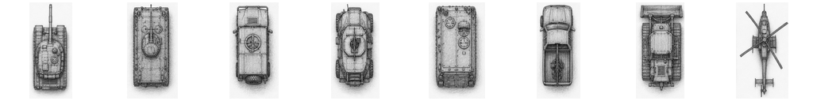
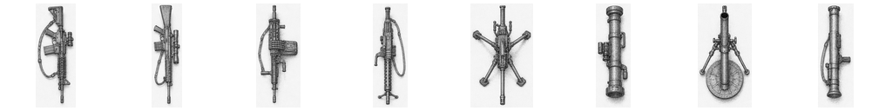
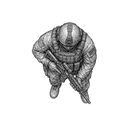

# Art Plate Index

This index gathers the major visual assets used by the `modernerKrieg` book.
It is not a replacement for [`../assets/ASSETS.md`](../assets/ASSETS.md), which
is the full asset review catalogue. This file is a curated reader's gallery:
the images that explain the simulation's atmosphere, interfaces, and current
asset contract.

The book uses art as evidence. If a plate suggests a gameplay concept, the
engine should eventually model that concept or the documentation should say why
it does not.

## Map Overview

| Plate | Path | Why It Matters |
| --- | --- | --- |
|  | [`../assets/mosul/runtime/maps/market_commercial_streets_2003/overview.png`](../assets/mosul/runtime/maps/market_commercial_streets_2003/overview.png) | First readable view of the 500 m by 500 m public demo area. |

Review questions:

- does the overview still match the scenario name?
- are roads, shops, alleys, roofs, and open areas visually legible?
- does the native board projection keep this image aligned with world meters?
- can a reader understand why civilians and hidden contacts matter here?

## Runtime Level Stack

| Plate | Path | Why It Matters |
| --- | --- | --- |
|  | [`../assets/mosul/runtime/maps/market_commercial_streets_2003/levels/level_01_ground.png`](../assets/mosul/runtime/maps/market_commercial_streets_2003/levels/level_01_ground.png) | Ground-level movement, streets, shops, and market space. |
|  | [`../assets/mosul/runtime/maps/market_commercial_streets_2003/levels/level_02_roofs_and_second_floor.png`](../assets/mosul/runtime/maps/market_commercial_streets_2003/levels/level_02_roofs_and_second_floor.png) | First vertical layer for roofs and second floors. |
|  | [`../assets/mosul/runtime/maps/market_commercial_streets_2003/levels/level_03_upper_floor.png`](../assets/mosul/runtime/maps/market_commercial_streets_2003/levels/level_03_upper_floor.png) | Higher interior/upper-floor surface. |
|  | [`../assets/mosul/runtime/maps/market_commercial_streets_2003/levels/level_04_roof_access.png`](../assets/mosul/runtime/maps/market_commercial_streets_2003/levels/level_04_roof_access.png) | Roof access and vertical transition vocabulary. |

Review questions:

- do all level PNGs match the building-level manifest?
- are alpha layers aligned with the ground plate?
- do roof surfaces correspond to topology nodes?
- do stairs, roof edges, and access points have data-backed meaning?
- can the native renderer show the active level without confusing the player?

## Source Map Plates

| Plate | Path | Why It Matters |
| --- | --- | --- |
|  | [`../assets/mosul/source/maps/market_commercial_streets_demo_2003/imgs/market_commercial_streets_demo_7000/preview_1400.png`](../assets/mosul/source/maps/market_commercial_streets_demo_2003/imgs/market_commercial_streets_demo_7000/preview_1400.png) | Source preview used as the initial runtime overview. |
|  | [`../assets/mosul/source/maps/market_commercial_streets_demo_2003/imgs/market_commercial_streets_demo_7000/preview_multistorey_lineart_1400.png`](../assets/mosul/source/maps/market_commercial_streets_demo_2003/imgs/market_commercial_streets_demo_7000/preview_multistorey_lineart_1400.png) | Helps review whether multi-storey information remains visually coherent. |

Review questions:

- should the runtime overview be regenerated from newer source art?
- are traffic vehicles still baked into any map layers that should be dynamic?
- do source and runtime assets have clear provenance notes?

## Line Art Plates

| Plate | Path | Why It Matters |
| --- | --- | --- |
|  | [`../assets/mosul/source/line_art/01_mosul_area_map.png`](../assets/mosul/source/line_art/01_mosul_area_map.png) | Gives geographic and atmospheric context for the demo. |
|  | [`../assets/mosul/source/line_art/04_combatant_types.png`](../assets/mosul/source/line_art/04_combatant_types.png) | Visual vocabulary for roles and irregular threats. |
|  | [`../assets/mosul/source/line_art/05_weapons_infantry_support.png`](../assets/mosul/source/line_art/05_weapons_infantry_support.png) | Weapon identity and support-role context. |
|  | [`../assets/mosul/source/line_art/06_vehicles_and_air_systems.png`](../assets/mosul/source/line_art/06_vehicles_and_air_systems.png) | Vehicle and support asset vocabulary. |
|  | [`../assets/mosul/source/line_art/07_tactics_urban_combat.png`](../assets/mosul/source/line_art/07_tactics_urban_combat.png) | Visual reminder of doors, rooftops, alleys, fire lanes, and movement pressure. |
|  | [`../assets/mosul/source/line_art/10_us_ally_force_archetypes.png`](../assets/mosul/source/line_art/10_us_ally_force_archetypes.png) | Allied force identity and role framing. |
|  | [`../assets/mosul/source/line_art/11_us_ally_weapons_lineart.png`](../assets/mosul/source/line_art/11_us_ally_weapons_lineart.png) | Weapon reference plate for the documentation and future UI. |

Review questions:

- has final unified art replaced any of these plates?
- do the chapters describe the current art honestly?
- does any plate imply a capability the engine does not yet model?

## Source Sprite Sheets

| Plate | Path | Why It Matters |
| --- | --- | --- |
|  | [`../assets/shared/source/sprite_sheets/08_combatants_topdown_128.png`](../assets/shared/source/sprite_sheets/08_combatants_topdown_128.png) | Combatant source roles and top-down silhouette language. |
|  | [`../assets/shared/source/sprite_sheets/12_us_ally_troops_topdown_128.png`](../assets/shared/source/sprite_sheets/12_us_ally_troops_topdown_128.png) | Allied troops and role silhouettes. |
|  | [`../assets/shared/source/sprite_sheets/14_us_ally_vehicles_topdown_128.png`](../assets/shared/source/sprite_sheets/14_us_ally_vehicles_topdown_128.png) | Vehicle source silhouettes. |
|  | [`../assets/shared/source/sprite_sheets/16_us_ally_weapons_topdown_128.png`](../assets/shared/source/sprite_sheets/16_us_ally_weapons_topdown_128.png) | Weapon source sprites and scale. |
|  | [`../assets/shared/source/sprite_sheets/18_combatants_stances_topdown_128.png`](../assets/shared/source/sprite_sheets/18_combatants_stances_topdown_128.png) | Standing, crouching, prone, wounded, and dead state vocabulary. |
|  | [`../assets/shared/source/sprite_sheets/19_civilian_states_topdown_128.png`](../assets/shared/source/sprite_sheets/19_civilian_states_topdown_128.png) | Civilian state vocabulary and review surface. |

Review questions:

- do source sheets still match the runtime render manifest?
- do all gameplay states have clear art?
- do all art states have a simulation meaning or documented placeholder status?
- are pivot points and map scale consistent?

## Runtime Sprite Examples

| Plate | Path | Why It Matters |
| --- | --- | --- |
|  | [`../assets/shared/runtime/sprites/rendered/infantry_128/allied/us_army_rifleman/standing/north.png`](../assets/shared/runtime/sprites/rendered/infantry_128/allied/us_army_rifleman/standing/north.png) | Small infantry runtime sprite with alpha edges. |
|  | [`../assets/shared/runtime/sprites/rendered/civilians_128/civilian/old_man/standing/north.png`](../assets/shared/runtime/sprites/rendered/civilians_128/civilian/old_man/standing/north.png) | Civilian runtime sprite and state/facing convention. |
|  | [`../assets/shared/runtime/sprites/rendered/weapons_128/m4_carbine/north.png`](../assets/shared/runtime/sprites/rendered/weapons_128/m4_carbine/north.png) | Weapon runtime sprite and facing convention. |
|  | [`../assets/shared/runtime/sprites/rendered/vehicles_1024/allied/cargo_truck/intact/north.png`](../assets/shared/runtime/sprites/rendered/vehicles_1024/allied/cargo_truck/intact/north.png) | Large vehicle sprite scale, state, and alpha edge review. |

Review questions:

- do alpha edges composite cleanly over the map?
- are facings named consistently?
- do state names match engine state names closely enough?
- do large vehicle sprites need special scale or anchor handling?

## Manifest Contracts

The visual plates are connected to these data files:

- [`../assets/mosul/manifests/market_commercial_streets_2003.mapmanifest`](../assets/mosul/manifests/market_commercial_streets_2003.mapmanifest)
- [`../assets/mosul/manifests/market_commercial_streets_2003_building_levels.json`](../assets/mosul/manifests/market_commercial_streets_2003_building_levels.json)
- [`../assets/mosul/manifests/market_commercial_streets_2003_topology.json`](../assets/mosul/manifests/market_commercial_streets_2003_topology.json)
- [`../assets/shared/manifests/shared_tactical_sprites.spritemanifest`](../assets/shared/manifests/shared_tactical_sprites.spritemanifest)
- [`../assets/shared/runtime/sprites/manifest.json`](../assets/shared/runtime/sprites/manifest.json)
- [`../assets/shared/runtime/sprites/rendered/render_manifest.json`](../assets/shared/runtime/sprites/rendered/render_manifest.json)

If a plate changes, check whether a manifest needs to change. If a manifest
changes, check whether a plate in this book now misleads the reader.

## Screenshot Protocol Placeholder

When screenshot capture is added in the native Mosul implementation or through
future C-side render products, screenshots should include:

- scenario id;
- seed;
- tick;
- UTC or local timestamp with milliseconds;
- selected unit or event id when relevant;
- short reason tag, such as `civilian_panic`, `roof_overwatch`, `search_cache`,
  `route_failure`, or `objective_contested`.

Screenshots should go to a local ignored directory. They are review evidence,
not source assets unless deliberately promoted.
